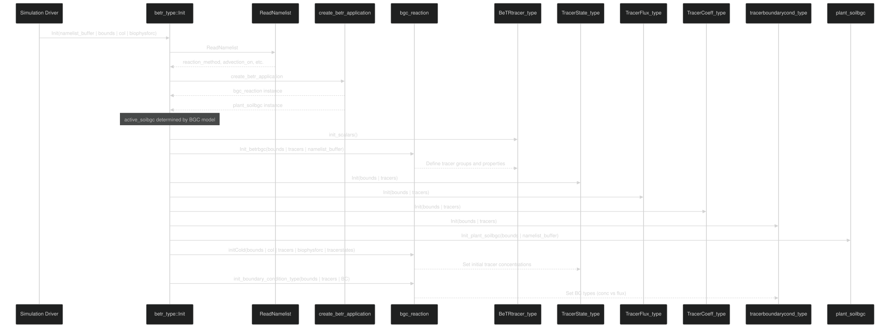

# betr_type Architecture

Relevant source files

- [src/betr/betr_core/BGCReactionsMod.F90](https://github.com/jingtao-lbl/sbetr-resomv1/blob/72301c77/src/betr/betr_core/BGCReactionsMod.F90)
- [src/betr/betr_rxns/DIOCBGCReactionsType.F90](https://github.com/jingtao-lbl/sbetr-resomv1/blob/72301c77/src/betr/betr_rxns/DIOCBGCReactionsType.F90)
- [src/betr/betr_rxns/H2OIsotopeBGCReactionsType.F90](https://github.com/jingtao-lbl/sbetr-resomv1/blob/72301c77/src/betr/betr_rxns/H2OIsotopeBGCReactionsType.F90)
- [src/betr/betr_rxns/MockBGCReactionsType.F90](https://github.com/jingtao-lbl/sbetr-resomv1/blob/72301c77/src/betr/betr_rxns/MockBGCReactionsType.F90)
- [src/driver/shared/BeTRType.F90](https://github.com/jingtao-lbl/sbetr-resomv1/blob/72301c77/src/driver/shared/BeTRType.F90)

This page documents the architecture of the `betr_type` class, which serves as the main orchestrator for BeTR simulations. The `betr_type` coordinates tracer transport, BGC reactions, and data exchange between the land surface model and biogeochemical models.

Scope: This page focuses on the `betr_type` class structure, its components, and orchestration methods. For details on specific BGC models, see [BGC Model Plugin System](#7.1) . For tracer transport mechanisms, see [Transport Mechanisms](#5.4) . For the simulation execution flow, see [Time-Stepping Loop](#3.3) .

## Class Overview

The `betr_type` class is defined in [src/driver/shared/BeTRType.F90 44-106](https://github.com/jingtao-lbl/sbetr-resomv1/blob/72301c77/src/driver/shared/BeTRType.F90#L44-L106) and acts as the central coordinator for BeTR simulations. It encapsulates all major subsystems including BGC models, tracer management, transport coefficients, and coupling with land surface models.

### Primary Responsibilities

| Responsibility | Implementation | 
| --- | --- |
| BGC Model Management | Holds polymorphic bgc_reaction instance selected at runtime | 
| Tracer Orchestration | Manages tracer states, fluxes, coefficients, and boundary conditions | 
| Transport-Reaction Coupling | Coordinates Strang splitting via step_without_drainage and step_with_drainage | 
| LSM Interface | Provides methods to exchange data with land surface models | 
| Diagnostic Output | Retrieves states and fluxes for history files and mass balance checking | 

Sources: [src/driver/shared/BeTRType.F90 44-106](https://github.com/jingtao-lbl/sbetr-resomv1/blob/72301c77/src/driver/shared/BeTRType.F90#L44-L106)

## Component Architecture

The `betr_type` class contains multiple component objects that handle specialized functionality. The following diagram shows the key components and their relationships.

### Component Structure Diagram

Sources: [src/driver/shared/BeTRType.F90 44-70](https://github.com/jingtao-lbl/sbetr-resomv1/blob/72301c77/src/driver/shared/BeTRType.F90#L44-L70)

## Component Details

### BGC Model Components

The `betr_type` holds polymorphic instances of BGC models that implement the abstract `bgc_reaction_type` interface:

These are instantiated at runtime based on the `reaction_method` namelist parameter via the factory pattern. The `bgc_reaction` performs biogeochemical transformations, while `plant_soilbgc` handles plant-soil nutrient coupling.

Key Methods on BGC Components:

- `calc_bgc_reaction`- Compute biogeochemical transformations
- `set_boundary_conditions`- Define top/bottom boundary conditions for tracers
- `do_tracer_equilibration`- Handle phase equilibration (gas-aqueous-solid)
- `retrieve_biostates`- Extract state variables for LSM

Sources: [src/driver/shared/BeTRType.F90 54-55](https://github.com/jingtao-lbl/sbetr-resomv1/blob/72301c77/src/driver/shared/BeTRType.F90#L54-L55)  [src/betr/betr_core/BGCReactionsMod.F90 17-59](https://github.com/jingtao-lbl/sbetr-resomv1/blob/72301c77/src/betr/betr_core/BGCReactionsMod.F90#L17-L59)

### Tracer Management Components

The tracer system is distributed across four tightly-coupled types:

| Component | Type | Purpose | 
| --- | --- | --- |
| tracers | BeTRtracer_type | Defines tracer properties, names, IDs, groupings | 
| tracerstates | TracerState_type | Stores concentrations (mobile, frozen, solid phases) | 
| tracerfluxes | TracerFlux_type | Tracks all flux terms (diffusion, advection, reactions, etc.) | 
| tracercoeffs | TracerCoeff_type | Holds partition coefficients, diffusivities, retardation factors | 
| tracerboundaryconds | tracerboundarycond_type | Manages top/bottom boundary conditions | 

These components are initialized in [src/driver/shared/BeTRType.F90 193-208](https://github.com/jingtao-lbl/sbetr-resomv1/blob/72301c77/src/driver/shared/BeTRType.F90#L193-L208) and used throughout transport and reaction calculations.

Sources: [src/driver/shared/BeTRType.F90 57-61](https://github.com/jingtao-lbl/sbetr-resomv1/blob/72301c77/src/driver/shared/BeTRType.F90#L57-L61)

### Plant Nutrient Kinetics

The `plantNutkinetics` component [src/driver/shared/BeTRType.F90 62](https://github.com/jingtao-lbl/sbetr-resomv1/blob/72301c77/src/driver/shared/BeTRType.F90#L62-L62) stores plant nutrient uptake parameters that are passed from the land surface model. When active soil BGC is enabled ( `active_soibgc=.true.` ), this component is initialized and used to set kinetic parameters before BGC reaction calculations.

Sources: [src/driver/shared/BeTRType.F90 190-191](https://github.com/jingtao-lbl/sbetr-resomv1/blob/72301c77/src/driver/shared/BeTRType.F90#L190-L191)  [src/driver/shared/BeTRType.F90 364-369](https://github.com/jingtao-lbl/sbetr-resomv1/blob/72301c77/src/driver/shared/BeTRType.F90#L364-L369)

## Initialization Sequence

The `Init` method [src/driver/shared/BeTRType.F90 153-222](https://github.com/jingtao-lbl/sbetr-resomv1/blob/72301c77/src/driver/shared/BeTRType.F90#L153-L222) performs the complete initialization of `betr_type` and all its components.

### Initialization Flow Diagram

Initialization Steps:

Sources: [src/driver/shared/BeTRType.F90 153-222](https://github.com/jingtao-lbl/sbetr-resomv1/blob/72301c77/src/driver/shared/BeTRType.F90#L153-L222)

## Time-Stepping Methods

The `betr_type` implements Strang operator splitting with two main stepping methods that are called sequentially by the simulation driver.

### Strang Splitting Workflow

Sources: [src/driver/shared/BeTRType.F90 309-435](https://github.com/jingtao-lbl/sbetr-resomv1/blob/72301c77/src/driver/shared/BeTRType.F90#L309-L435)  [src/driver/shared/BeTRType.F90 506-631](https://github.com/jingtao-lbl/sbetr-resomv1/blob/72301c77/src/driver/shared/BeTRType.F90#L506-L631)

### step_without_drainage

The `step_without_drainage` method [src/driver/shared/BeTRType.F90 309-435](https://github.com/jingtao-lbl/sbetr-resomv1/blob/72301c77/src/driver/shared/BeTRType.F90#L309-L435) performs transport and reaction without drainage losses:

Key Operations:

Sources: [src/driver/shared/BeTRType.F90 309-435](https://github.com/jingtao-lbl/sbetr-resomv1/blob/72301c77/src/driver/shared/BeTRType.F90#L309-L435)

### step_with_drainage

The `step_with_drainage` method [src/driver/shared/BeTRType.F90 506-631](https://github.com/jingtao-lbl/sbetr-resomv1/blob/72301c77/src/driver/shared/BeTRType.F90#L506-L631) applies drainage losses to tracer concentrations:

Core Algorithm:

This exponential decay formulation accounts for the bulk partition coefficient to properly calculate the fraction of tracer lost to drainage.

Special Handling:

- **Water tracers**[src/driver/shared/BeTRType.F90579-599](https://github.com/jingtao-lbl/sbetr-resomv1/blob/72301c77/src/driver/shared/BeTRType.F90#L579-L599): Use actual water concentration from groundwater
- **MOSART coupling**[src/driver/shared/BeTRType.F90601-621](https://github.com/jingtao-lbl/sbetr-resomv1/blob/72301c77/src/driver/shared/BeTRType.F90#L601-L621): Special treatment for litter and SOM conversion to DOM
- **Gas pressure diagnostics**[src/driver/shared/BeTRType.F90627-628](https://github.com/jingtao-lbl/sbetr-resomv1/blob/72301c77/src/driver/shared/BeTRType.F90#L627-L628): Update gas phase diagnostics after drainage

Sources: [src/driver/shared/BeTRType.F90 506-631](https://github.com/jingtao-lbl/sbetr-resomv1/blob/72301c77/src/driver/shared/BeTRType.F90#L506-L631)

## BGC Model Integration

The `betr_type` integrates with BGC models through the polymorphic `bgc_reaction` member. The factory pattern enables runtime selection of BGC models without modifying core code.

### BGC Model Instantiation

The `create_betr_application` method [src/driver/shared/BeTRType.F90 184-186](https://github.com/jingtao-lbl/sbetr-resomv1/blob/72301c77/src/driver/shared/BeTRType.F90#L184-L186) delegates to `ApplicationsFactory` to instantiate the appropriate BGC model based on the namelist configuration.

Sources: [src/driver/shared/BeTRType.F90 91](https://github.com/jingtao-lbl/sbetr-resomv1/blob/72301c77/src/driver/shared/BeTRType.F90#L91-L91)  [src/driver/shared/BeTRType.F90 184-186](https://github.com/jingtao-lbl/sbetr-resomv1/blob/72301c77/src/driver/shared/BeTRType.F90#L184-L186)

### BGC Model Interface

All BGC models must implement the abstract interface defined in `bgc_reaction_type`  [src/betr/betr_core/BGCReactionsMod.F90 17-59](https://github.com/jingtao-lbl/sbetr-resomv1/blob/72301c77/src/betr/betr_core/BGCReactionsMod.F90#L17-L59) Key deferred procedures include:

| Method | Purpose | Called From | 
| --- | --- | --- |
| Init_betrbgc | Define tracers and initialize parameters | betr_type::Init | 
| calc_bgc_reaction | Compute biogeochemical transformations | step_without_drainage | 
| set_boundary_conditions | Set tracer boundary conditions | stage_tracer_transport | 
| do_tracer_equilibration | Phase equilibration after transport | Transport modules | 
| initCold | Set initial tracer concentrations | betr_type::Init | 
| retrieve_biostates | Extract states for LSM | betr_type::retrieve_biostates | 

Example implementation from Mock BGC model [src/betr/betr_rxns/MockBGCReactionsType.F90 30-53](https://github.com/jingtao-lbl/sbetr-resomv1/blob/72301c77/src/betr/betr_rxns/MockBGCReactionsType.F90#L30-L53) :

Sources: [src/betr/betr_core/BGCReactionsMod.F90 17-59](https://github.com/jingtao-lbl/sbetr-resomv1/blob/72301c77/src/betr/betr_core/BGCReactionsMod.F90#L17-L59)  [src/betr/betr_rxns/MockBGCReactionsType.F90 30-53](https://github.com/jingtao-lbl/sbetr-resomv1/blob/72301c77/src/betr/betr_rxns/MockBGCReactionsType.F90#L30-L53)

## Data Exchange Methods

The `betr_type` provides several methods for exchanging data with the simulation driver and land surface model.

### State and Flux Retrieval

Key Retrieval Methods:

Sources: [src/driver/shared/BeTRType.F90 459-503](https://github.com/jingtao-lbl/sbetr-resomv1/blob/72301c77/src/driver/shared/BeTRType.F90#L459-L503)  [src/driver/shared/BeTRType.F90 647-668](https://github.com/jingtao-lbl/sbetr-resomv1/blob/72301c77/src/driver/shared/BeTRType.F90#L647-L668)

### Mass Balance and Diagnostics

The `check_mass_err` method [src/driver/shared/BeTRType.F90 771-866](https://github.com/jingtao-lbl/sbetr-resomv1/blob/72301c77/src/driver/shared/BeTRType.F90#L771-L866) performs mass balance checking for tracers. This is used to verify conservation properties and detect numerical errors.

The `debug_info` method [src/driver/shared/BeTRType.F90 438-456](https://github.com/jingtao-lbl/sbetr-resomv1/blob/72301c77/src/driver/shared/BeTRType.F90#L438-L456) delegates to `bgc_reaction::debug_info` to output detailed BGC state information for debugging purposes.

Sources: [src/driver/shared/BeTRType.F90 82](https://github.com/jingtao-lbl/sbetr-resomv1/blob/72301c77/src/driver/shared/BeTRType.F90#L82-L82)  [src/driver/shared/BeTRType.F90 100](https://github.com/jingtao-lbl/sbetr-resomv1/blob/72301c77/src/driver/shared/BeTRType.F90#L100-L100)

## Tracer Layer Adjustment

The `betr_type` handles dynamic layer adjustments (snow layering changes, freeze-thaw) through specialized methods:

| Method | Purpose | When Called | 
| --- | --- | --- |
| Enter_tracer_LayerAdjustment | Save tracer states before layer change | Before snow layer operations | 
| Exit_tracer_LayerAdjustment | Restore and adjust tracer states | After snow layer operations | 
| tracer_snowcapping | Handle snow capping events | When new snow accumulates | 
| tracer_DivideSnowLayers | Split snow layers | When layer thickness exceeds threshold | 
| tracer_CombineSnowLayers | Merge snow layers | When layer thickness too small | 
| diagnose_dtracer_freeze_thaw | Update frozen/mobile tracers | After phase change | 

These methods ensure tracer conservation during dynamic grid changes. They are typically called by the hydrology module before and after snow layer adjustments.

Sources: [src/driver/shared/BeTRType.F90 83-87](https://github.com/jingtao-lbl/sbetr-resomv1/blob/72301c77/src/driver/shared/BeTRType.F90#L83-L87)  [src/driver/shared/BeTRType.F90 81](https://github.com/jingtao-lbl/sbetr-resomv1/blob/72301c77/src/driver/shared/BeTRType.F90#L81-L81)

## Configuration and Parameter Updates

### Namelist Configuration

The `ReadNamelist` method [src/driver/shared/BeTRType.F90 238-306](https://github.com/jingtao-lbl/sbetr-resomv1/blob/72301c77/src/driver/shared/BeTRType.F90#L238-L306) reads configuration parameters:

- `reaction_method`: Selects BGC model (e.g., 'ecacnp', 'simic', 'mock_run')
- `advection_on`: Enable/disable advective transport
- `diffusion_on`: Enable/disable diffusive transport
- `reaction_on`: Enable/disable BGC reactions
- `ebullition_on`: Enable/disable gas ebullition

These flags are stored in `betr_type`  [src/driver/shared/BeTRType.F90 46-50](https://github.com/jingtao-lbl/sbetr-resomv1/blob/72301c77/src/driver/shared/BeTRType.F90#L46-L50) and checked during time-stepping to conditionally execute different processes.

Sources: [src/driver/shared/BeTRType.F90 238-306](https://github.com/jingtao-lbl/sbetr-resomv1/blob/72301c77/src/driver/shared/BeTRType.F90#L238-L306)  [src/driver/shared/BeTRType.F90 46-50](https://github.com/jingtao-lbl/sbetr-resomv1/blob/72301c77/src/driver/shared/BeTRType.F90#L46-L50)

### Dynamic Parameter Updates

The `UpdateParas` method [src/driver/shared/BeTRType.F90 136-151](https://github.com/jingtao-lbl/sbetr-resomv1/blob/72301c77/src/driver/shared/BeTRType.F90#L136-L151) updates BGC parameters after reading from external files. It delegates to `bgc_reaction::UpdateParas` to allow BGC-model-specific parameter adjustments.

The `SetParCols` method [src/driver/shared/BeTRType.F90 124-134](https://github.com/jingtao-lbl/sbetr-resomv1/blob/72301c77/src/driver/shared/BeTRType.F90#L124-L134) sets the parameter column index for spatially-varying parameters, useful for site-specific calibration.

Sources: [src/driver/shared/BeTRType.F90 136-151](https://github.com/jingtao-lbl/sbetr-resomv1/blob/72301c77/src/driver/shared/BeTRType.F90#L136-L151)  [src/driver/shared/BeTRType.F90 124-134](https://github.com/jingtao-lbl/sbetr-resomv1/blob/72301c77/src/driver/shared/BeTRType.F90#L124-L134)

## Summary

The `betr_type` class serves as the central orchestrator for BeTR simulations with the following architectural features:

Design Principles:

- **Separation of Concerns**: Transport, reactions, and state management are encapsulated in separate component objects
- **Polymorphism**: BGC models implement abstract interfaces, enabling runtime selection
- **Strang Splitting**: Physics processes are split into drainage and non-drainage phases for numerical accuracy
- **Extensibility**`betr_type`: New BGC models can be added without modifying code

Key Architectural Patterns:

- **Composition**`betr_type`: composes multiple specialized components rather than inheriting
- **Delegation**: Most functionality delegated to component objects (tracers, states, fluxes, BGC)
- **Factory Pattern**`create_betr_application`: BGC model instantiation handled by factory ( )
- **Template Method**`bgc_reaction_type`: Abstract defines interface, concrete models implement

Integration Points:

- `step_without_drainage``step_with_drainage`Land surface models call and each timestep
- `bgc_reaction`BGC models interact via polymorphic interface
- Tracer transport occurs through tracer state/flux/coeff components
- `HistRetrieve*`History output accessed via methods

Sources: [src/driver/shared/BeTRType.F90 1-2314](https://github.com/jingtao-lbl/sbetr-resomv1/blob/72301c77/src/driver/shared/BeTRType.F90#L1-L2314)