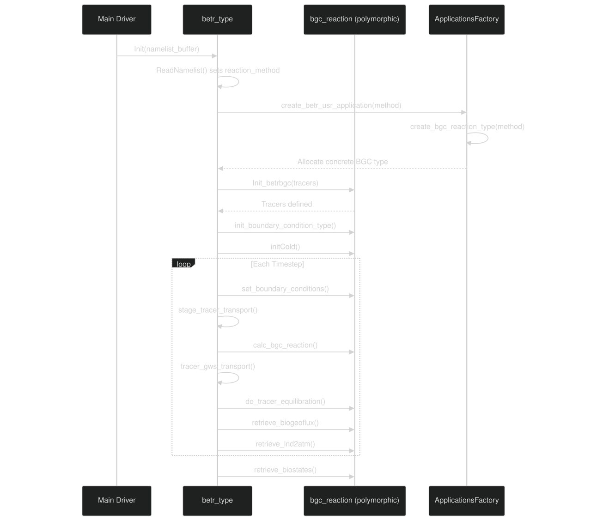

# BGC Reaction Interface

Relevant source files

- [src/Applications/app_util/ApplicationsFactory.F90](https://github.com/jingtao-lbl/sbetr-resomv1/blob/72301c77/src/Applications/app_util/ApplicationsFactory.F90)
- [src/Applications/soil-farm/bgcfarm_util/BiogeoConType.F90](https://github.com/jingtao-lbl/sbetr-resomv1/blob/72301c77/src/Applications/soil-farm/bgcfarm_util/BiogeoConType.F90)
- [src/betr/betr_core/BGCReactionsMod.F90](https://github.com/jingtao-lbl/sbetr-resomv1/blob/72301c77/src/betr/betr_core/BGCReactionsMod.F90)
- [src/betr/betr_rxns/DIOCBGCReactionsType.F90](https://github.com/jingtao-lbl/sbetr-resomv1/blob/72301c77/src/betr/betr_rxns/DIOCBGCReactionsType.F90)
- [src/betr/betr_rxns/H2OIsotopeBGCReactionsType.F90](https://github.com/jingtao-lbl/sbetr-resomv1/blob/72301c77/src/betr/betr_rxns/H2OIsotopeBGCReactionsType.F90)
- [src/betr/betr_rxns/MockBGCReactionsType.F90](https://github.com/jingtao-lbl/sbetr-resomv1/blob/72301c77/src/betr/betr_rxns/MockBGCReactionsType.F90)
- [src/betr/betr_util/Tracer_varcon.F90](https://github.com/jingtao-lbl/sbetr-resomv1/blob/72301c77/src/betr/betr_util/Tracer_varcon.F90)
- [src/betr/betr_util/betr_ctrl.F90](https://github.com/jingtao-lbl/sbetr-resomv1/blob/72301c77/src/betr/betr_util/betr_ctrl.F90)
- [src/driver/shared/BeTRType.F90](https://github.com/jingtao-lbl/sbetr-resomv1/blob/72301c77/src/driver/shared/BeTRType.F90)

Purpose: This page documents the abstract BGC reaction interface ( `bgc_reaction_type` ) that defines the contract between BeTR's transport engine and pluggable biogeochemical models. It explains the interface methods, how models are instantiated via the factory pattern, and how concrete BGC models implement this interface.

Scope: This page covers the abstract interface definition, factory instantiation, and the lifecycle of BGC reaction objects. For details on specific BGC models (ECACNP, SIMIC, V1ECA, etc.), see [BGC Models](#7) . For tracer configuration and transport, see [Tracer Transport System](#5) .

## Abstract BGC Reaction Type

The `bgc_reaction_type` abstract class in [src/betr/betr_core/BGCReactionsMod.F90 17-59](https://github.com/jingtao-lbl/sbetr-resomv1/blob/72301c77/src/betr/betr_core/BGCReactionsMod.F90#L17-L59) defines a polymorphic interface that all BGC models must implement. This design allows BeTR to work with any BGC model without modifying the core transport code.

All methods are declared as `deferred` , meaning concrete implementations must provide the actual implementation.

Sources:  [src/betr/betr_core/BGCReactionsMod.F90 1-121](https://github.com/jingtao-lbl/sbetr-resomv1/blob/72301c77/src/betr/betr_core/BGCReactionsMod.F90#L1-L121)

## Interface Architecture

The following diagram shows how the abstract interface connects to concrete implementations and the factory pattern:

Sources:  [src/driver/shared/BeTRType.F90 44-56](https://github.com/jingtao-lbl/sbetr-resomv1/blob/72301c77/src/driver/shared/BeTRType.F90#L44-L56)  [src/Applications/app_util/ApplicationsFactory.F90 27-115](https://github.com/jingtao-lbl/sbetr-resomv1/blob/72301c77/src/Applications/app_util/ApplicationsFactory.F90#L27-L115)  [src/betr/betr_util/Tracer_varcon.F90 53-55](https://github.com/jingtao-lbl/sbetr-resomv1/blob/72301c77/src/betr/betr_util/Tracer_varcon.F90#L53-L55)

## Factory Pattern Implementation

The `ApplicationsFactory` module uses Fortran's `select case` statement to instantiate the appropriate BGC model based on the `reaction_method` string from the namelist.

### Factory Creation Flow

Sources:  [src/Applications/app_util/ApplicationsFactory.F90 50-115](https://github.com/jingtao-lbl/sbetr-resomv1/blob/72301c77/src/Applications/app_util/ApplicationsFactory.F90#L50-L115)

### Key Factory Code Structure

The factory uses Fortran's source-based allocation to instantiate concrete types:

The `asoibgc` flag indicates whether active soil BGC is needed (vs. passive tracer transport only).

Sources:  [src/Applications/app_util/ApplicationsFactory.F90 83-108](https://github.com/jingtao-lbl/sbetr-resomv1/blob/72301c77/src/Applications/app_util/ApplicationsFactory.F90#L83-L108)

## Interface Method Contracts

Each abstract interface method has a specific purpose in the BGC model lifecycle and computation:

| Method | Purpose | When Called | 
| --- | --- | --- |
| Init_betrbgc | Initialize BGC model, define tracers | During betr_type%Init() | 
| init_boundary_condition_type | Set BC types (concentration vs flux) | After tracer initialization | 
| initCold | Cold start initialization of tracer states | During initial setup | 
| set_boundary_conditions | Set top/bottom BC values each timestep | Before transport/reaction | 
| calc_bgc_reaction | Compute biogeochemical reactions | Main timestep loop | 
| do_tracer_equilibration | Equilibrate gas-aqueous-solid phases | After transport | 
| retrieve_biogeoflux | Send fluxes back to LSM | End of timestep | 
| retrieve_lnd2atm | Calculate land-to-atmosphere fluxes | End of timestep | 
| retrieve_biostates | Extract state variables | For output/diagnostics | 
| set_kinetics_par | Set plant-nutrient kinetic parameters | When LSM provides data | 
| set_bgc_spinup | Configure spinup acceleration | During spinup phase | 
| UpdateParas | Update parameters from external files | After parameter loading | 
| init_iP_prof | Initialize inorganic P profile | For P-enabled models | 
| reset_biostates | Reset state variables | For special restart cases | 
| debug_info | Output debugging information | On demand | 
| SetParCols | Set parameter column indices | For spatially-varying parameters | 

Sources:  [src/betr/betr_core/BGCReactionsMod.F90 61-429](https://github.com/jingtao-lbl/sbetr-resomv1/blob/72301c77/src/betr/betr_core/BGCReactionsMod.F90#L61-L429)

## Detailed Interface Methods

### Initialization Methods
Init_betrbgc
Defines the tracers that the BGC model will use and initializes internal data structures.

Key Responsibilities:

- `betrtracer_vars%add_tracer_group()`Add tracer groups using
- Set tracer properties (mobile, volatile, advective, etc.)
- Allocate internal arrays
- Read model-specific namelist parameters

Example from Mock Model:

The mock model defines 6 tracers (N2, O2, AR, CO2x, CH4, DOC):

Sources:  [src/betr/betr_core/BGCReactionsMod.F90 63-85](https://github.com/jingtao-lbl/sbetr-resomv1/blob/72301c77/src/betr/betr_core/BGCReactionsMod.F90#L63-L85)  [src/betr/betr_rxns/MockBGCReactionsType.F90 174-288](https://github.com/jingtao-lbl/sbetr-resomv1/blob/72301c77/src/betr/betr_rxns/MockBGCReactionsType.F90#L174-L288)
initCold
Initializes tracer concentrations for a cold start simulation.

Key Responsibilities:

- Set initial concentrations for all tracers
- Can use soil properties (temperature, moisture) for initialization
- Set both mobile and solid phase concentrations

Sources:  [src/betr/betr_core/BGCReactionsMod.F90 314-335](https://github.com/jingtao-lbl/sbetr-resomv1/blob/72301c77/src/betr/betr_core/BGCReactionsMod.F90#L314-L335)

### Boundary Condition Methods
init_boundary_condition_type
Specifies whether each tracer uses concentration-based or flux-based boundary conditions at the top.

Common Pattern:

Constants `bndcond_as_conc` and `bndcond_as_flux` are defined in [src/betr/betr_util/Tracer_varcon.F90 37-38](https://github.com/jingtao-lbl/sbetr-resomv1/blob/72301c77/src/betr/betr_util/Tracer_varcon.F90#L37-L38)

Sources:  [src/betr/betr_core/BGCReactionsMod.F90 264-282](https://github.com/jingtao-lbl/sbetr-resomv1/blob/72301c77/src/betr/betr_core/BGCReactionsMod.F90#L264-L282)  [src/betr/betr_rxns/MockBGCReactionsType.F90 123-152](https://github.com/jingtao-lbl/sbetr-resomv1/blob/72301c77/src/betr/betr_rxns/MockBGCReactionsType.F90#L123-L152)
set_boundary_conditions
Sets the actual boundary condition values each timestep based on atmospheric composition and environmental conditions.

Key Responsibilities:

- Convert atmospheric ppmv to mol/m³ for gases
- `tracerboundarycond_vars%tracer_gwdif_concflux_top_col`Set top BC values in
- `tracerboundarycond_vars%bot_concflux_col`Set bottom BC values in
- `condc_toplay_col`Calculate surface conductance in

Example Pattern:

Sources:  [src/betr/betr_core/BGCReactionsMod.F90 228-260](https://github.com/jingtao-lbl/sbetr-resomv1/blob/72301c77/src/betr/betr_core/BGCReactionsMod.F90#L228-L260)  [src/betr/betr_rxns/MockBGCReactionsType.F90 292-376](https://github.com/jingtao-lbl/sbetr-resomv1/blob/72301c77/src/betr/betr_rxns/MockBGCReactionsType.F90#L292-L376)

## Reaction and Transport Methods

### calc_bgc_reaction

The core method that computes biogeochemical transformations. This is where models implement decomposition, nitrification, denitrification, nutrient competition, etc.

Key Responsibilities:

- `tracerstate_vars%tracer_conc_mobile_col`Read current tracer concentrations from
- Apply biogeochemical transformations (ODE integration, analytic solutions, etc.)
- `tracerstate_vars`Update concentrations in
- `tracerflux_vars%tracer_flx_netpro_vr_col`Record net production/consumption in
- `plant_soilbgc`Update plant-soil coupling via
- `biogeo_flux`Send diagnostic fluxes to

Typical Structure:

Sources:  [src/betr/betr_core/BGCReactionsMod.F90 142-189](https://github.com/jingtao-lbl/sbetr-resomv1/blob/72301c77/src/betr/betr_core/BGCReactionsMod.F90#L142-L189)  [src/betr/betr_rxns/MockBGCReactionsType.F90 379-459](https://github.com/jingtao-lbl/sbetr-resomv1/blob/72301c77/src/betr/betr_rxns/MockBGCReactionsType.F90#L379-L459)

### do_tracer_equilibration

Equilibrates tracers between gas, aqueous, and solid phases after transport but before the next reaction step.

Key Responsibilities:

- Use partition coefficients to redistribute tracers
- Apply Henry's law for gas-aqueous equilibration
- Handle freezing/thawing effects
- Update gas, mobile, and solid phase concentrations

Typical Use: Most simple models (e.g., mock, passive tracers) don't need custom equilibration logic and can leave this as a no-op. Complex models with sorption, precipitation, or isotopic fractionation implement custom equilibration.

Sources:  [src/betr/betr_core/BGCReactionsMod.F90 285-311](https://github.com/jingtao-lbl/sbetr-resomv1/blob/72301c77/src/betr/betr_core/BGCReactionsMod.F90#L285-L311)  [src/betr/betr_rxns/MockBGCReactionsType.F90 462-504](https://github.com/jingtao-lbl/sbetr-resomv1/blob/72301c77/src/betr/betr_rxns/MockBGCReactionsType.F90#L462-L504)

## Data Exchange Methods

### retrieve_biogeoflux

Sends BGC fluxes back to the land surface model for use in carbon/nitrogen/phosphorus budgets.

Key Responsibilities:

- Map internal tracer fluxes to LSM-expected flux variables
- Convert units if necessary (mol/m²/s to gC/m²/s, etc.)
- Aggregate fluxes for output (e.g., total heterotrophic respiration)

Sources:  [src/betr/betr_core/BGCReactionsMod.F90 338-355](https://github.com/jingtao-lbl/sbetr-resomv1/blob/72301c77/src/betr/betr_core/BGCReactionsMod.F90#L338-L355)

### retrieve_lnd2atm

Calculates fluxes from land to atmosphere for coupling with atmospheric models.

Key Responsibilities:

- Sum vertical fluxes (ebullition, diffusion, advection)
- Apply unit conversions for atmospheric coupling
- Handle special cases (CH4 oxidation in unsaturated zone, etc.)

Sources:  [src/betr/betr_core/BGCReactionsMod.F90 192-209](https://github.com/jingtao-lbl/sbetr-resomv1/blob/72301c77/src/betr/betr_core/BGCReactionsMod.F90#L192-L209)

### retrieve_biostates

Extracts state variables for output, diagnostics, or restart files.

Key Responsibilities:

- Map internal tracer states to LSM state variables
- Calculate derived quantities (soil C pools, N mineralization rates, etc.)
- Provide data for history output

Sources:  [src/betr/betr_core/BGCReactionsMod.F90 381-404](https://github.com/jingtao-lbl/sbetr-resomv1/blob/72301c77/src/betr/betr_core/BGCReactionsMod.F90#L381-L404)

## Parameter and Configuration Methods

### set_kinetics_par

Updates kinetic parameters that depend on plant physiology (e.g., nutrient uptake kinetics).

Key Responsibilities:

- Receive plant-nutrient kinetic parameters from LSM
- Store or apply these parameters for nutrient competition calculations
- `tracercoeff_vars`Update coefficients in if needed

Sources:  [src/betr/betr_core/BGCReactionsMod.F90 211-225](https://github.com/jingtao-lbl/sbetr-resomv1/blob/72301c77/src/betr/betr_core/BGCReactionsMod.F90#L211-L225)

### UpdateParas

Updates parameters after reading spatially-varying parameter files.

Key Responsibilities:

- Apply spatially-varying parameters (soil-order specific, PFT-specific, etc.)
- Validate parameter ranges
- Update internal parameter arrays

Sources:  [src/betr/betr_core/BGCReactionsMod.F90 109-121](https://github.com/jingtao-lbl/sbetr-resomv1/blob/72301c77/src/betr/betr_core/BGCReactionsMod.F90#L109-L121)

### set_bgc_spinup

Configures spinup acceleration factors for faster equilibration.

Key Responsibilities:

- Apply spinup acceleration factors to decomposition rates
- Adjust pool sizes for accelerated cycling
- `betr_spinup_state`Coordinate with global flag

The `betr_spinup_state` variable (defined in [src/betr/betr_util/betr_ctrl.F90 16-17](https://github.com/jingtao-lbl/sbetr-resomv1/blob/72301c77/src/betr/betr_util/betr_ctrl.F90#L16-L17) ) controls spinup phases:

- 0: Normal simulation
- 1: AD-1 spinup (accumulating spinup scalars)
- 2: AD-2 spinup

Sources:  [src/betr/betr_core/BGCReactionsMod.F90 123-140](https://github.com/jingtao-lbl/sbetr-resomv1/blob/72301c77/src/betr/betr_core/BGCReactionsMod.F90#L123-L140)  [src/betr/betr_util/betr_ctrl.F90 16-17](https://github.com/jingtao-lbl/sbetr-resomv1/blob/72301c77/src/betr/betr_util/betr_ctrl.F90#L16-L17)

## Usage Within BeTR Core

The `betr_type` class holds a polymorphic `bgc_reaction` member and calls its methods at appropriate points in the simulation:

Key Call Sites in BeTRType.F90:

| Method | Called From | Line Reference | 
| --- | --- | --- |
| Init_betrbgc | betr_type%Init() | BeTRType.F90195 | 
| init_boundary_condition_type | betr_type%Init() | BeTRType.F90217 | 
| initCold | betr_type%Init() | BeTRType.F90214 | 
| set_kinetics_par | step_without_drainage() | BeTRType.F90367-368 | 
| calc_bgc_reaction | step_without_drainage() | BeTRType.F90385-398 | 
| retrieve_biogeoflux | retrieve_biofluxes() | BeTRType.F90493-494 | 
| retrieve_lnd2atm | diagnoselnd2atm() | BeTRType.F90665-666 | 
| retrieve_biostates | retrieve_biostates() | BeTRType.F90474-475 | 

Sources:  [src/driver/shared/BeTRType.F90 153-222](https://github.com/jingtao-lbl/sbetr-resomv1/blob/72301c77/src/driver/shared/BeTRType.F90#L153-L222)  [src/driver/shared/BeTRType.F90 309-435](https://github.com/jingtao-lbl/sbetr-resomv1/blob/72301c77/src/driver/shared/BeTRType.F90#L309-L435)

## Implementing a New BGC Model

To create a custom BGC model:

### Step 1: Define the Type

Create a module with a type that extends `bgc_reaction_type` :

### Step 2: Implement the Constructor

### Step 3: Implement All Interface Methods

Every deferred procedure must be implemented, even if some are no-ops for your model. See [MockBGCReactionsType.F90](https://github.com/jingtao-lbl/sbetr-resomv1/blob/72301c77/MockBGCReactionsType.F90) for a minimal example.

### Step 4: Register in Factory

Add your model to `ApplicationsFactory.F90` :

### Step 5: Add Parameter Support

If your model has parameters, create a parameter type extending `BiogeoCon_type` (see [BiogeoConType.F90](https://github.com/jingtao-lbl/sbetr-resomv1/blob/72301c77/BiogeoConType.F90) ) and add loading logic to `ApplicationsFactory` :

Sources:  [src/betr/betr_rxns/MockBGCReactionsType.F90 1-57](https://github.com/jingtao-lbl/sbetr-resomv1/blob/72301c77/src/betr/betr_rxns/MockBGCReactionsType.F90#L1-L57)  [src/Applications/app_util/ApplicationsFactory.F90 50-115](https://github.com/jingtao-lbl/sbetr-resomv1/blob/72301c77/src/Applications/app_util/ApplicationsFactory.F90#L50-L115)  [src/Applications/soil-farm/bgcfarm_util/BiogeoConType.F90 1-74](https://github.com/jingtao-lbl/sbetr-resomv1/blob/72301c77/src/Applications/soil-farm/bgcfarm_util/BiogeoConType.F90#L1-L74)

## Example: Mock BGC Model

The mock BGC model provides a minimal but complete implementation. It defines 6 tracers (N2, O2, AR, CO2x, CH4, DOC) and implements simple DOC decay:

### Tracer Definition

### Simple Reaction Implementation

The mock model applies exponential decay to DOC:

This simple example shows the minimum required to create a functioning BGC model.

Sources:  [src/betr/betr_rxns/MockBGCReactionsType.F90 174-459](https://github.com/jingtao-lbl/sbetr-resomv1/blob/72301c77/src/betr/betr_rxns/MockBGCReactionsType.F90#L174-L459)

## Summary Table: Key Types and Modules

| Type/Module | Purpose | Location | 
| --- | --- | --- |
| bgc_reaction_type | Abstract base class defining interface | BGCReactionsMod.F90 | 
| ApplicationsFactory | Factory for instantiating concrete models | ApplicationsFactory.F90 | 
| BiogeoCon_type | Base parameter type for BGC models | BiogeoConType.F90 | 
| betr_type | Core BeTR orchestrator holding bgc_reaction | BeTRType.F90 | 
| bgc_reaction_mock_run_type | Example minimal implementation | MockBGCReactionsType.F90 | 
| ecacnp_bgc_reaction_type | ECACNP model implementation | Referenced in factory | 
| resom_bgc_reaction_type | RESOM model implementation | Referenced in factory | 
| v1eca_bgc_reaction_type | V1ECA model implementation | Referenced in factory | 
| reaction_method | String controlling model selection | Tracer_varcon.F9055 | 
| betr_spinup_state | Controls spinup acceleration | betr_ctrl.F9016 | 

## Key Concepts

Sources:  [src/betr/betr_core/BGCReactionsMod.F90 1-429](https://github.com/jingtao-lbl/sbetr-resomv1/blob/72301c77/src/betr/betr_core/BGCReactionsMod.F90#L1-L429)  [src/Applications/app_util/ApplicationsFactory.F90 1-370](https://github.com/jingtao-lbl/sbetr-resomv1/blob/72301c77/src/Applications/app_util/ApplicationsFactory.F90#L1-L370)  [src/driver/shared/BeTRType.F90 1-222](https://github.com/jingtao-lbl/sbetr-resomv1/blob/72301c77/src/driver/shared/BeTRType.F90#L1-L222)