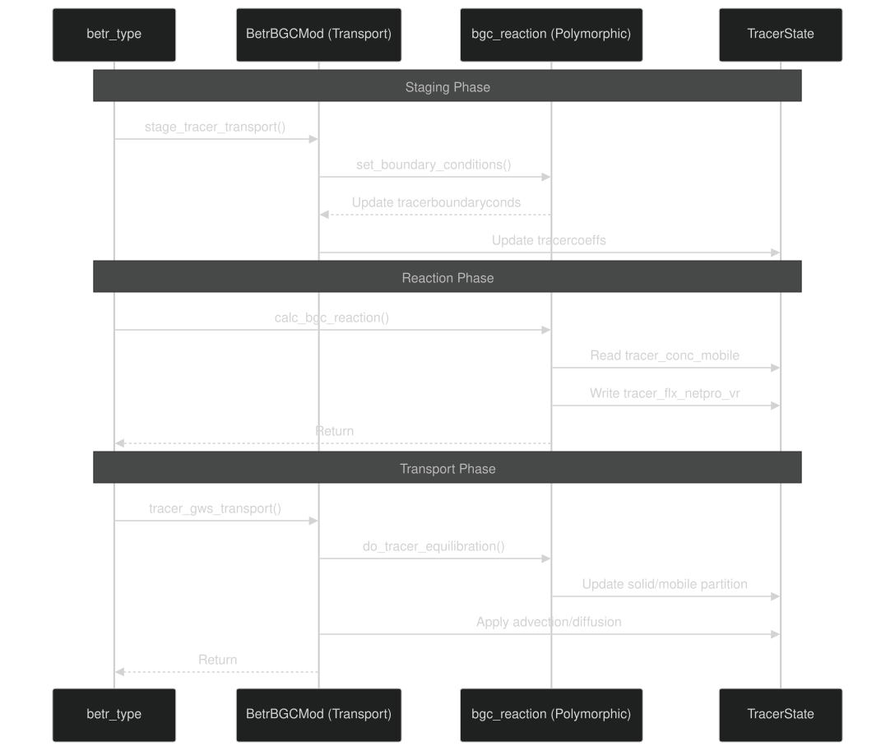

# Core BeTR Engine

Relevant source files

- [src/betr/betr_core/BGCReactionsMod.F90](https://github.com/jingtao-lbl/sbetr-resomv1/blob/72301c77/src/betr/betr_core/BGCReactionsMod.F90)
- [src/betr/betr_main/BetrBGCMod.F90](https://github.com/jingtao-lbl/sbetr-resomv1/blob/72301c77/src/betr/betr_main/BetrBGCMod.F90)
- [src/betr/betr_rxns/DIOCBGCReactionsType.F90](https://github.com/jingtao-lbl/sbetr-resomv1/blob/72301c77/src/betr/betr_rxns/DIOCBGCReactionsType.F90)
- [src/betr/betr_rxns/H2OIsotopeBGCReactionsType.F90](https://github.com/jingtao-lbl/sbetr-resomv1/blob/72301c77/src/betr/betr_rxns/H2OIsotopeBGCReactionsType.F90)
- [src/betr/betr_rxns/MockBGCReactionsType.F90](https://github.com/jingtao-lbl/sbetr-resomv1/blob/72301c77/src/betr/betr_rxns/MockBGCReactionsType.F90)
- [src/driver/shared/BeTRType.F90](https://github.com/jingtao-lbl/sbetr-resomv1/blob/72301c77/src/driver/shared/BeTRType.F90)

## Purpose and Scope

This page documents the core orchestration layer of BeTR, centered around the `betr_type` class and its coordination of transport and biogeochemical reaction processes. The `betr_type` acts as the main controller that integrates tracer management, multi-phase transport mechanisms, and pluggable BGC models into a coherent simulation framework.

For information about specific BGC model implementations, see [BGC Models](#7) . For details on tracer transport mechanisms, see [Tracer Transport System](#5) . For simulation execution modes, see [Simulation Modes](#3.1) .

## The betr_type Orchestrator

### Architecture and Components

The `betr_type` class [src/driver/shared/BeTRType.F90 44-106](https://github.com/jingtao-lbl/sbetr-resomv1/blob/72301c77/src/driver/shared/BeTRType.F90#L44-L106) is the central orchestrator that owns and coordinates all major subsystems. It maintains references to:

Component Types:

| Component | Type | Visibility | Purpose | 
| --- | --- | --- | --- |
| bgc_reaction | bgc_reaction_type (allocatable) | public | Pluggable BGC model implementing biogeochemical reactions | 
| plant_soilbgc | plant_soilbgc_type (allocatable) | public | Plant-soil coupling interface | 
| tracers | BeTRtracer_type | public | Tracer definitions and configuration | 
| tracercoeffs | TracerCoeff_type | public | Transport coefficients (diffusion, partition) | 
| tracerfluxes | TracerFlux_type | public | Flux variables across boundaries and layers | 
| tracerstates | TracerState_type | public | Tracer concentrations (mobile, frozen, solid) | 
| tracerboundaryconds | tracerboundarycond_type | public | Top/bottom boundary conditions | 
| plantNutkinetics | PlantNutKinetics_type | public | Plant nutrient uptake kinetics | 
| aereconds | betr_aerecond_type | private | Aerenchyma conductance parameters | 

betr_type Class Diagram

Sources: [src/driver/shared/BeTRType.F90 44-106](https://github.com/jingtao-lbl/sbetr-resomv1/blob/72301c77/src/driver/shared/BeTRType.F90#L44-L106)

### Initialization Sequence

The `Init` method [src/driver/shared/BeTRType.F90 153-222](https://github.com/jingtao-lbl/sbetr-resomv1/blob/72301c77/src/driver/shared/BeTRType.F90#L153-L222) orchestrates the initialization of all subsystems in dependency order:

Sources: [src/driver/shared/BeTRType.F90 153-222](https://github.com/jingtao-lbl/sbetr-resomv1/blob/72301c77/src/driver/shared/BeTRType.F90#L153-L222)

### Control Flags

The `betr_type` maintains boolean flags that control simulation behavior [src/driver/shared/BeTRType.F90 46-50](https://github.com/jingtao-lbl/sbetr-resomv1/blob/72301c77/src/driver/shared/BeTRType.F90#L46-L50) :

- `diffusion_on`: Enable/disable diffusive transport
- `advection_on`: Enable/disable advective transport
- `reaction_on`: Enable/disable biogeochemical reactions
- `ebullition_on`: Enable/disable gas bubble release

These flags are read from the namelist and passed to transport/reaction routines to selectively enable/disable processes.

Sources: [src/driver/shared/BeTRType.F90 44-106](https://github.com/jingtao-lbl/sbetr-resomv1/blob/72301c77/src/driver/shared/BeTRType.F90#L44-L106)

## Transport Coordination via BetrBGCMod

The `BetrBGCMod` module [src/betr/betr_main/BetrBGCMod.F90](https://github.com/jingtao-lbl/sbetr-resomv1/blob/72301c77/src/betr/betr_main/BetrBGCMod.F90) provides the core transport coordination routines called by `betr_type` . These are pure transport operations that do not depend on specific BGC model implementations.

### Public Transport Interfaces

| Subroutine | Purpose | Called By | 
| --- | --- | --- |
| stage_tracer_transport | Calculate transport coefficients, boundary conditions | betr_type%step_without_drainage | 
| surface_tracer_hydropath_update | Surface runoff, snow residual | betr_type%step_without_drainage | 
| tracer_gws_transport | Multi-phase subsurface transport | betr_type%step_without_drainage | 
| calc_ebullition | Pressure-driven gas release | betr_type%step_without_drainage | 
| diagnose_gas_pressure | Update gas pressures post-transport | betr_type%step_with_drainage | 

Sources: [src/betr/betr_main/BetrBGCMod.F90 45-53](https://github.com/jingtao-lbl/sbetr-resomv1/blob/72301c77/src/betr/betr_main/BetrBGCMod.F90#L45-L53)

### Two-Phase Time Stepping (Strang Splitting)

BeTR uses Strang operator splitting to separate transport processes into two phases, improving numerical accuracy and stability:

Phase 1: step_without_drainage  [src/driver/shared/BeTRType.F90 309-435](https://github.com/jingtao-lbl/sbetr-resomv1/blob/72301c77/src/driver/shared/BeTRType.F90#L309-L435)

Handles transport and reactions without groundwater drainage:

Phase 2: step_with_drainage  [src/driver/shared/BeTRType.F90 506-631](https://github.com/jingtao-lbl/sbetr-resomv1/blob/72301c77/src/driver/shared/BeTRType.F90#L506-L631)

Handles tracer loss due to drainage:

Sources: [src/driver/shared/BeTRType.F90 309-435](https://github.com/jingtao-lbl/sbetr-resomv1/blob/72301c77/src/driver/shared/BeTRType.F90#L309-L435)  [src/driver/shared/BeTRType.F90 506-631](https://github.com/jingtao-lbl/sbetr-resomv1/blob/72301c77/src/driver/shared/BeTRType.F90#L506-L631)

### Transport Staging

The `stage_tracer_transport` routine [src/betr/betr_main/BetrBGCMod.F90 114-267](https://github.com/jingtao-lbl/sbetr-resomv1/blob/72301c77/src/betr/betr_main/BetrBGCMod.F90#L114-L267) prepares all coefficients needed for transport:

Staging Operations:

Sources: [src/betr/betr_main/BetrBGCMod.F90 114-267](https://github.com/jingtao-lbl/sbetr-resomv1/blob/72301c77/src/betr/betr_main/BetrBGCMod.F90#L114-L267)

### Multi-Phase Subsurface Transport

The `tracer_gws_transport` routine [src/betr/betr_main/BetrBGCMod.F90 271-362](https://github.com/jingtao-lbl/sbetr-resomv1/blob/72301c77/src/betr/betr_main/BetrBGCMod.F90#L271-L362) orchestrates gas+aqueous+solid phase transport:

Transport Pathway Selection:

Transport Execution:

Sources: [src/betr/betr_main/BetrBGCMod.F90 271-362](https://github.com/jingtao-lbl/sbetr-resomv1/blob/72301c77/src/betr/betr_main/BetrBGCMod.F90#L271-L362)  [src/betr/betr_main/BetrBGCMod.F90 579-694](https://github.com/jingtao-lbl/sbetr-resomv1/blob/72301c77/src/betr/betr_main/BetrBGCMod.F90#L579-L694)

### Adaptive Time-Stepping in Transport

Both `do_tracer_advection`  [src/betr/betr_main/BetrBGCMod.F90 697-1153](https://github.com/jingtao-lbl/sbetr-resomv1/blob/72301c77/src/betr/betr_main/BetrBGCMod.F90#L697-L1153) and `tracer_solid_transport`  [src/betr/betr_main/BetrBGCMod.F90 364-576](https://github.com/jingtao-lbl/sbetr-resomv1/blob/72301c77/src/betr/betr_main/BetrBGCMod.F90#L364-L576) use adaptive sub-stepping to prevent negative concentrations:

Algorithm:

Sources: [src/betr/betr_main/BetrBGCMod.F90 697-1153](https://github.com/jingtao-lbl/sbetr-resomv1/blob/72301c77/src/betr/betr_main/BetrBGCMod.F90#L697-L1153)  [src/betr/betr_main/BetrBGCMod.F90 364-576](https://github.com/jingtao-lbl/sbetr-resomv1/blob/72301c77/src/betr/betr_main/BetrBGCMod.F90#L364-L576)

## BGC Reaction Interface

### Abstract Base Class Design

The `bgc_reaction_type`  [src/betr/betr_core/BGCReactionsMod.F90 17-59](https://github.com/jingtao-lbl/sbetr-resomv1/blob/72301c77/src/betr/betr_core/BGCReactionsMod.F90#L17-L59) is an abstract base class that defines the interface for all BGC models. This enables polymorphic dispatch where `betr_type` calls BGC operations through the abstract interface without knowing the concrete implementation.

Required Abstract Methods:

| Method | Purpose | When Called | 
| --- | --- | --- |
| Init_betrbgc | Initialize BGC model, define tracers | During betr_type%Init() | 
| calc_bgc_reaction | Execute biogeochemical reactions | Every timestep in step_without_drainage | 
| set_boundary_conditions | Set top/bottom BC for tracers | During stage_tracer_transport | 
| do_tracer_equilibration | Partition tracers between phases | Before transport in tracer_gw_transport | 
| initCold | Set initial tracer concentrations | During betr_type%Init() | 
| retrieve_biostates | Extract state for LSM mass balance | After timestep | 
| retrieve_biogeoflux | Extract fluxes for LSM | After timestep | 
| init_boundary_condition_type | Define BC types (flux vs conc) | During betr_type%Init() | 

Sources: [src/betr/betr_core/BGCReactionsMod.F90 17-59](https://github.com/jingtao-lbl/sbetr-resomv1/blob/72301c77/src/betr/betr_core/BGCReactionsMod.F90#L17-L59)  [src/betr/betr_core/BGCReactionsMod.F90 61-443](https://github.com/jingtao-lbl/sbetr-resomv1/blob/72301c77/src/betr/betr_core/BGCReactionsMod.F90#L61-L443)

### Concrete Implementation Example

Mock BGC model [src/betr/betr_rxns/MockBGCReactionsType.F90 30-53](https://github.com/jingtao-lbl/sbetr-resomv1/blob/72301c77/src/betr/betr_rxns/MockBGCReactionsType.F90#L30-L53) demonstrates the minimal implementation:

Type Declaration:

Polymorphic Usage in betr_type:

The actual concrete type (MockBGC, ECACNP, SIMIC, etc.) is determined at runtime by the factory pattern in `create_betr_application`  [src/driver/shared/BeTRType.F90 184-186](https://github.com/jingtao-lbl/sbetr-resomv1/blob/72301c77/src/driver/shared/BeTRType.F90#L184-L186)

Sources: [src/betr/betr_rxns/MockBGCReactionsType.F90 30-53](https://github.com/jingtao-lbl/sbetr-resomv1/blob/72301c77/src/betr/betr_rxns/MockBGCReactionsType.F90#L30-L53)  [src/driver/shared/BeTRType.F90 44-106](https://github.com/jingtao-lbl/sbetr-resomv1/blob/72301c77/src/driver/shared/BeTRType.F90#L44-L106)

### BGC-Transport Coupling Points

The BGC model interacts with transport at specific coupling points:

Sources: [src/driver/shared/BeTRType.F90 371-407](https://github.com/jingtao-lbl/sbetr-resomv1/blob/72301c77/src/driver/shared/BeTRType.F90#L371-L407)

## Execution Flow Detail

### Main Timestep Execution

The complete execution of one model timestep through `betr_type` :

Sources: [src/driver/shared/BeTRType.F90 309-435](https://github.com/jingtao-lbl/sbetr-resomv1/blob/72301c77/src/driver/shared/BeTRType.F90#L309-L435)

### Data Flow Through Components

How tracer data flows through the system during a timestep:

Sources: [src/driver/shared/BeTRType.F90 309-435](https://github.com/jingtao-lbl/sbetr-resomv1/blob/72301c77/src/driver/shared/BeTRType.F90#L309-L435)  [src/betr/betr_main/BetrBGCMod.F90](https://github.com/jingtao-lbl/sbetr-resomv1/blob/72301c77/src/betr/betr_main/BetrBGCMod.F90)

### Error Handling and Status Propagation

BeTR uses `betr_status_type` for error propagation [src/driver/shared/BeTRType.F90](https://github.com/jingtao-lbl/sbetr-resomv1/blob/72301c77/src/driver/shared/BeTRType.F90) :

Pattern:

This enables immediate return on error with context about where the failure occurred. All routines in the call chain check status and return immediately on error.

Sources: [src/driver/shared/BeTRType.F90 359-426](https://github.com/jingtao-lbl/sbetr-resomv1/blob/72301c77/src/driver/shared/BeTRType.F90#L359-L426)