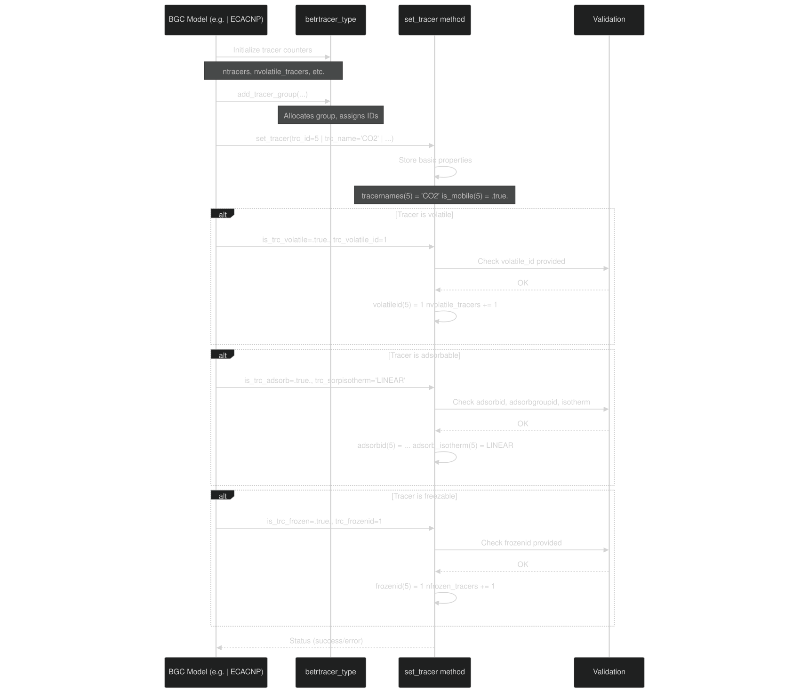

# Tracer Configuration

Relevant source files

- [src/betr/betr_core/BeTRTracerType.F90](https://github.com/jingtao-lbl/sbetr-resomv1/blob/72301c77/src/betr/betr_core/BeTRTracerType.F90)
- [src/betr/betr_core/TracerBaseType.F90](https://github.com/jingtao-lbl/sbetr-resomv1/blob/72301c77/src/betr/betr_core/TracerBaseType.F90)
- [src/betr/betr_core/TracerBoundaryCondType.F90](https://github.com/jingtao-lbl/sbetr-resomv1/blob/72301c77/src/betr/betr_core/TracerBoundaryCondType.F90)
- [src/betr/betr_core/TracerCoeffType.F90](https://github.com/jingtao-lbl/sbetr-resomv1/blob/72301c77/src/betr/betr_core/TracerCoeffType.F90)
- [src/betr/betr_core/TracerFluxType.F90](https://github.com/jingtao-lbl/sbetr-resomv1/blob/72301c77/src/betr/betr_core/TracerFluxType.F90)
- [src/betr/betr_core/TracerStateType.F90](https://github.com/jingtao-lbl/sbetr-resomv1/blob/72301c77/src/betr/betr_core/TracerStateType.F90)
- [src/betr/betr_main/TracerBalanceMod.F90](https://github.com/jingtao-lbl/sbetr-resomv1/blob/72301c77/src/betr/betr_main/TracerBalanceMod.F90)
- [src/betr/betr_para/TracerParamsMod.F90](https://github.com/jingtao-lbl/sbetr-resomv1/blob/72301c77/src/betr/betr_para/TracerParamsMod.F90)

This page documents how tracers are defined, configured with properties (mobile, volatile, adsorbing, diffusive), and organized into groups within BeTR. For information about tracer state management (concentrations and storage), see [Tracer State Management](#5.2) . For phase equilibration and transport coefficients, see [Phase Equilibration](#5.3) .

## Overview

In BeTR, a tracer represents any chemical species that is tracked through the soil profile, including gaseous species (CO₂, CH₄, O₂), aqueous species (dissolved organic matter, nutrients), solid species (soil organic matter pools), and their isotopic variants. Each tracer is configured with a set of properties that determine how it participates in transport and biogeochemical processes.

The tracer configuration system is centered on the `betrtracer_type` class ( [src/betr/betr_core/BeTRTracerType.F90 26-127](https://github.com/jingtao-lbl/sbetr-resomv1/blob/72301c77/src/betr/betr_core/BeTRTracerType.F90#L26-L127) ), which stores all tracer properties, organizes tracers into transport groups, and provides methods for registering new tracers. This configuration determines which transport mechanisms apply to each tracer and how phase equilibration is computed.

Sources:  [src/betr/betr_core/BeTRTracerType.F90 1-527](https://github.com/jingtao-lbl/sbetr-resomv1/blob/72301c77/src/betr/betr_core/BeTRTracerType.F90#L1-L527)

## Tracer Categories

BeTR organizes tracers into several hierarchical categories based on their transport behavior and phase characteristics:

Key Category Counters (from `betrtracer_type` ):

| Counter | Description | Typical Examples | 
| --- | --- | --- |
| ntracers | Total number of all tracers | Sum of all categories | 
| ngwmobile_tracers | Gas/water mobile tracers | CO₂, dissolved nutrients, water isotopes | 
| nvolatile_tracers | Can exist in gas phase | CO₂, CH₄, N₂O, O₂, water vapor | 
| nsolid_equil_tracers | Equilibrium adsorption | NH₄⁺, adsorbed DOC | 
| nsolid_passive_tracers | Solid-phase only | SOM pools, litter pools | 
| nfrozen_tracers | Can freeze to ice | Water isotopes | 

Sources:  [src/betr/betr_core/BeTRTracerType.F90 29-41](https://github.com/jingtao-lbl/sbetr-resomv1/blob/72301c77/src/betr/betr_core/BeTRTracerType.F90#L29-L41)  [src/betr/betr_core/BeTRTracerType.F90 173-184](https://github.com/jingtao-lbl/sbetr-resomv1/blob/72301c77/src/betr/betr_core/BeTRTracerType.F90#L173-L184)

## BeTRtracer_type Structure

The `betrtracer_type` class is the central configuration object that stores all tracer definitions and their properties.

### Core Components

Data Organization:

- **Property flags**`is_volatile``is_mobile`: Boolean arrays indicating tracer capabilities ( , , etc.)
- **ID mapping arrays**`volatilegroupid``adsorbid`: Link tracers to their position in specialized arrays ( , )
- **Group membership**`tracer_group_memid(group_id, member_position)`: maps groups to member tracers
- **Metadata**: Names, units, molecular weights for each tracer

Sources:  [src/betr/betr_core/BeTRTracerType.F90 26-127](https://github.com/jingtao-lbl/sbetr-resomv1/blob/72301c77/src/betr/betr_core/BeTRTracerType.F90#L26-L127)  [src/betr/betr_core/BeTRTracerType.F90 228-279](https://github.com/jingtao-lbl/sbetr-resomv1/blob/72301c77/src/betr/betr_core/BeTRTracerType.F90#L228-L279)

## Tracer Properties

Each tracer is configured with a set of boolean flags and numeric parameters that control its behavior in transport and reactions.

### Boolean Property Flags

The following table describes each property flag in `betrtracer_type` :

| Property | Array Name | Meaning | Transport Implications | 
| --- | --- | --- | --- |
| Mobile | is_mobile(:) | Can move through soil | If false, tracer is completely immobile | 
| Diffusive | is_diffusive(:) | Undergoes diffusion | Participates in concentration-gradient transport | 
| Advective | is_advective(:) | Moves with water flow | Affected by infiltration, drainage | 
| Volatile | is_volatile(:) | Can exist as gas | Partitions between gas/aqueous phases | 
| Adsorbable | is_adsorb(:) | Adsorbs to surfaces | Has equilibrium solid phase | 
| Water tracer | is_h2o(:) | Is water or isotope | Special handling for vapor/ice | 
| CO₂ tag | is_co2tag(:) | Tagged CO₂ tracer | For source attribution | 
| DOM | is_dom(:) | Dissolved organic matter | RTM-BGC compatibility | 
| Isotope | is_isotope(:) | Isotopic variant | Fractionation effects apply | 
| Freezable | is_frozen(:) | Can form ice phase | Has frozen concentration array | 

Key Constraints:

- `is_mobile = .false.``is_diffusive``is_advective``.false.`[src/betr/betr_core/BeTRTracerType.F90330-338](https://github.com/jingtao-lbl/sbetr-resomv1/blob/72301c77/src/betr/betr_core/BeTRTracerType.F90#L330-L338)If , then both and are automatically set to ( )
- `trc_volatile_id``trc_volatile_group_id`[src/betr/betr_core/BeTRTracerType.F90342-357](https://github.com/jingtao-lbl/sbetr-resomv1/blob/72301c77/src/betr/betr_core/BeTRTracerType.F90#L342-L357)Volatile tracers must specify and ( )
- `trc_adsorbid``trc_adsorbgroupid``trc_sorpisotherm`[src/betr/betr_core/BeTRTracerType.F90370-397](https://github.com/jingtao-lbl/sbetr-resomv1/blob/72301c77/src/betr/betr_core/BeTRTracerType.F90#L370-L397)Adsorbable tracers must specify , , and ( )

Sources:  [src/betr/betr_core/BeTRTracerType.F90 82-92](https://github.com/jingtao-lbl/sbetr-resomv1/blob/72301c77/src/betr/betr_core/BeTRTracerType.F90#L82-L92)  [src/betr/betr_core/BeTRTracerType.F90 237-246](https://github.com/jingtao-lbl/sbetr-resomv1/blob/72301c77/src/betr/betr_core/BeTRTracerType.F90#L237-L246)  [src/betr/betr_core/BeTRTracerType.F90 283-411](https://github.com/jingtao-lbl/sbetr-resomv1/blob/72301c77/src/betr/betr_core/BeTRTracerType.F90#L283-L411)

### Numeric Configuration Parameters

Scaling Factors:

- `adv_scalar(group)`[src/betr/betr_core/BeTRTracerType.F90260](https://github.com/jingtao-lbl/sbetr-resomv1/blob/72301c77/src/betr/betr_core/BeTRTracerType.F90#L260-L260): Multiplies advective flux for sensitivity analysis ( )
- `difu_scalar(group)`[src/betr/betr_core/BeTRTracerType.F90261](https://github.com/jingtao-lbl/sbetr-resomv1/blob/72301c77/src/betr/betr_core/BeTRTracerType.F90#L261-L261): Multiplies diffusive flux ( )
- `vtrans_scal(tracer)`[src/betr/betr_core/BeTRTracerType.F90259](https://github.com/jingtao-lbl/sbetr-resomv1/blob/72301c77/src/betr/betr_core/BeTRTracerType.F90#L259-L259): Fraction of dissolved tracer taken up by plant transpiration ( )

Adsorption Isotherms:

- `sorp_isotherm_linear``C_solid = Kd * C_aqueous`: Linear isotherm,
- `sorp_isotherm_langmuir`[src/betr/betr_core/BeTRTracerType.F90391-395](https://github.com/jingtao-lbl/sbetr-resomv1/blob/72301c77/src/betr/betr_core/BeTRTracerType.F90#L391-L395): Langmuir isotherm for saturable sorption sites ( )

Sources:  [src/betr/betr_core/BeTRTracerType.F90 102-114](https://github.com/jingtao-lbl/sbetr-resomv1/blob/72301c77/src/betr/betr_core/BeTRTracerType.F90#L102-L114)  [src/betr/betr_core/BeTRTracerType.F90 260-262](https://github.com/jingtao-lbl/sbetr-resomv1/blob/72301c77/src/betr/betr_core/BeTRTracerType.F90#L260-L262)

## Tracer Groups

Tracers with similar transport characteristics are organized into tracer groups to optimize computation. Each group shares the same transport coefficients and boundary condition types.

### Group Organization

Group Membership Array:

The `tracer_group_memid(group, position)` array stores which tracers belong to each group:

Adding a Tracer Group:

The `add_tracer_group` method ( [src/betr/betr_core/BeTRTracerType.F90 427-473](https://github.com/jingtao-lbl/sbetr-resomv1/blob/72301c77/src/betr/betr_core/BeTRTracerType.F90#L427-L473) ) registers a new group:

This updates group counters ( `ngwmobile_tracer_groups` , `nvolatile_tracer_groups` ) and assigns tracer ID ranges.

Sources:  [src/betr/betr_core/BeTRTracerType.F90 36-40](https://github.com/jingtao-lbl/sbetr-resomv1/blob/72301c77/src/betr/betr_core/BeTRTracerType.F90#L36-L40)  [src/betr/betr_core/BeTRTracerType.F90 109-110](https://github.com/jingtao-lbl/sbetr-resomv1/blob/72301c77/src/betr/betr_core/BeTRTracerType.F90#L109-L110)  [src/betr/betr_core/BeTRTracerType.F90 270-274](https://github.com/jingtao-lbl/sbetr-resomv1/blob/72301c77/src/betr/betr_core/BeTRTracerType.F90#L270-L274)  [src/betr/betr_core/BeTRTracerType.F90 427-473](https://github.com/jingtao-lbl/sbetr-resomv1/blob/72301c77/src/betr/betr_core/BeTRTracerType.F90#L427-L473)

## Configuring Individual Tracers

The `set_tracer` method ( [src/betr/betr_core/BeTRTracerType.F90 283-411](https://github.com/jingtao-lbl/sbetr-resomv1/blob/72301c77/src/betr/betr_core/BeTRTracerType.F90#L283-L411) ) configures an individual tracer with all its properties.

### Configuration Workflow

### Required vs Optional Arguments

Required for all tracers:

- `trc_id`: Unique integer identifier
- `trc_name`: Tracer name (e.g., "CO2", "NH3", "SOM1")
- `is_trc_mobile`: Can the tracer move?
- `is_trc_advective`: Does it move with water flow?
- `trc_group_id`: Which transport group?
- `trc_group_mem`: Position within group

Required for volatile tracers:

- `is_trc_volatile = .true.`
- `trc_volatile_id`: Position in volatile arrays (1 to nvolatile_tracers)
- `trc_volatile_group_id`: Volatile group ID

Required for adsorbable tracers:

- `is_trc_adsorb = .true.`
- `trc_adsorbid`: Position in adsorption arrays
- `trc_adsorbgroupid`: Adsorption group ID
- `trc_sorpisotherm`: 'LINEAR' or 'LANGMUIR'

Required for freezable tracers:

- `is_trc_frozen = .true.`
- `trc_frozenid`: Position in frozen arrays

Optional arguments:

- `is_trc_diffusive``.true.`: Default is
- `trc_vtrans_scal``0.0`: Default is (no transpiration uptake)
- `is_trc_h2o``.false.`: Default is
- `do_mass_balchk``.true.`: Default is
- `is_trc_dom``.false.`: Default is
- `trc_family_name``trc_name`: Default is same as

Sources:  [src/betr/betr_core/BeTRTracerType.F90 283-315](https://github.com/jingtao-lbl/sbetr-resomv1/blob/72301c77/src/betr/betr_core/BeTRTracerType.F90#L283-L315)  [src/betr/betr_core/BeTRTracerType.F90 318-411](https://github.com/jingtao-lbl/sbetr-resomv1/blob/72301c77/src/betr/betr_core/BeTRTracerType.F90#L318-L411)

## Special Tracer Types

BeTR defines special ID ranges for commonly used tracer families to enable specialized handling.

### Predefined Tracer ID Ranges

The following special tracer ranges are defined in `betrtracer_type` :

Usage Example:

BGC models can check if a specific tracer type exists:

Tagged CO2 Tracers:

BeTR supports source-specific CO2 tracking:

- `id_trc_air_co2x`: Atmospheric CO2
- `id_trc_arrt_co2x`: Autotrophic respiration CO2
- `id_trc_hrsoi_co2x`: Heterotrophic respiration CO2

These are configured with `is_co2tag(:) = .true.` flag to enable tagged transport.

Sources:  [src/betr/betr_core/BeTRTracerType.F90 43-79](https://github.com/jingtao-lbl/sbetr-resomv1/blob/72301c77/src/betr/betr_core/BeTRTracerType.F90#L43-L79)  [src/betr/betr_core/BeTRTracerType.F90 186-223](https://github.com/jingtao-lbl/sbetr-resomv1/blob/72301c77/src/betr/betr_core/BeTRTracerType.F90#L186-L223)  [src/betr/betr_core/BeTRTracerType.F90 475-525](https://github.com/jingtao-lbl/sbetr-resomv1/blob/72301c77/src/betr/betr_core/BeTRTracerType.F90#L475-L525)

## Tracer Families and Multi-Species Groups

Many chemical species exist in multiple aqueous forms depending on pH. BeTR handles this through tracer families .

### Family Name Concept

Each tracer has both a `tracername` and a `tracerfamilyname` :

- **tracername**: Specific chemical form (e.g., "CO2", "HCO3-", "CO3-2")
- **tracerfamilyname**: Chemical family (e.g., "CO2X" for all carbonate species)

The family name is used to apply equilibrium scaling factors based on pH ( [src/betr/betr_para/TracerParamsMod.F90 486-496](https://github.com/jingtao-lbl/sbetr-resomv1/blob/72301c77/src/betr/betr_para/TracerParamsMod.F90#L486-L496) ):

This allows pH-dependent partitioning between species while treating them as a single family for transport purposes.

Example Configuration:

Sources:  [src/betr/betr_core/BeTRTracerType.F90 112](https://github.com/jingtao-lbl/sbetr-resomv1/blob/72301c77/src/betr/betr_core/BeTRTracerType.F90#L112-L112)  [src/betr/betr_core/BeTRTracerType.F90 320-324](https://github.com/jingtao-lbl/sbetr-resomv1/blob/72301c77/src/betr/betr_core/BeTRTracerType.F90#L320-L324)  [src/betr/betr_para/TracerParamsMod.F90 457-496](https://github.com/jingtao-lbl/sbetr-resomv1/blob/72301c77/src/betr/betr_para/TracerParamsMod.F90#L457-L496)

## Solid Passive Tracers

Solid passive tracers (soil organic matter pools) undergo different transport than mobile tracers, using bioturbation and cryoturbation rather than advection-diffusion.

### Configuration for Solid Transport

Key Parameters:

- `tracer_solid_passive_diffus_scal_group(group_id)`: Multiplier for base diffusivity (default = 1.0)
- `tracer_solid_passive_diffus_thc_group(group_id)`: Minimum diffusivity threshold (default = 1e-40 m²/s)

Diffusivity Calculation:

In permafrost regions with cryoturbation ( [src/betr/betr_para/TracerParamsMod.F90 325-337](https://github.com/jingtao-lbl/sbetr-resomv1/blob/72301c77/src/betr/betr_para/TracerParamsMod.F90#L325-L337) ):

In temperate soils with bioturbation ( [src/betr/betr_para/TracerParamsMod.F90 339-341](https://github.com/jingtao-lbl/sbetr-resomv1/blob/72301c77/src/betr/betr_para/TracerParamsMod.F90#L339-L341) ):

Sources:  [src/betr/betr_core/BeTRTracerType.F90 106-108](https://github.com/jingtao-lbl/sbetr-resomv1/blob/72301c77/src/betr/betr_core/BeTRTracerType.F90#L106-L108)  [src/betr/betr_core/BeTRTracerType.F90 264-268](https://github.com/jingtao-lbl/sbetr-resomv1/blob/72301c77/src/betr/betr_core/BeTRTracerType.F90#L264-L268)  [src/betr/betr_para/TracerParamsMod.F90 318-349](https://github.com/jingtao-lbl/sbetr-resomv1/blob/72301c77/src/betr/betr_para/TracerParamsMod.F90#L318-L349)  [src/betr/betr_core/BeTRTracerType.F90 414-424](https://github.com/jingtao-lbl/sbetr-resomv1/blob/72301c77/src/betr/betr_core/BeTRTracerType.F90#L414-L424)

## Relationship to Other Tracer Types

The configuration in `betrtracer_type` determines the structure of other tracer-related data types:

Array Sizing Logic:

- `ntracers`**all tracers**Arrays indexed by store data for
- `ngwmobile_tracers`**mobile tracers only**Arrays indexed by store data for
- `nvolatile_tracers`**volatile tracers only**Arrays indexed by store data for
- `ntracer_groups`**group-level**Arrays indexed by store coefficients
- `nvolatile_tracer_groups`**volatile group-level**Arrays indexed by store coefficients

This organization minimizes memory usage by avoiding storage of parameters that don't apply to certain tracer types (e.g., Henry's constants for non-volatile tracers).

Sources:  [src/betr/betr_core/TracerStateType.F90 100-136](https://github.com/jingtao-lbl/sbetr-resomv1/blob/72301c77/src/betr/betr_core/TracerStateType.F90#L100-L136)  [src/betr/betr_core/TracerCoeffType.F90 128-174](https://github.com/jingtao-lbl/sbetr-resomv1/blob/72301c77/src/betr/betr_core/TracerCoeffType.F90#L128-L174)  [src/betr/betr_core/TracerFluxType.F90 134-191](https://github.com/jingtao-lbl/sbetr-resomv1/blob/72301c77/src/betr/betr_core/TracerFluxType.F90#L134-L191)