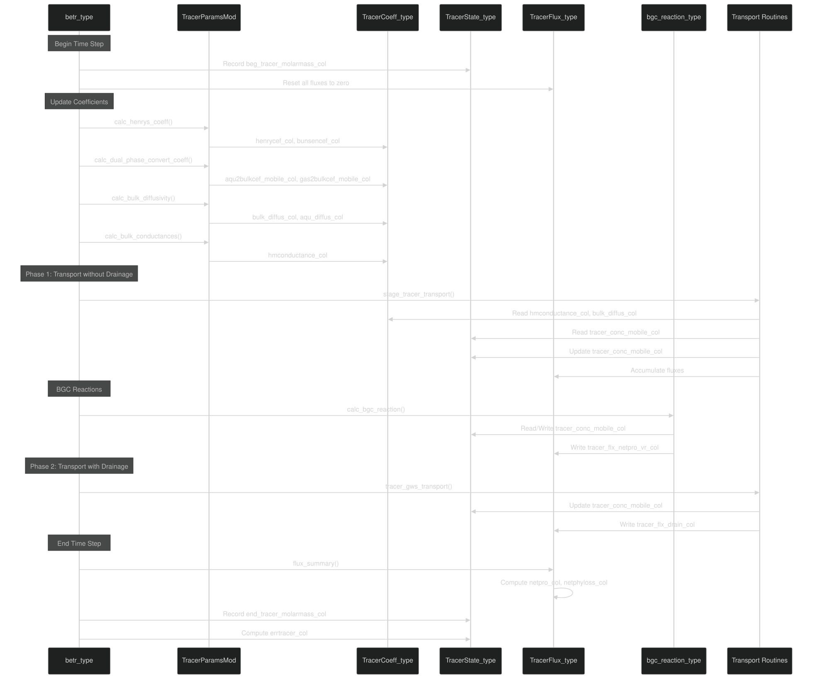
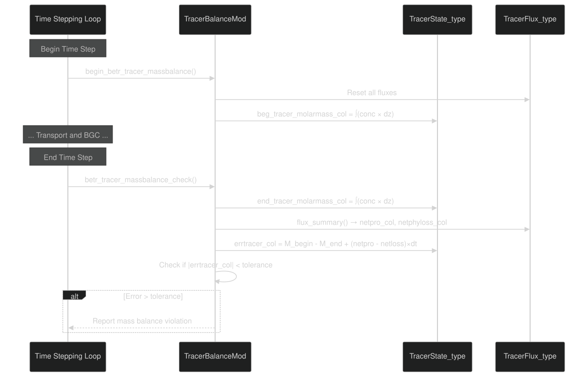

# Tracer State Management

Relevant source files

- [src/betr/betr_core/BeTRTracerType.F90](https://github.com/jingtao-lbl/sbetr-resomv1/blob/72301c77/src/betr/betr_core/BeTRTracerType.F90)
- [src/betr/betr_core/TracerBaseType.F90](https://github.com/jingtao-lbl/sbetr-resomv1/blob/72301c77/src/betr/betr_core/TracerBaseType.F90)
- [src/betr/betr_core/TracerBoundaryCondType.F90](https://github.com/jingtao-lbl/sbetr-resomv1/blob/72301c77/src/betr/betr_core/TracerBoundaryCondType.F90)
- [src/betr/betr_core/TracerCoeffType.F90](https://github.com/jingtao-lbl/sbetr-resomv1/blob/72301c77/src/betr/betr_core/TracerCoeffType.F90)
- [src/betr/betr_core/TracerFluxType.F90](https://github.com/jingtao-lbl/sbetr-resomv1/blob/72301c77/src/betr/betr_core/TracerFluxType.F90)
- [src/betr/betr_core/TracerStateType.F90](https://github.com/jingtao-lbl/sbetr-resomv1/blob/72301c77/src/betr/betr_core/TracerStateType.F90)
- [src/betr/betr_main/TracerBalanceMod.F90](https://github.com/jingtao-lbl/sbetr-resomv1/blob/72301c77/src/betr/betr_main/TracerBalanceMod.F90)
- [src/betr/betr_para/TracerParamsMod.F90](https://github.com/jingtao-lbl/sbetr-resomv1/blob/72301c77/src/betr/betr_para/TracerParamsMod.F90)

## Purpose and Scope

This page documents BeTR's tracer state management system, which tracks tracer concentrations, fluxes, and transport coefficients throughout the simulation. The system consists of three core data types that work together to maintain the complete state of all tracers at each time step:

- **`TracerState_type`**: Stores tracer concentrations across all phases and locations
- **`TracerFlux_type`**: Tracks all tracer fluxes (physical transport and biogeochemical sources/sinks)
- **`TracerCoeff_type`**: Manages phase conversion coefficients and transport parameters

For information about how tracers are configured and defined, see [Tracer Configuration](#5.1) . For details on the transport mechanisms that use these data structures, see [Transport Mechanisms](#5.4) .

## Overview: The Three Core Data Types

The tracer state management system separates concerns into three complementary data structures that collectively represent the complete state of the tracer transport system at any point in time.

### High-Level Architecture

Sources:  [src/betr/betr_core/TracerStateType.F90 1-549](https://github.com/jingtao-lbl/sbetr-resomv1/blob/72301c77/src/betr/betr_core/TracerStateType.F90#L1-L549)  [src/betr/betr_core/TracerFluxType.F90 1-750](https://github.com/jingtao-lbl/sbetr-resomv1/blob/72301c77/src/betr/betr_core/TracerFluxType.F90#L1-L750)  [src/betr/betr_core/TracerCoeffType.F90 1-343](https://github.com/jingtao-lbl/sbetr-resomv1/blob/72301c77/src/betr/betr_core/TracerCoeffType.F90#L1-L343)

## TracerState_type: Concentration Management

The `TracerState_type` data structure manages tracer concentrations across all phases (mobile, solid, frozen) and tracks mass balance at the column level. It extends `tracerbase_type` to inherit history output capabilities.

### Key State Variables

| Variable | Dimensions | Units | Description | 
| --- | --- | --- | --- |
| tracer_conc_mobile_col | (begc:endc, lbj:ubj, 1:ntracers) | mol/m³ | Bulk mobile phase concentration (gas + aqueous) | 
| tracer_conc_solid_equil_col | (begc:endc, lbj:ubj, 1:nsolid_equil_tracers) | mol/m³ | Equilibrium adsorbed/solid phase | 
| tracer_conc_frozen_col | (begc:endc, lbj:ubj, 1:nfrozen_tracers) | mol/m³ | Frozen phase (ice) | 
| tracer_P_gas_col | (begc:endc, lbj:ubj) | Pa | Total gas pressure | 
| tracer_P_gas_frac_col | (begc:endc, lbj:ubj, 1:nvolatile_tracers) | - | Gas phase fraction by species | 
| tracer_conc_surfwater_col | (begc:endc, 1:ngwmobile_tracers) | mol/m³ | Surface water concentration | 
| tracer_conc_aquifer_col | (begc:endc, 1:ngwmobile_tracers) | mol/m³ | Aquifer concentration | 
| tracer_conc_grndwater_col | (begc:endc, 1:ngwmobile_tracers) | mol/m³ | Groundwater concentration | 

Sources:  [src/betr/betr_core/TracerStateType.F90 27-58](https://github.com/jingtao-lbl/sbetr-resomv1/blob/72301c77/src/betr/betr_core/TracerStateType.F90#L27-L58)

### Mobile Phase Concentration

The "mobile" phase represents tracers that can move via diffusion and advection. For volatile tracers, this is the combined gas and aqueous phase concentration stored as a single bulk value. The actual partitioning between gas and aqueous phases is computed on-the-fly using phase conversion coefficients.

Conversion relationships (calculated in `TracerCoeff_type` ):

- **Gas-primary retardation:**For most volatile tracers, the bulk concentration is gas-primary
- **Aqueous-primary retardation:**For water isotopes, the bulk concentration is aqueous-primary
- **Equilibrium assumption:**Gas and aqueous phases are assumed to be in instantaneous equilibrium

Sources:  [src/betr/betr_core/TracerStateType.F90 36](https://github.com/jingtao-lbl/sbetr-resomv1/blob/72301c77/src/betr/betr_core/TracerStateType.F90#L36-L36)  [src/betr/betr_para/TracerParamsMod.F90 172-351](https://github.com/jingtao-lbl/sbetr-resomv1/blob/72301c77/src/betr/betr_para/TracerParamsMod.F90#L172-L351)

### Multi-Phase Tracer Representation

BeTR represents tracers in up to four distinct phases, depending on tracer properties:

Phase storage decisions:

- **Mobile phase**`tracer_conc_mobile_col`( ): Always stored for all tracers
- **Equilibrium solid**`tracer_conc_solid_equil_col``is_adsorb(tracer)=.true.`( ): Stored separately only if
- **Frozen phase**`tracer_conc_frozen_col``is_frozen(tracer)=.true.`( ): Stored separately only if
- **Gas/aqueous split**: Not stored separately; computed on-demand from mobile phase and coefficients

Sources:  [src/betr/betr_core/TracerStateType.F90 85-137](https://github.com/jingtao-lbl/sbetr-resomv1/blob/72301c77/src/betr/betr_core/TracerStateType.F90#L85-L137)  [src/betr/betr_core/BeTRTracerType.F90 82-98](https://github.com/jingtao-lbl/sbetr-resomv1/blob/72301c77/src/betr/betr_core/BeTRTracerType.F90#L82-L98)

### Mass Balance Tracking

The `TracerState_type` maintains variables to enable mass balance checking at each time step:

| Variable | Purpose | 
| --- | --- |
| beg_tracer_molarmass_col | Column-integrated mass at beginning of time step (mol/m²) | 
| end_tracer_molarmass_col | Column-integrated mass at end of time step (mol/m²) | 
| tracer_soi_molarmass_col | Soil-only integrated mass (mol/m²) | 
| errtracer_col | Mass balance error (mol/m²) | 

The mass balance equation enforced is:

Sources:  [src/betr/betr_core/TracerStateType.F90 41-43](https://github.com/jingtao-lbl/sbetr-resomv1/blob/72301c77/src/betr/betr_core/TracerStateType.F90#L41-L43)  [src/betr/betr_main/TracerBalanceMod.F90 145-173](https://github.com/jingtao-lbl/sbetr-resomv1/blob/72301c77/src/betr/betr_main/TracerBalanceMod.F90#L145-L173)

### Integration Methods

The `TracerState_type` provides methods to integrate tracer mass over the column:

These methods perform vertical integration using layer thicknesses:

Sources:  [src/betr/betr_core/TracerStateType.F90 320-371](https://github.com/jingtao-lbl/sbetr-resomv1/blob/72301c77/src/betr/betr_core/TracerStateType.F90#L320-L371)  [src/betr/betr_main/TracerBalanceMod.F90 182-244](https://github.com/jingtao-lbl/sbetr-resomv1/blob/72301c77/src/betr/betr_main/TracerBalanceMod.F90#L182-L244)

## TracerFlux_type: Flux Tracking

The `TracerFlux_type` tracks all tracer fluxes through various physical pathways and biogeochemical processes. Fluxes are accumulated throughout each time step and used for mass balance checking and output.

### Flux Categories

Tracer fluxes are organized into several categories based on their physical or biogeochemical origin:
Physical Fluxes (Column-Level)
| Variable | Units | Description | 
| --- | --- | --- |
| tracer_flx_infl_col | mol/m²/s | Infiltration flux into top soil layer | 
| tracer_flx_drain_col | mol/m²/s | Subsurface drainage flux (lateral + bottom) | 
| tracer_flx_leaching_col | mol/m²/s | Bottom boundary leaching flux | 
| tracer_flx_surfrun_col | mol/m²/s | Surface runoff flux | 
| tracer_flx_prec_col | mol/m²/s | Precipitation input flux | 
| tracer_flx_snowmelt_col | mol/m²/s | Snow melt release flux | 

Sources:  [src/betr/betr_core/TracerFluxType.F90 27-48](https://github.com/jingtao-lbl/sbetr-resomv1/blob/72301c77/src/betr/betr_core/TracerFluxType.F90#L27-L48)
Volatile Tracer Fluxes
For tracers with `is_volatile=.true.` , additional emission fluxes are tracked:

| Variable | Units | Description | 
| --- | --- | --- |
| tracer_flx_ebu_col | mol/m²/s | Ebullition (bubble) flux | 
| tracer_flx_dif_col | mol/m²/s | Diffusive emission to atmosphere | 
| tracer_flx_tparchm_col | mol/m²/s | Plant aerenchyma transport flux | 
| tracer_flx_surfemi_col | mol/m²/s | Total surface emission (sum of above) | 
| tracer_flx_parchm_vr_col | mol/m³/s | Vertically-resolved aerenchyma flux | 

Sources:  [src/betr/betr_core/TracerFluxType.F90 34-44](https://github.com/jingtao-lbl/sbetr-resomv1/blob/72301c77/src/betr/betr_core/TracerFluxType.F90#L34-L44)
Biogeochemical Fluxes
| Variable | Units | Description | 
| --- | --- | --- |
| tracer_flx_netpro_col | mol/m²/s | Net production from BGC reactions | 
| tracer_flx_netpro_vr_col | mol/m³/s | Vertically-resolved net production | 
| tracer_flx_vtrans_col | mol/m²/s | Plant transpiration uptake | 
| tracer_flx_vtrans_vr_col | mol/m³/s | Vertically-resolved transpiration uptake | 

Sources:  [src/betr/betr_core/TracerFluxType.F90 32-48](https://github.com/jingtao-lbl/sbetr-resomv1/blob/72301c77/src/betr/betr_core/TracerFluxType.F90#L32-L48)

### Net Flux Accounting

Two critical summary fluxes are computed for mass balance checking:

The `flux_summary` method computes:

Sources:  [src/betr/betr_core/TracerFluxType.F90 576-750](https://github.com/jingtao-lbl/sbetr-resomv1/blob/72301c77/src/betr/betr_core/TracerFluxType.F90#L576-L750)

### Flux Accumulation and Temporal Averaging

Fluxes are accumulated during each time step and temporally averaged for output:

Sources:  [src/betr/betr_core/TracerFluxType.F90 553-574](https://github.com/jingtao-lbl/sbetr-resomv1/blob/72301c77/src/betr/betr_core/TracerFluxType.F90#L553-L574)  [src/betr/betr_main/TracerBalanceMod.F90 138-143](https://github.com/jingtao-lbl/sbetr-resomv1/blob/72301c77/src/betr/betr_main/TracerBalanceMod.F90#L138-L143)

## TracerCoeff_type: Transport Coefficients

The `TracerCoeff_type` stores all parameters needed for phase partitioning and transport calculations. These coefficients are recomputed at each time step based on environmental conditions (temperature, soil moisture, pH).

### Phase Conversion Coefficients

These coefficients convert between different phase representations:

| Variable | Dimensions | Description | 
| --- | --- | --- |
| henrycef_col | (begc:endc, lbj:ubj, 1:nvolatile_tracer_groups) | Henry's law constant (mol/m³_gas / mol/m³_aq) | 
| bunsencef_col | (begc:endc, lbj:ubj, 1:nvolatile_tracer_groups) | Bunsen coefficient (dimensionless) | 
| aqu2bulkcef_mobile_col | (begc:endc, lbj:ubj, 1:ngwmobile_tracer_groups) | Aqueous → bulk concentration factor | 
| gas2bulkcef_mobile_col | (begc:endc, lbj:ubj, 1:nvolatile_tracer_groups) | Gas → bulk concentration factor | 
| aqu2equilsolidcef_col | (begc:endc, lbj:ubj, 1:nsolid_equil_tracer_groups) | Aqueous → equilibrium solid factor | 
| aqu2neutralcef_col | (begc:endc, lbj:ubj, 1:ngwmobile_tracer_groups) | Aqueous → neutral species factor (pH correction) | 

Sources:  [src/betr/betr_core/TracerCoeffType.F90 28-35](https://github.com/jingtao-lbl/sbetr-resomv1/blob/72301c77/src/betr/betr_core/TracerCoeffType.F90#L28-L35)

### Phase Partitioning Calculations

The phase conversion coefficients are computed in [TracerParamsMod.F90](https://github.com/jingtao-lbl/sbetr-resomv1/blob/72301c77/TracerParamsMod.F90) using:
Henry's Law Constants
Computed in `calc_henrys_coeff`  [src/betr/betr_para/TracerParamsMod.F90 434-512](https://github.com/jingtao-lbl/sbetr-resomv1/blob/72301c77/src/betr/betr_para/TracerParamsMod.F90#L434-L512) :

- Temperature-dependent using Arrhenius relationship
- pH-dependent scaling for acid/base equilibria
- Separate values for soil and snow

Bunsen Coefficients
Computed in `calc_bunsen_coeff`  [src/betr/betr_para/TracerParamsMod.F90 514-592](https://github.com/jingtao-lbl/sbetr-resomv1/blob/72301c77/src/betr/betr_para/TracerParamsMod.F90#L514-L592) :
Bulk-to-Phase Conversion
Computed in `calc_dual_phase_convert_coeff`  [src/betr/betr_para/TracerParamsMod.F90 596-1200](https://github.com/jingtao-lbl/sbetr-resomv1/blob/72301c77/src/betr/betr_para/TracerParamsMod.F90#L596-L1200) :

For volatile tracers (gas-primary):

For water isotopes (aqueous-primary):

Where:

- θ_gas = air volume fraction
- θ_aq = aqueous volume fraction
- D_gas, D_aq = diffusivity weighting factors (typically tortuosity × diffusivity)
- bunsen = Bunsen coefficient

Sources:  [src/betr/betr_para/TracerParamsMod.F90 596-1200](https://github.com/jingtao-lbl/sbetr-resomv1/blob/72301c77/src/betr/betr_para/TracerParamsMod.F90#L596-L1200)

### Transport Coefficients

| Variable | Dimensions | Units | Description | 
| --- | --- | --- | --- |
| bulk_diffus_col | (begc:endc, lbj:ubj, 1:ntracer_groups) | m²/s | Bulk molecular diffusivity | 
| aqu_diffus_col | (begc:endc, lbj:ubj, 1:ngwmobile_tracer_groups) | m²/s | Aqueous phase diffusivity | 
| aqu_diffus0_col | (begc:endc, lbj:ubj, 1:ngwmobile_tracer_groups) | m²/s | Pure aqueous diffusivity | 
| hmconductance_col | (begc:endc, lbj:ubj-1, 1:ntracer_groups) | m/s | Harmonic mean conductance at layer interfaces | 
| diffblkm_topsoi_col | (begc:endc, 1:ngwmobile_tracer_groups) | m²/s | Top soil bulk diffusivity | 

Bulk diffusivity calculation for volatile tracers [src/betr/betr_para/TracerParamsMod.F90 251-313](https://github.com/jingtao-lbl/sbetr-resomv1/blob/72301c77/src/betr/betr_para/TracerParamsMod.F90#L251-L313) :

Where:

- τ_gas, τ_liq = soil tortuosity for gas/aqueous diffusion
- D_gas, D_aq = molecular diffusivity in air/water

Sources:  [src/betr/betr_core/TracerCoeffType.F90 43-48](https://github.com/jingtao-lbl/sbetr-resomv1/blob/72301c77/src/betr/betr_core/TracerCoeffType.F90#L43-L48)  [src/betr/betr_para/TracerParamsMod.F90 172-351](https://github.com/jingtao-lbl/sbetr-resomv1/blob/72301c77/src/betr/betr_para/TracerParamsMod.F90#L172-L351)

### Sorption Parameters

For tracers with equilibrium adsorption ( `is_adsorb=.true.` ):

| Variable | Description | 
| --- | --- |
| k_sorbsurf_col | Langmuir affinity constant or linear partition coefficient (mol/m³ or m³/mol) | 
| Q_sorbsurf_col | Langmuir maximum sorption capacity (mol/m³ solid) | 

These are used in equilibrium sorption calculations during phase partitioning.

Sources:  [src/betr/betr_core/TracerCoeffType.F90 46-47](https://github.com/jingtao-lbl/sbetr-resomv1/blob/72301c77/src/betr/betr_core/TracerCoeffType.F90#L46-L47)  [src/betr/betr_para/TracerParamsMod.F90 665-867](https://github.com/jingtao-lbl/sbetr-resomv1/blob/72301c77/src/betr/betr_para/TracerParamsMod.F90#L665-L867)

## Integration: Data Flow Between Types

The three data types work together throughout each time step in a carefully orchestrated sequence:

### Time Step Workflow

Sources:  [src/betr/betr_main/BetrBGCMod.F90](https://github.com/jingtao-lbl/sbetr-resomv1/blob/72301c77/src/betr/betr_main/BetrBGCMod.F90)  [src/betr/betr_main/TracerBalanceMod.F90 31-66](https://github.com/jingtao-lbl/sbetr-resomv1/blob/72301c77/src/betr/betr_main/TracerBalanceMod.F90#L31-L66)

### Coefficient Update Dependencies

Phase conversion coefficients depend on environmental conditions and must be updated before each transport calculation:

This dependency chain is executed by `set_multi_phase_diffusion()` before transport calculations.

Sources:  [src/betr/betr_para/TracerParamsMod.F90 41-46](https://github.com/jingtao-lbl/sbetr-resomv1/blob/72301c77/src/betr/betr_para/TracerParamsMod.F90#L41-L46)

## Initialization and Restart

### Initialization Sequence

All three data types follow a common initialization pattern:

Key aspects:

Sources:  [src/betr/betr_core/TracerStateType.F90 63-82](https://github.com/jingtao-lbl/sbetr-resomv1/blob/72301c77/src/betr/betr_core/TracerStateType.F90#L63-L82)  [src/betr/betr_core/TracerFluxType.F90 90-108](https://github.com/jingtao-lbl/sbetr-resomv1/blob/72301c77/src/betr/betr_core/TracerFluxType.F90#L90-L108)  [src/betr/betr_core/TracerCoeffType.F90 60-80](https://github.com/jingtao-lbl/sbetr-resomv1/blob/72301c77/src/betr/betr_core/TracerCoeffType.F90#L60-L80)

### Restart Capability
TracerState_type Restart
The state variables are saved/restored in restart files to enable simulation continuation:

Saved variables:

- `tracer_conc_mobile_col`(all tracers)
- `tracer_conc_aquifer_col`(mobile tracers)
- `tracer_conc_solid_equil_col`(if adsorbing tracers present)
- `tracer_conc_frozen_col`(if freezable tracers present)

The `Restart()` method handles both reading ('read' flag) and writing ('write' flag) of these arrays to/from the restart data structure.

Sources:  [src/betr/betr_core/TracerStateType.F90 225-300](https://github.com/jingtao-lbl/sbetr-resomv1/blob/72301c77/src/betr/betr_core/TracerStateType.F90#L225-L300)
TracerFlux_type and TracerCoeff_type
These types do not persist data to restart files because:

- **Fluxes**: Reset to zero at the beginning of each time step
- **Coefficients**: Recomputed from environmental conditions at each time step

Their `Restart()` methods are intentionally empty placeholders.

Sources:  [src/betr/betr_core/TracerFluxType.F90 440-453](https://github.com/jingtao-lbl/sbetr-resomv1/blob/72301c77/src/betr/betr_core/TracerFluxType.F90#L440-L453)  [src/betr/betr_core/TracerCoeffType.F90 83-109](https://github.com/jingtao-lbl/sbetr-resomv1/blob/72301c77/src/betr/betr_core/TracerCoeffType.F90#L83-L109)

### Restart Variable Information

The system provides introspection methods to determine what needs to be saved:

This allows the restart system to dynamically adapt to different tracer configurations.

Sources:  [src/betr/betr_core/TracerStateType.F90 455-547](https://github.com/jingtao-lbl/sbetr-resomv1/blob/72301c77/src/betr/betr_core/TracerStateType.F90#L455-L547)

## Mass Balance Verification

The three data types work together to enable rigorous mass balance checking at each time step.

### Mass Balance Equation

For each tracer in each column:

Where:

- `beg_tracer_molarmass_col``TracerState_type`M_begin = (from )
- `end_tracer_molarmass_col``TracerState_type`M_end = (from )
- `tracer_flx_netpro_col``TracerFlux_type`S_bgc = (from )
- `tracer_flx_netphyloss_col``TracerFlux_type`L_physical = (from )

### Mass Balance Workflow

Sources:  [src/betr/betr_main/TracerBalanceMod.F90 31-178](https://github.com/jingtao-lbl/sbetr-resomv1/blob/72301c77/src/betr/betr_main/TracerBalanceMod.F90#L31-L178)

### Integration Methods

The column-integrated mass is computed by summing across all phases:

Sources:  [src/betr/betr_core/TracerStateType.F90 320-371](https://github.com/jingtao-lbl/sbetr-resomv1/blob/72301c77/src/betr/betr_core/TracerStateType.F90#L320-L371)  [src/betr/betr_main/TracerBalanceMod.F90 225-243](https://github.com/jingtao-lbl/sbetr-resomv1/blob/72301c77/src/betr/betr_main/TracerBalanceMod.F90#L225-L243)

### Error Tolerance

The mass balance check compares relative error to tolerance:

Default tolerance: `err_min_rel = 1.e-3` (0.1%)

Sources:  [src/betr/betr_main/TracerBalanceMod.F90 108-173](https://github.com/jingtao-lbl/sbetr-resomv1/blob/72301c77/src/betr/betr_main/TracerBalanceMod.F90#L108-L173)

## Summary: Key Design Principles

The tracer state management system demonstrates several important design patterns:

This architecture enables BeTR to efficiently handle multiple tracer types with diverse properties while maintaining numerical accuracy and diagnosability.

Sources:  [src/betr/betr_core/TracerStateType.F90 1-549](https://github.com/jingtao-lbl/sbetr-resomv1/blob/72301c77/src/betr/betr_core/TracerStateType.F90#L1-L549)  [src/betr/betr_core/TracerFluxType.F90 1-750](https://github.com/jingtao-lbl/sbetr-resomv1/blob/72301c77/src/betr/betr_core/TracerFluxType.F90#L1-L750)  [src/betr/betr_core/TracerCoeffType.F90 1-343](https://github.com/jingtao-lbl/sbetr-resomv1/blob/72301c77/src/betr/betr_core/TracerCoeffType.F90#L1-L343)