# Phase Equilibration

Relevant source files

- [src/betr/betr_core/BeTRTracerType.F90](https://github.com/jingtao-lbl/sbetr-resomv1/blob/72301c77/src/betr/betr_core/BeTRTracerType.F90)
- [src/betr/betr_core/TracerBaseType.F90](https://github.com/jingtao-lbl/sbetr-resomv1/blob/72301c77/src/betr/betr_core/TracerBaseType.F90)
- [src/betr/betr_core/TracerBoundaryCondType.F90](https://github.com/jingtao-lbl/sbetr-resomv1/blob/72301c77/src/betr/betr_core/TracerBoundaryCondType.F90)
- [src/betr/betr_core/TracerCoeffType.F90](https://github.com/jingtao-lbl/sbetr-resomv1/blob/72301c77/src/betr/betr_core/TracerCoeffType.F90)
- [src/betr/betr_core/TracerFluxType.F90](https://github.com/jingtao-lbl/sbetr-resomv1/blob/72301c77/src/betr/betr_core/TracerFluxType.F90)
- [src/betr/betr_core/TracerStateType.F90](https://github.com/jingtao-lbl/sbetr-resomv1/blob/72301c77/src/betr/betr_core/TracerStateType.F90)
- [src/betr/betr_main/BetrBGCMod.F90](https://github.com/jingtao-lbl/sbetr-resomv1/blob/72301c77/src/betr/betr_main/BetrBGCMod.F90)
- [src/betr/betr_main/TracerBalanceMod.F90](https://github.com/jingtao-lbl/sbetr-resomv1/blob/72301c77/src/betr/betr_main/TracerBalanceMod.F90)
- [src/betr/betr_para/TracerParamsMod.F90](https://github.com/jingtao-lbl/sbetr-resomv1/blob/72301c77/src/betr/betr_para/TracerParamsMod.F90)

## Purpose and Scope

This page documents BeTR's multi-phase tracer equilibration system, which partitions tracers between gaseous, aqueous, and solid phases based on thermodynamic equilibrium principles. Phase equilibration occurs before transport calculations to ensure that tracer concentrations are properly distributed across phases according to environmental conditions (temperature, pressure, soil moisture, pH).

For information about the actual transport of tracers after equilibration, see [Transport Mechanisms](#5.4) . For the overall tracer state management, see [Tracer State Management](#5.2) .

## Multi-Phase Tracer System

BeTR represents tracers across three distinct phases, with phase conversion governed by partition coefficients that depend on environmental conditions.

### Phase Types and Tracer Concentrations

Sources:  [src/betr/betr_core/TracerStateType.F90 36-39](https://github.com/jingtao-lbl/sbetr-resomv1/blob/72301c77/src/betr/betr_core/TracerStateType.F90#L36-L39)  [src/betr/betr_core/BeTRTracerType.F90 82-91](https://github.com/jingtao-lbl/sbetr-resomv1/blob/72301c77/src/betr/betr_core/BeTRTracerType.F90#L82-L91)

The bulk mobile concentration stored in `tracer_conc_mobile_col` represents the sum of gas and aqueous phases:

Cbulk = Cgas × air_vol + Caqu × h2osoi_liqvol

where `air_vol` and `h2osoi_liqvol` are the volumetric fractions of air and liquid water in each soil layer.

## Phase Conversion Coefficients

Phase equilibration relies on several coefficient types stored in `TracerCoeff_type` and computed during the staging phase.

### Coefficient Types

| Coefficient | Variable | Units | Purpose | 
| --- | --- | --- | --- |
| Henry's constant | henrycef_col(c,j,k) | dimensionless | Gas-aqueous equilibrium: Cgas = H × Caqu | 
| Bunsen coefficient | bunsencef_col(c,j,k) | dimensionless | Alternative gas-aqueous representation | 
| Aqueous-to-bulk | aqu2bulkcef_mobile_col(c,j,k) | dimensionless | Convert aqueous → bulk concentration | 
| Gas-to-bulk | gas2bulkcef_mobile_col(c,j,k) | dimensionless | Convert gas → bulk concentration | 
| Aqueous-to-solid | aqu2equilsolidcef_col(c,j,k) | dimensionless | Adsorption equilibrium coefficient | 
| Neutral aqueous | aqu2neutralcef_col(c,j,k) | dimensionless | pH-dependent speciation | 

Sources:  [src/betr/betr_core/TracerCoeffType.F90 28-36](https://github.com/jingtao-lbl/sbetr-resomv1/blob/72301c77/src/betr/betr_core/TracerCoeffType.F90#L28-L36)

### Coefficient Calculation Workflow

Sources:  [src/betr/betr_main/BetrBGCMod.F90 208-265](https://github.com/jingtao-lbl/sbetr-resomv1/blob/72301c77/src/betr/betr_main/BetrBGCMod.F90#L208-L265)  [src/betr/betr_para/TracerParamsMod.F90 41-46](https://github.com/jingtao-lbl/sbetr-resomv1/blob/72301c77/src/betr/betr_para/TracerParamsMod.F90#L41-L46)

## Henry's Law and Gas-Aqueous Equilibrium

For volatile tracers, gas-aqueous equilibrium follows Henry's law, which is temperature-dependent and can be pH-dependent for species with acid-base chemistry.

### Henry's Law Implementation

The dimensionless Henry's constant is computed as:

H = Cgas / Caqu

For CO₂ and similar tracers that undergo speciation, an equilibrium scaling factor accounts for pH effects:

Sources:  [src/betr/betr_para/TracerParamsMod.F90 434-512](https://github.com/jingtao-lbl/sbetr-resomv1/blob/72301c77/src/betr/betr_para/TracerParamsMod.F90#L434-L512)  [src/betr/betr_para/TracerParamSetMod.F90 26](https://github.com/jingtao-lbl/sbetr-resomv1/blob/72301c77/src/betr/betr_para/TracerParamSetMod.F90#L26-L26)

The `calc_henrys_coeff` function loops through all volatile tracer groups and computes:

This is performed for both soil layers and snow layers (snow uses surface soil pH).

### Bunsen Coefficient

The Bunsen coefficient provides an alternative representation:

β = 1/H × (ρvap/ρwater)

where ρvap is the vapor density and ρwater is water density. The conversion is:

Sources:  [src/betr/betr_para/TracerParamsMod.F90 514-609](https://github.com/jingtao-lbl/sbetr-resomv1/blob/72301c77/src/betr/betr_para/TracerParamsMod.F90#L514-L609)

## Bulk Phase Conversion Coefficients

To enable efficient bulk transport calculations while maintaining phase equilibrium, BeTR computes coefficients that convert between bulk and individual phase concentrations.

### Conversion Formulas

For a volatile tracer in a soil layer:

Bulk concentration:

Using Henry's law (Cgas = H × Caqu):

Phase conversion coefficients:

- `aqu2bulkcef_mobile_col = H × air_vol + h2osoi_liqvol`(aqueous to bulk)
- `gas2bulkcef_mobile_col = air_vol + h2osoi_liqvol/H`(gas to bulk)

These allow conversion:

### Retardation Factor

The retardation factor `Rfactor` accounts for phase partitioning in transport:

Sources:  [src/betr/betr_main/BetrBGCMod.F90 1230-1308](https://github.com/jingtao-lbl/sbetr-resomv1/blob/72301c77/src/betr/betr_main/BetrBGCMod.F90#L1230-L1308) specifically `set_gwdif_Rfactor`

The retardation factor appears in the effective diffusion equation and determines how much tracer "lags" due to phase partitioning during transport.

## Adsorption and Solid Phase Equilibrium

Non-volatile tracers can adsorb to soil surfaces. BeTR supports both linear and Langmuir adsorption isotherms.

### Adsorption Isotherms

Sources:  [src/betr/betr_core/BeTRTracerType.F90 98](https://github.com/jingtao-lbl/sbetr-resomv1/blob/72301c77/src/betr/betr_core/BeTRTracerType.F90#L98-L98)  [src/betr/betr_core/TracerCoeffType.F90 46-47](https://github.com/jingtao-lbl/sbetr-resomv1/blob/72301c77/src/betr/betr_core/TracerCoeffType.F90#L46-L47)

### Equilibrium Solid Phase Calculation

The `aqu2equilsolidcef_col` coefficient converts aqueous concentration to solid phase concentration for tracers with `is_adsorb = .true.` :

For linear isotherm :

For Langmuir isotherm :

The solid phase equilibrium is enforced during the equilibration step, updating `tracer_conc_solid_equil_col` .

Sources:  [src/betr/betr_core/TracerStateType.F90 37](https://github.com/jingtao-lbl/sbetr-resomv1/blob/72301c77/src/betr/betr_core/TracerStateType.F90#L37-L37)

## Water Isotope Fractionation

Water isotopes (H₂¹⁸O, HDO) undergo fractionation during phase changes due to their different vapor pressures.

### Fractionation Mechanisms

Sources:  [src/betr/betr_para/TracerParamSetWatIsoMod.F90 30-32](https://github.com/jingtao-lbl/sbetr-resomv1/blob/72301c77/src/betr/betr_para/TracerParamSetWatIsoMod.F90#L30-L32)

Fractionation factors α are temperature-dependent and modify phase partitioning:

- **α > 1**: Heavy isotope prefers the condensed phase (liquid or solid)
- **α < 1**: Light isotope prefers the condensed phase

These are applied by adjusting the effective Henry's constant for isotope tracers.

## Equilibration Algorithm

The actual equilibration is performed by calling `do_tracer_equilibration` on the BGC reaction object during transport.

### Equilibration Timing in Transport

Sources:  [src/betr/betr_main/BetrBGCMod.F90 645-692](https://github.com/jingtao-lbl/sbetr-resomv1/blob/72301c77/src/betr/betr_main/BetrBGCMod.F90#L645-L692)

The equilibration occurs after coefficients are set but before transport calculations. The comment in the code states:

This ensures that changes in soil moisture, temperature, or other environmental conditions properly redistribute tracers across phases before transport.

### Equilibration Responsibilities

The `do_tracer_equilibration` method is part of the BGC reaction interface and is implemented by each BGC model. The method signature:

Inputs:

- `tracercoeff_vars`: Phase conversion coefficients (henrycef, bunsencef, etc.)
- `tracerstate_vars`: Current tracer concentrations

Updates:

- `tracerstate_vars%tracer_conc_mobile_col`: Bulk mobile concentration
- `tracerstate_vars%tracer_conc_solid_equil_col`: Equilibrium adsorbed concentration (if applicable)
- `tracerstate_vars%tracer_conc_frozen_col`: Frozen concentration (if applicable)

Sources:  [src/betr/betr_main/BetrBGCMod.F90 651-656](https://github.com/jingtao-lbl/sbetr-resomv1/blob/72301c77/src/betr/betr_main/BetrBGCMod.F90#L651-L656)

## Diffusivity Calculation with Phase Effects

Bulk diffusivity accounts for both gas and aqueous phase diffusion, weighted by their partition coefficients.

### Bulk Diffusivity Formula

For volatile tracers, the bulk diffusivity combines gas and aqueous contributions:

where:

- `τgas``τliq`, = tortuosity factors for gas and liquid phases
- `Dgas``Daqu`, = molecular diffusivities in air and water
- `H`= Henry's constant (or 1/Bunsen coefficient)

Sources:  [src/betr/betr_para/TracerParamsMod.F90 172-351](https://github.com/jingtao-lbl/sbetr-resomv1/blob/72301c77/src/betr/betr_para/TracerParamsMod.F90#L172-L351) specifically `calc_bulk_diffusivity`

The code distinguishes between:

- **Gas-primary formulation**(for most volatile tracers): Uses gas phase as reference
- **Aqueous-primary formulation**(for H₂O tracers): Uses aqueous phase as reference

This distinction affects how the diffusivity and retardation factor are computed.

### Tortuosity Factors

Tortuosity accounts for the tortuous path through porous media:

| Phase | Function | Dependency | 
| --- | --- | --- |
| Gas | get_taugas(porosity, air_vol, bsw) | Air-filled porosity, Clapp-Hornberger parameter | 
| Liquid | get_tauliq(porosity, h2osoi_liqvol, bsw) | Water-filled porosity, Clapp-Hornberger parameter | 

Sources:  [src/betr/betr_para/TracerParamsMod.F90 67-168](https://github.com/jingtao-lbl/sbetr-resomv1/blob/72301c77/src/betr/betr_para/TracerParamsMod.F90#L67-L168)  [src/betr/betr_para/TracerParamSetMod.F90 27](https://github.com/jingtao-lbl/sbetr-resomv1/blob/72301c77/src/betr/betr_para/TracerParamSetMod.F90#L27-L27)

## Integration with Mass Balance

Phase equilibration must conserve total tracer mass while redistributing between phases.

### Conservation Principle

Sources:  [src/betr/betr_main/TracerBalanceMod.F90 182-244](https://github.com/jingtao-lbl/sbetr-resomv1/blob/72301c77/src/betr/betr_main/TracerBalanceMod.F90#L182-L244)

The mass balance check in `betr_tracer_mass_summary` sums contributions from:

- `int_mass_mobile_col`Mobile phase:
- `int_mass_frozen_col`Frozen phase: (if applicable)
- `int_mass_adsorb_col`Adsorbed phase: (if applicable)

These are integrated over depth to compute total column mass, which must be conserved during equilibration.

## Summary of Key Functions and Data Structures

### Primary Functions

| Function | File | Purpose | 
| --- | --- | --- |
| set_phase_convert_coeff | TracerParamsMod.F90:208-218 | Master function to compute all phase conversion coefficients | 
| calc_henrys_coeff | TracerParamsMod.F90:434-512 | Compute Henry's law constants | 
| calc_bunsen_coeff | TracerParamsMod.F90:514-609 | Compute Bunsen coefficients | 
| calc_bulk_diffusivity | TracerParamsMod.F90:172-351 | Compute phase-weighted bulk diffusivity | 
| do_tracer_equilibration | BGCReactionsMod (interface) | Redistribute tracers across phases | 
| set_gwdif_Rfactor | BetrBGCMod.F90:1230-1308 | Compute retardation factors for transport | 

### Key Data Structures

| Structure | Purpose | Key Arrays | 
| --- | --- | --- |
| TracerCoeff_type | Phase conversion coefficients | henrycef_col, bunsencef_col, aqu2bulkcef_mobile_col, gas2bulkcef_mobile_col | 
| TracerState_type | Tracer concentrations by phase | tracer_conc_mobile_col, tracer_conc_solid_equil_col, tracer_conc_frozen_col | 
| BeTRtracer_type | Tracer properties | is_volatile, is_adsorb, is_h2o, is_frozen | 

Sources:  [src/betr/betr_core/TracerCoeffType.F90 27-56](https://github.com/jingtao-lbl/sbetr-resomv1/blob/72301c77/src/betr/betr_core/TracerCoeffType.F90#L27-L56)  [src/betr/betr_core/TracerStateType.F90 27-58](https://github.com/jingtao-lbl/sbetr-resomv1/blob/72301c77/src/betr/betr_core/TracerStateType.F90#L27-L58)  [src/betr/betr_core/BeTRTracerType.F90 26-127](https://github.com/jingtao-lbl/sbetr-resomv1/blob/72301c77/src/betr/betr_core/BeTRTracerType.F90#L26-L127)