# Transport Mechanisms

Relevant source files

- [src/betr/betr_main/BetrBGCMod.F90](https://github.com/jingtao-lbl/sbetr-resomv1/blob/72301c77/src/betr/betr_main/BetrBGCMod.F90)

## Purpose and Scope

This page documents the five transport mechanisms implemented in BeTR for moving tracers through soil profiles: diffusion , advection , solid phase transport (turbation), ebullition (gas bubble release), and surface processes (runoff, snow mixing). These mechanisms operate on different tracer phases (gas, aqueous, solid) and are coordinated with adaptive time-stepping to ensure numerical stability and mass conservation.

For information about how tracers are configured and organized into phases, see [Tracer Configuration](#5.1) . For details on phase equilibration that occurs before transport, see [Phase Equilibration](#5.3) . For the adaptive time-stepping algorithm details, see [Adaptive Time-Stepping](#5.5) .

## Transport Mechanism Overview

BeTR implements a multi-phase tracer transport system where tracers exist simultaneously in gas, aqueous, and solid phases. The five transport mechanisms operate on different phases and are applied sequentially within each time step:

| Mechanism | Phase | Process | Primary Subroutine | 
| --- | --- | --- | --- |
| Diffusion | Gas + Aqueous | Concentration gradient-driven transport | do_tracer_gw_diffusion | 
| Advection | Aqueous | Water flow-driven transport | do_tracer_advection | 
| Solid Transport | Solid | Bioturbation, cryoturbation | tracer_solid_transport | 
| Ebullition | Gas | Pressure-driven bubble release | calc_ebullition | 
| Surface Processes | Aqueous | Runoff, snow/ponding mixing | surface_tracer_hydropath_update | 

The transport mechanisms are coordinated by the main transport orchestrator `tracer_gws_transport` , which applies them in a specific sequence with adaptive time-stepping to prevent negative tracer concentrations.

Sources:  [src/betr/betr_main/BetrBGCMod.F90 36-48](https://github.com/jingtao-lbl/sbetr-resomv1/blob/72301c77/src/betr/betr_main/BetrBGCMod.F90#L36-L48)  [src/betr/betr_main/BetrBGCMod.F90 271-362](https://github.com/jingtao-lbl/sbetr-resomv1/blob/72301c77/src/betr/betr_main/BetrBGCMod.F90#L271-L362)

## Transport Execution Flow

The following diagram shows how transport mechanisms are invoked during a single time step:

Sources:  [src/betr/betr_main/BetrBGCMod.F90 114-267](https://github.com/jingtao-lbl/sbetr-resomv1/blob/72301c77/src/betr/betr_main/BetrBGCMod.F90#L114-L267)  [src/betr/betr_main/BetrBGCMod.F90 271-362](https://github.com/jingtao-lbl/sbetr-resomv1/blob/72301c77/src/betr/betr_main/BetrBGCMod.F90#L271-L362)  [src/betr/betr_main/BetrBGCMod.F90 579-694](https://github.com/jingtao-lbl/sbetr-resomv1/blob/72301c77/src/betr/betr_main/BetrBGCMod.F90#L579-L694)

## Diffusive Transport

Diffusion moves tracers along concentration gradients in both gas and aqueous phases. The implementation uses a modified dual-phase diffusion scheme where gas and aqueous phases are in equilibrium during transport.

### Algorithm

The diffusion solver operates on bulk tracer concentrations (gas + aqueous combined) using a retardation factor `Rfactor` that accounts for phase partitioning:

Where:

- `C_bulk`= bulk tracer concentration [mol/m³]
- `Rfactor`= retardation factor (accounts for gas/aqueous partitioning)
- `D`= effective diffusion coefficient [m²/s]
- `S`= source/sink term [mol/m³/s]

### Implementation

The function `do_tracer_gw_diffusion` implements diffusive transport with these key steps:

### Boundary Conditions

Top boundary can be either:

- **Concentration boundary**`bndcond_as_conc`( ): Specified atmospheric concentration, flux computed from gradient
- **Flux boundary**: Specified flux directly

Bottom boundary typically has zero-gradient (no flux) condition.

Sources:  [src/betr/betr_main/BetrBGCMod.F90 1029-1307](https://github.com/jingtao-lbl/sbetr-resomv1/blob/72301c77/src/betr/betr_main/BetrBGCMod.F90#L1029-L1307)

## Advective Transport

Advection moves dissolved tracers with water flow. Only aqueous phase tracers undergo advection; gaseous phase transport occurs through diffusion and ebullition.

### Algorithm

The advection equation for aqueous tracers is:

Where:

- `θ`= volumetric water content
- `C_aq`= aqueous phase concentration [mol/m³]
- `q`= water flux [m/s]
- `S_root`= root-soil exchange term

### Implementation

The function `do_tracer_advection` uses semi-Lagrangian advection to handle both downward infiltration and upward fluxes:

### Special Handling

- **Wetlands and lakes**[src/betr/betr_main/BetrBGCMod.F90322-327](https://github.com/jingtao-lbl/sbetr-resomv1/blob/72301c77/src/betr/betr_main/BetrBGCMod.F90#L322-L327): Only diffusion is applied, no advection
- **Convergence zones**: Cells where flow direction changes require adaptive time-stepping
- **Surface runoff**`calc_tracer_surface_runoff`: Handled separately by

Sources:  [src/betr/betr_main/BetrBGCMod.F90 697-1026](https://github.com/jingtao-lbl/sbetr-resomv1/blob/72301c77/src/betr/betr_main/BetrBGCMod.F90#L697-L1026)

## Solid Phase Transport (Turbation)

Solid phase tracers move through bioturbation (biological mixing) and cryoturbation (freeze-thaw mixing), parameterized as diffusion processes with no surface flux.

### Algorithm

Solid phase transport follows simple diffusion without advection:

Where:

- `C_solid`= solid phase tracer concentration [mol/m³]
- `D_turb``hmconductance_col`= turbation conductance [m²/s] stored in

### Implementation

The function `tracer_solid_transport` implements turbation for all solid phase mobile tracers:

### Turbation Conductance

The conductance `hmconductance_col` is calculated externally based on:

- Bioturbation rates (worm activity, root growth)
- Cryoturbation rates (freeze-thaw cycles)
- Depth-dependent mixing profiles

Sources:  [src/betr/betr_main/BetrBGCMod.F90 364-576](https://github.com/jingtao-lbl/sbetr-resomv1/blob/72301c77/src/betr/betr_main/BetrBGCMod.F90#L364-L576)

## Ebullition (Gas Bubble Release)

Ebullition occurs when total gas pressure exceeds hydrostatic pressure, causing bubble formation and rapid upward gas transport.

### Pressure Calculation

For each soil layer, the code calculates:

### Bubble Release Algorithm

When `P_total > P_hydro` , bubbles form and rise:

### Special Conditions

- **Ice sealing**[src/betr/betr_main/BetrBGCMod.F901440](https://github.com/jingtao-lbl/sbetr-resomv1/blob/72301c77/src/betr/betr_main/BetrBGCMod.F90#L1440-L1440)[src/betr/betr_main/BetrBGCMod.F901499](https://github.com/jingtao-lbl/sbetr-resomv1/blob/72301c77/src/betr/betr_main/BetrBGCMod.F90#L1499-L1499): No ebullition if top layer ice fraction > 0.99
- **Required tracers**[src/betr/betr_main/BetrBGCMod.F901493](https://github.com/jingtao-lbl/sbetr-resomv1/blob/72301c77/src/betr/betr_main/BetrBGCMod.F90#L1493-L1493): Requires N₂, O₂, Ar, CH₄, CO₂ to be mobile tracers

Sources:  [src/betr/betr_main/BetrBGCMod.F90 1407-1558](https://github.com/jingtao-lbl/sbetr-resomv1/blob/72301c77/src/betr/betr_main/BetrBGCMod.F90#L1407-L1558)

## Surface Processes

Surface processes handle tracer transport through surface runoff and mixing with snow/ponding water at the soil surface.

### Surface Runoff

The function `calc_tracer_surface_runoff` calculates tracer loss through surface water runoff using a perfect mixing assumption:

### Snow and Surface Water Mixing

The function `calc_tracer_h2osfc_snow_residual_combine` handles merging of residual snow and ponding water into topsoil:

Sources:  [src/betr/betr_main/BetrBGCMod.F90 1652-1821](https://github.com/jingtao-lbl/sbetr-resomv1/blob/72301c77/src/betr/betr_main/BetrBGCMod.F90#L1652-L1821)  [src/betr/betr_main/BetrBGCMod.F90 1825-1880](https://github.com/jingtao-lbl/sbetr-resomv1/blob/72301c77/src/betr/betr_main/BetrBGCMod.F90#L1825-L1880)

## Transport Coordination and Sequencing

The main orchestrator `tracer_gws_transport` coordinates all transport mechanisms in a specific sequence to maintain numerical accuracy and physical consistency.

### Transport Pathway Selection

The code defines two transport scheme constants:

- `diffusion_scheme = 1`: Diffusive transport
- `advection_scheme = 2`: Advective transport

The pathway is determined by column type [src/betr/betr_main/BetrBGCMod.F90 322-327](https://github.com/jingtao-lbl/sbetr-resomv1/blob/72301c77/src/betr/betr_main/BetrBGCMod.F90#L322-L327) :

### Execution Sequence

### Phase Equilibration Before Transport

Before any transport occurs, `do_tracer_equilibration` is called to:

This equilibration is essential because hydrological conditions change between time steps, affecting phase partitioning coefficients.

Sources:  [src/betr/betr_main/BetrBGCMod.F90 271-362](https://github.com/jingtao-lbl/sbetr-resomv1/blob/72301c77/src/betr/betr_main/BetrBGCMod.F90#L271-L362)  [src/betr/betr_main/BetrBGCMod.F90 579-694](https://github.com/jingtao-lbl/sbetr-resomv1/blob/72301c77/src/betr/betr_main/BetrBGCMod.F90#L579-L694)  [src/betr/betr_main/BetrBGCMod.F90 322-346](https://github.com/jingtao-lbl/sbetr-resomv1/blob/72301c77/src/betr/betr_main/BetrBGCMod.F90#L322-L346)  [src/betr/betr_main/BetrBGCMod.F90 651-657](https://github.com/jingtao-lbl/sbetr-resomv1/blob/72301c77/src/betr/betr_main/BetrBGCMod.F90#L651-L657)

## Adaptive Time-Stepping Algorithm

All transport mechanisms use adaptive time-stepping to prevent negative tracer concentrations, which can cause numerical instability and violate physical constraints.

### Algorithm Components

The adaptive time-stepping algorithm has these key elements:

### Adaptive Time-Stepping Flow

### Exit Condition

The helper function `exit_loop_by_threshold` determines when to exit the adaptive time-stepping loop [src/betr/betr_main/BetrBGCMod.F90 1310-1339](https://github.com/jingtao-lbl/sbetr-resomv1/blob/72301c77/src/betr/betr_main/BetrBGCMod.F90#L1310-L1339) :

All columns must have `time_remain <= dtime_min` for the loop to exit.

Sources:  [src/betr/betr_main/BetrBGCMod.F90 1161-1302](https://github.com/jingtao-lbl/sbetr-resomv1/blob/72301c77/src/betr/betr_main/BetrBGCMod.F90#L1161-L1302)  [src/betr/betr_main/BetrBGCMod.F90 491-572](https://github.com/jingtao-lbl/sbetr-resomv1/blob/72301c77/src/betr/betr_main/BetrBGCMod.F90#L491-L572)  [src/betr/betr_main/BetrBGCMod.F90 891-1022](https://github.com/jingtao-lbl/sbetr-resomv1/blob/72301c77/src/betr/betr_main/BetrBGCMod.F90#L891-L1022)  [src/betr/betr_main/BetrBGCMod.F90 1310-1339](https://github.com/jingtao-lbl/sbetr-resomv1/blob/72301c77/src/betr/betr_main/BetrBGCMod.F90#L1310-L1339)

## Mass Balance and Error Control

Each transport mechanism enforces strict mass conservation through error budget calculations and relative error thresholds.

### Mass Balance Equation

For each tracer, the mass balance check verifies:

### Error Thresholds by Mechanism

Different transport mechanisms use different error tolerances:

| Mechanism | Absolute Error Min | Relative Error Threshold | Purpose | 
| --- | --- | --- | --- |
| Diffusion | 1.e-12 | 1.e-2 | src/betr/betr_main/BetrBGCMod.F901084-1085 | 
| Advection | 1.e-10 | 1.e-2 | src/betr/betr_main/BetrBGCMod.F90767 | 
| Solid Transport | 1.e-12 | N/A | src/betr/betr_main/BetrBGCMod.F90424 | 

### Diffusion Mass Balance

For diffusive transport [src/betr/betr_main/BetrBGCMod.F90 1249-1290](https://github.com/jingtao-lbl/sbetr-resomv1/blob/72301c77/src/betr/betr_main/BetrBGCMod.F90#L1249-L1290) :

### Advection Mass Balance

For advective transport [src/betr/betr_main/BetrBGCMod.F90 952-983](https://github.com/jingtao-lbl/sbetr-resomv1/blob/72301c77/src/betr/betr_main/BetrBGCMod.F90#L952-L983) :

### Error Correction

When mass balance errors are within tolerance, the code adjusts the boundary flux to close the mass balance exactly:

This ensures perfect mass conservation at the cost of slightly modifying the diagnosed boundary flux.

Sources:  [src/betr/betr_main/BetrBGCMod.F90 1249-1290](https://github.com/jingtao-lbl/sbetr-resomv1/blob/72301c77/src/betr/betr_main/BetrBGCMod.F90#L1249-L1290)  [src/betr/betr_main/BetrBGCMod.F90 952-983](https://github.com/jingtao-lbl/sbetr-resomv1/blob/72301c77/src/betr/betr_main/BetrBGCMod.F90#L952-L983)  [src/betr/betr_main/BetrBGCMod.F90 542-558](https://github.com/jingtao-lbl/sbetr-resomv1/blob/72301c77/src/betr/betr_main/BetrBGCMod.F90#L542-L558)

## Code Entity Map

The following diagram maps the major transport subroutines to their file locations and key responsibilities:

Sources:  [src/betr/betr_main/BetrBGCMod.F90 45-53](https://github.com/jingtao-lbl/sbetr-resomv1/blob/72301c77/src/betr/betr_main/BetrBGCMod.F90#L45-L53)  [src/betr/betr_main/BetrBGCMod.F90 56-576](https://github.com/jingtao-lbl/sbetr-resomv1/blob/72301c77/src/betr/betr_main/BetrBGCMod.F90#L56-L576)  [src/betr/betr_main/BetrBGCMod.F90 579-1880](https://github.com/jingtao-lbl/sbetr-resomv1/blob/72301c77/src/betr/betr_main/BetrBGCMod.F90#L579-L1880)

## Transport Mechanism Selection

The transport mechanisms applied depend on tracer properties and environmental conditions:

### Tracer Properties

Each tracer has flags in `betrtracer_type` that control which transport mechanisms apply:

- `is_mobile`: Can move through soil (vs. permanently fixed)
- `is_diffusive`: Undergoes diffusion
- `is_advective`: Undergoes advection
- `is_volatile`: Participates in gas phase transport and ebullition

These flags are checked before applying each mechanism:

- `is_mobile .and. is_diffusive`[src/betr/betr_main/BetrBGCMod.F901145-1146](https://github.com/jingtao-lbl/sbetr-resomv1/blob/72301c77/src/betr/betr_main/BetrBGCMod.F90#L1145-L1146)Diffusion:
- `is_mobile .and. is_advective`[src/betr/betr_main/BetrBGCMod.F90835](https://github.com/jingtao-lbl/sbetr-resomv1/blob/72301c77/src/betr/betr_main/BetrBGCMod.F90#L835-L835)Advection:
- `is_volatile .and. (.not. is_h2o)`[src/betr/betr_main/BetrBGCMod.F901536](https://github.com/jingtao-lbl/sbetr-resomv1/blob/72301c77/src/betr/betr_main/BetrBGCMod.F90#L1536-L1536)Ebullition:

### Environmental Conditions

Transport pathway selection depends on column type:

- **Lakes and wetlands**[src/betr/betr_main/BetrBGCMod.F90322-324](https://github.com/jingtao-lbl/sbetr-resomv1/blob/72301c77/src/betr/betr_main/BetrBGCMod.F90#L322-L324): Only diffusion, no advection
- **Uplands**[src/betr/betr_main/BetrBGCMod.F90326](https://github.com/jingtao-lbl/sbetr-resomv1/blob/72301c77/src/betr/betr_main/BetrBGCMod.F90#L326-L326): Both advection and diffusion
- **Ice-sealed soil**[src/betr/betr_main/BetrBGCMod.F901499](https://github.com/jingtao-lbl/sbetr-resomv1/blob/72301c77/src/betr/betr_main/BetrBGCMod.F90#L1499-L1499): No ebullition if top layer ice fraction > 0.99

Sources:  [src/betr/betr_main/BetrBGCMod.F90 322-327](https://github.com/jingtao-lbl/sbetr-resomv1/blob/72301c77/src/betr/betr_main/BetrBGCMod.F90#L322-L327)  [src/betr/betr_main/BetrBGCMod.F90 835](https://github.com/jingtao-lbl/sbetr-resomv1/blob/72301c77/src/betr/betr_main/BetrBGCMod.F90#L835-L835)  [src/betr/betr_main/BetrBGCMod.F90 1145-1146](https://github.com/jingtao-lbl/sbetr-resomv1/blob/72301c77/src/betr/betr_main/BetrBGCMod.F90#L1145-L1146)  [src/betr/betr_main/BetrBGCMod.F90 1499](https://github.com/jingtao-lbl/sbetr-resomv1/blob/72301c77/src/betr/betr_main/BetrBGCMod.F90#L1499-L1499)  [src/betr/betr_main/BetrBGCMod.F90 1536](https://github.com/jingtao-lbl/sbetr-resomv1/blob/72301c77/src/betr/betr_main/BetrBGCMod.F90#L1536-L1536)