# Adaptive Time-Stepping

Relevant source files

- [src/betr/betr_main/BetrBGCMod.F90](https://github.com/jingtao-lbl/sbetr-resomv1/blob/72301c77/src/betr/betr_main/BetrBGCMod.F90)

## Purpose and Scope

This page documents BeTR's adaptive time-stepping algorithm, which is a critical numerical method used to ensure stability and prevent negative tracer concentrations during transport calculations. The algorithm dynamically adjusts sub-time-steps within the main model time step based on the behavior of tracer concentrations.

For information about the transport mechanisms themselves (diffusion, advection, solid transport), see [Transport Mechanisms](#5.4) . For details on mass balance checking and diagnostics, see [Mass Balance and Diagnostics](#5.7) .

## Overview

BeTR's transport calculations operate within the main model time step (typically on the order of minutes to hours) but use internal adaptive sub-time-stepping to maintain numerical stability. The adaptive algorithm detects when a transport calculation would produce negative tracer concentrations and automatically reduces the sub-time-step until the transport can be performed safely while maintaining mass conservation.

The adaptive time-stepping algorithm is implemented in three transport contexts:

- **Gas-water diffusion**- Dual-phase diffusive transport
- **Advection**- Aqueous phase advective transport with water flow
- **Solid transport**- Diffusive transport of adsorbed tracers via bioturbation/cryoturbation

Key parameters:

- `dtime_min = 1.0 seconds`- Minimum allowed sub-time-step
- `err_tol_transp = 1.e-8`- Error tolerance for transport calculations
- `tiny_val = 1.e-20`- Very small value threshold

Sources: [src/betr/betr_main/BetrBGCMod.F90 39-41](https://github.com/jingtao-lbl/sbetr-resomv1/blob/72301c77/src/betr/betr_main/BetrBGCMod.F90#L39-L41)

## Adaptive Time-Stepping Algorithm

### Core Algorithm Flow

Diagram: Adaptive time-stepping control flow

Sources: [src/betr/betr_main/BetrBGCMod.F90 482-572](https://github.com/jingtao-lbl/sbetr-resomv1/blob/72301c77/src/betr/betr_main/BetrBGCMod.F90#L482-L572)  [src/betr/betr_main/BetrBGCMod.F90 891-1022](https://github.com/jingtao-lbl/sbetr-resomv1/blob/72301c77/src/betr/betr_main/BetrBGCMod.F90#L891-L1022)  [src/betr/betr_main/BetrBGCMod.F90 1160-1302](https://github.com/jingtao-lbl/sbetr-resomv1/blob/72301c77/src/betr/betr_main/BetrBGCMod.F90#L1160-L1302)

### Time Step Adjustment Logic

The algorithm maintains three key time variables per column:

| Variable | Description | Update Rule | 
| --- | --- | --- |
| dtime_loc(c) | Current sub-time-step for column c | Halved when negative concentrations detected; clamped to [dtime_min, time_remain] | 
| time_remain(c) | Remaining time to evolve for column c | Decremented by dtime_loc(c) after successful update | 
| update_col(c) | Logical flag indicating if column should be updated | Set to .false. when time_remain <= dtime_min | 

The algorithm exits when all columns have `time_remain(c) <= dtime_min` , implemented by the function `exit_loop_by_threshold` .

Sources: [src/betr/betr_main/BetrBGCMod.F90 405-411](https://github.com/jingtao-lbl/sbetr-resomv1/blob/72301c77/src/betr/betr_main/BetrBGCMod.F90#L405-L411)  [src/betr/betr_main/BetrBGCMod.F90 741-743](https://github.com/jingtao-lbl/sbetr-resomv1/blob/72301c77/src/betr/betr_main/BetrBGCMod.F90#L741-L743)  [src/betr/betr_main/BetrBGCMod.F90 1070-1072](https://github.com/jingtao-lbl/sbetr-resomv1/blob/72301c77/src/betr/betr_main/BetrBGCMod.F90#L1070-L1072)  [src/betr/betr_main/BetrBGCMod.F90 1310-1339](https://github.com/jingtao-lbl/sbetr-resomv1/blob/72301c77/src/betr/betr_main/BetrBGCMod.F90#L1310-L1339)

## Implementation by Transport Mechanism

### Diffusion: do_tracer_gw_diffusion

This subroutine implements adaptive time-stepping for gas-water dual-phase diffusive transport of mobile tracers.

Diagram: Diffusion adaptive time-stepping implementation

Key features:

- Operates on tracer groups (tracers with same phase conversion coefficients)
- `DiffusTransp`Uses implicit Crank-Nicolson scheme via
- Enforces concentration boundary conditions at top and bottom
- Checks both negative concentrations and relative mass balance error
- `err_relative_threshold = 1.e-2`Error threshold: (1% relative error)

Sources: [src/betr/betr_main/BetrBGCMod.F90 1029-1307](https://github.com/jingtao-lbl/sbetr-resomv1/blob/72301c77/src/betr/betr_main/BetrBGCMod.F90#L1029-L1307)
Negative Concentration Detection
Sources: [src/betr/betr_main/BetrBGCMod.F90 1188-1209](https://github.com/jingtao-lbl/sbetr-resomv1/blob/72301c77/src/betr/betr_main/BetrBGCMod.F90#L1188-L1209)

### Advection: do_tracer_advection

This subroutine implements adaptive time-stepping for aqueous phase advective transport.

Diagram: Advection adaptive time-stepping implementation

Key features:

- Uses semi-Lagrangian method for upstream concentration tracking
- Handles both positive (downward) and negative (upward) flows
- Integrates root-soil water exchange as exponential decay
- Tracks multiple flux components: infiltration, leaching, transpiration, seepage
- `err_relative_threshold = 1.e-2`Error threshold: (1% relative error)
- `halfdt_col`The semi-Lagrangian solver itself signals when time step reduction is needed via

Sources: [src/betr/betr_main/BetrBGCMod.F90 697-1026](https://github.com/jingtao-lbl/sbetr-resomv1/blob/72301c77/src/betr/betr_main/BetrBGCMod.F90#L697-L1026)
Advection Velocity Normalization
The advection velocity must be normalized by the aqueous-to-bulk conversion factor to account for phase partitioning:

Sources: [src/betr/betr_main/BetrBGCMod.F90 860-864](https://github.com/jingtao-lbl/sbetr-resomv1/blob/72301c77/src/betr/betr_main/BetrBGCMod.F90#L860-L864)

### Solid Transport: tracer_solid_transport

This subroutine implements adaptive time-stepping for solid phase tracer transport via bioturbation and cryoturbation.

Diagram: Solid transport adaptive time-stepping implementation

Key features:

- Only operates on solid phase tracers (non-mobile in gas/aqueous phases)
- Zero flux boundary condition at surface (no solid phase enters/leaves at top)
- `err_min_solid = 1.e-12`Uses strict mass conservation check:
- Simpler than diffusion/advection since no phase conversion or external fluxes

Sources: [src/betr/betr_main/BetrBGCMod.F90 364-576](https://github.com/jingtao-lbl/sbetr-resomv1/blob/72301c77/src/betr/betr_main/BetrBGCMod.F90#L364-L576)

## Mass Balance Checking

At each successful sub-time-step, the algorithm enforces strict mass balance by comparing the integrated concentration change with the sum of all fluxes:

### Diffusion Mass Balance

Sources: [src/betr/betr_main/BetrBGCMod.F90 1256-1258](https://github.com/jingtao-lbl/sbetr-resomv1/blob/72301c77/src/betr/betr_main/BetrBGCMod.F90#L1256-L1258)

### Advection Mass Balance

Sources: [src/betr/betr_main/BetrBGCMod.F90 957-958](https://github.com/jingtao-lbl/sbetr-resomv1/blob/72301c77/src/betr/betr_main/BetrBGCMod.F90#L957-L958)

### Relative Error Calculation

The relative error is computed to determine if the mass balance is acceptable:

Sources: [src/betr/betr_main/BetrBGCMod.F90 960-966](https://github.com/jingtao-lbl/sbetr-resomv1/blob/72301c77/src/betr/betr_main/BetrBGCMod.F90#L960-L966)  [src/betr/betr_main/BetrBGCMod.F90 1263-1268](https://github.com/jingtao-lbl/sbetr-resomv1/blob/72301c77/src/betr/betr_main/BetrBGCMod.F90#L1263-L1268)

## Implementation Architecture

### Function Call Hierarchy

Diagram: Adaptive time-stepping function call hierarchy

Sources: [src/betr/betr_main/BetrBGCMod.F90 271-362](https://github.com/jingtao-lbl/sbetr-resomv1/blob/72301c77/src/betr/betr_main/BetrBGCMod.F90#L271-L362)  [src/betr/betr_main/BetrBGCMod.F90 579-694](https://github.com/jingtao-lbl/sbetr-resomv1/blob/72301c77/src/betr/betr_main/BetrBGCMod.F90#L579-L694)

### Code Entities and Their Roles

| Code Entity | Type | Purpose | 
| --- | --- | --- |
| do_tracer_gw_diffusion | Subroutine | Main adaptive loop for gas-water diffusion | 
| do_tracer_advection | Subroutine | Main adaptive loop for aqueous advection | 
| tracer_solid_transport | Subroutine | Main adaptive loop for solid phase transport | 
| exit_loop_by_threshold | Function | Determines if adaptive loop should exit | 
| dtime_loc(c) | Real(r8) array | Current sub-time-step for each column | 
| time_remain(c) | Real(r8) array | Remaining time to evolve for each column | 
| update_col(c) | Logical array | Whether column needs further updates | 
| halfdt_col(c) | Logical array | Signal from advection solver to halve time step | 
| dtime_min | Parameter | Minimum allowed sub-time-step (1.0 second) | 
| err_relative_threshold | Parameter | Acceptable relative error (1.e-2) | 
| tiny_val | Parameter | Threshold for zero concentration (1.e-20) | 

Sources: [src/betr/betr_main/BetrBGCMod.F90 39-41](https://github.com/jingtao-lbl/sbetr-resomv1/blob/72301c77/src/betr/betr_main/BetrBGCMod.F90#L39-L41)  [src/betr/betr_main/BetrBGCMod.F90 1029-1307](https://github.com/jingtao-lbl/sbetr-resomv1/blob/72301c77/src/betr/betr_main/BetrBGCMod.F90#L1029-L1307)  [src/betr/betr_main/BetrBGCMod.F90 697-1026](https://github.com/jingtao-lbl/sbetr-resomv1/blob/72301c77/src/betr/betr_main/BetrBGCMod.F90#L697-L1026)  [src/betr/betr_main/BetrBGCMod.F90 364-576](https://github.com/jingtao-lbl/sbetr-resomv1/blob/72301c77/src/betr/betr_main/BetrBGCMod.F90#L364-L576)

## Constraints and Safeguards

### Minimum Time Step Enforcement

If the adaptive algorithm reduces the time step below a critical threshold, the simulation aborts with a diagnostic error:

This prevents the simulation from entering an infinite loop with infinitesimal time steps.

Sources: [src/betr/betr_main/BetrBGCMod.F90 1216-1230](https://github.com/jingtao-lbl/sbetr-resomv1/blob/72301c77/src/betr/betr_main/BetrBGCMod.F90#L1216-L1230)

### Tiny Value Handling

Very small concentration changes are explicitly zeroed out to avoid numerical noise triggering unnecessary time step reductions:

Sources: [src/betr/betr_main/BetrBGCMod.F90 514](https://github.com/jingtao-lbl/sbetr-resomv1/blob/72301c77/src/betr/betr_main/BetrBGCMod.F90#L514-L514)  [src/betr/betr_main/BetrBGCMod.F90 1191](https://github.com/jingtao-lbl/sbetr-resomv1/blob/72301c77/src/betr/betr_main/BetrBGCMod.F90#L1191-L1191)

### Column-Specific Evolution

Each column evolves independently with its own sub-time-step, allowing efficient handling of spatial heterogeneity where some regions require smaller time steps than others. The loop exits only when all columns have consumed the full model time step:

Sources: [src/betr/betr_main/BetrBGCMod.F90 1310-1339](https://github.com/jingtao-lbl/sbetr-resomv1/blob/72301c77/src/betr/betr_main/BetrBGCMod.F90#L1310-L1339)

## Integration with Transport System

The adaptive time-stepping algorithm is invoked during the main transport phase of the simulation, specifically in the `step_without_drainage` phase of the Strang splitting (see [Time-Stepping Loop](#3.3) ):

The adaptive algorithm ensures that by the end of this sequence, all columns have evolved for exactly `dtime` (the model time step) while maintaining positive concentrations and mass conservation.

Sources: [src/betr/betr_main/BetrBGCMod.F90 271-362](https://github.com/jingtao-lbl/sbetr-resomv1/blob/72301c77/src/betr/betr_main/BetrBGCMod.F90#L271-L362)