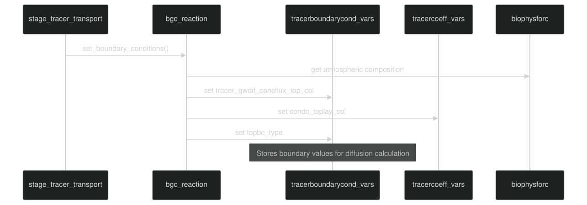

# Boundary Conditions

Relevant source files

- [src/betr/betr_core/BeTRTracerType.F90](https://github.com/jingtao-lbl/sbetr-resomv1/blob/72301c77/src/betr/betr_core/BeTRTracerType.F90)
- [src/betr/betr_core/TracerBaseType.F90](https://github.com/jingtao-lbl/sbetr-resomv1/blob/72301c77/src/betr/betr_core/TracerBaseType.F90)
- [src/betr/betr_core/TracerBoundaryCondType.F90](https://github.com/jingtao-lbl/sbetr-resomv1/blob/72301c77/src/betr/betr_core/TracerBoundaryCondType.F90)
- [src/betr/betr_core/TracerCoeffType.F90](https://github.com/jingtao-lbl/sbetr-resomv1/blob/72301c77/src/betr/betr_core/TracerCoeffType.F90)
- [src/betr/betr_core/TracerFluxType.F90](https://github.com/jingtao-lbl/sbetr-resomv1/blob/72301c77/src/betr/betr_core/TracerFluxType.F90)
- [src/betr/betr_core/TracerStateType.F90](https://github.com/jingtao-lbl/sbetr-resomv1/blob/72301c77/src/betr/betr_core/TracerStateType.F90)
- [src/betr/betr_main/BetrBGCMod.F90](https://github.com/jingtao-lbl/sbetr-resomv1/blob/72301c77/src/betr/betr_main/BetrBGCMod.F90)
- [src/betr/betr_main/TracerBalanceMod.F90](https://github.com/jingtao-lbl/sbetr-resomv1/blob/72301c77/src/betr/betr_main/TracerBalanceMod.F90)
- [src/betr/betr_para/TracerParamsMod.F90](https://github.com/jingtao-lbl/sbetr-resomv1/blob/72301c77/src/betr/betr_para/TracerParamsMod.F90)

## Purpose and Scope

This page documents how BeTR specifies and applies boundary conditions for tracer transport at the top (atmosphere-soil interface) and bottom (soil-aquifer interface) of the soil column. Boundary conditions determine how tracers enter and exit the simulation domain through incoming fluxes (precipitation, atmospheric deposition) and outgoing fluxes (ebullition, diffusion, drainage, leaching).

For information about the transport mechanisms that use these boundary conditions, see [Transport Mechanisms](#5.4) . For details on phase equilibration at boundaries, see [Phase Equilibration](#5.3) .

## Overview

BeTR supports two primary boundary types:

The boundary condition type varies by tracer group and is set during the staging phase before each transport calculation.

Sources: [src/betr/betr_core/TracerBoundaryCondType.F90 1-178](https://github.com/jingtao-lbl/sbetr-resomv1/blob/72301c77/src/betr/betr_core/TracerBoundaryCondType.F90#L1-L178)  [src/betr/betr_main/BetrBGCMod.F90 232-241](https://github.com/jingtao-lbl/sbetr-resomv1/blob/72301c77/src/betr/betr_main/BetrBGCMod.F90#L232-L241)

## Boundary Condition Data Structure

Key Data Members:

- `tracer_gwdif_concflux_top_col`: Top boundary values (concentration or flux) for gas-water diffusion [dimension 2 stores previous and current timestep]
- `bot_concflux_col`: Bottom boundary flux values
- `condc_toplay_col`: Conductance at atmosphere-soil interface
- `topbc_type``botbc_type`, : Integer flags indicating boundary condition type (Dirichlet, Neumann, Robin)
- `jtops_col`: Index of topmost active layer (accounts for snow/ponding water)

Sources: [src/betr/betr_core/TracerBoundaryCondType.F90 20-36](https://github.com/jingtao-lbl/sbetr-resomv1/blob/72301c77/src/betr/betr_core/TracerBoundaryCondType.F90#L20-L36)  [src/betr/betr_core/TracerStateType.F90 27-44](https://github.com/jingtao-lbl/sbetr-resomv1/blob/72301c77/src/betr/betr_core/TracerStateType.F90#L27-L44)

## Top Boundary Conditions

### Atmospheric Boundary Setup

The top boundary condition is set in the `set_boundary_conditions` method of the BGC reaction module, which is called during the staging phase:

Sources: [src/betr/betr_main/BetrBGCMod.F90 232-241](https://github.com/jingtao-lbl/sbetr-resomv1/blob/72301c77/src/betr/betr_main/BetrBGCMod.F90#L232-L241)

### Infiltration and Precipitation Input

Infiltration fluxes are calculated separately and represent tracer mass entering the soil via water infiltration:

calc_tracer_infiltration Function Flow:

The infiltration calculation occurs in [src/betr/betr_para/TracerParamsMod.F90 244-256](https://github.com/jingtao-lbl/sbetr-resomv1/blob/72301c77/src/betr/betr_para/TracerParamsMod.F90#L244-L256) and is invoked only when `advection_on` is true.

Sources: [src/betr/betr_main/BetrBGCMod.F90 244-256](https://github.com/jingtao-lbl/sbetr-resomv1/blob/72301c77/src/betr/betr_main/BetrBGCMod.F90#L244-L256)  [src/betr/betr_para/TracerParamsMod.F90 1-50](https://github.com/jingtao-lbl/sbetr-resomv1/blob/72301c77/src/betr/betr_para/TracerParamsMod.F90#L1-L50)

### Surface Hydrologic Processes

Before vertical transport, surface processes update tracer states:

These processes account for:

- Merging of tracer mass in surface ponding water with topsoil
- Tracer loss through surface runoff (calculated based on runoff water flux and tracer concentration)
- Residual snow melt contribution to topsoil tracer mass

Sources: [src/betr/betr_main/BetrBGCMod.F90 56-111](https://github.com/jingtao-lbl/sbetr-resomv1/blob/72301c77/src/betr/betr_main/BetrBGCMod.F90#L56-L111)

### Boundary Condition Types for Top Boundary

| BC Type | Description | Typical Tracers | 
| --- | --- | --- |
| Concentration BC (Dirichlet) | Atmospheric concentration specified directly | Volatile tracers (CO₂, CH₄, N₂O) with fixed atmospheric mixing ratios | 
| Flux BC (Neumann) | Incoming flux specified (e.g., wet deposition) | Non-volatile tracers, nutrients from precipitation | 
| Conductance BC (Robin) | Flux proportional to concentration gradient with resistance | Volatile tracers with aerenchyma/diffusive transport | 

Sources: [src/betr/betr_core/TracerBoundaryCondType.F90 20-36](https://github.com/jingtao-lbl/sbetr-resomv1/blob/72301c77/src/betr/betr_core/TracerBoundaryCondType.F90#L20-L36)

## Bottom Boundary Conditions

### Drainage and Leaching

Bottom boundary fluxes represent tracer loss to aquifer or groundwater:

Drainage : Vertical water flow exiting the bottom of the soil column, carrying dissolved tracers. The flux is proportional to water drainage flux and tracer concentration at the bottom layer.

Leaching : Combined vertical and lateral tracer loss. Includes both drainage and any lateral subsurface flow.

The bottom boundary is typically a zero-gradient (Neumann) boundary condition : `∂C/∂z = 0` , meaning no diffusive flux at the bottom, but advective transport (drainage) is allowed.

Sources: [src/betr/betr_core/TracerFluxType.F90 38-41](https://github.com/jingtao-lbl/sbetr-resomv1/blob/72301c77/src/betr/betr_core/TracerFluxType.F90#L38-L41)  [src/betr/betr_core/TracerStateType.F90 29-32](https://github.com/jingtao-lbl/sbetr-resomv1/blob/72301c77/src/betr/betr_core/TracerStateType.F90#L29-L32)

## Implementation in Transport Workflow

### Staging Phase: Setting Boundary Conditions

The `set_boundary_conditions` method is BGC-model-specific because different models may have different atmospheric sources (e.g., CO₂ from photosynthesis vs. soil respiration).

Sources: [src/betr/betr_main/BetrBGCMod.F90 114-267](https://github.com/jingtao-lbl/sbetr-resomv1/blob/72301c77/src/betr/betr_main/BetrBGCMod.F90#L114-L267)

### Application During Transport

During `do_tracer_gw_diffusion` and `do_tracer_advection` , boundary conditions are applied:

Diffusion :

- `tracer_gwdif_concflux_top_col``condc_toplay_col`Top boundary: Uses and to impose atmospheric concentration or flux
- Bottom boundary: Zero-gradient condition (no diffusive flux through bottom)

Advection :

- Top boundary: Infiltration flux added directly to top soil layer
- Bottom boundary: Drainage flux calculated from bottom layer concentration and water flux

Sources: [src/betr/betr_main/BetrBGCMod.F90 660-692](https://github.com/jingtao-lbl/sbetr-resomv1/blob/72301c77/src/betr/betr_main/BetrBGCMod.F90#L660-L692)  [src/betr/betr_main/BetrBGCMod.F90 696-692](https://github.com/jingtao-lbl/sbetr-resomv1/blob/72301c77/src/betr/betr_main/BetrBGCMod.F90#L696-L692)

## Snow Layer Boundary Resistance

For volatile tracers, snow layers add resistance to gas exchange:

Snow resistance reduces the effective conductance between atmosphere and soil for gas exchange. This is particularly important for:

- CO₂ diffusion in seasonally snow-covered soils
- CH₄ ebullition through snow layers
- N₂O emissions during freeze-thaw cycles

Sources: [src/betr/betr_para/TracerParamsMod.F90 47](https://github.com/jingtao-lbl/sbetr-resomv1/blob/72301c77/src/betr/betr_para/TracerParamsMod.F90#L47-L47)

## Boundary Condition Update Frequency

| Phase | Frequency | Purpose | 
| --- | --- | --- |
| Staging | Every timestep | Update atmospheric BC, infiltration rates, aerenchyma conductance | 
| Surface Hydro | Every timestep | Update surface runoff, snow melt contributions | 
| Transport | Sub-stepped adaptively | Apply BC during diffusion/advection with adaptive time-stepping | 
| Post-Transport | Every timestep | Update aquifer/groundwater concentrations from drainage | 

The boundary conditions use a two-element array (dimension 2 in `tracer_gwdif_concflux_top_col` ) to store values at the previous and current time steps, enabling temporal interpolation during adaptive sub-stepping within transport calculations.

Sources: [src/betr/betr_core/TracerBoundaryCondType.F90 77-78](https://github.com/jingtao-lbl/sbetr-resomv1/blob/72301c77/src/betr/betr_core/TracerBoundaryCondType.F90#L77-L78)

## BGC Model Interface

Different BGC models implement `set_boundary_conditions` differently based on their specific tracers and atmospheric exchange processes:

Abstract Interface:

Typical Implementation Steps:

This polymorphic design allows different BGC models to customize boundary conditions without modifying the transport code.

Sources: [src/betr/betr_main/BetrBGCMod.F90 232-241](https://github.com/jingtao-lbl/sbetr-resomv1/blob/72301c77/src/betr/betr_main/BetrBGCMod.F90#L232-L241)

## Key Diagnostics and Output

Boundary-related flux variables available for history output:

| Variable | Description | Units | 
| --- | --- | --- |
| *_FLX_INFIL | Infiltration flux at top boundary | mol/m²/s | 
| *_FLX_SURFEMI | Total surface emission (diffusion + ebullition) | mol/m²/s | 
| *_FLX_DRAIN | Drainage flux at bottom boundary | mol/m²/s | 
| *_FLX_TLEACH | Total leaching (vertical + lateral) | mol/m²/s | 
| *_FLX_SRUNOFF | Surface runoff loss | mol/m²/s | 

These fluxes are accumulated during transport and written to history files for mass balance checking and scientific analysis.

Sources: [src/betr/betr_core/TracerFluxType.F90 195-327](https://github.com/jingtao-lbl/sbetr-resomv1/blob/72301c77/src/betr/betr_core/TracerFluxType.F90#L195-L327)