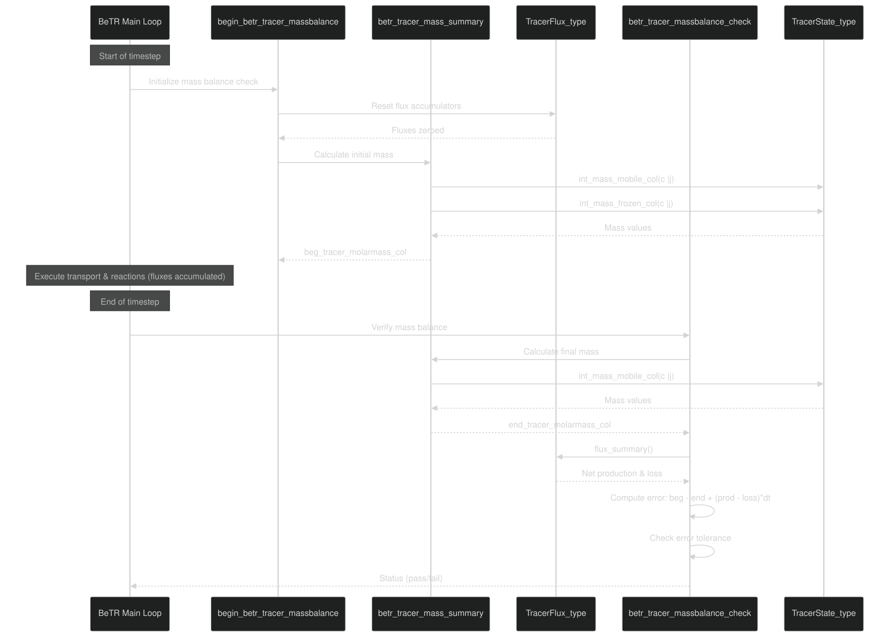

# Mass Balance and Diagnostics

Relevant source files

- [src/betr/betr_core/BeTRTracerType.F90](https://github.com/jingtao-lbl/sbetr-resomv1/blob/72301c77/src/betr/betr_core/BeTRTracerType.F90)
- [src/betr/betr_core/TracerBaseType.F90](https://github.com/jingtao-lbl/sbetr-resomv1/blob/72301c77/src/betr/betr_core/TracerBaseType.F90)
- [src/betr/betr_core/TracerBoundaryCondType.F90](https://github.com/jingtao-lbl/sbetr-resomv1/blob/72301c77/src/betr/betr_core/TracerBoundaryCondType.F90)
- [src/betr/betr_core/TracerCoeffType.F90](https://github.com/jingtao-lbl/sbetr-resomv1/blob/72301c77/src/betr/betr_core/TracerCoeffType.F90)
- [src/betr/betr_core/TracerFluxType.F90](https://github.com/jingtao-lbl/sbetr-resomv1/blob/72301c77/src/betr/betr_core/TracerFluxType.F90)
- [src/betr/betr_core/TracerStateType.F90](https://github.com/jingtao-lbl/sbetr-resomv1/blob/72301c77/src/betr/betr_core/TracerStateType.F90)
- [src/betr/betr_main/TracerBalanceMod.F90](https://github.com/jingtao-lbl/sbetr-resomv1/blob/72301c77/src/betr/betr_main/TracerBalanceMod.F90)
- [src/betr/betr_para/TracerParamsMod.F90](https://github.com/jingtao-lbl/sbetr-resomv1/blob/72301c77/src/betr/betr_para/TracerParamsMod.F90)

## Purpose and Scope

This page documents BeTR's mass balance checking framework and diagnostic output system. Mass balance verification ensures that tracer quantities are conserved throughout the simulation by accounting for all sources, sinks, and transport processes. The diagnostic system provides detailed output of tracer concentrations, fluxes, and state variables for model validation and analysis.

For information about the tracer state variables being tracked, see [Tracer State Management](#5.2) . For details on individual transport mechanisms that contribute to fluxes, see [Transport Mechanisms](#5.4) .

## Mass Balance Equation

BeTR enforces mass conservation at the column level using a discrete time mass balance equation:

Where:

- **M_beg**: Total tracer mass at beginning of timestep (mol/m²)
- **M_end**: Total tracer mass at end of timestep (mol/m²)
- **F_production**: Net biogeochemical production rate (mol/m²/s)
- **F_loss**: Net physical loss rate through all transport pathways (mol/m²/s)
- **Δt**: Timestep duration (s)

The mass balance error is computed as:

This error should be near zero (within tolerance) if mass is conserved. The framework separately tracks multiple phases:

- **Mobile phase**: Gas + aqueous tracer (for volatile/mobile tracers)
- **Frozen phase**: Tracer in ice (for freezable tracers)
- **Adsorbed phase**: Equilibrium solid phase (for adsorbing tracers)

Sources: [src/betr/betr_main/TracerBalanceMod.F90 69-178](https://github.com/jingtao-lbl/sbetr-resomv1/blob/72301c77/src/betr/betr_main/TracerBalanceMod.F90#L69-L178)

## Mass Calculation and Integration

### Vertical Integration of Tracer Mass

Total tracer mass in a column is computed by vertically integrating concentration over layer thickness:

Where C_i is the bulk concentration (mol/m³) and Δz_i is layer thickness (m).

### TracerState Integration Methods

The `TracerState_type` provides methods to integrate different tracer phases:

| Method | Purpose | Phase | 
| --- | --- | --- |
| int_mass_mobile_col | Integrate mobile (gas+aqueous) tracer | Mobile phase | 
| int_mass_frozen_col | Integrate frozen tracer | Frozen phase | 
| int_mass_adsorb_col | Integrate adsorbed tracer | Solid equilibrium phase | 

Diagram: Tracer Mass Integration Process

Sources: [src/betr/betr_core/TracerStateType.F90 320-371](https://github.com/jingtao-lbl/sbetr-resomv1/blob/72301c77/src/betr/betr_core/TracerStateType.F90#L320-L371)  [src/betr/betr_main/TracerBalanceMod.F90 182-244](https://github.com/jingtao-lbl/sbetr-resomv1/blob/72301c77/src/betr/betr_main/TracerBalanceMod.F90#L182-L244)

## Mass Balance Check Workflow

### Initialization and Execution

The mass balance check occurs in two stages during each timestep:

Diagram: Mass Balance Check Workflow

Sources: [src/betr/betr_main/TracerBalanceMod.F90 31-66](https://github.com/jingtao-lbl/sbetr-resomv1/blob/72301c77/src/betr/betr_main/TracerBalanceMod.F90#L31-L66)  [src/betr/betr_main/TracerBalanceMod.F90 69-178](https://github.com/jingtao-lbl/sbetr-resomv1/blob/72301c77/src/betr/betr_main/TracerBalanceMod.F90#L69-L178)

### Key Data Structures

| Variable | Type | Purpose | Units | 
| --- | --- | --- | --- |
| beg_tracer_molarmass_col | real(r8)(:,:) | Mass at start of timestep | mol/m² | 
| end_tracer_molarmass_col | real(r8)(:,:) | Mass at end of timestep | mol/m² | 
| errtracer_col | real(r8)(:,:) | Mass balance error | mol/m² | 
| tracer_flx_netpro_col | real(r8)(:,:) | Net biogeochemical production | mol/m²/s | 
| tracer_flx_netphyloss_col | real(r8)(:,:) | Net physical loss | mol/m²/s | 
| do_mass_balchk | logical(:) | Enable check for each tracer | - | 

Sources: [src/betr/betr_core/TracerStateType.F90 40-43](https://github.com/jingtao-lbl/sbetr-resomv1/blob/72301c77/src/betr/betr_core/TracerStateType.F90#L40-L43)  [src/betr/betr_core/TracerFluxType.F90 30-33](https://github.com/jingtao-lbl/sbetr-resomv1/blob/72301c77/src/betr/betr_core/TracerFluxType.F90#L30-L33)

## Flux Accounting

### Flux Categories

All tracer fluxes are organized into two main categories for mass balance purposes:

1. Physical Loss Fluxes ( `tracer_flx_netphyloss_col` ):

- `tracer_flx_drain_col`: Subsurface drainage
- `tracer_flx_leaching_col`: Bottom boundary leaching
- `tracer_flx_surfrun_col`: Surface runoff
- `tracer_flx_ebu_col`: Ebullition (volatile tracers)
- `tracer_flx_dif_col`: Diffusion to atmosphere (volatile tracers)
- `tracer_flx_tparchm_col`: Aerenchyma transport (volatile tracers)
- `tracer_flx_vtrans_col`: Transpiration uptake

2. Production/Input Fluxes ( `tracer_flx_netpro_col` ):

- `tracer_flx_netpro_vr_col`Biogeochemical sources (integrated from )
- `tracer_flx_prec_col`Precipitation inputs ( )
- Other sources

### Flux Summarization Process

The `flux_summary` method computes net production and net physical loss by aggregating individual flux components:

Diagram: Flux Accounting Architecture

Sources: [src/betr/betr_core/TracerFluxType.F90 571-687](https://github.com/jingtao-lbl/sbetr-resomv1/blob/72301c77/src/betr/betr_core/TracerFluxType.F90#L571-L687)

### Temporal Averaging

Fluxes are accumulated during sub-timesteps (e.g., during adaptive time-stepping in transport) and then temporally averaged:

This ensures flux rates are correctly represented as mol/m²/s for the mass balance equation.

Sources: [src/betr/betr_core/TracerFluxType.F90 689-768](https://github.com/jingtao-lbl/sbetr-resomv1/blob/72301c77/src/betr/betr_core/TracerFluxType.F90#L689-L768)

## Error Detection and Reporting

### Error Tolerance Checking

Mass balance errors are checked against both absolute and relative tolerances:

### Error Reporting and Diagnostics

When a mass balance error exceeds tolerance, the framework reports:

The `flux_display` method generates a diagnostic message showing all individual flux components for the failing tracer:

Diagram: Error Detection and Reporting Flow

Sources: [src/betr/betr_main/TracerBalanceMod.F90 147-173](https://github.com/jingtao-lbl/sbetr-resomv1/blob/72301c77/src/betr/betr_main/TracerBalanceMod.F90#L147-L173)  [src/betr/betr_core/TracerFluxType.F90 770-904](https://github.com/jingtao-lbl/sbetr-resomv1/blob/72301c77/src/betr/betr_core/TracerFluxType.F90#L770-L904)

### Selective Mass Balance Checking

Not all tracers undergo mass balance checking. The `do_mass_balchk` flag in `BeTRtracer_type` controls this on a per-tracer basis:

Additionally, for `type1_bgc` simulations, only volatile tracers are checked:

Sources: [src/betr/betr_main/TracerBalanceMod.F90 144-147](https://github.com/jingtao-lbl/sbetr-resomv1/blob/72301c77/src/betr/betr_main/TracerBalanceMod.F90#L144-L147)  [src/betr/betr_core/BeTRTracerType.F90 92](https://github.com/jingtao-lbl/sbetr-resomv1/blob/72301c77/src/betr/betr_core/BeTRTracerType.F90#L92-L92)

## Diagnostic Output Variables

### State Diagnostics

The `TracerState_type` provides history output variables for monitoring tracer mass and concentrations:

| Variable Name | Dimensions | Units | Description | 
| --- | --- | --- | --- |
| {tracer}_TRACER_CONC_BULK | (col, lev) | mol/m³ | Bulk concentration in mobile phase | 
| {tracer}_TRACER_ERR | (col) | mol/m³ | Mass balance error | 
| {tracer}_TRCER_SOI_MOLAMASS | (col) | mol/m² | Total mass in soil only | 
| {tracer}_TRCER_COL_MOLAMASS | (col) | mol/m² | Total mass in column (soil + snow) | 
| {tracer}_TRACER_CONC_FROZEN | (col, lev) | mol/m³ | Frozen phase concentration (if applicable) | 
| {tracer}_TRACER_P_GAS_FRAC | (col, lev) | - | Gas pressure fraction (volatile tracers) | 

Sources: [src/betr/betr_core/TracerStateType.F90 170-216](https://github.com/jingtao-lbl/sbetr-resomv1/blob/72301c77/src/betr/betr_core/TracerStateType.F90#L170-L216)

### Flux Diagnostics

The `TracerFlux_type` provides extensive flux diagnostic variables:

| Variable Name | Dimensions | Units | Description | 
| --- | --- | --- | --- |
| {tracer}_FLX_INFIL | (col) | mol/m²/s | Infiltration flux | 
| {tracer}_FLX_DRAIN | (col) | mol/m²/s | Drainage flux | 
| {tracer}_FLX_LEACHING | (col) | mol/m²/s | Bottom leaching flux | 
| {tracer}_FLX_SRUNOFF | (col) | mol/m²/s | Surface runoff flux | 
| {tracer}_FLX_VTRANS | (col) | mol/m²/s | Transpiration flux | 
| {tracer}_FLX_EBU | (col) | mol/m²/s | Ebullition flux (volatile) | 
| {tracer}_FLX_DIF | (col) | mol/m²/s | Diffusion flux (volatile) | 
| {tracer}_FLX_SURFEMI | (col) | mol/m²/s | Total surface emission (volatile) | 
| {tracer}_FLX_NETPRO | (col) | mol/m²/s | Net biogeochemical production | 
| {tracer}_FLX_NETLOSS | (col) | mol/m²/s | Net physical loss | 
| {tracer}_FLX_NETPRO_vr | (col, lev) | mol/m³/s | Vertically-resolved production | 

Note : `{tracer}` is replaced with the actual tracer name (e.g., `CO2` , `NH3` , etc.).

Sources: [src/betr/betr_core/TracerFluxType.F90 227-327](https://github.com/jingtao-lbl/sbetr-resomv1/blob/72301c77/src/betr/betr_core/TracerFluxType.F90#L227-L327)

### Transport Coefficient Diagnostics

The `TracerCoeff_type` provides diagnostics on transport parameters:

| Variable Name | Dimensions | Units | Description | 
| --- | --- | --- | --- |
| CAQU2BULK_vr_{tracer} | (col, lev) | - | Aqueous-to-bulk conversion factor | 
| CGAS2BULK_{tracer} | (col, lev) | - | Gas-to-bulk conversion factor | 
| HMCONDC_vr_{tracer} | (col, lev) | - | Harmonic mean conductance | 
| ARENCHYMA_{tracer} | (col) | m/s | Aerenchyma conductance | 

Sources: [src/betr/betr_core/TracerCoeffType.F90 209-249](https://github.com/jingtao-lbl/sbetr-resomv1/blob/72301c77/src/betr/betr_core/TracerCoeffType.F90#L209-L249)

### Output Data Flow

Diagram: Diagnostic Output Data Flow

Sources: [src/betr/betr_core/TracerStateType.F90 391-451](https://github.com/jingtao-lbl/sbetr-resomv1/blob/72301c77/src/betr/betr_core/TracerStateType.F90#L391-L451)  [src/betr/betr_core/TracerFluxType.F90 906-1078](https://github.com/jingtao-lbl/sbetr-resomv1/blob/72301c77/src/betr/betr_core/TracerFluxType.F90#L906-L1078)  [src/betr/betr_core/TracerCoeffType.F90 294-342](https://github.com/jingtao-lbl/sbetr-resomv1/blob/72301c77/src/betr/betr_core/TracerCoeffType.F90#L294-L342)

## Summary

The mass balance and diagnostics framework in BeTR provides:

This framework enables model validation, debugging of conservation issues, and detailed analysis of tracer behavior throughout the simulation.