# Tracer Transport System

<details>
<summary>Relevant source files</summary>


- [src/betr/betr_core/BeTRTracerType.F90](https://github.com/jingtao-lbl/sbetr-resomv1/blob/72301c77/src/betr/betr_core/BeTRTracerType.F90)
- [src/betr/betr_core/TracerBaseType.F90](https://github.com/jingtao-lbl/sbetr-resomv1/blob/72301c77/src/betr/betr_core/TracerBaseType.F90)
- [src/betr/betr_core/TracerBoundaryCondType.F90](https://github.com/jingtao-lbl/sbetr-resomv1/blob/72301c77/src/betr/betr_core/TracerBoundaryCondType.F90)
- [src/betr/betr_core/TracerCoeffType.F90](https://github.com/jingtao-lbl/sbetr-resomv1/blob/72301c77/src/betr/betr_core/TracerCoeffType.F90)
- [src/betr/betr_core/TracerFluxType.F90](https://github.com/jingtao-lbl/sbetr-resomv1/blob/72301c77/src/betr/betr_core/TracerFluxType.F90)
- [src/betr/betr_core/TracerStateType.F90](https://github.com/jingtao-lbl/sbetr-resomv1/blob/72301c77/src/betr/betr_core/TracerStateType.F90)
- [src/betr/betr_main/BetrBGCMod.F90](https://github.com/jingtao-lbl/sbetr-resomv1/blob/72301c77/src/betr/betr_main/BetrBGCMod.F90)
- [src/betr/betr_main/TracerBalanceMod.F90](https://github.com/jingtao-lbl/sbetr-resomv1/blob/72301c77/src/betr/betr_main/TracerBalanceMod.F90)
- [src/betr/betr_para/TracerParamsMod.F90](https://github.com/jingtao-lbl/sbetr-resomv1/blob/72301c77/src/betr/betr_para/TracerParamsMod.F90)


</details>

## Purpose and Scope

The Tracer Transport System is the core component of BeTR responsible for simulating the movement of tracers (chemical species) through soil columns. It handles multi-phase transport where tracers exist simultaneously in gas, aqueous, and solid phases, with equilibration between phases controlled by partition coefficients. The system implements five distinct transport mechanisms: diffusion, advection, solid-phase transport (bioturbation/cryoturbation), ebullition (bubble release), and surface hydrological processes.

This page covers the tracer transport infrastructure, phase equilibration, and transport mechanisms. For information about:

- [Tracer Configuration](#5.1)How tracers are configured and defined, see
- [Tracer State Management](#5.2)How tracer states and fluxes are managed, see
- [Transport Mechanisms](#5.4)Specific transport mechanisms in detail, see
- [Boundary Conditions](#5.6)Boundary condition specification, see


## System Architecture

The Tracer Transport System consists of several interconnected data types and modules that manage tracer properties, states, fluxes, and transport coefficients. The main orchestration occurs in `BetrBGCMod` , which coordinates the various transport steps.

### Core Data Types and Their Roles



Sources:  [src/betr/betr_main/BetrBGCMod.F90 1-54](https://github.com/jingtao-lbl/sbetr-resomv1/blob/72301c77/src/betr/betr_main/BetrBGCMod.F90#L1-L54)  [src/betr/betr_core/TracerStateType.F90 1-58](https://github.com/jingtao-lbl/sbetr-resomv1/blob/72301c77/src/betr/betr_core/TracerStateType.F90#L1-L58)  [src/betr/betr_core/TracerFluxType.F90 1-87](https://github.com/jingtao-lbl/sbetr-resomv1/blob/72301c77/src/betr/betr_core/TracerFluxType.F90#L1-L87)  [src/betr/betr_core/TracerCoeffType.F90 1-56](https://github.com/jingtao-lbl/sbetr-resomv1/blob/72301c77/src/betr/betr_core/TracerCoeffType.F90#L1-L56)  [src/betr/betr_core/BeTRTracerType.F90 1-127](https://github.com/jingtao-lbl/sbetr-resomv1/blob/72301c77/src/betr/betr_core/BeTRTracerType.F90#L1-L127)

| Data Type | Module | Primary Purpose | 
| --- | --- | --- |
| betrtracer_type | BeTRTracerType | Defines tracer properties, grouping, and configuration (volatile, mobile, adsorbing, etc.) | 
| TracerState_type | TracerStateType | Stores tracer concentrations in mobile, solid equilibrium, and frozen phases | 
| TracerFlux_type | TracerFluxType | Accumulates all tracer fluxes (diffusion, advection, ebullition, drainage, etc.) | 
| TracerCoeff_type | TracerCoeffType | Stores phase conversion coefficients (Henry's law, Bunsen, partition coefficients) and transport parameters (diffusivity, conductance) | 
| TracerBoundaryCond_type | TracerBoundaryCondType | Specifies top and bottom boundary conditions for transport | 


Sources:  [src/betr/betr_core/BeTRTracerType.F90 26-127](https://github.com/jingtao-lbl/sbetr-resomv1/blob/72301c77/src/betr/betr_core/BeTRTracerType.F90#L26-L127)  [src/betr/betr_core/TracerStateType.F90 27-58](https://github.com/jingtao-lbl/sbetr-resomv1/blob/72301c77/src/betr/betr_core/TracerStateType.F90#L27-L58)  [src/betr/betr_core/TracerFluxType.F90 24-87](https://github.com/jingtao-lbl/sbetr-resomv1/blob/72301c77/src/betr/betr_core/TracerFluxType.F90#L24-L87)  [src/betr/betr_core/TracerCoeffType.F90 27-56](https://github.com/jingtao-lbl/sbetr-resomv1/blob/72301c77/src/betr/betr_core/TracerCoeffType.F90#L27-L56)  [src/betr/betr_core/TracerBoundaryCondType.F90 21-36](https://github.com/jingtao-lbl/sbetr-resomv1/blob/72301c77/src/betr/betr_core/TracerBoundaryCondType.F90#L21-L36)

## Multi-Phase Tracer System

BeTR implements a comprehensive multi-phase tracer system where tracers can exist in gas, aqueous, and solid phases simultaneously. Phase partitioning is controlled by equilibrium coefficients computed based on temperature, pH, and soil properties.

### Phase Representation



Sources:  [src/betr/betr_core/TracerStateType.F90 29-39](https://github.com/jingtao-lbl/sbetr-resomv1/blob/72301c77/src/betr/betr_core/TracerStateType.F90#L29-L39)  [src/betr/betr_core/TracerCoeffType.F90 28-47](https://github.com/jingtao-lbl/sbetr-resomv1/blob/72301c77/src/betr/betr_core/TracerCoeffType.F90#L28-L47)  [src/betr/betr_para/TracerParamsMod.F90 176-351](https://github.com/jingtao-lbl/sbetr-resomv1/blob/72301c77/src/betr/betr_para/TracerParamsMod.F90#L176-L351)

The bulk mobile concentration ( `tracer_conc_mobile_col` ) represents the total tracer in gas + aqueous phases. For volatile tracers, the split between gas and aqueous is determined by:

- 
Gas-primary formulation (for volatile tracers): The bulk diffusivity is computed as:

```bg-input-dark/30 border-cloud/30 rounded-md border px-[0.25rem] py-px text-xs font-normal leading-[15px] before:hidden after:hidden
bulk_diffus = air_vol * tau_gas * diffgas + h2osoi_liqvol * tau_liq * diffaqu * bunsencef
```

- 
Aqueous-primary formulation (for water isotopes): The bulk diffusivity is:

```bg-input-dark/30 border-cloud/30 rounded-md border px-[0.25rem] py-px text-xs font-normal leading-[15px] before:hidden after:hidden
bulk_diffus = air_vol * tau_gas * diffgas / bunsencef + h2osoi_liqvol * tau_liq * diffaqu
```


Sources:  [src/betr/betr_para/TracerParamsMod.F90 254-313](https://github.com/jingtao-lbl/sbetr-resomv1/blob/72301c77/src/betr/betr_para/TracerParamsMod.F90#L254-L313)

### Phase Conversion Coefficients

The subroutine `set_phase_convert_coeff` in `TracerParamsMod` calculates:

Sources:  [src/betr/betr_para/TracerParamsMod.F90 434-551](https://github.com/jingtao-lbl/sbetr-resomv1/blob/72301c77/src/betr/betr_para/TracerParamsMod.F90#L434-L551)

## Transport Mechanisms

BeTR implements five distinct transport mechanisms, each handling different aspects of tracer movement:

### Transport Mechanism Overview



Sources:  [src/betr/betr_main/BetrBGCMod.F90 45-48](https://github.com/jingtao-lbl/sbetr-resomv1/blob/72301c77/src/betr/betr_main/BetrBGCMod.F90#L45-L48)  [src/betr/betr_main/BetrBGCMod.F90 271-362](https://github.com/jingtao-lbl/sbetr-resomv1/blob/72301c77/src/betr/betr_main/BetrBGCMod.F90#L271-L362)  [src/betr/betr_main/BetrBGCMod.F90 579-694](https://github.com/jingtao-lbl/sbetr-resomv1/blob/72301c77/src/betr/betr_main/BetrBGCMod.F90#L579-L694)

| Mechanism | Subroutine | Phase(s) | Driver | Key Features | 
| --- | --- | --- | --- | --- |
| Diffusion | do_tracer_gw_diffusion | Gas + Aqueous | Concentration gradient | Uses bulk diffusivity with Rfactor retardation | 
| Advection | do_tracer_advection | Aqueous only | Water flux | Semi-Lagrangian or explicit scheme | 
| Solid Transport | tracer_solid_transport | Solid only | Bioturbation/cryoturbation | Diffusive parameterization | 
| Ebullition | calc_ebullition | Gas only | Pressure threshold | Instantaneous bubble release | 
| Surface Processes | surface_tracer_hydropath_update | Aqueous | Runoff, snow melt | Combines surface water pools | 


Sources:  [src/betr/betr_main/BetrBGCMod.F90 661-692](https://github.com/jingtao-lbl/sbetr-resomv1/blob/72301c77/src/betr/betr_main/BetrBGCMod.F90#L661-L692)  [src/betr/betr_main/BetrBGCMod.F90 697-800](https://github.com/jingtao-lbl/sbetr-resomv1/blob/72301c77/src/betr/betr_main/BetrBGCMod.F90#L697-L800)  [src/betr/betr_main/BetrBGCMod.F90 364-576](https://github.com/jingtao-lbl/sbetr-resomv1/blob/72301c77/src/betr/betr_main/BetrBGCMod.F90#L364-L576)

### 1. Diffusion Transport

Diffusion is implemented in `do_tracer_gw_diffusion` using a tridiagonal matrix solver with adaptive time-stepping. The effective diffusivity accounts for both gas and aqueous phase contributions:

Key features:

- Computed at layer interfaces using harmonic mean of bulk diffusivities
- `Rfactor`Retardation factor accounts for phase partitioning
- Adaptive sub-stepping prevents negative concentrations
- Supports both Dirichlet and Neumann boundary conditions


Sources:  [src/betr/betr_main/BetrBGCMod.F90 802-1130](https://github.com/jingtao-lbl/sbetr-resomv1/blob/72301c77/src/betr/betr_main/BetrBGCMod.F90#L802-L1130)

### 2. Advection Transport

Advection moves aqueous-phase tracers with water flow. Two schemes are available:

- **Semi-Lagrangian**: Interpolates upstream concentrations (more accurate, larger time steps)
- **Explicit upwind**: Simple but requires small time steps


The advection equation solved is:

where `θ` is volumetric water content, `q` is water flux, and `S` is source/sink.

Sources:  [src/betr/betr_main/BetrBGCMod.F90 697-800](https://github.com/jingtao-lbl/sbetr-resomv1/blob/72301c77/src/betr/betr_main/BetrBGCMod.F90#L697-L800)

### 3. Solid Phase Transport (Bioturbation/Cryoturbation)

Solid-phase tracers (organic matter pools) move via biological mixing (bioturbation) or freeze-thaw cycles (cryoturbation). This is parameterized as a diffusion process:

- **Cryoturbation**: Active in permafrost regions with mixing depth dependent on active layer thickness
- **Bioturbation**: Constant diffusivity in non-permafrost soils
- Diffusivity profiles decrease linearly with depth


Sources:  [src/betr/betr_main/BetrBGCMod.F90 364-576](https://github.com/jingtao-lbl/sbetr-resomv1/blob/72301c77/src/betr/betr_main/BetrBGCMod.F90#L364-L576)  [src/betr/betr_para/TracerParamsMod.F90 318-349](https://github.com/jingtao-lbl/sbetr-resomv1/blob/72301c77/src/betr/betr_para/TracerParamsMod.F90#L318-L349)

### 4. Ebullition

Ebullition releases gas bubbles when total gas pressure exceeds a threshold. The implementation:

Sources:  [src/betr/betr_main/BetrBGCMod.F90 1754-1987](https://github.com/jingtao-lbl/sbetr-resomv1/blob/72301c77/src/betr/betr_main/BetrBGCMod.F90#L1754-L1987)

### 5. Surface Hydrological Processes

Surface processes include:

- **Surface runoff**: Removes tracers proportional to runoff water
- **Snow-soil interaction**: Merges snow meltwater with top soil layer
- **Ponding water**: Combines standing water with surface soil


Sources:  [src/betr/betr_main/BetrBGCMod.F90 56-111](https://github.com/jingtao-lbl/sbetr-resomv1/blob/72301c77/src/betr/betr_main/BetrBGCMod.F90#L56-L111)

## Transport Execution Flow

The transport system executes in a coordinated sequence orchestrated by the main BeTR time-stepping loop:

### Main Transport Sequence



Sources:  [src/betr/betr_main/BetrBGCMod.F90 114-267](https://github.com/jingtao-lbl/sbetr-resomv1/blob/72301c77/src/betr/betr_main/BetrBGCMod.F90#L114-L267)  [src/betr/betr_main/BetrBGCMod.F90 271-362](https://github.com/jingtao-lbl/sbetr-resomv1/blob/72301c77/src/betr/betr_main/BetrBGCMod.F90#L271-L362)

### Two-Phase Transport Strategy (Strang Splitting)

BeTR uses operator splitting to separate transport processes:

This separation improves numerical stability and allows different time scales for different processes.

Sources:  [src/betr/betr_main/BetrBGCMod.F90 114-267](https://github.com/jingtao-lbl/sbetr-resomv1/blob/72301c77/src/betr/betr_main/BetrBGCMod.F90#L114-L267)

## Adaptive Time-Stepping

All transport mechanisms use adaptive time-stepping to ensure numerical stability and prevent negative concentrations. The algorithm:

### Adaptive Time-Stepping Implementation



Sources:  [src/betr/betr_main/BetrBGCMod.F90 483-572](https://github.com/jingtao-lbl/sbetr-resomv1/blob/72301c77/src/betr/betr_main/BetrBGCMod.F90#L483-L572)  [src/betr/betr_main/BetrBGCMod.F90 924-1040](https://github.com/jingtao-lbl/sbetr-resomv1/blob/72301c77/src/betr/betr_main/BetrBGCMod.F90#L924-L1040)

Key parameters:

- `dtime_min = 1.0`second - Minimum allowed sub-step
- `err_tol_transp = 1.e-8`- Error tolerance for mass balance


Sources:  [src/betr/betr_main/BetrBGCMod.F90 39-41](https://github.com/jingtao-lbl/sbetr-resomv1/blob/72301c77/src/betr/betr_main/BetrBGCMod.F90#L39-L41)

## Phase Equilibration and Coefficient Calculation

Before transport, tracers are equilibrated between phases based on current environmental conditions. This is a critical step that determines how tracers partition.

### Coefficient Calculation Pipeline



Sources:  [src/betr/betr_para/TracerParamsMod.F90 67-168](https://github.com/jingtao-lbl/sbetr-resomv1/blob/72301c77/src/betr/betr_para/TracerParamsMod.F90#L67-L168)  [src/betr/betr_para/TracerParamsMod.F90 172-351](https://github.com/jingtao-lbl/sbetr-resomv1/blob/72301c77/src/betr/betr_para/TracerParamsMod.F90#L172-L351)  [src/betr/betr_para/TracerParamsMod.F90 434-512](https://github.com/jingtao-lbl/sbetr-resomv1/blob/72301c77/src/betr/betr_para/TracerParamsMod.F90#L434-L512)  [src/betr/betr_para/TracerParamsMod.F90 514-612](https://github.com/jingtao-lbl/sbetr-resomv1/blob/72301c77/src/betr/betr_para/TracerParamsMod.F90#L514-L612)

### Henry's Law and Bunsen Coefficient

For volatile tracers, gas-aqueous partitioning follows Henry's law:

where `H` is Henry's law constant (Pa·m³/mol). The dimensionless Bunsen coefficient is:

These are temperature-dependent and may be pH-dependent for acid-base species like CO₂.

Sources:  [src/betr/betr_para/TracerParamsMod.F90 434-512](https://github.com/jingtao-lbl/sbetr-resomv1/blob/72301c77/src/betr/betr_para/TracerParamsMod.F90#L434-L512)  [src/betr/betr_para/TracerParamsMod.F90 514-612](https://github.com/jingtao-lbl/sbetr-resomv1/blob/72301c77/src/betr/betr_para/TracerParamsMod.F90#L514-L612)

### Retardation Factor

The retardation factor `Rfactor` accounts for the fraction of tracer participating in transport vs. being held in non-mobile phases:

For volatile tracers (gas-primary):

For non-volatile tracers:

Sources:  [src/betr/betr_main/BetrBGCMod.F90 1993-2112](https://github.com/jingtao-lbl/sbetr-resomv1/blob/72301c77/src/betr/betr_main/BetrBGCMod.F90#L1993-L2112)

## Boundary Conditions

Boundary conditions are specified through `TracerBoundaryCond_type` and set by the BGC model's `set_boundary_conditions` method.

### Boundary Condition Types



Sources:  [src/betr/betr_core/TracerBoundaryCondType.F90 21-36](https://github.com/jingtao-lbl/sbetr-resomv1/blob/72301c77/src/betr/betr_core/TracerBoundaryCondType.F90#L21-L36)  [src/betr/betr_main/BetrBGCMod.F90 232-242](https://github.com/jingtao-lbl/sbetr-resomv1/blob/72301c77/src/betr/betr_main/BetrBGCMod.F90#L232-L242)

### Common Boundary Condition Configurations

| Tracer Type | Top BC | Bottom BC | Description | 
| --- | --- | --- | --- |
| Volatile (e.g., CO₂) | Concentration | Zero flux | Atmospheric equilibration at surface, no leaching at bottom | 
| Non-volatile dissolved | Infiltration flux | Concentration gradient | Input from precipitation, drainage at bottom | 
| Solid phase | Zero flux | Zero flux | No exchange at boundaries | 


Sources:  [src/betr/betr_main/BetrBGCMod.F90 232-242](https://github.com/jingtao-lbl/sbetr-resomv1/blob/72301c77/src/betr/betr_main/BetrBGCMod.F90#L232-L242)

## Mass Balance Checking

The `TracerBalanceMod` module provides mass balance verification to ensure conservation of mass through transport:

### Mass Balance Calculation


Sources:  [src/betr/betr_main/TracerBalanceMod.F90 31-66](https://github.com/jingtao-lbl/sbetr-resomv1/blob/72301c77/src/betr/betr_main/TracerBalanceMod.F90#L31-L66)  [src/betr/betr_main/TracerBalanceMod.F90 69-178](https://github.com/jingtao-lbl/sbetr-resomv1/blob/72301c77/src/betr/betr_main/TracerBalanceMod.F90#L69-L178)

The mass balance equation verified is:

where:

- `M_beg``beg_tracer_molarmass_col`= - Initial column-integrated mass [mol/m²]
- `M_end``end_tracer_molarmass_col`= - Final column-integrated mass [mol/m²]
- `Production``tracer_flx_netpro_col`= - Net production rate [mol/m²/s]
- `Loss``tracer_flx_netphyloss_col`= - Net physical loss rate [mol/m²/s]
- `ε``errtracer_col``err_min = 1.e-8``err_min_rel = 1.e-3`= - Numerical error (should be < absolute or relative)


Sources:  [src/betr/betr_main/TracerBalanceMod.F90 109-176](https://github.com/jingtao-lbl/sbetr-resomv1/blob/72301c77/src/betr/betr_main/TracerBalanceMod.F90#L109-L176)  [src/betr/betr_main/TracerBalanceMod.F90 182-244](https://github.com/jingtao-lbl/sbetr-resomv1/blob/72301c77/src/betr/betr_main/TracerBalanceMod.F90#L182-L244)

### Flux Summary

All fluxes contributing to mass balance are accumulated in `TracerFlux_type` and summarized by `flux_summary` :

- `tracer_flx_drain_col``tracer_flx_surfrun_col``tracer_flx_ebu_col``tracer_flx_dif_col`Physical losses: , , ,
- `tracer_flx_netpro_vr_col`Production: (integrated vertically)
- `tracer_flx_prec_col``tracer_flx_infl_col`Inputs: ,


Sources:  [src/betr/betr_core/TracerFluxType.F90 489-695](https://github.com/jingtao-lbl/sbetr-resomv1/blob/72301c77/src/betr/betr_core/TracerFluxType.F90#L489-L695)

## Key Subroutines Reference

| Subroutine | Module | Purpose | 
| --- | --- | --- |
| stage_tracer_transport | BetrBGCMod | Set up coefficients and boundary conditions before transport | 
| tracer_gws_transport | BetrBGCMod | Orchestrate gas-water-solid transport (diffusion, advection, solid) | 
| surface_tracer_hydropath_update | BetrBGCMod | Handle surface runoff, snow, and ponding water | 
| calc_ebullition | BetrBGCMod | Calculate and apply ebullition (bubble) fluxes | 
| set_phase_convert_coeff | TracerParamsMod | Calculate Henry's law, Bunsen, and partition coefficients | 
| set_multi_phase_diffusion | TracerParamsMod | Calculate bulk diffusivities and conductances | 
| do_tracer_gw_diffusion | BetrBGCMod | Execute diffusive transport with adaptive time-stepping | 
| do_tracer_advection | BetrBGCMod | Execute advective transport with adaptive time-stepping | 
| tracer_solid_transport | BetrBGCMod | Execute solid-phase transport (bioturbation/cryoturbation) | 
| begin_betr_tracer_massbalance | TracerBalanceMod | Initialize mass balance tracking | 
| betr_tracer_massbalance_check | TracerBalanceMod | Verify mass conservation | 


Sources:  [src/betr/betr_main/BetrBGCMod.F90 45-53](https://github.com/jingtao-lbl/sbetr-resomv1/blob/72301c77/src/betr/betr_main/BetrBGCMod.F90#L45-L53)  [src/betr/betr_para/TracerParamsMod.F90 40-46](https://github.com/jingtao-lbl/sbetr-resomv1/blob/72301c77/src/betr/betr_para/TracerParamsMod.F90#L40-L46)  [src/betr/betr_main/TracerBalanceMod.F90 23-24](https://github.com/jingtao-lbl/sbetr-resomv1/blob/72301c77/src/betr/betr_main/TracerBalanceMod.F90#L23-L24)