# ODE Integrators

Relevant source files

- [src/betr/betr_math/FindRootMod.F90](https://github.com/jingtao-lbl/sbetr-resomv1/blob/72301c77/src/betr/betr_math/FindRootMod.F90)
- [src/betr/betr_math/InterpolationMod.F90](https://github.com/jingtao-lbl/sbetr-resomv1/blob/72301c77/src/betr/betr_math/InterpolationMod.F90)
- [src/betr/betr_math/MathfuncMod.F90](https://github.com/jingtao-lbl/sbetr-resomv1/blob/72301c77/src/betr/betr_math/MathfuncMod.F90)
- [src/betr/betr_math/ODEMod.F90](https://github.com/jingtao-lbl/sbetr-resomv1/blob/72301c77/src/betr/betr_math/ODEMod.F90)
- [src/betr/betr_math/func_data_type_mod.F90](https://github.com/jingtao-lbl/sbetr-resomv1/blob/72301c77/src/betr/betr_math/func_data_type_mod.F90)
- [src/betr/betr_util/gbetrType.F90](https://github.com/jingtao-lbl/sbetr-resomv1/blob/72301c77/src/betr/betr_util/gbetrType.F90)

## Purpose and Scope

The ODE integrator subsystem provides numerical methods for solving ordinary differential equations (ODEs) that arise from biogeochemical (BGC) reaction systems in BeTR. These integrators are specifically designed to handle the unique challenges of biogeochemical modeling: maintaining mass positivity, handling stiff reaction networks, and ensuring numerical stability over long time periods.

This page documents the mathematical methods, algorithm implementations, and integration interfaces. For information about how BGC models define their reaction systems, see [BGC Model Plugin System](#7.1) . For details on transport mechanisms that interact with these integrators, see [Transport Mechanisms](#5.4) .

Sources: [src/betr/betr_math/ODEMod.F90 1-836](https://github.com/jingtao-lbl/sbetr-resomv1/blob/72301c77/src/betr/betr_math/ODEMod.F90#L1-L836)

## Available Integration Methods

BeTR provides six primary ODE integration methods, organized into two families: BBKS (Broekhuizen et al., 2008) and Runge-Kutta methods. The BBKS methods are specialized for mass-positive integration, while Runge-Kutta methods provide traditional high-order accuracy.

| Method | Order | Type | Adaptive | Primary Use Case | 
| --- | --- | --- | --- | --- |
| ode_ebbks1 | 1st | Explicit BBKS | No | Fast, simple positive-preserving integration | 
| ode_ebbks2 | 2nd | Explicit BBKS | No | Higher accuracy positive-preserving integration | 
| ode_mbbks1 | 1st | Implicit BBKS | No | Stiff reactions requiring positivity | 
| ode_mbbks2 | 2nd | Implicit BBKS | No | Stiff reactions with higher accuracy | 
| ode_adapt_ebbks1 | 1st | Explicit BBKS | Yes | Adaptive time-stepping with positivity | 
| ode_adapt_mbbks1 | 1st | Implicit BBKS | Yes | Adaptive time-stepping for stiff systems | 
| ode_rk2 | 2nd | Runge-Kutta | No | Traditional 2nd-order integration | 
| ode_rk4 | 4th | Runge-Kutta | No | Traditional 4th-order integration | 

Sources: [src/betr/betr_math/ODEMod.F90 20-27](https://github.com/jingtao-lbl/sbetr-resomv1/blob/72301c77/src/betr/betr_math/ODEMod.F90#L20-L27)  [src/betr/betr_math/ODEMod.F90 68-835](https://github.com/jingtao-lbl/sbetr-resomv1/blob/72301c77/src/betr/betr_math/ODEMod.F90#L68-L835)

## Integration Method Selection

Sources: [src/betr/betr_math/ODEMod.F90 68-835](https://github.com/jingtao-lbl/sbetr-resomv1/blob/72301c77/src/betr/betr_math/ODEMod.F90#L68-L835)

## BBKS Positive-Preserving Integrators

The BBKS (Broekhuizen-Burchard-Kuzmic-Salas) integrators are the core numerical methods in BeTR. They guarantee that state variables representing physical quantities (e.g., carbon mass, nitrogen mass) remain non-negative during integration, which is essential for biogeochemical modeling.

### Explicit BBKS Algorithm

The explicit BBKS method ( `ebbks` ) computes a scaling factor that prevents any primary state variable from becoming negative:

Algorithm Flow:

Sources: [src/betr/betr_math/ODEMod.F90 561-604](https://github.com/jingtao-lbl/sbetr-resomv1/blob/72301c77/src/betr/betr_math/ODEMod.F90#L561-L604)

### Implicit BBKS Algorithm

The implicit BBKS method ( `mbbks` ) uses a more sophisticated approach that solves a nonlinear equation to determine the optimal scaling factor:

Algorithm Flow:

The gradient scaling function being solved is:

This ensures that all primary variables remain positive while maximizing the time step.

Sources: [src/betr/betr_math/ODEMod.F90 288-358](https://github.com/jingtao-lbl/sbetr-resomv1/blob/72301c77/src/betr/betr_math/ODEMod.F90#L288-L358)  [src/betr/betr_math/ODEMod.F90 499-558](https://github.com/jingtao-lbl/sbetr-resomv1/blob/72301c77/src/betr/betr_math/ODEMod.F90#L499-L558)

Sources: [src/betr/betr_math/ODEMod.F90 288-358](https://github.com/jingtao-lbl/sbetr-resomv1/blob/72301c77/src/betr/betr_math/ODEMod.F90#L288-L358)

## First-Order vs Second-Order BBKS

BeTR provides both first-order and second-order accurate BBKS methods:

### First-Order: ode_ebbks1 and ode_mbbks1

Single derivative evaluation per step:

- `f = odefun(y₀, dt, t)`Call ODE function:
- `y = y₀ + p_scale * dt * f`Apply BBKS update:

Sources: [src/betr/betr_math/ODEMod.F90 68-104](https://github.com/jingtao-lbl/sbetr-resomv1/blob/72301c77/src/betr/betr_math/ODEMod.F90#L68-L104)  [src/betr/betr_math/ODEMod.F90 152-192](https://github.com/jingtao-lbl/sbetr-resomv1/blob/72301c77/src/betr/betr_math/ODEMod.F90#L152-L192)

### Second-Order: ode_ebbks2 and ode_mbbks2

Two-stage predictor-corrector:

For second-order implicit BBKS ( `ode_mbbks2` ), an additional scaling step ensures positivity of the averaged derivative.

Sources: [src/betr/betr_math/ODEMod.F90 106-150](https://github.com/jingtao-lbl/sbetr-resomv1/blob/72301c77/src/betr/betr_math/ODEMod.F90#L106-L150)  [src/betr/betr_math/ODEMod.F90 223-286](https://github.com/jingtao-lbl/sbetr-resomv1/blob/72301c77/src/betr/betr_math/ODEMod.F90#L223-L286)

## Runge-Kutta Integrators

BeTR provides standard Runge-Kutta methods for cases where positivity constraints are not required or are handled externally.

### Fourth-Order Runge-Kutta (ode_rk4)

The classic RK4 method evaluates the ODE function four times per step:

Sources: [src/betr/betr_math/ODEMod.F90 609-684](https://github.com/jingtao-lbl/sbetr-resomv1/blob/72301c77/src/betr/betr_math/ODEMod.F90#L609-L684)

### Second-Order Runge-Kutta (ode_rk2)

A simplified two-stage method:

Sources: [src/betr/betr_math/ODEMod.F90 688-744](https://github.com/jingtao-lbl/sbetr-resomv1/blob/72301c77/src/betr/betr_math/ODEMod.F90#L688-L744)

## Adaptive Time-Stepping

The adaptive integrators automatically adjust the time step based on local error estimates to balance accuracy and computational cost.

### Error Estimation Strategy

The adaptive methods use Richardson extrapolation to estimate local truncation error:

Sources: [src/betr/betr_math/ODEMod.F90 459-479](https://github.com/jingtao-lbl/sbetr-resomv1/blob/72301c77/src/betr/betr_math/ODEMod.F90#L459-L479)

### Time Step Scaling Rules

Based on the relative error `rerr` compared to threshold `rerr_thr = 1e-2` :

| Condition | Action | Time Step Multiplier | 
| --- | --- | --- |
| rerr < 0.5 * rerr_thr | Accept, increase | 2.0 | 
| 0.5 * rerr_thr ≤ rerr < rerr_thr | Accept, maintain | 1.0 | 
| rerr_thr ≤ rerr < 2 * rerr_thr | Accept, decrease | 0.5 | 
| rerr ≥ 2 * rerr_thr | Reject, decrease | 0.5 | 

Minimum time step: The adaptive algorithm enforces `dt_min = dt_requested / 64` to prevent excessive sub-stepping.

Sources: [src/betr/betr_math/ODEMod.F90 194-221](https://github.com/jingtao-lbl/sbetr-resomv1/blob/72301c77/src/betr/betr_math/ODEMod.F90#L194-L221)

Sources: [src/betr/betr_math/ODEMod.F90 361-456](https://github.com/jingtao-lbl/sbetr-resomv1/blob/72301c77/src/betr/betr_math/ODEMod.F90#L361-L456)  [src/betr/betr_math/ODEMod.F90 747-834](https://github.com/jingtao-lbl/sbetr-resomv1/blob/72301c77/src/betr/betr_math/ODEMod.F90#L747-L834)

## ODE Function Interface

All ODE integrators in BeTR use standardized abstract interfaces that define how the derivative function must be implemented. This enables BGC models to be used interchangeably with any integrator.

### BBKS Interface

For BBKS methods, the ODE function must implement:

Key parameters:

- `extra`: Generic container for passing BGC model-specific data
- `y(neq)`: Current state vector (concentrations, masses, etc.)
- `nprimeq`: Number of state variables that must remain positive (typically all mass pools)
- `f(neq)`: Derivative vector computed by the BGC model

Sources: [src/betr/betr_math/ODEMod.F90 29-42](https://github.com/jingtao-lbl/sbetr-resomv1/blob/72301c77/src/betr/betr_math/ODEMod.F90#L29-L42)  [src/betr/betr_util/gbetrType.F90 1-14](https://github.com/jingtao-lbl/sbetr-resomv1/blob/72301c77/src/betr/betr_util/gbetrType.F90#L1-L14)

### Runge-Kutta Interface

For Runge-Kutta methods, a simplified interface without positivity constraints:

Sources: [src/betr/betr_math/ODEMod.F90 45-57](https://github.com/jingtao-lbl/sbetr-resomv1/blob/72301c77/src/betr/betr_math/ODEMod.F90#L45-L57)

## Supporting Utilities

### Relative Error Calculation

Two overloaded versions of `get_rerr` compute relative errors:

Vector version ( `get_rerr_v` ): Returns maximum relative error across all components

Scalar version ( `get_rerr_s` ): Computes relative error for single values

Sources: [src/betr/betr_math/ODEMod.F90 459-496](https://github.com/jingtao-lbl/sbetr-resomv1/blob/72301c77/src/betr/betr_math/ODEMod.F90#L459-L496)

### Root Finding for BBKS Scaling

The implicit BBKS method uses `GetGdtScalar` to solve the nonlinear scaling equation:

This function:

The BBKS function `gfunc_mbkks` evaluates:

Sources: [src/betr/betr_math/ODEMod.F90 499-558](https://github.com/jingtao-lbl/sbetr-resomv1/blob/72301c77/src/betr/betr_math/ODEMod.F90#L499-L558)  [src/betr/betr_math/FindRootMod.F90 393-511](https://github.com/jingtao-lbl/sbetr-resomv1/blob/72301c77/src/betr/betr_math/FindRootMod.F90#L393-L511)

## Integration with BGC Models

Sources: [src/betr/betr_math/ODEMod.F90 1-836](https://github.com/jingtao-lbl/sbetr-resomv1/blob/72301c77/src/betr/betr_math/ODEMod.F90#L1-L836)

## Usage Examples and Patterns

### Typical BBKS Integration Call

### Typical Adaptive Integration Call

Sources: [src/betr/betr_math/ODEMod.F90 152-192](https://github.com/jingtao-lbl/sbetr-resomv1/blob/72301c77/src/betr/betr_math/ODEMod.F90#L152-L192)  [src/betr/betr_math/ODEMod.F90 361-456](https://github.com/jingtao-lbl/sbetr-resomv1/blob/72301c77/src/betr/betr_math/ODEMod.F90#L361-L456)

## Performance Considerations

### Computational Cost Comparison

| Method | Function Evaluations | Root Solves | Typical Use Case | 
| --- | --- | --- | --- |
| ode_ebbks1 | 1 per step | 0 | Fast, non-stiff, moderate accuracy | 
| ode_ebbks2 | 2 per step | 0 | Fast, non-stiff, higher accuracy | 
| ode_mbbks1 | 1 per step | 1 per step (if needed) | Stiff, guaranteed positivity | 
| ode_mbbks2 | 2 per step | 2 per step (if needed) | Stiff, high accuracy | 
| ode_adapt_ebbks1 | 2-3 per accepted step | 0 | Variable stiffness, auto-stepping | 
| ode_adapt_mbbks1 | 2-3 per accepted step | 1-3 per accepted step | Stiff, variable dynamics | 
| ode_rk4 | 4 per step | 0 | Smooth, non-stiff systems | 

Notes:

- Root solving in BBKS methods occurs only when negative derivatives are detected
- Adaptive methods may reject steps, increasing total function evaluations
- The 0.9999 safety factor in BBKS reduces but doesn't eliminate root solving frequency

Sources: [src/betr/betr_math/ODEMod.F90 288-358](https://github.com/jingtao-lbl/sbetr-resomv1/blob/72301c77/src/betr/betr_math/ODEMod.F90#L288-L358)  [src/betr/betr_math/ODEMod.F90 561-604](https://github.com/jingtao-lbl/sbetr-resomv1/blob/72301c77/src/betr/betr_math/ODEMod.F90#L561-L604)

## Error Handling and Diagnostics

All ODE integrators use the `betr_status_type` pattern for error reporting:

Success:  `bstatus%check_status()` returns `.false.`

Failure conditions:

- Root finding fails in implicit BBKS (from Brent's method)
- Negative scaling factor computed (mathematical inconsistency)
- Maximum iterations exceeded in adaptive methods
- Invalid function evaluation (NaN, Inf)

### Debug Mode

The module provides a debug flag for detailed output:

When enabled, BBKS integrators output diagnostic information about constraint violations and scaling factors.

Sources: [src/betr/betr_math/ODEMod.F90 18](https://github.com/jingtao-lbl/sbetr-resomv1/blob/72301c77/src/betr/betr_math/ODEMod.F90#L18-L18)  [src/betr/betr_math/ODEMod.F90 591-593](https://github.com/jingtao-lbl/sbetr-resomv1/blob/72301c77/src/betr/betr_math/ODEMod.F90#L591-L593)

## References and Citation

The BBKS methods are based on:

Broekhuizen, N., Rickard, G.J., Bruggeman, J., and Meister, A. (2008)   An improved and generalized second order, unconditionally positive, mass conserving integration scheme for biochemical systems  Applied Numerical Mathematics, 58(3), 319-340

The implementation in BeTR includes modifications for:

- Multi-variable constraint handling
- Adaptive time-stepping integration
- Efficient root-finding using Brent's method
- Safety factors to reduce root-finding frequency

Sources: [src/betr/betr_math/ODEMod.F90 3-6](https://github.com/jingtao-lbl/sbetr-resomv1/blob/72301c77/src/betr/betr_math/ODEMod.F90#L3-L6)  [src/betr/betr_math/ODEMod.F90 70-73](https://github.com/jingtao-lbl/sbetr-resomv1/blob/72301c77/src/betr/betr_math/ODEMod.F90#L70-L73)