# Interpolation Methods

Relevant source files

- [src/betr/betr_math/FindRootMod.F90](https://github.com/jingtao-lbl/sbetr-resomv1/blob/72301c77/src/betr/betr_math/FindRootMod.F90)
- [src/betr/betr_math/InterpolationMod.F90](https://github.com/jingtao-lbl/sbetr-resomv1/blob/72301c77/src/betr/betr_math/InterpolationMod.F90)
- [src/betr/betr_math/MathfuncMod.F90](https://github.com/jingtao-lbl/sbetr-resomv1/blob/72301c77/src/betr/betr_math/MathfuncMod.F90)
- [src/betr/betr_math/ODEMod.F90](https://github.com/jingtao-lbl/sbetr-resomv1/blob/72301c77/src/betr/betr_math/ODEMod.F90)
- [src/betr/betr_math/func_data_type_mod.F90](https://github.com/jingtao-lbl/sbetr-resomv1/blob/72301c77/src/betr/betr_math/func_data_type_mod.F90)
- [src/betr/betr_util/gbetrType.F90](https://github.com/jingtao-lbl/sbetr-resomv1/blob/72301c77/src/betr/betr_util/gbetrType.F90)

## Purpose and Scope

This page documents the interpolation capabilities in BeTR's numerical methods library, specifically focusing on the `InterpolationMod` module. These methods are used throughout BeTR for regridding tracer concentrations, calculating fluxes between different spatial resolutions, and performing smooth data reconstruction. For information about ODE integration methods that use some of these interpolation techniques, see [ODE Integrators](#6.1) .

Sources: [src/betr/betr_math/InterpolationMod.F90 1-724](https://github.com/jingtao-lbl/sbetr-resomv1/blob/72301c77/src/betr/betr_math/InterpolationMod.F90#L1-L724)

## Overview

BeTR provides four classes of interpolation methods:

| Method Class | Functions | Order of Accuracy | Use Cases | 
| --- | --- | --- | --- |
| Lagrange | Lagrange_interp, Lagrange_poly | Order n (configurable) | High-accuracy smooth data reconstruction | 
| Linear | mono_Linear_interp_trj, twopoint_linterp | Order 1 | Fast trajectory interpolation, boundary conditions | 
| PCHIP | pchip_polycc, pchip_interp | Order 3 (monotonic cubic) | Shape-preserving interpolation of non-smooth data | 
| Mass-based | cmass_interp, mass_interp, bmass_interp | Order 1 (conservative) | Tracer regridding with mass conservation | 

Sources: [src/betr/betr_math/InterpolationMod.F90 22-29](https://github.com/jingtao-lbl/sbetr-resomv1/blob/72301c77/src/betr/betr_math/InterpolationMod.F90#L22-L29)

## Module Architecture

Sources: [src/betr/betr_math/InterpolationMod.F90 1-30](https://github.com/jingtao-lbl/sbetr-resomv1/blob/72301c77/src/betr/betr_math/InterpolationMod.F90#L1-L30)  [src/betr/betr_math/MathfuncMod.F90 22-48](https://github.com/jingtao-lbl/sbetr-resomv1/blob/72301c77/src/betr/betr_math/MathfuncMod.F90#L22-L48)

## Lagrange Interpolation

### Overview

Lagrange interpolation constructs a polynomial of order `pn` that passes exactly through `pn+1` data points. BeTR uses this for high-accuracy reconstruction of smooth functions.

### Key Functions

`Lagrange_interp`  [src/betr/betr_math/InterpolationMod.F90 79-137](https://github.com/jingtao-lbl/sbetr-resomv1/blob/72301c77/src/betr/betr_math/InterpolationMod.F90#L79-L137)

Parameters:

- `pn`: Order of interpolation polynomial (e.g., 3 for cubic)
- `x(:)`: Known x-coordinates of data points
- `y(:)`: Known y-values at data points
- `xi(:)`: Target x-coordinates for interpolation
- `yi(:)`: Output interpolated values
- `bstatus`: Error status

`Lagrange_poly`  [src/betr/betr_math/InterpolationMod.F90 140-177](https://github.com/jingtao-lbl/sbetr-resomv1/blob/72301c77/src/betr/betr_math/InterpolationMod.F90#L140-L177)

Computes the Lagrange cardinal functions to evaluate the polynomial at a single point.

### Algorithm Details

Window Selection Logic  [src/betr/betr_math/InterpolationMod.F90 105-133](https://github.com/jingtao-lbl/sbetr-resomv1/blob/72301c77/src/betr/betr_math/InterpolationMod.F90#L105-L133) :

- For interior points: centers window around located position
- `pn+1`For left boundary: uses first points
- `pn+1`For right boundary: uses last points

Sources: [src/betr/betr_math/InterpolationMod.F90 79-213](https://github.com/jingtao-lbl/sbetr-resomv1/blob/72301c77/src/betr/betr_math/InterpolationMod.F90#L79-L213)

## Linear Interpolation

### Monotonic Linear Trajectory Interpolation

`mono_Linear_interp_trj`  [src/betr/betr_math/InterpolationMod.F90 33-76](https://github.com/jingtao-lbl/sbetr-resomv1/blob/72301c77/src/betr/betr_math/InterpolationMod.F90#L33-L76)

Performs piecewise linear interpolation optimized for trajectory data where consecutive `xi` values are typically close together.

Optimization: Uses `loc_xj` which accepts a hint about the previous position to avoid full array searches.

### Two-Point Linear Interpolation

`twopoint_linterp`  [src/betr/betr_math/InterpolationMod.F90 514-535](https://github.com/jingtao-lbl/sbetr-resomv1/blob/72301c77/src/betr/betr_math/InterpolationMod.F90#L514-L535)

Core linear interpolation formula:

Handles degenerate case when `x2-x1 < 1e-20` by returning the average `(f1+f2)/2` .

Sources: [src/betr/betr_math/InterpolationMod.F90 33-76](https://github.com/jingtao-lbl/sbetr-resomv1/blob/72301c77/src/betr/betr_math/InterpolationMod.F90#L33-L76)  [src/betr/betr_math/InterpolationMod.F90 514-535](https://github.com/jingtao-lbl/sbetr-resomv1/blob/72301c77/src/betr/betr_math/InterpolationMod.F90#L514-L535)

## PCHIP (Piecewise Cubic Hermite Interpolating Polynomial)

### Overview

PCHIP provides shape-preserving cubic interpolation that maintains monotonicity and prevents overshoots, making it ideal for physical quantities that must remain bounded or monotonic.

Reference: Fritsch and Carlson, 1980 [src/betr/betr_math/InterpolationMod.F90 220](https://github.com/jingtao-lbl/sbetr-resomv1/blob/72301c77/src/betr/betr_math/InterpolationMod.F90#L220-L220)

### Two-Stage Process

### Coefficient Generation

`pchip_polycc`  [src/betr/betr_math/InterpolationMod.F90 215-367](https://github.com/jingtao-lbl/sbetr-resomv1/blob/72301c77/src/betr/betr_math/InterpolationMod.F90#L215-L367)

Computes the derivative values `di[]` at each data point that define the cubic spline.

Algorithm Steps:

Four constraint regions are supported (controlled by `region` parameter):

| Region | Constraint | Description | 
| --- | --- | --- |
| 1 | max(α,β) <= 3 | Independent bounds | 
| 2 | α²+β² <= 9 | Circular region (default) | 
| 3 | α+β <= 3 | Linear constraint | 
| 4 | 2α+β <= 3 or α+2β <= 3 | Weighted constraint | 

Where `α = di[j]/slp[j]` and `β = di[j+1]/slp[j]` .

### Interpolation Evaluation

`pchip_interp`  [src/betr/betr_math/InterpolationMod.F90 370-434](https://github.com/jingtao-lbl/sbetr-resomv1/blob/72301c77/src/betr/betr_math/InterpolationMod.F90#L370-L434)

Uses the computed `di[]` coefficients to evaluate the cubic spline.

Hermite Basis Functions  [src/betr/betr_math/InterpolationMod.F90 417-433](https://github.com/jingtao-lbl/sbetr-resomv1/blob/72301c77/src/betr/betr_math/InterpolationMod.F90#L417-L433) :

Interpolation Formula  [src/betr/betr_math/InterpolationMod.F90 412](https://github.com/jingtao-lbl/sbetr-resomv1/blob/72301c77/src/betr/betr_math/InterpolationMod.F90#L412-L412) :

Where `t1 = (x[id+1]-xi)/h` and `t2 = (xi-x[id])/h` .

Sources: [src/betr/betr_math/InterpolationMod.F90 215-434](https://github.com/jingtao-lbl/sbetr-resomv1/blob/72301c77/src/betr/betr_math/InterpolationMod.F90#L215-L434)

## Mass-Based Interpolation

### Purpose

Mass-based interpolation methods ensure conservation of total mass when regridding tracer concentrations between different spatial discretizations. This is critical for transport calculations in BeTR.

### Cumulative Mass Interpolation

`cmass_interp`  [src/betr/betr_math/InterpolationMod.F90 539-580](https://github.com/jingtao-lbl/sbetr-resomv1/blob/72301c77/src/betr/betr_math/InterpolationMod.F90#L539-L580)

Interpolates multiple tracer fields ( `ny` tracers) from grid `x[]` to grid `xi[]` using linear interpolation on the original mass values.

Use Case: Mapping tracer concentrations from coarse grid to fine grid or vice versa when each grid point represents a cumulative mass.

### Inner Node Mass Interpolation

`mass_interp`  [src/betr/betr_math/InterpolationMod.F90 583-616](https://github.com/jingtao-lbl/sbetr-resomv1/blob/72301c77/src/betr/betr_math/InterpolationMod.F90#L583-L616)

Computes the total mass contained between left boundary `zl` and right boundary `zr` by integrating over the `mass_curve` .

Algorithm:

Note: Interpolates from opposite ends for left and right boundaries [src/betr/betr_math/InterpolationMod.F90 611-612](https://github.com/jingtao-lbl/sbetr-resomv1/blob/72301c77/src/betr/betr_math/InterpolationMod.F90#L611-L612)

### Boundary Node Mass Interpolation

`bmass_interp`  [src/betr/betr_math/InterpolationMod.F90 619-657](https://github.com/jingtao-lbl/sbetr-resomv1/blob/72301c77/src/betr/betr_math/InterpolationMod.F90#L619-L657)

Similar to `mass_interp` but uses `loc_x` and `loc_xj` to find the correct segments for both boundaries, making it suitable for arbitrary boundary positions.

Sources: [src/betr/betr_math/InterpolationMod.F90 539-657](https://github.com/jingtao-lbl/sbetr-resomv1/blob/72301c77/src/betr/betr_math/InterpolationMod.F90#L539-L657)

## Layer Adjustment

`layer_adjust`  [src/betr/betr_math/InterpolationMod.F90 679-723](https://github.com/jingtao-lbl/sbetr-resomv1/blob/72301c77/src/betr/betr_math/InterpolationMod.F90#L679-L723)

Computes a redistribution matrix `rmat` that maps concentrations from one vertical layer structure ( `z1` ) to another ( `zt` ). This is essential for handling changing layer thicknesses due to snow accumulation, soil moisture changes, or regridding.

Output: Matrix `rmat(len1,len2)` where `rmat(j,k)` is the fraction of layer `j` in the new grid that comes from layer `k` in the old grid.

Key Logic  [src/betr/betr_math/InterpolationMod.F90 692-721](https://github.com/jingtao-lbl/sbetr-resomv1/blob/72301c77/src/betr/betr_math/InterpolationMod.F90#L692-L721) :

- `j=1``zt[1]`First new layer ( ): Accumulates contributions from all old layers up to
- `zt[j-1]``zt[j]`Subsequent layers: Distributes between boundaries and
- Handles cases where new layer spans multiple old layers or falls within single old layer

Sources: [src/betr/betr_math/InterpolationMod.F90 679-723](https://github.com/jingtao-lbl/sbetr-resomv1/blob/72301c77/src/betr/betr_math/InterpolationMod.F90#L679-L723)

## Utility Functions

### Location Functions

`loc_x`  [src/betr/betr_math/InterpolationMod.F90 437-480](https://github.com/jingtao-lbl/sbetr-resomv1/blob/72301c77/src/betr/betr_math/InterpolationMod.F90#L437-L480)

Locates the index where `xi` falls within array `x[]` . Returns error if `xi` is out of bounds.

Returns:

- `i_loc = j``x[j] <= xi < x[j+1]`if
- `i_loc = 1``xi == x[1]`if
- `i_loc = m``xi == x[m]`if
- `xi < x[1]``xi > x[m]`Error if or

`loc_xj`  [src/betr/betr_math/InterpolationMod.F90 483-510](https://github.com/jingtao-lbl/sbetr-resomv1/blob/72301c77/src/betr/betr_math/InterpolationMod.F90#L483-L510)

Similar to `loc_x` but accepts a hint `j0` (previous position) and searches starting from `max(j0-1, 1)` . This optimization is crucial for trajectory interpolation where consecutive points are typically nearby.

`find_idx`  [src/betr/betr_math/InterpolationMod.F90 179-213](https://github.com/jingtao-lbl/sbetr-resomv1/blob/72301c77/src/betr/betr_math/InterpolationMod.F90#L179-L213)

Internal function used by Lagrange interpolation. Returns special codes:

- `-100``xi < x[1]`: Left boundary ( )
- `-200``xi > x[n]`: Right boundary ( )
- `j``x[j] <= xi < x[j+1]`: Normal index where

### Location Function Comparison

| Function | Error Handling | Optimization | Use Case | 
| --- | --- | --- | --- |
| loc_x | Strict bounds checking via bstatus | Full search from index 1 | Initial location, critical paths | 
| loc_xj | Lenient (returns -1 on failure) | Starts near hint j0 | Sequential interpolation | 
| find_idx | Special return codes (-100, -200) | Full search with caching hint k0 | Lagrange interpolation | 

Sources: [src/betr/betr_math/InterpolationMod.F90 179-213](https://github.com/jingtao-lbl/sbetr-resomv1/blob/72301c77/src/betr/betr_math/InterpolationMod.F90#L179-L213)  [src/betr/betr_math/InterpolationMod.F90 437-510](https://github.com/jingtao-lbl/sbetr-resomv1/blob/72301c77/src/betr/betr_math/InterpolationMod.F90#L437-L510)

## Integration with BeTR Transport

### Usage Context

Interpolation methods in BeTR are primarily used for:

### Method Selection Guidelines

| Physical Requirement | Recommended Method | Rationale | 
| --- | --- | --- |
| Mass conservation required | mass_interp, bmass_interp, layer_adjust | Explicitly conserves total mass | 
| Smooth physical fields | Lagrange_interp (order 3-5) | High accuracy for smooth data | 
| Monotonic physical quantities | pchip_interp | Prevents unphysical overshoots | 
| Fast sequential lookups | mono_Linear_interp_trj | Optimized with position hints | 
| Simple boundary conditions | twopoint_linterp | Minimal overhead | 

Sources: [src/betr/betr_math/InterpolationMod.F90 1-30](https://github.com/jingtao-lbl/sbetr-resomv1/blob/72301c77/src/betr/betr_math/InterpolationMod.F90#L1-L30)

## Error Handling

All interpolation functions use `betr_status_type` for error reporting [src/betr/betr_math/InterpolationMod.F90 37](https://github.com/jingtao-lbl/sbetr-resomv1/blob/72301c77/src/betr/betr_math/InterpolationMod.F90#L37-L37)  [src/betr/betr_math/InterpolationMod.F90 91](https://github.com/jingtao-lbl/sbetr-resomv1/blob/72301c77/src/betr/betr_math/InterpolationMod.F90#L91-L91)

Common Error Conditions:

Example Error Handling Pattern:

Sources: [src/betr/betr_math/InterpolationMod.F90 9-10](https://github.com/jingtao-lbl/sbetr-resomv1/blob/72301c77/src/betr/betr_math/InterpolationMod.F90#L9-L10)  [src/betr/betr_math/InterpolationMod.F90 37-47](https://github.com/jingtao-lbl/sbetr-resomv1/blob/72301c77/src/betr/betr_math/InterpolationMod.F90#L37-L47)  [src/betr/betr_math/InterpolationMod.F90 91-101](https://github.com/jingtao-lbl/sbetr-resomv1/blob/72301c77/src/betr/betr_math/InterpolationMod.F90#L91-L101)

## Dependencies

The interpolation module depends on:

- **`bshr_kind_mod`**`r8`[src/betr/betr_math/InterpolationMod.F9012](https://github.com/jingtao-lbl/sbetr-resomv1/blob/72301c77/src/betr/betr_math/InterpolationMod.F90#L12-L12)- Defines precision type
- **`bshr_assert_mod`**[src/betr/betr_math/InterpolationMod.F909-11](https://github.com/jingtao-lbl/sbetr-resomv1/blob/72301c77/src/betr/betr_math/InterpolationMod.F90#L9-L11)- Provides assertion macros for validation
- **`bshr_log_mod`**[src/betr/betr_math/InterpolationMod.F9013](https://github.com/jingtao-lbl/sbetr-resomv1/blob/72301c77/src/betr/betr_math/InterpolationMod.F90#L13-L13)- Error message formatting
- **`BetrStatusType`**[src/betr/betr_math/InterpolationMod.F9037](https://github.com/jingtao-lbl/sbetr-resomv1/blob/72301c77/src/betr/betr_math/InterpolationMod.F90#L37-L37)- Error status object
- **`betr_constants`**[src/betr/betr_math/InterpolationMod.F90225](https://github.com/jingtao-lbl/sbetr-resomv1/blob/72301c77/src/betr/betr_math/InterpolationMod.F90#L225-L225)- Constants including error message length
- **`MathfuncMod::diff`**[src/betr/betr_math/InterpolationMod.F90256](https://github.com/jingtao-lbl/sbetr-resomv1/blob/72301c77/src/betr/betr_math/InterpolationMod.F90#L256-L256)- Forward difference operator
- **`MathfuncMod::cumsum`**[src/betr/betr_math/InterpolationMod.F90608](https://github.com/jingtao-lbl/sbetr-resomv1/blob/72301c77/src/betr/betr_math/InterpolationMod.F90#L608-L608)[src/betr/betr_math/InterpolationMod.F90644](https://github.com/jingtao-lbl/sbetr-resomv1/blob/72301c77/src/betr/betr_math/InterpolationMod.F90#L644-L644)- Cumulative sum

Sources: [src/betr/betr_math/InterpolationMod.F90 1-30](https://github.com/jingtao-lbl/sbetr-resomv1/blob/72301c77/src/betr/betr_math/InterpolationMod.F90#L1-L30)  [src/betr/betr_math/MathfuncMod.F90 220-286](https://github.com/jingtao-lbl/sbetr-resomv1/blob/72301c77/src/betr/betr_math/MathfuncMod.F90#L220-L286)  [src/betr/betr_math/MathfuncMod.F90 315-337](https://github.com/jingtao-lbl/sbetr-resomv1/blob/72301c77/src/betr/betr_math/MathfuncMod.F90#L315-L337)