# Root Finding and Linear Algebra

Relevant source files

- [src/betr/betr_math/FindRootMod.F90](https://github.com/jingtao-lbl/sbetr-resomv1/blob/72301c77/src/betr/betr_math/FindRootMod.F90)
- [src/betr/betr_math/InterpolationMod.F90](https://github.com/jingtao-lbl/sbetr-resomv1/blob/72301c77/src/betr/betr_math/InterpolationMod.F90)
- [src/betr/betr_math/MathfuncMod.F90](https://github.com/jingtao-lbl/sbetr-resomv1/blob/72301c77/src/betr/betr_math/MathfuncMod.F90)
- [src/betr/betr_math/ODEMod.F90](https://github.com/jingtao-lbl/sbetr-resomv1/blob/72301c77/src/betr/betr_math/ODEMod.F90)
- [src/betr/betr_math/func_data_type_mod.F90](https://github.com/jingtao-lbl/sbetr-resomv1/blob/72301c77/src/betr/betr_math/func_data_type_mod.F90)
- [src/betr/betr_util/gbetrType.F90](https://github.com/jingtao-lbl/sbetr-resomv1/blob/72301c77/src/betr/betr_util/gbetrType.F90)

## Purpose and Scope

This page documents the root-finding algorithms and linear algebra operations that form the mathematical foundation of BeTR's numerical methods library. These routines provide essential support for solving nonlinear equations that arise in biogeochemical calculations and for solving linear systems within ODE integrators.

For ODE integration methods that use these algorithms, see [ODE Integrators](#6.1) . For interpolation methods, see [Interpolation Methods](#6.2) .

## Root Finding Algorithms

BeTR implements several root-finding algorithms to solve nonlinear equations that arise during biogeochemical calculations, particularly when computing equilibrium states or solving implicit equations within the MBBKS ODE integrator.

### Brent's Method

Brent's method is a robust bracketing algorithm that combines bisection, secant, and inverse quadratic interpolation to find roots of single-variable functions. It is the primary root-finding method used in BeTR.

Implementation:`brent`subroutine

Key Features:

- **Guaranteed convergence**when root is properly bracketed
- **Super-linear convergence**rate when inverse quadratic interpolation is applicable
- **Fallback to bisection**ensures robustness when interpolation fails
- **Tolerance control**`|xm| <= 2*macheps*|b| + 0.5*tol`: Convergence when

Usage in BeTR: The `brent` method is called by the MBBKS integrator to find the gradient scaling factor `pscal` that prevents negative concentrations:

Sources: [src/betr/betr_math/FindRootMod.F90 393-511](https://github.com/jingtao-lbl/sbetr-resomv1/blob/72301c77/src/betr/betr_math/FindRootMod.F90#L393-L511)

### Newton-Raphson Methods

Newton-Raphson methods provide fast convergence for smooth functions when a good initial guess is available. BeTR implements specialized Newton-Raphson solvers for polynomial equations.

Cubic Newton-Raphson

Solves cubic equations of the form: `2x³ + qx² + rx - s = 0`

The method iterates: `x₁ = x₀ - f(x₀)/f'(x₀)` until relative error `|1 - x₀/x₁| < 10⁻⁴`

Sources: [src/betr/betr_math/FindRootMod.F90 20-34](https://github.com/jingtao-lbl/sbetr-resomv1/blob/72301c77/src/betr/betr_math/FindRootMod.F90#L20-L34)

### Hybrid Root Finding

The hybrid solver combines Newton-secant and Brent's method to leverage the speed of Newton-like methods with the robustness of bracketing approaches.

Algorithm Strategy:

Convergence Criteria:

- `|dx| < |x|*10⁻²``|f| < 10⁻⁴`Secant phase: or
- `10⁻²`Overall tolerance: relative accuracy

Sources: [src/betr/betr_math/FindRootMod.F90 514-616](https://github.com/jingtao-lbl/sbetr-resomv1/blob/72301c77/src/betr/betr_math/FindRootMod.F90#L514-L616)

### Polynomial Root Solvers

BeTR provides specialized solvers for quadratic and cubic equations with various constraints.

| Function | Equation Type | Constraint | Method | 
| --- | --- | --- | --- |
| quadrootbnd | ax² + bx + c = 0 | Root in [xl, xr] | Discriminant formula | 
| quadproot | ax² + bx + c = 0 | Positive root | Discriminant formula | 
| cubicrootbnd | ax³ + bx² + cx + d = 0 | Root in [xl, xr] | Trigonometric method | 
| cubicproot | ax³ + bx² + cx + d = 0 | Positive root | Trigonometric method | 

Cubic Solver Algorithm:

The cubic solver uses Cardano's method converted to trigonometric form for three real roots:

Sources: [src/betr/betr_math/FindRootMod.F90 36-219](https://github.com/jingtao-lbl/sbetr-resomv1/blob/72301c77/src/betr/betr_math/FindRootMod.F90#L36-L219)

## Linear Algebra Operations

BeTR implements several linear algebra routines for solving linear systems that arise in implicit ODE integration and matrix operations within BGC calculations.

### LU Decomposition

LU decomposition factors a matrix A into lower (L) and upper (U) triangular matrices: A = LU

This decomposition enables efficient solution of multiple linear systems with the same coefficient matrix.

Implementation Components:

Main Interface:`LUsolvAxr`

Combines decomposition and solution in single call:

Sources: [src/betr/betr_math/FindRootMod.F90 223-288](https://github.com/jingtao-lbl/sbetr-resomv1/blob/72301c77/src/betr/betr_math/FindRootMod.F90#L223-L288)  [src/betr/betr_math/FindRootMod.F90 292-348](https://github.com/jingtao-lbl/sbetr-resomv1/blob/72301c77/src/betr/betr_math/FindRootMod.F90#L292-L348)

### Gaussian Elimination

Gaussian elimination provides an alternative method for solving linear systems, particularly useful for small to medium-sized dense matrices.

Key Features:

- **Partial pivoting**: Selects row with maximum absolute value in current column
- **Singularity detection**: Checks if pivot < 10⁻⁵
- **In-place operation**: Overwrites matrix A with upper triangular form
- **Back substitution**: Solves for unknowns from last to first

Main Interface:`gaussian_solve`

Sources: [src/betr/betr_math/FindRootMod.F90 619-783](https://github.com/jingtao-lbl/sbetr-resomv1/blob/72301c77/src/betr/betr_math/FindRootMod.F90#L619-L783)

### BLAS-like Operations

BeTR uses BLAS-style (Basic Linear Algebra Subprograms) operations through the `LinearAlgebraMod` module for efficient vector and matrix operations.

`taxpy`- Scalar times vector plus vector

- Used extensively in ODE integrators for state updates
- `n``a``x``incx``y``incy`Parameters: (length), (scalar), (source), (stride), (destination), (stride)
- `incx=1, incy=1`Optimized for common case:

Usage in EBBKS integrator:

`sparse_gemv`- Sparse matrix-vector multiplication

- `p_dt = A_p * rates``d_dt = A_d * rates`Used in flux correction to compute and
- Only multiplies non-zero entries (exploits sparsity)

Sources: [src/betr/betr_math/ODEMod.F90 11](https://github.com/jingtao-lbl/sbetr-resomv1/blob/72301c77/src/betr/betr_math/ODEMod.F90#L11-L11)  [src/betr/betr_math/MathfuncMod.F90 734](https://github.com/jingtao-lbl/sbetr-resomv1/blob/72301c77/src/betr/betr_math/MathfuncMod.F90#L734-L734)

## Integration with ODE Solvers

Root finding and linear algebra operations are tightly integrated with BeTR's ODE solvers, particularly the MBBKS (Modified Broekhuizen-Burchard-Kimmich-Sandu) integrator.

### MBBKS Gradient Scaling

The MBBKS method prevents negative concentrations by scaling the gradient using a root-finding approach.

Mathematical Formulation:

For each primary state variable with negative tendency, the scaling factor `p` must satisfy:

For multiple constraints, the scaling function is:

where:

- `NJ`= number of negative tendencies
- `aⱼ = -1/pmⱼ``pmⱼ = -y_n/(f_n*dt)`with
- `pmax = min(pmⱼ)^NJ`bounds the search interval

Call Sequence:

Sources: [src/betr/betr_math/ODEMod.F90 288-358](https://github.com/jingtao-lbl/sbetr-resomv1/blob/72301c77/src/betr/betr_math/ODEMod.F90#L288-L358)  [src/betr/betr_math/ODEMod.F90 499-558](https://github.com/jingtao-lbl/sbetr-resomv1/blob/72301c77/src/betr/betr_math/ODEMod.F90#L499-L558)

### Flux Correction in BGC Reactions

The flux correction algorithm uses linear algebra operations to prevent negative state variables in biogeochemical reactions.

Algorithm Details:

Sources: [src/betr/betr_math/MathfuncMod.F90 727-780](https://github.com/jingtao-lbl/sbetr-resomv1/blob/72301c77/src/betr/betr_math/MathfuncMod.F90#L727-L780)

## Data Structures

### func_data_type

A generic container for passing data to callback functions, particularly for root-finding algorithms.

Design Philosophy:

- **Generic structure**: Keeps size small by using generic variable names
- **Dynamic allocation**: Large arrays are pointers, allocated as needed
- **Associate blocks**`associate`: Calling code uses to give meaningful names

Usage Example in MBBKS:

Sources: [src/betr/betr_math/func_data_type_mod.F90 1-27](https://github.com/jingtao-lbl/sbetr-resomv1/blob/72301c77/src/betr/betr_math/func_data_type_mod.F90#L1-L27)

### gbetr_type

An empty polymorphic type used as a placeholder for passing data structures to ODE solvers.

Purpose:

- Provides common interface for ODE function callbacks
- Different BGC models extend this type with their specific data
- Enables polymorphic behavior in ODE solvers

Sources: [src/betr/betr_math/gbetrType.F90 1-14](https://github.com/jingtao-lbl/sbetr-resomv1/blob/72301c77/src/betr/betr_math/gbetrType.F90#L1-L14)

## Module Dependencies

Dependency Summary:

| Module | Primary Dependencies | Purpose | 
| --- | --- | --- |
| FindRootMod | func_data_type_mod, MathfuncMod | Root finding algorithms | 
| LinearAlgebraMod | None (base module) | BLAS-like operations | 
| MathfuncMod | LinearAlgebraMod | Utility functions, flux correction | 
| ODEMod | FindRootMod, LinearAlgebraMod, gbetrType | ODE integration | 
| func_data_type_mod | None (base module) | Data passing interface | 
| gbetrType | None (base module) | Polymorphic data container | 

Sources: [src/betr/betr_math/FindRootMod.F90 1-18](https://github.com/jingtao-lbl/sbetr-resomv1/blob/72301c77/src/betr/betr_math/FindRootMod.F90#L1-L18)  [src/betr/betr_math/MathfuncMod.F90 1-21](https://github.com/jingtao-lbl/sbetr-resomv1/blob/72301c77/src/betr/betr_math/MathfuncMod.F90#L1-L21)  [src/betr/betr_math/ODEMod.F90 1-27](https://github.com/jingtao-lbl/sbetr-resomv1/blob/72301c77/src/betr/betr_math/ODEMod.F90#L1-L27)

## Performance Considerations

### Root Finding Efficiency

| Method | Speed | Robustness | Best Use Case | 
| --- | --- | --- | --- |
| Brent | Medium | Very High | Production code, guaranteed convergence needed | 
| Hybrid | Fast | High | When good initial guess available | 
| Newton-Raphson | Very Fast | Medium | Smooth functions, excellent initial guess | 

Guidelines:

- **Brent's method**Use for production reliability (MBBKS integrator)
- **hybrid method**Use for exploratory calculations
- **Newton-Raphson**Use only for polynomial equations with known behavior

### Linear Algebra Efficiency

For small systems (n < 10):

- **Gaussian elimination**is competitive and simpler
- No need for sophisticated pivoting strategies

For medium systems (10 ≤ n < 100):

- **LU decomposition**is more efficient for multiple right-hand sides
- Partial pivoting improves numerical stability

For large sparse systems:

- **sparse_gemv**Use to avoid zero multiplications
- Only ~5-20% of matrix entries are typically non-zero in BGC cascade matrices

Sources: [src/betr/betr_math/FindRootMod.F90 393-511](https://github.com/jingtao-lbl/sbetr-resomv1/blob/72301c77/src/betr/betr_math/FindRootMod.F90#L393-L511)  [src/betr/betr_math/MathfuncMod.F90 734](https://github.com/jingtao-lbl/sbetr-resomv1/blob/72301c77/src/betr/betr_math/MathfuncMod.F90#L734-L734)