# Numerical Methods

Relevant source files

- [src/betr/betr_math/FindRootMod.F90](https://github.com/jingtao-lbl/sbetr-resomv1/blob/72301c77/src/betr/betr_math/FindRootMod.F90)
- [src/betr/betr_math/InterpolationMod.F90](https://github.com/jingtao-lbl/sbetr-resomv1/blob/72301c77/src/betr/betr_math/InterpolationMod.F90)
- [src/betr/betr_math/MathfuncMod.F90](https://github.com/jingtao-lbl/sbetr-resomv1/blob/72301c77/src/betr/betr_math/MathfuncMod.F90)
- [src/betr/betr_math/ODEMod.F90](https://github.com/jingtao-lbl/sbetr-resomv1/blob/72301c77/src/betr/betr_math/ODEMod.F90)
- [src/betr/betr_math/func_data_type_mod.F90](https://github.com/jingtao-lbl/sbetr-resomv1/blob/72301c77/src/betr/betr_math/func_data_type_mod.F90)
- [src/betr/betr_util/gbetrType.F90](https://github.com/jingtao-lbl/sbetr-resomv1/blob/72301c77/src/betr/betr_util/gbetrType.F90)

The BeTR numerical methods library provides a comprehensive suite of mathematical algorithms that support the core transport and biogeochemical reaction calculations. This page documents the ODE integrators, interpolation schemes, root-finding algorithms, and linear algebra routines that ensure numerical stability, mass conservation, and accuracy throughout the simulation.

For information about how these methods are applied within the transport system, see [Tracer Transport System](#5) . For BGC-specific applications of these methods, see [BGC Models](#7) .

## Overview

The numerical methods library resides in `src/betr/betr_math/` and consists of four primary modules that provide algorithms with complementary purposes:

| Module | Purpose | Key Algorithms | 
| --- | --- | --- |
| ODEMod | Time integration of ordinary differential equations | BBKS (explicit/implicit), Runge-Kutta, adaptive stepping | 
| InterpolationMod | Spatial regridding and flux interpolation | Lagrange polynomials, PCHIP, mass-conserving interpolation | 
| FindRootMod | Nonlinear equation solving | Brent's method, Newton-Raphson, Gaussian elimination | 
| MathfuncMod | Mathematical utilities and flux correction | Law of Minimum, cumulative sums, safe division | 

Sources:  [src/betr/betr_math/ODEMod.F90 1-836](https://github.com/jingtao-lbl/sbetr-resomv1/blob/72301c77/src/betr/betr_math/ODEMod.F90#L1-L836)  [src/betr/betr_math/InterpolationMod.F90 1-725](https://github.com/jingtao-lbl/sbetr-resomv1/blob/72301c77/src/betr/betr_math/InterpolationMod.F90#L1-L725)  [src/betr/betr_math/FindRootMod.F90 1-785](https://github.com/jingtao-lbl/sbetr-resomv1/blob/72301c77/src/betr/betr_math/FindRootMod.F90#L1-L785)  [src/betr/betr_math/MathfuncMod.F90 1-801](https://github.com/jingtao-lbl/sbetr-resomv1/blob/72301c77/src/betr/betr_math/MathfuncMod.F90#L1-L801)

## Numerical Methods Architecture

The following diagram illustrates how the numerical methods modules integrate with the broader BeTR system:

Sources:  [src/betr/betr_math/ODEMod.F90 1-20](https://github.com/jingtao-lbl/sbetr-resomv1/blob/72301c77/src/betr/betr_math/ODEMod.F90#L1-L20)  [src/betr/betr_math/InterpolationMod.F90 1-30](https://github.com/jingtao-lbl/sbetr-resomv1/blob/72301c77/src/betr/betr_math/InterpolationMod.F90#L1-L30)  [src/betr/betr_math/FindRootMod.F90 1-17](https://github.com/jingtao-lbl/sbetr-resomv1/blob/72301c77/src/betr/betr_math/FindRootMod.F90#L1-L17)  [src/betr/betr_math/MathfuncMod.F90 1-62](https://github.com/jingtao-lbl/sbetr-resomv1/blob/72301c77/src/betr/betr_math/MathfuncMod.F90#L1-L62)

## ODE Integrators

The `ODEMod` module provides several time integration schemes for solving ordinary differential equations that arise from biogeochemical reaction systems. The module emphasizes positive-preserving methods that prevent negative concentrations, which is critical for mass balance.

### BBKS Integrators

The Broekhuizen-Burchard-Kantha-Skyllingstad (BBKS) method is the primary ODE integrator used for BGC reactions. It guarantees positive solutions through gradient modification.
Explicit BBKS (`ode_ebbks1`,`ode_ebbks2`)
The explicit BBKS method is first-order or second-order accurate and uses a scaling parameter to ensure positivity:

- **Input:**`y0(neq)``dt``nprimeq`Initial state , time step , number of primary equations
- **Output:**`y(neq)``pscal`Updated state , scaling factor
- **Method:**`f``ebbks()`Computes derivative , then applies to scale gradients

Sources:  [src/betr/betr_math/ODEMod.F90 68-104](https://github.com/jingtao-lbl/sbetr-resomv1/blob/72301c77/src/betr/betr_math/ODEMod.F90#L68-L104)  [src/betr/betr_math/ODEMod.F90 561-604](https://github.com/jingtao-lbl/sbetr-resomv1/blob/72301c77/src/betr/betr_math/ODEMod.F90#L561-L604)
Implicit BBKS (`ode_mbbks1`,`ode_mbbks2`)
The implicit BBKS method is more stable for stiff problems. It solves a nonlinear scalar equation to find the optimal gradient modifier:

- **Method:**`GetGdtScalar()``brent()``pscal`Uses root-finding ( with ) to solve for such that all concentrations remain non-negative
- **Implementation:**`mbbks()``aj`Calls which computes individual scalars for each negative derivative, then solves the gradient modifier function

Sources:  [src/betr/betr_math/ODEMod.F90 152-192](https://github.com/jingtao-lbl/sbetr-resomv1/blob/72301c77/src/betr/betr_math/ODEMod.F90#L152-L192)  [src/betr/betr_math/ODEMod.F90 288-358](https://github.com/jingtao-lbl/sbetr-resomv1/blob/72301c77/src/betr/betr_math/ODEMod.F90#L288-L358)  [src/betr/betr_math/ODEMod.F90 499-558](https://github.com/jingtao-lbl/sbetr-resomv1/blob/72301c77/src/betr/betr_math/ODEMod.F90#L499-L558)

### Runge-Kutta Methods

Classical Runge-Kutta methods are provided for non-stiff problems where positivity preservation is less critical:

| Method | Order | Function | Use Case | 
| --- | --- | --- | --- |
| RK2 | 2 | ode_rk2() | Fast, moderate accuracy | 
| RK4 | 4 | ode_rk4() | High accuracy for smooth problems | 

Sources:  [src/betr/betr_math/ODEMod.F90 609-684](https://github.com/jingtao-lbl/sbetr-resomv1/blob/72301c77/src/betr/betr_math/ODEMod.F90#L609-L684)  [src/betr/betr_math/ODEMod.F90 688-744](https://github.com/jingtao-lbl/sbetr-resomv1/blob/72301c77/src/betr/betr_math/ODEMod.F90#L688-L744)

### Adaptive Time-Stepping

Adaptive methods adjust the time step based on local error estimates to balance accuracy and efficiency:

Algorithm:

Sources:  [src/betr/betr_math/ODEMod.F90 361-456](https://github.com/jingtao-lbl/sbetr-resomv1/blob/72301c77/src/betr/betr_math/ODEMod.F90#L361-L456)  [src/betr/betr_math/ODEMod.F90 194-221](https://github.com/jingtao-lbl/sbetr-resomv1/blob/72301c77/src/betr/betr_math/ODEMod.F90#L194-L221)  [src/betr/betr_math/ODEMod.F90 459-496](https://github.com/jingtao-lbl/sbetr-resomv1/blob/72301c77/src/betr/betr_math/ODEMod.F90#L459-L496)

### ODE Integration Workflow

Sources:  [src/betr/betr_math/ODEMod.F90 29-96](https://github.com/jingtao-lbl/sbetr-resomv1/blob/72301c77/src/betr/betr_math/ODEMod.F90#L29-L96)  [src/betr/betr_math/ODEMod.F90 152-284](https://github.com/jingtao-lbl/sbetr-resomv1/blob/72301c77/src/betr/betr_math/ODEMod.F90#L152-L284)  [src/betr/betr_math/ODEMod.F90 499-558](https://github.com/jingtao-lbl/sbetr-resomv1/blob/72301c77/src/betr/betr_math/ODEMod.F90#L499-L558)

## Interpolation Methods

The `InterpolationMod` module provides spatial interpolation and regridding capabilities essential for tracer transport on adaptive or changing grids.

### Lagrange Polynomial Interpolation

Lagrange interpolation constructs a polynomial of order `pn` that passes through `pn+1` data points:

Algorithm:

- `xi(k)`- `pos = find_idx(x, xi(k), pos)`Find position in data array:
- `pn+1``pos`Select neighboring points centered around
- `yi(k) = Lagrange_poly(pn, x_subset, y_subset, xi(k))`Evaluate Lagrange polynomial:
For each target point :

Cardinal Function:  `L_i(x) = ∏(j≠i) (x - x_j) / (x_i - x_j)`

Interpolated Value:  `P(x) = Σ L_i(x) * y_i`

Sources:  [src/betr/betr_math/InterpolationMod.F90 79-137](https://github.com/jingtao-lbl/sbetr-resomv1/blob/72301c77/src/betr/betr_math/InterpolationMod.F90#L79-L137)  [src/betr/betr_math/InterpolationMod.F90 140-177](https://github.com/jingtao-lbl/sbetr-resomv1/blob/72301c77/src/betr/betr_math/InterpolationMod.F90#L140-L177)

### PCHIP (Piecewise Cubic Hermite Interpolating Polynomial)

PCHIP provides monotonic cubic interpolation, preserving the monotonicity of the input data. This is critical for concentration profiles to avoid overshoot/undershoot.
Phase 1: Compute Derivative Coefficients
Algorithm (Fritsch & Carlson 1980):

Sources:  [src/betr/betr_math/InterpolationMod.F90 215-367](https://github.com/jingtao-lbl/sbetr-resomv1/blob/72301c77/src/betr/betr_math/InterpolationMod.F90#L215-L367)
Phase 2: Evaluate Interpolant
Hermite Basis Functions:

- `φ(t) = (3 - 2t)t²`
- `ψ(t) = t²(t - 1)`

Interpolation Formula:  `y(ξ) = f(x_i)*φ(t_1) + f(x_{i+1})*φ(t_2) - h*d_i*ψ(t_1) + h*d_{i+1}*ψ(t_2)`

where `t_1 = (x_{i+1} - ξ)/h` , `t_2 = (ξ - x_i)/h`

Sources:  [src/betr/betr_math/InterpolationMod.F90 370-434](https://github.com/jingtao-lbl/sbetr-resomv1/blob/72301c77/src/betr/betr_math/InterpolationMod.F90#L370-L434)

### Mass-Conserving Interpolation

For tracer regridding, mass conservation is paramount. Several specialized routines handle mass-based interpolation:

| Function | Purpose | Method | 
| --- | --- | --- |
| cmass_interp() | Interpolate based on cumulative mass | Linear interpolation of mass curve | 
| mass_interp() | Compute mass in layer boundaries | Cumsum then two-point linear interpolation | 
| bmass_interp() | Boundary mass interpolation | Locates boundaries in cumulative mass profile | 

Algorithm for`cmass_interp()`:

Sources:  [src/betr/betr_math/InterpolationMod.F90 539-580](https://github.com/jingtao-lbl/sbetr-resomv1/blob/72301c77/src/betr/betr_math/InterpolationMod.F90#L539-L580)  [src/betr/betr_math/InterpolationMod.F90 583-616](https://github.com/jingtao-lbl/sbetr-resomv1/blob/72301c77/src/betr/betr_math/InterpolationMod.F90#L583-L616)  [src/betr/betr_math/InterpolationMod.F90 619-657](https://github.com/jingtao-lbl/sbetr-resomv1/blob/72301c77/src/betr/betr_math/InterpolationMod.F90#L619-L657)

### Interpolation Method Selection

Sources:  [src/betr/betr_math/InterpolationMod.F90 22-29](https://github.com/jingtao-lbl/sbetr-resomv1/blob/72301c77/src/betr/betr_math/InterpolationMod.F90#L22-L29)

## Root Finding and Linear Algebra

The `FindRootMod` module provides robust algorithms for solving nonlinear equations and linear systems that arise in equilibrium calculations and implicit time-stepping.

### Brent's Method

Brent's method combines bisection, secant, and inverse quadratic interpolation for robust root-finding:

Algorithm:

Convergence: Guaranteed if root is bracketed; typically superlinear convergence rate

Use Cases:

- `GetGdtScalar()`BBKS gradient modifier calculation in
- Phase equilibration root-finding
- Implicit parameter estimation

Sources:  [src/betr/betr_math/FindRootMod.F90 393-511](https://github.com/jingtao-lbl/sbetr-resomv1/blob/72301c77/src/betr/betr_math/FindRootMod.F90#L393-L511)

### Hybrid Root-Finding

The `hybrid_findroot()` method combines Newton-Secant iteration with Brent's method as a backup:

Strategy:

Sources:  [src/betr/betr_math/FindRootMod.F90 514-616](https://github.com/jingtao-lbl/sbetr-resomv1/blob/72301c77/src/betr/betr_math/FindRootMod.F90#L514-L616)

### Quadratic and Cubic Root-Finding

Specialized routines solve polynomial equations analytically:

| Function | Purpose | Algorithm | 
| --- | --- | --- |
| quadproot() | Positive root of quadratic | Analytical formula with discriminant check | 
| quadrootbnd() | Bounded root of quadratic | Test both roots against bounds | 
| cubicproot() | Positive root of cubic | Trigonometric method for three real roots | 
| cubicrootbnd() | Bounded root of cubic | Test all three roots against bounds | 

Sources:  [src/betr/betr_math/FindRootMod.F90 36-219](https://github.com/jingtao-lbl/sbetr-resomv1/blob/72301c77/src/betr/betr_math/FindRootMod.F90#L36-L219)

### Linear System Solvers
Gaussian Elimination
For small dense linear systems `Ax = b` :

Algorithm:

Sources:  [src/betr/betr_math/FindRootMod.F90 619-783](https://github.com/jingtao-lbl/sbetr-resomv1/blob/72301c77/src/betr/betr_math/FindRootMod.F90#L619-L783)
LU Decomposition
For repeated solves with same coefficient matrix:

Algorithm:

Advantage: LU decomposition needs to be computed only once; multiple right-hand sides solved efficiently

Sources:  [src/betr/betr_math/FindRootMod.F90 223-348](https://github.com/jingtao-lbl/sbetr-resomv1/blob/72301c77/src/betr/betr_math/FindRootMod.F90#L223-L348)

### Root-Finding Strategy Flowchart

Sources:  [src/betr/betr_math/FindRootMod.F90 393-616](https://github.com/jingtao-lbl/sbetr-resomv1/blob/72301c77/src/betr/betr_math/FindRootMod.F90#L393-L616)

## Mathematical Utilities

The `MathfuncMod` module provides utility functions and specialized algorithms for mass conservation and numerical stability.

### Law of Minimum Flux Correction

The `lom_type` class implements the Law of Minimum (LOM) algorithm for flux correction to prevent negative concentrations in reaction-transport systems:

Algorithm (`flux_correction_fullm()`):

Purpose: Ensures mass positivity while minimally perturbing the reaction system

Sources:  [src/betr/betr_math/MathfuncMod.F90 53-62](https://github.com/jingtao-lbl/sbetr-resomv1/blob/72301c77/src/betr/betr_math/MathfuncMod.F90#L53-L62)  [src/betr/betr_math/MathfuncMod.F90 604-696](https://github.com/jingtao-lbl/sbetr-resomv1/blob/72301c77/src/betr/betr_math/MathfuncMod.F90#L604-L696)  [src/betr/betr_math/MathfuncMod.F90 727-780](https://github.com/jingtao-lbl/sbetr-resomv1/blob/72301c77/src/betr/betr_math/MathfuncMod.F90#L727-L780)

### Vector and Array Operations

| Function | Description | Use Case | 
| --- | --- | --- |
| cumsum() | Cumulative sum of vector/matrix | Mass profile calculation | 
| diff() | Forward difference y(j) = x(j+1) - x(j) | Gradient computation | 
| cumpdiff() | Cumulative positive difference | Non-negative profile reconstruction | 
| safe_div() | Division avoiding divide-by-zero | Robust ratio calculations | 
| dot_sum() | Dot product using BLAS | Efficient inner products | 
| minp() | Minimum of nonzero entries | LOM scaling factor | 
| heviside() | Heaviside step function | Discontinuous processes | 

Sources:  [src/betr/betr_math/MathfuncMod.F90 220-396](https://github.com/jingtao-lbl/sbetr-resomv1/blob/72301c77/src/betr/betr_math/MathfuncMod.F90#L220-L396)

### Sorting and Bounds Checking

- **`asc_sort_vec()`:**Bubble sort to ascending order
- **`asc_sorti_vec()`:**Sorting with index tracking
- **`is_bounded()`:**`[xl, xr]`Test if value within bounds
- **`minmax()`:**Find minimum and maximum of vector

Sources:  [src/betr/betr_math/MathfuncMod.F90 419-519](https://github.com/jingtao-lbl/sbetr-resomv1/blob/72301c77/src/betr/betr_math/MathfuncMod.F90#L419-L519)

### Utility Function Integration

Sources:  [src/betr/betr_math/MathfuncMod.F90 22-61](https://github.com/jingtao-lbl/sbetr-resomv1/blob/72301c77/src/betr/betr_math/MathfuncMod.F90#L22-L61)

## Data Structures for Numerical Methods

### func_data_type

A generic container for passing data to callback functions, particularly for root-finding routines:

Usage in BBKS: Stores the array of individual gradient modifiers `aj` used in solving the BBKS function `∏(1 + aj*p^(1/nJ)) - p = 0`

Sources:  [src/betr/betr_math/func_data_type_mod.F90 1-27](https://github.com/jingtao-lbl/sbetr-resomv1/blob/72301c77/src/betr/betr_math/func_data_type_mod.F90#L1-L27)

### gbetr_type

An empty generic data type that serves as a placeholder for passing BGC model-specific data to ODE solvers:

Purpose: Provides a common interface for ODE integration routines. BGC models extend this type or pass their own data structures through this interface.

Sources:  [src/betr/betr_util/gbetrType.F90 1-14](https://github.com/jingtao-lbl/sbetr-resomv1/blob/72301c77/src/betr/betr_util/gbetrType.F90#L1-L14)

## Numerical Stability Considerations

### Positive-Preserving Integration

The BBKS methods guarantee that all primary state variables (concentrations) remain non-negative by:

Sources:  [src/betr/betr_math/ODEMod.F90 288-358](https://github.com/jingtao-lbl/sbetr-resomv1/blob/72301c77/src/betr/betr_math/ODEMod.F90#L288-L358)  [src/betr/betr_math/ODEMod.F90 561-604](https://github.com/jingtao-lbl/sbetr-resomv1/blob/72301c77/src/betr/betr_math/ODEMod.F90#L561-L604)

### Adaptive Error Control

The relative error threshold in `get_tscal()` is set to `rerr_thr = 1.e-2` (1% relative error):

- Time step doubled when error < 0.5%
- Time step halved when error > 2%
- Step rejected and retried when error > 2%

This balances accuracy with computational efficiency.

Sources:  [src/betr/betr_math/ODEMod.F90 194-221](https://github.com/jingtao-lbl/sbetr-resomv1/blob/72301c77/src/betr/betr_math/ODEMod.F90#L194-L221)

### Monotonicity Preservation

PCHIP interpolation ensures that:

- No new extrema are introduced between data points
- Sign of derivatives matches sign of slopes
- Constraints applied through four different "region" formulations

This is critical for concentration profiles where spurious oscillations would violate physical bounds.

Sources:  [src/betr/betr_math/InterpolationMod.F90 215-367](https://github.com/jingtao-lbl/sbetr-resomv1/blob/72301c77/src/betr/betr_math/InterpolationMod.F90#L215-L367)

### Mass Conservation

Mass-conserving interpolation uses cumulative mass curves to ensure that:

This property is maintained even when regridding across substantially different layer structures.

Sources:  [src/betr/betr_math/InterpolationMod.F90 539-657](https://github.com/jingtao-lbl/sbetr-resomv1/blob/72301c77/src/betr/betr_math/InterpolationMod.F90#L539-L657)

## Performance Optimization

### BLAS Integration

Where possible, the numerical methods leverage BLAS (Basic Linear Algebra Subprograms) for efficiency:

- **`taxpy()`:**`y = a*x + y``DAXPY`Computes using BLAS or Fortran intrinsic
- **`dot_sum()`:**`dot_product()`Wraps Fortran intrinsic for consistency

Sources:  [src/betr/betr_math/ODEMod.F90 11](https://github.com/jingtao-lbl/sbetr-resomv1/blob/72301c77/src/betr/betr_math/ODEMod.F90#L11-L11)  [src/betr/betr_math/MathfuncMod.F90 367-396](https://github.com/jingtao-lbl/sbetr-resomv1/blob/72301c77/src/betr/betr_math/MathfuncMod.F90#L367-L396)

### Sparse Matrix Operations

The `LinearAlgebraMod` (referenced but not shown in provided files) provides sparse matrix-vector multiplication ( `sparse_gemv()` ) used in flux correction:

This avoids dense matrix operations when reaction networks are sparse.

Sources:  [src/betr/betr_math/MathfuncMod.F90 734-762](https://github.com/jingtao-lbl/sbetr-resomv1/blob/72301c77/src/betr/betr_math/MathfuncMod.F90#L734-L762)

### Minimizing Function Evaluations

The adaptive ODE methods and hybrid root-finding approaches minimize expensive function evaluations by:

- Reusing derivative calculations when possible
- Switching from secant to bisection only when necessary
- Caching minimum function values during iterations

Sources:  [src/betr/betr_math/ODEMod.F90 361-456](https://github.com/jingtao-lbl/sbetr-resomv1/blob/72301c77/src/betr/betr_math/ODEMod.F90#L361-L456)  [src/betr/betr_math/FindRootMod.F90 514-616](https://github.com/jingtao-lbl/sbetr-resomv1/blob/72301c77/src/betr/betr_math/FindRootMod.F90#L514-L616)

## Error Handling

All numerical methods use the `betr_status_type` for consistent error reporting:

Common error conditions include:

- Singular matrices in linear solvers
- Unbounded roots in polynomial solvers
- Exceeded iteration limits in iterative methods
- Out-of-bounds values in interpolation

The calling code can check for errors using `bstatus%check_status()` and propagate or handle them appropriately.

Sources:  [src/betr/betr_math/ODEMod.F90 155-192](https://github.com/jingtao-lbl/sbetr-resomv1/blob/72301c77/src/betr/betr_math/ODEMod.F90#L155-L192)  [src/betr/betr_math/InterpolationMod.F90 33-76](https://github.com/jingtao-lbl/sbetr-resomv1/blob/72301c77/src/betr/betr_math/InterpolationMod.F90#L33-L76)  [src/betr/betr_math/FindRootMod.F90 393-511](https://github.com/jingtao-lbl/sbetr-resomv1/blob/72301c77/src/betr/betr_math/FindRootMod.F90#L393-L511)

## Summary Table: When to Use Each Method

| Numerical Task | Recommended Method | Key Properties | Primary Use Case | 
| --- | --- | --- | --- |
| Stiff BGC ODEs | ode_mbbks1() | Mass-positive, implicit | Decomposition reactions | 
| Non-stiff ODEs | ode_ebbks1() | Mass-positive, explicit | Fast non-stiff kinetics | 
| High accuracy ODE | ode_rk4() | 4th order accurate | Smooth test problems | 
| Variable accuracy ODE | ode_adapt_mbbks1() | Adaptive stepping | Mixed timescales | 
| Smooth interpolation | Lagrange_interp() | High-order polynomial | Forcing data interpolation | 
| Monotonic interpolation | PCHIP: pchip_polycc() + pchip_interp() | No overshoot | Concentration profiles | 
| Mass-conserving regrid | cmass_interp() | Conserves total mass | Tracer regridding | 
| Bracketed root | brent() | Guaranteed convergence | Equilibrium calculations | 
| Unbounded root | hybrid_findroot() | Secant + Brent backup | Parameter estimation | 
| Polynomial root | quadproot(), cubicproot() | Analytical solution | Simple algebraic equations | 
| Small linear system | gaussian_solve() | Gaussian elimination | Direct solve | 
| Repeated solves | LUsolvAxr() | LU decomposition | Multiple RHS | 
| Flux correction | flux_correction_fullm() with lom_type | Preserves positivity | Mass balance enforcement |