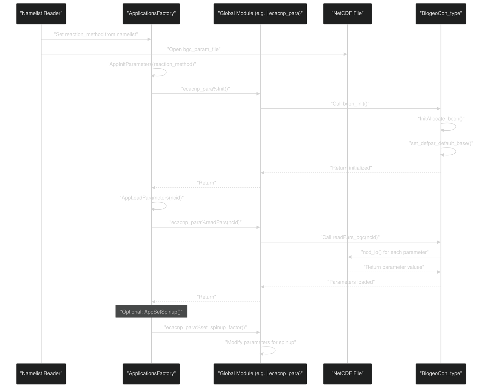

# BGC Model Plugin System

Relevant source files

- [src/Applications/app_util/ApplicationsFactory.F90](https://github.com/jingtao-lbl/sbetr-resomv1/blob/72301c77/src/Applications/app_util/ApplicationsFactory.F90)
- [src/Applications/soil-farm/bgcfarm_util/BiogeoConType.F90](https://github.com/jingtao-lbl/sbetr-resomv1/blob/72301c77/src/Applications/soil-farm/bgcfarm_util/BiogeoConType.F90)
- [src/betr/betr_util/Tracer_varcon.F90](https://github.com/jingtao-lbl/sbetr-resomv1/blob/72301c77/src/betr/betr_util/Tracer_varcon.F90)
- [src/betr/betr_util/betr_ctrl.F90](https://github.com/jingtao-lbl/sbetr-resomv1/blob/72301c77/src/betr/betr_util/betr_ctrl.F90)

## Purpose and Scope

This page documents BeTR's BGC (biogeochemical) model plugin architecture, which enables runtime selection and instantiation of different biogeochemical models without recompilation. The system uses the factory pattern to create model instances based on configuration strings, with abstract base classes defining common interfaces that all models must implement.

For information about implementing a specific new BGC model, see [Creating Custom BGC Models](#7.7) . For details on the parameter management system shared by BGC models, see [Parameter Management](#7.2) . For documentation of individual BGC model implementations (ECACNP, SIMIC, V1ECA, etc.), see sections [7.3](#7.3) through [7.6](#7.6) .

## Overview

The BGC plugin system allows BeTR to support multiple biogeochemical models through a consistent interface. At runtime, the `reaction_method` namelist parameter determines which BGC model to instantiate. The system is built on three pillars:

Sources: [src/Applications/app_util/ApplicationsFactory.F90 1-370](https://github.com/jingtao-lbl/sbetr-resomv1/blob/72301c77/src/Applications/app_util/ApplicationsFactory.F90#L1-L370)

## Plugin Architecture

Diagram: BGC Model Plugin Architecture

Sources: [src/Applications/app_util/ApplicationsFactory.F90 27-175](https://github.com/jingtao-lbl/sbetr-resomv1/blob/72301c77/src/Applications/app_util/ApplicationsFactory.F90#L27-L175)

## Factory Pattern Implementation

### Model Instantiation Entry Point

The primary factory function is `create_betr_usr_application` , which serves as the entry point for creating all BGC-related objects:

This function creates two main components:

- **bgc_reaction**`bgc_reaction_type`: The BGC reaction model implementing
- **plant_soilbgc**`plant_soilbgc_type`: The plant-soil interface implementing

The `method` string parameter determines which concrete classes are instantiated.

Sources: [src/Applications/app_util/ApplicationsFactory.F90 27-46](https://github.com/jingtao-lbl/sbetr-resomv1/blob/72301c77/src/Applications/app_util/ApplicationsFactory.F90#L27-L46)

### BGC Reaction Type Factory

The `create_bgc_reaction_type` function uses a `select case` statement to instantiate the appropriate BGC model:

| Reaction Method String | Instantiated Type | Availability | 
| --- | --- | --- |
| "ecacnp" or "ecacnp_mosart" | ecacnp_bgc_reaction_type() | Always | 
| "resom" | resom_bgc_reaction_type() | Always | 
| "v1eca" or "v1eca_mosart" | v1eca_bgc_reaction_type() | Always | 
| "ch4soil" | ch4soil_bgc_reaction_type() | SBETR only | 
| "cdom" or "cdom_mosart" | cdom_bgc_reaction_type() | SBETR only | 
| "simic" | simic_bgc_reaction_type() | SBETR only | 
| "keca" | keca_bgc_reaction_type() | SBETR only | 

The factory uses Fortran's polymorphic allocation with the `source=` keyword to create instances:

This approach ensures that the allocated object has the correct dynamic type while being stored in a base class pointer.

Sources: [src/Applications/app_util/ApplicationsFactory.F90 50-115](https://github.com/jingtao-lbl/sbetr-resomv1/blob/72301c77/src/Applications/app_util/ApplicationsFactory.F90#L50-L115)

### Plant-Soil BGC Type Factory

Similarly, `create_plant_soilbgc_type` instantiates the corresponding plant-soil interface for each BGC model. The same `method` string is used to ensure consistency:

Sources: [src/Applications/app_util/ApplicationsFactory.F90 118-175](https://github.com/jingtao-lbl/sbetr-resomv1/blob/72301c77/src/Applications/app_util/ApplicationsFactory.F90#L118-L175)

## Model Registration Mechanism

Diagram: Process for Registering a New BGC Model

The registration pattern requires adding code in marked regions between `!begin_appadd` and `!end_appadd` comment blocks. These blocks serve as clear insertion points for new models.

Sources: [src/Applications/app_util/ApplicationsFactory.F90 60-310](https://github.com/jingtao-lbl/sbetr-resomv1/blob/72301c77/src/Applications/app_util/ApplicationsFactory.F90#L60-L310)

## Abstract Base Classes

### bgc_reaction_type Interface

The `bgc_reaction_type` abstract class (defined elsewhere, referenced here) provides the core interface that all BGC models must implement. Key methods include:

- **Initialization**: Set up tracer definitions and indices
- **runbgc**: Execute one timestep of biogeochemical reactions
- **calc_bgc_reaction**: Calculate reaction rates and update tracer states
- **Boundary conditions**: Set atmospheric and bottom boundary conditions

All concrete BGC models must extend this type and implement these deferred procedures.

Sources: [src/Applications/app_util/ApplicationsFactory.F90 13-56](https://github.com/jingtao-lbl/sbetr-resomv1/blob/72301c77/src/Applications/app_util/ApplicationsFactory.F90#L13-L56)

### plant_soilbgc_type Interface

The `plant_soilbgc_type` abstract class defines the interface between plant processes and soil biogeochemistry. Each BGC model provides its own implementation that handles:

- Carbon, nitrogen, and phosphorus fluxes from vegetation
- Litter inputs to soil pools
- Nutrient uptake by plants
- Coupling with land surface models

Sources: [src/Applications/app_util/ApplicationsFactory.F90 14-124](https://github.com/jingtao-lbl/sbetr-resomv1/blob/72301c77/src/Applications/app_util/ApplicationsFactory.F90#L14-L124)

### BiogeoCon_type Parameter Base

The `BiogeoCon_type` class serves as the base for model-specific parameter types. It provides:

- Common parameter storage (C:N:P ratios, isotope flags)
- `readPars()``readPars_bgc()`NetCDF I/O interface through and
- `Init()``bcon_Init()`Initialization through and
- Deep copy functionality for parameter propagation
- `set_spinup_factor()`Spinup parameter modification through

Model-specific parameter types extend this base class to add their own parameters while inheriting common functionality.

Sources: [src/Applications/soil-farm/bgcfarm_util/BiogeoConType.F90 8-74](https://github.com/jingtao-lbl/sbetr-resomv1/blob/72301c77/src/Applications/soil-farm/bgcfarm_util/BiogeoConType.F90#L8-L74)

## Parameter Management System

### Parameter Loading Flow

Diagram: Parameter Loading Sequence

Sources: [src/Applications/app_util/ApplicationsFactory.F90 178-312](https://github.com/jingtao-lbl/sbetr-resomv1/blob/72301c77/src/Applications/app_util/ApplicationsFactory.F90#L178-L312)  [src/Applications/soil-farm/bgcfarm_util/BiogeoConType.F90 78-190](https://github.com/jingtao-lbl/sbetr-resomv1/blob/72301c77/src/Applications/soil-farm/bgcfarm_util/BiogeoConType.F90#L78-L190)

### Global Parameter Instances

Each BGC model declares a global module-level parameter instance that is initialized once and shared across the simulation. For example:

- `ecacnp_para``ecacnp_para_type`: Global instance of
- `simic_para``simic_para_type`: Global instance of
- `v1eca_para``v1eca_para_type`: Global instance of

These instances are initialized through `AppInitParameters()` and populated from NetCDF files through `AppLoadParameters()` .

Sources: [src/Applications/app_util/ApplicationsFactory.F90 183-275](https://github.com/jingtao-lbl/sbetr-resomv1/blob/72301c77/src/Applications/app_util/ApplicationsFactory.F90#L183-L275)

### Parameter Copying for Multiple Columns

For simulations with multiple spatial columns, the `AppCopyParas()` function creates column-specific parameter copies:

This function allocates an array of parameter objects (e.g., `ecacnp_paras(begc:endc)` ) and performs deep copies from the global instance. This allows column-specific parameter variations in future implementations.

Sources: [src/Applications/app_util/ApplicationsFactory.F90 316-368](https://github.com/jingtao-lbl/sbetr-resomv1/blob/72301c77/src/Applications/app_util/ApplicationsFactory.F90#L316-L368)

## Runtime Instantiation Process

### Configuration Variables

The plugin system relies on several key module variables:

| Variable | Module | Type | Purpose | 
| --- | --- | --- | --- |
| reaction_method | Tracer_varcon | character | Specifies which BGC model to use | 
| bgc_param_file | Tracer_varcon | character | Path to NetCDF parameter file | 
| is_nitrogen_active | Tracer_varcon | logical | Enable/disable nitrogen cycling | 
| is_phosphorus_active | Tracer_varcon | logical | Enable/disable phosphorus cycling | 
| use_c13_betr | Tracer_varcon | logical | Enable C-13 isotope tracking | 
| use_c14_betr | Tracer_varcon | logical | Enable C-14 isotope tracking | 
| inloop_reaction | betr_ctrl | logical | Controls reaction timing | 
| bgc_type | betr_ctrl | character | BGC type classification | 

Sources: [src/betr/betr_util/Tracer_varcon.F90 42-65](https://github.com/jingtao-lbl/sbetr-resomv1/blob/72301c77/src/betr/betr_util/Tracer_varcon.F90#L42-L65)  [src/betr/betr_util/betr_ctrl.F90 8-21](https://github.com/jingtao-lbl/sbetr-resomv1/blob/72301c77/src/betr/betr_util/betr_ctrl.F90#L8-L21)

### Instantiation Flow in BeTR Core

Diagram: Runtime Instantiation Flow

Sources: [src/Applications/app_util/ApplicationsFactory.F90 27-115](https://github.com/jingtao-lbl/sbetr-resomv1/blob/72301c77/src/Applications/app_util/ApplicationsFactory.F90#L27-L115)

## BGC Model Type Classification

The factory sets the `bgc_type` control variable to classify models:

- **type0_bgc**: No BGC (default)
- **type1_bgc**: Models that use external reaction loop (e.g., V1ECA)
- **type2_bgc**: Models that use internal reaction loop (e.g., ECACNP, RESOM)

This classification affects whether reactions are called within the transport loop ( `inloop_reaction=.true.` ) or in a separate phase ( `inloop_reaction=.false.` ).

Sources: [src/Applications/app_util/ApplicationsFactory.F90 87-102](https://github.com/jingtao-lbl/sbetr-resomv1/blob/72301c77/src/Applications/app_util/ApplicationsFactory.F90#L87-L102)  [src/betr/betr_util/betr_ctrl.F90 20-21](https://github.com/jingtao-lbl/sbetr-resomv1/blob/72301c77/src/betr/betr_util/betr_ctrl.F90#L20-L21)

## Conditional Compilation

Some BGC models are only available when BeTR is compiled with the `SBETR` preprocessor flag. The factory uses conditional compilation directives:

Models available without SBETR: ECACNP, RESOM, V1ECA Models requiring SBETR: CH4SOIL, CDOM, SIMIC, KECA

Sources: [src/Applications/app_util/ApplicationsFactory.F90 63-99](https://github.com/jingtao-lbl/sbetr-resomv1/blob/72301c77/src/Applications/app_util/ApplicationsFactory.F90#L63-L99)

## Error Handling

The factory pattern includes robust error handling through the `betr_status_type` object:

Example error handling pattern:

Sources: [src/Applications/app_util/ApplicationsFactory.F90 104-172](https://github.com/jingtao-lbl/sbetr-resomv1/blob/72301c77/src/Applications/app_util/ApplicationsFactory.F90#L104-L172)

## Summary of Key Files

| File Path | Primary Purpose | 
| --- | --- |
| src/Applications/app_util/ApplicationsFactory.F90 | Factory implementation for model instantiation | 
| src/Applications/soil-farm/bgcfarm_util/BiogeoConType.F90 | Base class for BGC parameters | 
| src/betr/betr_util/Tracer_varcon.F90 | Configuration variables including reaction_method | 
| src/betr/betr_util/betr_ctrl.F90 | Global control flags including bgc_type | 

For implementing specific BGC models, see the model-specific files:

- `src/Applications/soil-farm/ecacnp/`ECACNP:
- `src/Applications/soil-farm/resom/`RESOM:
- `src/Applications/soil-farm/v1eca/`V1ECA:
- `src/Applications/soil-farm/<model_name>/`Other models: