# Parameter Management

Relevant source files

- [src/Applications/app_util/ApplicationsFactory.F90](https://github.com/jingtao-lbl/sbetr-resomv1/blob/72301c77/src/Applications/app_util/ApplicationsFactory.F90)
- [src/Applications/soil-farm/bgcfarm_util/BiogeoConType.F90](https://github.com/jingtao-lbl/sbetr-resomv1/blob/72301c77/src/Applications/soil-farm/bgcfarm_util/BiogeoConType.F90)
- [src/betr/betr_util/Tracer_varcon.F90](https://github.com/jingtao-lbl/sbetr-resomv1/blob/72301c77/src/betr/betr_util/Tracer_varcon.F90)
- [src/betr/betr_util/betr_ctrl.F90](https://github.com/jingtao-lbl/sbetr-resomv1/blob/72301c77/src/betr/betr_util/betr_ctrl.F90)

## Purpose and Scope

This document describes the parameter management system in BeTR, which handles the initialization, loading, and distribution of biogeochemical model parameters. Parameter management provides a structured way to define model-specific constants, read them from NetCDF parameter files, and distribute them across spatial columns.

For information about how BGC models are instantiated and selected, see [BGC Model Plugin System](#7.1) . For details on individual BGC model implementations, see [ECACNP Model](#7.3) , [SIMIC Model](#7.4) , and [V1ECA Model](#7.5) .

## Parameter System Architecture

The parameter management system follows an object-oriented design with abstract base classes and model-specific extensions. Each BGC model defines its own parameter type that encapsulates all model-specific constants and kinetic parameters.

Parameter System Architecture : The factory methods in `ApplicationsFactory` dispatch to model-specific parameter types, all of which extend the `BiogeoCon_type` base class and implement common initialization and I/O methods.

Sources: [src/Applications/app_util/ApplicationsFactory.F90 1-370](https://github.com/jingtao-lbl/sbetr-resomv1/blob/72301c77/src/Applications/app_util/ApplicationsFactory.F90#L1-L370)  [src/Applications/soil-farm/bgcfarm_util/BiogeoConType.F90 1-400](https://github.com/jingtao-lbl/sbetr-resomv1/blob/72301c77/src/Applications/soil-farm/bgcfarm_util/BiogeoConType.F90#L1-L400)

## BiogeoConType Base Class

The `BiogeoCon_type` class defined in [src/Applications/soil-farm/bgcfarm_util/BiogeoConType.F90 8-74](https://github.com/jingtao-lbl/sbetr-resomv1/blob/72301c77/src/Applications/soil-farm/bgcfarm_util/BiogeoConType.F90#L8-L74) provides the foundation for all parameter types. It contains common parameters shared across multiple BGC models and defines the interface that all model-specific parameter types must implement.

### Core Parameters

The base class contains parameters for litter chemistry and stoichiometry:

| Parameter Group | Examples | Purpose | 
| --- | --- | --- |
| Litter Fractions | cwd_fcel_bgc, cwd_flig_bgc, lwd_fcel_bgc, fwd_flig_bgc | Cellulose and lignin fractions in coarse, large, and fine woody debris | 
| Initial C:N Ratios | init_cn_met, init_cn_cel, init_cn_lig, init_cn_cwd | Carbon-to-nitrogen ratios for metabolic, cellulose, lignin, and woody pools | 
| Initial C:P Ratios | init_cp_met, init_cp_cel, init_cp_lig, init_cp_cwd | Carbon-to-phosphorus ratios for litter pools | 
| Isotope Ratios | init_cc13_met, init_cc14_met | Initial C13 and C14 signatures when isotopes are active | 
| Nutrient Competition | vmax_minp_soluble_to_secondary, minp_secondary_decay, frac_p_sec_to_sol | ECA nutrient competition parameters (allocated by soil order) | 
| Weathering | E_weath, T_ref_weath, b_weath, f_shield, P_weip | Phosphorus weathering parameters | 

### Logical Switches

The base class also manages logical switches that control model behavior:

- `use_c13`[BiogeoConType.F9046](https://github.com/jingtao-lbl/sbetr-resomv1/blob/72301c77/BiogeoConType.F90#L46-L46): Enable C13 isotope tracking
- `use_c14`[BiogeoConType.F9047](https://github.com/jingtao-lbl/sbetr-resomv1/blob/72301c77/BiogeoConType.F90#L47-L47): Enable C14 isotope tracking
- `nop_limit`[BiogeoConType.F9049](https://github.com/jingtao-lbl/sbetr-resomv1/blob/72301c77/BiogeoConType.F90#L49-L49): Disable phosphorus limitation
- `non_limit`[BiogeoConType.F9050](https://github.com/jingtao-lbl/sbetr-resomv1/blob/72301c77/BiogeoConType.F90#L50-L50): Disable nitrogen limitation

### Key Methods

BiogeoConType Method Flow : Initialization involves allocating arrays and setting defaults, while I/O methods handle reading from files and printing for debugging.

Sources: [src/Applications/soil-farm/bgcfarm_util/BiogeoConType.F90 65-73](https://github.com/jingtao-lbl/sbetr-resomv1/blob/72301c77/src/Applications/soil-farm/bgcfarm_util/BiogeoConType.F90#L65-L73)

### Memory Allocation

Parameters that vary by soil order or PFT are allocated as arrays in `InitAllocate_bcon`  [BiogeoConType.F90 131-147](https://github.com/jingtao-lbl/sbetr-resomv1/blob/72301c77/BiogeoConType.F90#L131-L147) :

This allows parameters to be spatially variable based on soil classification or plant functional type.

Sources: [src/Applications/soil-farm/bgcfarm_util/BiogeoConType.F90 131-147](https://github.com/jingtao-lbl/sbetr-resomv1/blob/72301c77/src/Applications/soil-farm/bgcfarm_util/BiogeoConType.F90#L131-L147)

## Model-Specific Parameter Types

Each BGC model defines its own parameter type that extends `BiogeoCon_type` . These types are defined in separate modules and contain model-specific kinetic parameters, stoichiometric ratios, and configuration options.

### Parameter Type Organization

| BGC Model | Parameter Type | Module | Key Parameters | 
| --- | --- | --- | --- |
| ECACNP | ecacnp_para_type | ecacnpParaType | Decomposition rates, ECA competition, N/P cycling | 
| RESOM | resom_para_type | resomParaType | Mineral-organic interactions, SOM formation | 
| V1ECA | v1eca_para_type | v1ecaParaType | Enzymatic carbon assimilation, P weathering | 
| SIMIC | simic_para_type | simicParaType | Microbial dynamics, turnover rates | 
| KECA | keca_para_type | kecaParaType | Kinetic ECA parameters | 
| CH4SOIL | ch4soil_para_type | ch4soilParaType | Methane production and oxidation | 
| CDOM | cdom_para_type | cdomParaType | Dissolved organic matter | 

Each parameter type implements the same interface as `BiogeoCon_type` , allowing polymorphic parameter management through the factory pattern.

Sources: [src/Applications/app_util/ApplicationsFactory.F90 183-191](https://github.com/jingtao-lbl/sbetr-resomv1/blob/72301c77/src/Applications/app_util/ApplicationsFactory.F90#L183-L191)  [src/Applications/app_util/ApplicationsFactory.F90 231-239](https://github.com/jingtao-lbl/sbetr-resomv1/blob/72301c77/src/Applications/app_util/ApplicationsFactory.F90#L231-L239)

### Global Parameter Instances

Most BGC models use a single global parameter instance that is initialized once and optionally copied to create column-specific instances. For example:

- `ecacnp_para`[ApplicationsFactory.F90183](https://github.com/jingtao-lbl/sbetr-resomv1/blob/72301c77/ApplicationsFactory.F90#L183-L183): Global ECACNP parameters
- `resom_para`[ApplicationsFactory.F90184](https://github.com/jingtao-lbl/sbetr-resomv1/blob/72301c77/ApplicationsFactory.F90#L184-L184): Global RESOM parameters
- `v1eca_para`[ApplicationsFactory.F90191](https://github.com/jingtao-lbl/sbetr-resomv1/blob/72301c77/ApplicationsFactory.F90#L191-L191): Global V1ECA parameters

Sources: [src/Applications/app_util/ApplicationsFactory.F90 183-191](https://github.com/jingtao-lbl/sbetr-resomv1/blob/72301c77/src/Applications/app_util/ApplicationsFactory.F90#L183-L191)

## Parameter Loading from Files

Parameters are loaded from NetCDF files using a two-step process: file reading followed by initialization with default values where file values are missing.

### Parameter File Location

The parameter file path is specified in the namelist configuration and stored in the global variable `bgc_param_file`  [Tracer_varcon.F90 64](https://github.com/jingtao-lbl/sbetr-resomv1/blob/72301c77/Tracer_varcon.F90#L64-L64) :

### AppLoadParameters Factory Method

The `AppLoadParameters` subroutine [ApplicationsFactory.F90 178-223](https://github.com/jingtao-lbl/sbetr-resomv1/blob/72301c77/ApplicationsFactory.F90#L178-L223) dispatches parameter loading to the appropriate model based on `reaction_method` :

Parameter Loading Dispatch : The factory method routes to model-specific `readPars` implementations based on the selected BGC model.

Sources: [src/Applications/app_util/ApplicationsFactory.F90 178-223](https://github.com/jingtao-lbl/sbetr-resomv1/blob/72301c77/src/Applications/app_util/ApplicationsFactory.F90#L178-L223)

### NetCDF I/O Pattern

Parameter files use the `ncd_io` interface from the `ncdio_pio` module. The typical pattern for reading a parameter is:

The `readv` flag indicates whether the variable was found in the file. Missing variables either trigger an error or use default values depending on whether they are required.

Sources: [src/Applications/soil-farm/bgcfarm_util/BiogeoConType.F90 194-301](https://github.com/jingtao-lbl/sbetr-resomv1/blob/72301c77/src/Applications/soil-farm/bgcfarm_util/BiogeoConType.F90#L194-L301)

### Error Handling

Parameter loading uses `BetrStatusType` for error reporting [ApplicationsFactory.F90 195-198](https://github.com/jingtao-lbl/sbetr-resomv1/blob/72301c77/ApplicationsFactory.F90#L195-L198) :

This allows errors to propagate up the call stack with descriptive messages.

Sources: [src/Applications/app_util/ApplicationsFactory.F90 178-223](https://github.com/jingtao-lbl/sbetr-resomv1/blob/72301c77/src/Applications/app_util/ApplicationsFactory.F90#L178-L223)

## Parameter Initialization

After loading from files (or instead of loading if no file is provided), parameters are initialized with default values using `AppInitParameters` .

### AppInitParameters Factory Method

The `AppInitParameters` subroutine [ApplicationsFactory.F90 226-275](https://github.com/jingtao-lbl/sbetr-resomv1/blob/72301c77/ApplicationsFactory.F90#L226-L275) initializes model-specific parameters:

Parameter Initialization Dispatch : Each model's `Init` method allocates arrays and sets scientifically appropriate default values.

Sources: [src/Applications/app_util/ApplicationsFactory.F90 226-275](https://github.com/jingtao-lbl/sbetr-resomv1/blob/72301c77/src/Applications/app_util/ApplicationsFactory.F90#L226-L275)

### Initialization Order

The typical initialization sequence for parameters is:

This allows models to function with reasonable defaults even without parameter files, while still supporting site-specific calibration through parameter files.

### Configuration Integration

Parameter initialization integrates with global configuration settings from `Tracer_varcon` and `betr_ctrl` . For example, the base class initialization checks isotope flags [BiogeoConType.F90 121-124](https://github.com/jingtao-lbl/sbetr-resomv1/blob/72301c77/BiogeoConType.F90#L121-L124) :

These settings control which tracers are active and which nutrient cycling processes are enabled.

Sources: [src/Applications/soil-farm/bgcfarm_util/BiogeoConType.F90 107-129](https://github.com/jingtao-lbl/sbetr-resomv1/blob/72301c77/src/Applications/soil-farm/bgcfarm_util/BiogeoConType.F90#L107-L129)  [src/betr/betr_util/Tracer_varcon.F90 42-47](https://github.com/jingtao-lbl/sbetr-resomv1/blob/72301c77/src/betr/betr_util/Tracer_varcon.F90#L42-L47)

## Spinup Parameter Adjustments

During model spinup, certain kinetic parameters can be scaled to accelerate the approach to steady state. The `AppSetSpinup` subroutine manages these adjustments.

### Spinup Control

The spinup state is controlled by the global variable `betr_spinup_state` in `betr_ctrl`  [betr_ctrl.F90 16-17](https://github.com/jingtao-lbl/sbetr-resomv1/blob/72301c77/betr_ctrl.F90#L16-L17) :

- State 0: Normal simulation (no acceleration)
- State 1: AD-1 spinup (accelerated decomposition, stage 1)
- State 2: AD-2 spinup (accelerated decomposition, stage 2)

### AppSetSpinup Factory Method

The `AppSetSpinup` subroutine [ApplicationsFactory.F90 277-312](https://github.com/jingtao-lbl/sbetr-resomv1/blob/72301c77/ApplicationsFactory.F90#L277-L312) calls model-specific spinup adjustment methods:

Spinup Parameter Adjustment : Each model implements `set_spinup_factor()` to scale decomposition rates or other kinetic parameters based on the current spinup state.

Sources: [src/Applications/app_util/ApplicationsFactory.F90 277-312](https://github.com/jingtao-lbl/sbetr-resomv1/blob/72301c77/src/Applications/app_util/ApplicationsFactory.F90#L277-L312)

### Typical Spinup Scaling

Spinup acceleration typically scales decomposition rate constants by factors of 10-100x to reach quasi-equilibrium faster. The scaling is reversed when exiting spinup mode to resume normal simulation behavior. Each model decides which parameters to scale based on its specific formulation.

Sources: [src/Applications/app_util/ApplicationsFactory.F90 277-312](https://github.com/jingtao-lbl/sbetr-resomv1/blob/72301c77/src/Applications/app_util/ApplicationsFactory.F90#L277-L312)

## Column-Specific Parameter Distribution

For spatially-explicit simulations, parameters may need to vary by grid cell or column. The `AppCopyParas` subroutine creates column-specific parameter instances.

### Parameter Column Architecture

Column-Specific Parameter Distribution : A global parameter instance is deep-copied to create separate instances for each column, allowing site-specific calibration.

Sources: [src/Applications/app_util/ApplicationsFactory.F90 316-368](https://github.com/jingtao-lbl/sbetr-resomv1/blob/72301c77/src/Applications/app_util/ApplicationsFactory.F90#L316-L368)

### AppCopyParas Implementation

The `AppCopyParas` subroutine [ApplicationsFactory.F90 316-368](https://github.com/jingtao-lbl/sbetr-resomv1/blob/72301c77/ApplicationsFactory.F90#L316-L368) allocates and initializes column arrays:

This creates a separate parameter object for each column, initialized with values from the global parameter instance.

Sources: [src/Applications/app_util/ApplicationsFactory.F90 316-368](https://github.com/jingtao-lbl/sbetr-resomv1/blob/72301c77/src/Applications/app_util/ApplicationsFactory.F90#L316-L368)

### Column Index Management

The global variable `nparcols`  [Tracer_varcon.F90 49](https://github.com/jingtao-lbl/sbetr-resomv1/blob/72301c77/Tracer_varcon.F90#L49-L49) tracks the number of column-specific parameter instances:

This is set during parameter copying and used to manage the parameter array lifecycle.

Sources: [src/betr/betr_util/Tracer_varcon.F90 49](https://github.com/jingtao-lbl/sbetr-resomv1/blob/72301c77/src/betr/betr_util/Tracer_varcon.F90#L49-L49)  [src/Applications/app_util/ApplicationsFactory.F90 254](https://github.com/jingtao-lbl/sbetr-resomv1/blob/72301c77/src/Applications/app_util/ApplicationsFactory.F90#L254-L254)  [src/Applications/app_util/ApplicationsFactory.F90 345](https://github.com/jingtao-lbl/sbetr-resomv1/blob/72301c77/src/Applications/app_util/ApplicationsFactory.F90#L345-L345)

### Deep Copy Implementation

The `deep_copy_bgc` method [BiogeoConType.F90 342-397](https://github.com/jingtao-lbl/sbetr-resomv1/blob/72301c77/BiogeoConType.F90#L342-L397) copies all parameter values from a source ("mother") instance:

Model-specific parameter types override this method to also copy their additional parameters.

Sources: [src/Applications/soil-farm/bgcfarm_util/BiogeoConType.F90 342-397](https://github.com/jingtao-lbl/sbetr-resomv1/blob/72301c77/src/Applications/soil-farm/bgcfarm_util/BiogeoConType.F90#L342-L397)

## Parameter Usage in BGC Models

Once initialized, parameters are accessed by BGC reaction implementations during the reaction calculation phase.

### Parameter Access Pattern

BGC models receive parameter objects during initialization and store them as components. For example, a typical BGC reaction class structure is:

Parameter Usage Flow : BGC reaction implementations access parameter values during rate calculations, often combining them with state variables and environmental factors.

The parameters are typically accessed directly as member variables, allowing efficient computation during time integration.

Sources: [src/Applications/app_util/ApplicationsFactory.F90 27-46](https://github.com/jingtao-lbl/sbetr-resomv1/blob/72301c77/src/Applications/app_util/ApplicationsFactory.F90#L27-L46)

## Summary

The parameter management system provides:

| Feature | Implementation | Purpose | 
| --- | --- | --- |
| Type Hierarchy | BiogeoCon_type base class | Common interface for all parameter types | 
| File I/O | NetCDF reading via ncd_io | Load site-specific calibrations | 
| Default Values | Model-specific Init methods | Enable simulations without parameter files | 
| Factory Pattern | AppLoadParameters, AppInitParameters | Runtime polymorphism for different models | 
| Spinup Scaling | AppSetSpinup | Accelerate approach to equilibrium | 
| Spatial Distribution | AppCopyParas | Support spatially-variable parameters | 

This design allows BGC models to be configured flexibly while maintaining type safety and clear separation between different model formulations.

Sources: [src/Applications/app_util/ApplicationsFactory.F90 1-370](https://github.com/jingtao-lbl/sbetr-resomv1/blob/72301c77/src/Applications/app_util/ApplicationsFactory.F90#L1-L370)  [src/Applications/soil-farm/bgcfarm_util/BiogeoConType.F90 1-400](https://github.com/jingtao-lbl/sbetr-resomv1/blob/72301c77/src/Applications/soil-farm/bgcfarm_util/BiogeoConType.F90#L1-L400)