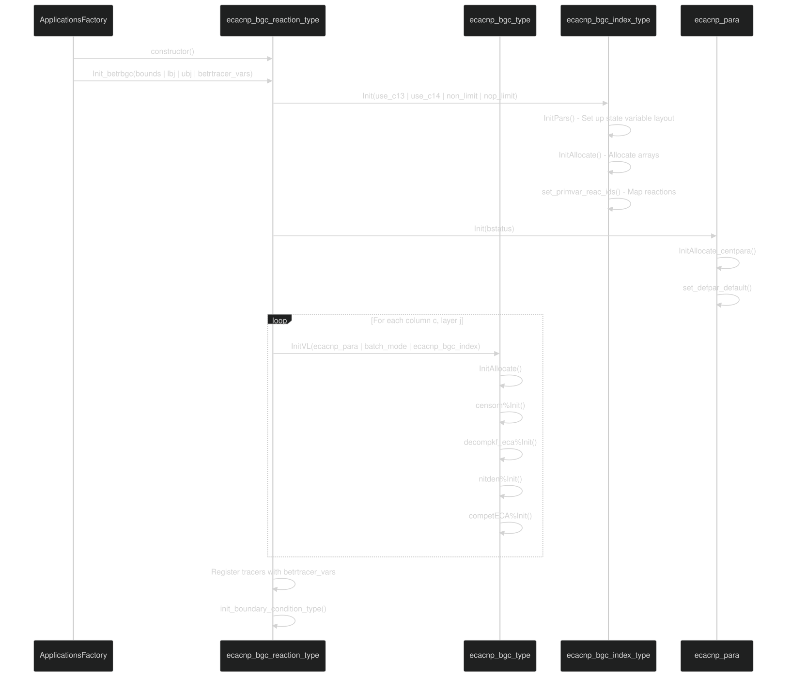
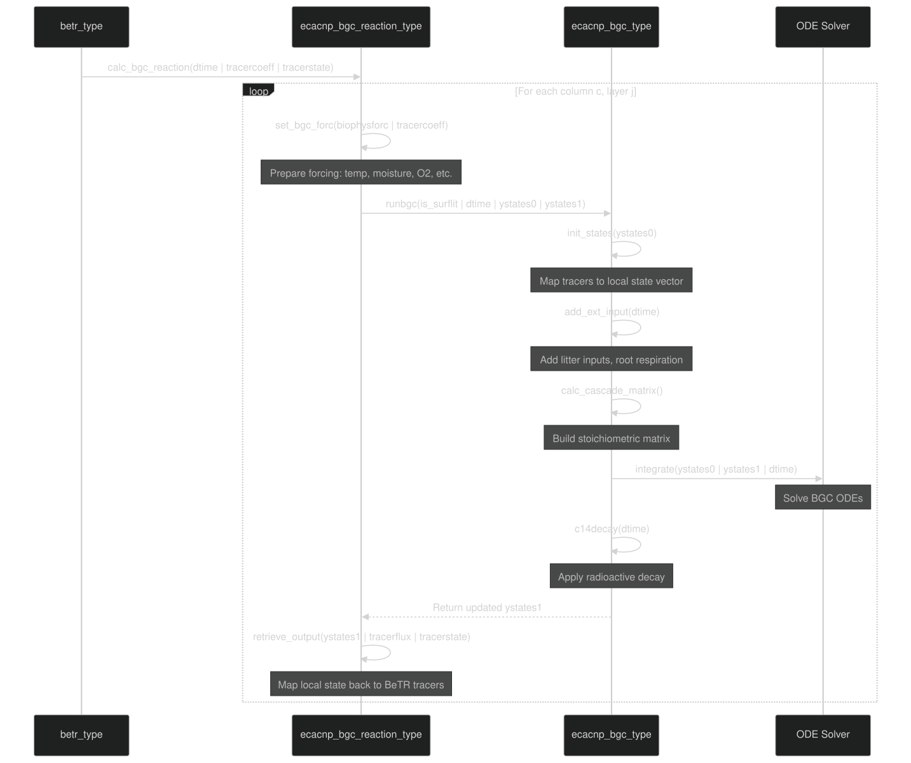

# ECACNP Model

Relevant source files

- [src/Applications/soil-farm/cdom/cdomNlayer/cdomBGCReactionsType.F90](https://github.com/jingtao-lbl/sbetr-resomv1/blob/72301c77/src/Applications/soil-farm/cdom/cdomNlayer/cdomBGCReactionsType.F90)
- [src/Applications/soil-farm/ch4lake/ch4lakeNlayer/ch4lakeBGCReactionsType.F90](https://github.com/jingtao-lbl/sbetr-resomv1/blob/72301c77/src/Applications/soil-farm/ch4lake/ch4lakeNlayer/ch4lakeBGCReactionsType.F90)
- [src/Applications/soil-farm/ch4soil/ch4soilNlayer/ch4soilBGCReactionsType.F90](https://github.com/jingtao-lbl/sbetr-resomv1/blob/72301c77/src/Applications/soil-farm/ch4soil/ch4soilNlayer/ch4soilBGCReactionsType.F90)
- [src/Applications/soil-farm/ecacnp/ecacnp1layer/ecacnpBGCCompetType.F90](https://github.com/jingtao-lbl/sbetr-resomv1/blob/72301c77/src/Applications/soil-farm/ecacnp/ecacnp1layer/ecacnpBGCCompetType.F90)
- [src/Applications/soil-farm/ecacnp/ecacnp1layer/ecacnpBGCIndexType.F90](https://github.com/jingtao-lbl/sbetr-resomv1/blob/72301c77/src/Applications/soil-farm/ecacnp/ecacnp1layer/ecacnpBGCIndexType.F90)
- [src/Applications/soil-farm/ecacnp/ecacnp1layer/ecacnpBGCType.F90](https://github.com/jingtao-lbl/sbetr-resomv1/blob/72301c77/src/Applications/soil-farm/ecacnp/ecacnp1layer/ecacnpBGCType.F90)
- [src/Applications/soil-farm/ecacnp/ecacnpNlayer/ecacnpBGCReactionsType.F90](https://github.com/jingtao-lbl/sbetr-resomv1/blob/72301c77/src/Applications/soil-farm/ecacnp/ecacnpNlayer/ecacnpBGCReactionsType.F90)
- [src/Applications/soil-farm/ecacnp/ecacnpPara/ecacnpParaType.F90](https://github.com/jingtao-lbl/sbetr-resomv1/blob/72301c77/src/Applications/soil-farm/ecacnp/ecacnpPara/ecacnpParaType.F90)
- [src/Applications/soil-farm/keca/kecaNlayer/kecaBGCReactionsType.F90](https://github.com/jingtao-lbl/sbetr-resomv1/blob/72301c77/src/Applications/soil-farm/keca/kecaNlayer/kecaBGCReactionsType.F90)

## Overview

The ECACNP model is a comprehensive biogeochemical model that simulates coupled carbon (C), nitrogen (N), and phosphorus (P) cycling in soils. ECACNP implements Century-based decomposition with Equilibrium Chemistry Approximation (ECA) for nutrient competition among decomposers, nitrifiers, denitrifiers, and plants. The model tracks multiple organic matter pools, inorganic nutrient dynamics, nitrification/denitrification processes, and enzymatic phosphorus extraction, with optional C13 and C14 isotope tracking.

For information about other BGC models in the system, see [Other BGC Models](#7.6) . For details on how BGC models are instantiated at runtime, see [BGC Model Plugin System](#7.1) . For parameter management, see [Parameter Management](#7.2) .

## Model Architecture

### Class Hierarchy

The ECACNP model implements the standard BeTR BGC plugin interface through a two-tier class structure:

Sources:  [src/Applications/soil-farm/ecacnp/ecacnpNlayer/ecacnpBGCReactionsType.F90 63-98](https://github.com/jingtao-lbl/sbetr-resomv1/blob/72301c77/src/Applications/soil-farm/ecacnp/ecacnpNlayer/ecacnpBGCReactionsType.F90#L63-L98)  [src/Applications/soil-farm/ecacnp/ecacnp1layer/ecacnpBGCType.F90 35-100](https://github.com/jingtao-lbl/sbetr-resomv1/blob/72301c77/src/Applications/soil-farm/ecacnp/ecacnp1layer/ecacnpBGCType.F90#L35-L100)

### Key Components

| Component | Purpose | File Location | 
| --- | --- | --- |
| ecacnp_bgc_reaction_type | Multi-layer interface implementing bgc_reaction_type | ecacnpNlayer/ecacnpBGCReactionsType.F90 | 
| ecacnp_bgc_type | Single-layer core BGC model extending jar_model_type | ecacnp1layer/ecacnpBGCType.F90 | 
| ecacnp_bgc_index_type | State variable and reaction indexing system | ecacnp1layer/ecacnpBGCIndexType.F90 | 
| ecacnp_para_type | Model parameters and configuration | ecacnpPara/ecacnpParaType.F90 | 
| Compet_ECACNP_type | ECA nutrient competition calculations | ecacnp1layer/ecacnpBGCCompetType.F90 | 
| DecompCent_type | Century decomposition kinetics | ecacnp1layer/ecacnpBGCDecompType.F90 | 
| century_nitden_type | Nitrification and denitrification | ecacnp1layer/ecacnpBGCNitDenType.F90 | 
| CentSom_type | SOM pool management | ecacnp1layer/ecacnpBGCSOMType.F90 | 

Sources:  [src/Applications/soil-farm/ecacnp/ecacnpNlayer/ecacnpBGCReactionsType.F90 1-104](https://github.com/jingtao-lbl/sbetr-resomv1/blob/72301c77/src/Applications/soil-farm/ecacnp/ecacnpNlayer/ecacnpBGCReactionsType.F90#L1-L104)  [src/Applications/soil-farm/ecacnp/ecacnp1layer/ecacnpBGCType.F90 1-103](https://github.com/jingtao-lbl/sbetr-resomv1/blob/72301c77/src/Applications/soil-farm/ecacnp/ecacnp1layer/ecacnpBGCType.F90#L1-L103)

## State Variables and Tracers

### Tracer Groups

ECACNP defines the following tracer groups that are registered with BeTR's tracer system:

Sources:  [src/Applications/soil-farm/ecacnp/ecacnpNlayer/ecacnpBGCReactionsType.F90 498-626](https://github.com/jingtao-lbl/sbetr-resomv1/blob/72301c77/src/Applications/soil-farm/ecacnp/ecacnpNlayer/ecacnpBGCReactionsType.F90#L498-L626)

### Organic Matter Pool Organization

Each organic matter pool contains `nelms` elements where `nelms` typically includes:

- `c_loc`Carbon (C) at location
- `n_loc`Nitrogen (N) at location
- `p_loc`Phosphorus (P) at location
- `c13_loc`Optionally C13 at location
- `c14_loc`Optionally C14 at location

| Pool Group | Pools | Description | Mobility | 
| --- | --- | --- | --- |
| Litter (LITR) | LIT1, LIT2, LIT3 | Surface and soil litter (metabolic, structural) | Bioturbation | 
| Wood (WOOD) | CWD, LWD, FWD | Coarse, large, fine woody debris | Bioturbation | 
| Microbial Biomass (Bm) | SOM1_MB | Active microbial biomass | Bioturbation | 
| Particulate OM (POM) | SOM2_POM | Particulate organic matter | Bioturbation | 
| Soil OM (SOM) | SOM3 | Stable soil organic matter | Bioturbation | 

Sources:  [src/Applications/soil-farm/ecacnp/ecacnp1layer/ecacnpBGCIndexType.F90 23-40](https://github.com/jingtao-lbl/sbetr-resomv1/blob/72301c77/src/Applications/soil-farm/ecacnp/ecacnp1layer/ecacnpBGCIndexType.F90#L23-L40)  [src/Applications/soil-farm/ecacnp/ecacnp1layer/ecacnpBGCIndexType.F90 362-406](https://github.com/jingtao-lbl/sbetr-resomv1/blob/72301c77/src/Applications/soil-farm/ecacnp/ecacnp1layer/ecacnpBGCIndexType.F90#L362-L406)

### State Variable Vector Structure

Sources:  [src/Applications/soil-farm/ecacnp/ecacnp1layer/ecacnpBGCIndexType.F90 298-527](https://github.com/jingtao-lbl/sbetr-resomv1/blob/72301c77/src/Applications/soil-farm/ecacnp/ecacnp1layer/ecacnpBGCIndexType.F90#L298-L527)

## Decomposition and Cascade Structure

### Decomposition Reactions

ECACNP implements Century-style decomposition with the following reaction pathways:

Sources:  [src/Applications/soil-farm/ecacnp/ecacnpPara/ecacnpParaType.F90 17-24](https://github.com/jingtao-lbl/sbetr-resomv1/blob/72301c77/src/Applications/soil-farm/ecacnp/ecacnpPara/ecacnpParaType.F90#L17-L24)  [src/Applications/soil-farm/ecacnp/ecacnpPara/ecacnpParaType.F90 188-194](https://github.com/jingtao-lbl/sbetr-resomv1/blob/72301c77/src/Applications/soil-farm/ecacnp/ecacnpPara/ecacnpParaType.F90#L188-L194)

### Cascade Matrix Implementation

The decomposition pathways are encoded in the `cascade_matrix` which has dimensions `[nstvars, nreactions]` :

| Reaction ID | Reaction Name | Description | 
| --- | --- | --- |
| lit1_dek_reac | LIT1 decomposition | Metabolic litter → SOM1 + CO2 | 
| lit2_dek_reac | LIT2 decomposition | Structural litter → SOM1 + CO2 | 
| lit3_dek_reac | LIT3 decomposition | Lignin litter → SOM2 + CO2 | 
| cwd_dek_reac | CWD decomposition | Coarse wood → SOM1 + SOM2 + CO2 | 
| lwd_dek_reac | LWD decomposition | Large wood → SOM1 + SOM2 + CO2 | 
| fwd_dek_reac | FWD decomposition | Fine wood → SOM1 + SOM2 + CO2 | 
| som1_dek_reac | SOM1 decomposition | Microbial biomass → SOM2 + SOM3 + CO2 | 
| som2_dek_reac | SOM2 decomposition | Particulate OM → SOM1 + SOM3 + CO2 | 
| som3_dek_reac | SOM3 decomposition | Stable SOM → SOM1 + CO2 | 

Sources:  [src/Applications/soil-farm/ecacnp/ecacnp1layer/ecacnpBGCIndexType.F90 26-34](https://github.com/jingtao-lbl/sbetr-resomv1/blob/72301c77/src/Applications/soil-farm/ecacnp/ecacnp1layer/ecacnpBGCIndexType.F90#L26-L34)  [src/Applications/soil-farm/ecacnp/ecacnp1layer/ecacnpBGCType.F90 44-46](https://github.com/jingtao-lbl/sbetr-resomv1/blob/72301c77/src/Applications/soil-farm/ecacnp/ecacnp1layer/ecacnpBGCType.F90#L44-L46)

### Decomposition Rate Calculation

Decomposition rates are calculated as:

Where:

- `k_decay`: Base decay rate constant (1/year converted to 1/s)
- `f_temp`: Temperature function using Q10 formulation
- `f_moisture`: Moisture limitation factor
- `f_depth`: Depth attenuation factor
- `f_nutrient`: Nutrient limitation factor (N and P)

Sources:  [src/Applications/soil-farm/ecacnp/ecacnpPara/ecacnpParaType.F90 13-33](https://github.com/jingtao-lbl/sbetr-resomv1/blob/72301c77/src/Applications/soil-farm/ecacnp/ecacnpPara/ecacnpParaType.F90#L13-L33)  [src/Applications/soil-farm/ecacnp/ecacnpPara/ecacnpParaType.F90 197-205](https://github.com/jingtao-lbl/sbetr-resomv1/blob/72301c77/src/Applications/soil-farm/ecacnp/ecacnpPara/ecacnpParaType.F90#L197-L205)

## Nutrient Competition (ECA Framework)

### ECA Competition Principle

The Equilibrium Chemistry Approximation (ECA) resolves competition for nutrients among multiple consumers simultaneously. For substrate `S` and consumers `E_i` , the complex formation is:

The ECA method calculates normalized uptake rates that satisfy:

Sources:  [src/Applications/soil-farm/ecacnp/ecacnp1layer/ecacnpBGCCompetType.F90 1-295](https://github.com/jingtao-lbl/sbetr-resomv1/blob/72301c77/src/Applications/soil-farm/ecacnp/ecacnp1layer/ecacnpBGCCompetType.F90#L1-L295)

### Nitrogen Competition

The nitrogen competition is solved by `run_compet_nitrogen` which returns:

- `ECA_factor_nit`: Nitrifier limitation factor (0-1)
- `ECA_factor_den`: Denitrifier limitation factor (0-1)
- `ECA_factor_nh4_mic`: Decomposer NH4 limitation (0-1)
- `ECA_factor_no3_mic`: Decomposer NO3 limitation (0-1)
- `ECA_flx_nh4_plants(p)`: Plant NH4 uptake flux per PFT
- `ECA_flx_no3_plants(p)`: Plant NO3 uptake flux per PFT
- `ECA_factor_msurf_nh4`: Mineral surface adsorption factor

Sources:  [src/Applications/soil-farm/ecacnp/ecacnp1layer/ecacnpBGCCompetType.F90 112-211](https://github.com/jingtao-lbl/sbetr-resomv1/blob/72301c77/src/Applications/soil-farm/ecacnp/ecacnp1layer/ecacnpBGCCompetType.F90#L112-L211)  [src/Applications/soil-farm/ecacnp/ecacnp1layer/ecacnpBGCCompetType.F90 13-42](https://github.com/jingtao-lbl/sbetr-resomv1/blob/72301c77/src/Applications/soil-farm/ecacnp/ecacnp1layer/ecacnpBGCCompetType.F90#L13-L42)

### Phosphorus Competition

The phosphorus competition is solved by `run_compet_phosphorus` which returns:

- `ECA_factor_phosphorus_mic`: Decomposer P limitation (0-1)
- `ECA_flx_phosphorus_plants(p)`: Plant P uptake flux per PFT
- `ECA_factor_minp_msurf`: Mineral surface adsorption factor

Note: P limitation to mineral sorption can be disabled with the `nop_limit` flag, in which case biological uptake remains competitive but mineral adsorption is set to zero.

Sources:  [src/Applications/soil-farm/ecacnp/ecacnp1layer/ecacnpBGCCompetType.F90 213-293](https://github.com/jingtao-lbl/sbetr-resomv1/blob/72301c77/src/Applications/soil-farm/ecacnp/ecacnp1layer/ecacnpBGCCompetType.F90#L213-L293)

### Kinetic Parameters

Kinetic parameters for ECA competition are set via `set_kinetics_par` :

| Parameter | Source | Purpose | 
| --- | --- | --- |
| Plant NH4 uptake | plant_nh4_vmax_vr_patch | Maximum NH4 uptake rate per PFT | 
| Plant NO3 uptake | plant_no3_vmax_vr_patch | Maximum NO3 uptake rate per PFT | 
| Plant P uptake | plant_p_vmax_vr_patch | Maximum P uptake rate per PFT | 
| Plant NH4 affinity | plant_nh4_km_vr_patch | Half-saturation constant for NH4 | 
| Plant NO3 affinity | plant_no3_km_vr_patch | Half-saturation constant for NO3 | 
| Plant P affinity | plant_p_km_vr_patch | Half-saturation constant for P | 
| Microbial NH4 affinity | km_decomp_nh4_vr_col | Half-saturation for decomposers | 
| Microbial NO3 affinity | km_decomp_no3_vr_col | Half-saturation for decomposers | 
| Microbial P affinity | km_decomp_p_vr_col | Half-saturation for decomposers | 

Sources:  [src/Applications/soil-farm/ecacnp/ecacnpNlayer/ecacnpBGCReactionsType.F90 367-429](https://github.com/jingtao-lbl/sbetr-resomv1/blob/72301c77/src/Applications/soil-farm/ecacnp/ecacnpNlayer/ecacnpBGCReactionsType.F90#L367-L429)

## Nitrification and Denitrification

### Nitrification Process

Nitrification converts NH4+ to NO3- with N2O as a byproduct:

The nitrification rate is calculated as:

Where:

- `vmax_nit`: Maximum nitrification rate (1/s)
- `f_o2`: Oxygen limitation using Michaelis-Menten kinetics
- `ECA_factor_nit`: NH4 availability from ECA competition
- `nitrif_n2o_loss_frac * rate_nit`N2O production: (typically 10^-4)

Sources:  [src/Applications/soil-farm/ecacnp/ecacnpPara/ecacnpParaType.F90 37-45](https://github.com/jingtao-lbl/sbetr-resomv1/blob/72301c77/src/Applications/soil-farm/ecacnp/ecacnpPara/ecacnpParaType.F90#L37-L45)  [src/Applications/soil-farm/ecacnp/ecacnpPara/ecacnpParaType.F90 208](https://github.com/jingtao-lbl/sbetr-resomv1/blob/72301c77/src/Applications/soil-farm/ecacnp/ecacnpPara/ecacnpParaType.F90#L208-L208)

### Denitrification Process

Denitrification converts NO3- to N2 and N2O under anaerobic conditions:

The denitrification rate follows:

Where:

- `vmax_den`: Maximum denitrification rate (1/s)
- `f_anaerobic`: Anaerobic fraction based on oxygen limitation
- `ECA_factor_den`: NO3 availability from ECA competition

The N2O:N2 product ratio is calculated using the `rij_kro` parameters based on Arah and Vinten (1995).

Sources:  [src/Applications/soil-farm/ecacnp/ecacnpPara/ecacnpParaType.F90 38-44](https://github.com/jingtao-lbl/sbetr-resomv1/blob/72301c77/src/Applications/soil-farm/ecacnp/ecacnpPara/ecacnpParaType.F90#L38-L44)  [src/Applications/soil-farm/ecacnp/ecacnpPara/ecacnpParaType.F90 210-215](https://github.com/jingtao-lbl/sbetr-resomv1/blob/72301c77/src/Applications/soil-farm/ecacnp/ecacnpPara/ecacnpParaType.F90#L210-L215)

## Phosphorus Cycling

### Inorganic Phosphorus Pools

ECACNP tracks three forms of inorganic phosphorus:

Sources:  [src/Applications/soil-farm/ecacnp/ecacnp1layer/ecacnpBGCType.F90 52-55](https://github.com/jingtao-lbl/sbetr-resomv1/blob/72301c77/src/Applications/soil-farm/ecacnp/ecacnp1layer/ecacnpBGCType.F90#L52-L55)  [src/Applications/soil-farm/ecacnp/ecacnpPara/ecacnpParaType.F90 10-89](https://github.com/jingtao-lbl/sbetr-resomv1/blob/72301c77/src/Applications/soil-farm/ecacnp/ecacnpPara/ecacnpParaType.F90#L10-L89)

### Phosphorus Transformations

| Transformation | Rate Equation | Parameters | 
| --- | --- | --- |
| Soluble → Secondary | vmax * (P_SOL/K_m) * ECA_factor_msurf | vmax_minp_soluble_to_secondary, kaff_minp_msurf | 
| Secondary → Soluble | minp_secondary_decay * frac_p_sec_to_sol * [P_secondary] | minp_secondary_decay, frac_p_sec_to_sol | 
| Secondary → Occluded | minp_secondary_decay * (1-frac_p_sec_to_sol) * [P_secondary] | Soil-order dependent | 

The parameters are soil-order specific, stored in arrays indexed by soil order (1-12).

Sources:  [src/Applications/soil-farm/ecacnp/ecacnp1layer/ecacnpBGCType.F90 212-219](https://github.com/jingtao-lbl/sbetr-resomv1/blob/72301c77/src/Applications/soil-farm/ecacnp/ecacnp1layer/ecacnpBGCType.F90#L212-L219)

### Phosphorus Weathering

Phosphorus weathering provides a source of new P to the system:

The weathering flux is calculated using the Hartmann model and distributed vertically according to `pweath_prof_col` .

Sources:  [src/Applications/soil-farm/ecacnp/ecacnpNlayer/ecacnpBGCReactionsType.F90 310-332](https://github.com/jingtao-lbl/sbetr-resomv1/blob/72301c77/src/Applications/soil-farm/ecacnp/ecacnpNlayer/ecacnpBGCReactionsType.F90#L310-L332)

### Enzymatic P Extraction

Unlike some implementations, ECACNP solves enzymatic P extraction simultaneously with decomposition rather than as a separate sequential process. Each organic matter pool (except CWD) is assigned a target C:P ratio to impose P limitation on decomposition. This ensures consistent ordering and avoids ambiguity in the solution.

Sources:  [src/Applications/soil-farm/ecacnp/ecacnpNlayer/ecacnpBGCReactionsType.F90 17-24](https://github.com/jingtao-lbl/sbetr-resomv1/blob/72301c77/src/Applications/soil-farm/ecacnp/ecacnpNlayer/ecacnpBGCReactionsType.F90#L17-L24)

## Integration with BeTR

### Initialization Flow

Sources:  [src/Applications/soil-farm/ecacnp/ecacnpNlayer/ecacnpBGCReactionsType.F90 432-486](https://github.com/jingtao-lbl/sbetr-resomv1/blob/72301c77/src/Applications/soil-farm/ecacnp/ecacnpNlayer/ecacnpBGCReactionsType.F90#L432-L486)  [src/Applications/soil-farm/ecacnp/ecacnp1layer/ecacnpBGCType.F90 245-292](https://github.com/jingtao-lbl/sbetr-resomv1/blob/72301c77/src/Applications/soil-farm/ecacnp/ecacnp1layer/ecacnpBGCType.F90#L245-L292)

### Reaction Calculation Flow

Sources:  [src/Applications/soil-farm/ecacnp/ecacnpNlayer/ecacnpBGCReactionsType.F90 1634-1910](https://github.com/jingtao-lbl/sbetr-resomv1/blob/72301c77/src/Applications/soil-farm/ecacnp/ecacnpNlayer/ecacnpBGCReactionsType.F90#L1634-L1910)  [src/Applications/soil-farm/ecacnp/ecacnp1layer/ecacnpBGCType.F90 530-752](https://github.com/jingtao-lbl/sbetr-resomv1/blob/72301c77/src/Applications/soil-farm/ecacnp/ecacnp1layer/ecacnpBGCType.F90#L530-L752)

### Boundary Conditions

ECACNP sets specific boundary condition types for different tracers:

| Tracer | Top BC Type | Bottom BC Type | Notes | 
| --- | --- | --- | --- |
| Volatile gases (O2, CO2, N2, N2O, CH4, AR) | Concentration | Zero flux | Atmospheric concentration at top | 
| NO3- | Flux | Zero flux | Deposition flux at top | 
| P_SOL | Flux | Zero flux | Weathering flux at top | 
| NH3x | Concentration | Zero flux | Atmospheric concentration at top | 
| Passive (OM pools, mineral P) | Flux | Zero flux | Litter input at top | 

Sources:  [src/Applications/soil-farm/ecacnp/ecacnpNlayer/ecacnpBGCReactionsType.F90 146-174](https://github.com/jingtao-lbl/sbetr-resomv1/blob/72301c77/src/Applications/soil-farm/ecacnp/ecacnpNlayer/ecacnpBGCReactionsType.F90#L146-L174)

## Spinup Acceleration

### Spinup Strategy

ECACNP uses differentiated spinup factors for different SOM pools to accelerate equilibration:

The `latacc` (latitude acceleration) factor increases spinup acceleration at higher latitudes where decomposition is slower:

Sources:  [src/Applications/soil-farm/ecacnp/ecacnpNlayer/ecacnpBGCReactionsType.F90 177-262](https://github.com/jingtao-lbl/sbetr-resomv1/blob/72301c77/src/Applications/soil-farm/ecacnp/ecacnpNlayer/ecacnpBGCReactionsType.F90#L177-L262)  [src/Applications/soil-farm/ecacnp/ecacnpPara/ecacnpParaType.F90 249-273](https://github.com/jingtao-lbl/sbetr-resomv1/blob/72301c77/src/Applications/soil-farm/ecacnp/ecacnpPara/ecacnpParaType.F90#L249-L273)

### Spinup State Transitions

Sources:  [src/Applications/soil-farm/ecacnp/ecacnpNlayer/ecacnpBGCReactionsType.F90 225-261](https://github.com/jingtao-lbl/sbetr-resomv1/blob/72301c77/src/Applications/soil-farm/ecacnp/ecacnpNlayer/ecacnpBGCReactionsType.F90#L225-L261)

## Key Parameters

### Decomposition Parameters

| Parameter | Default Value | Units | Description | 
| --- | --- | --- | --- |
| Q10 | 2.0 | - | Temperature sensitivity | 
| froz_q10 | 10.0 | - | Frozen soil Q10 | 
| decomp_depth_efolding | 1.0 | m | Depth attenuation | 
| k_decay_lit1 | 14.8, 18.5 | yr^-1 | Metabolic litter decay (surface, soil) | 
| k_decay_lit2 | 3.9, 4.9 | yr^-1 | Structural litter decay | 
| k_decay_lit3 | 3.9, 4.9 | yr^-1 | Lignin litter decay | 
| k_decay_som1 | 6.7, 7.3 | yr^-1 | Microbial biomass decay | 
| k_decay_som2 | 0.2 | yr^-1 | Particulate OM decay | 
| k_decay_som3 | 0.0045 | yr^-1 | Stable SOM decay | 
| k_decay_cwd | 0.6 | yr^-1 | Coarse wood decay | 

Sources:  [src/Applications/soil-farm/ecacnp/ecacnpPara/ecacnpParaType.F90 183-205](https://github.com/jingtao-lbl/sbetr-resomv1/blob/72301c77/src/Applications/soil-farm/ecacnp/ecacnpPara/ecacnpParaType.F90#L183-L205)

### Respiration Fractions

| Parameter | Default Value | Description | 
| --- | --- | --- |
| rf_l1s1_bgc | 0.55, 0.55 | Metabolic litter → SOM1 respiration (surface, soil) | 
| rf_l2s1_bgc | 0.45, 0.55 | Structural litter → SOM1 respiration | 
| rf_l3s2_bgc | 0.3 | Lignin litter → SOM2 respiration | 
| rf_s2s1_bgc | 0.55 | SOM2 → SOM1 respiration | 
| rf_s3s1_bgc | 0.55 | SOM3 → SOM1 respiration | 
| rf_s1s2a_bgc | 0.60, 0.17 | SOM1 → SOM2 respiration base | 
| rf_s1s2b_bgc | 0.0, 0.68 | SOM1 → SOM2 respiration sand-dependent | 

Sources:  [src/Applications/soil-farm/ecacnp/ecacnpPara/ecacnpParaType.F90 188-194](https://github.com/jingtao-lbl/sbetr-resomv1/blob/72301c77/src/Applications/soil-farm/ecacnp/ecacnpPara/ecacnpParaType.F90#L188-L194)

### Nitrification/Denitrification Parameters

| Parameter | Default Value | Units | Description | 
| --- | --- | --- | --- |
| k_nitr_max | 1.157e-6 | s^-1 | Maximum nitrification rate | 
| vmax_nit | 0.67/86400 | s^-1 | Maximum nitrification vmax | 
| vmax_den | 1.8/86400 | s^-1 | Maximum denitrification vmax | 
| km_nit | 0.76/14 | mol N m^-3 | NH4 half-saturation for nitrifiers | 
| km_den | 0.11/14 | mol N m^-3 | NO3 half-saturation for denitrifiers | 
| nitrif_n2o_loss_frac | 1e-4 | - | N2O production fraction | 
| organic_max | 160 | kg m^-3 | Organic matter content for peat | 

Sources:  [src/Applications/soil-farm/ecacnp/ecacnpPara/ecacnpParaType.F90 208-218](https://github.com/jingtao-lbl/sbetr-resomv1/blob/72301c77/src/Applications/soil-farm/ecacnp/ecacnpPara/ecacnpParaType.F90#L208-L218)  [src/Applications/soil-farm/ecacnp/ecacnpPara/ecacnpParaType.F90 234-243](https://github.com/jingtao-lbl/sbetr-resomv1/blob/72301c77/src/Applications/soil-farm/ecacnp/ecacnpPara/ecacnpParaType.F90#L234-L243)

### Nutrient Competition Parameters

| Parameter | Default Value | Units | Description | 
| --- | --- | --- | --- |
| km_decomp_nh4 | 0.18/14 | mol N m^-3 | Decomposer NH4 half-saturation | 
| km_decomp_no3 | 0.41/14 | mol N m^-3 | Decomposer NO3 half-saturation | 
| km_decomp_p | 0.2/31 | mol P m^-3 | Decomposer P half-saturation | 
| vmax_decomp_n | 5e-3/3600 | s^-1 | Maximum N uptake rate | 
| vmax_decomp_p | 1e-3/3600 | s^-1 | Maximum P uptake rate | 

Sources:  [src/Applications/soil-farm/ecacnp/ecacnpPara/ecacnpParaType.F90 234-243](https://github.com/jingtao-lbl/sbetr-resomv1/blob/72301c77/src/Applications/soil-farm/ecacnp/ecacnpPara/ecacnpParaType.F90#L234-L243)

### Initial C:N:P Ratios

| Pool | C:N Ratio | C:P Ratio | Description | 
| --- | --- | --- | --- |
| SOM1 (microbial biomass) | 8:1 | 110:1 | Mass-based ratios | 
| SOM2 (particulate OM) | 11:1 | 320:1 | Mass-based ratios | 
| SOM3 (stable SOM) | 11:1 | 114:1 | Mass-based ratios | 

Sources:  [src/Applications/soil-farm/ecacnp/ecacnpPara/ecacnpParaType.F90 219-232](https://github.com/jingtao-lbl/sbetr-resomv1/blob/72301c77/src/Applications/soil-farm/ecacnp/ecacnpPara/ecacnpParaType.F90#L219-L232)

## C13 and C14 Isotope Tracking

### Isotope Configuration

When `use_c13 = .true.` or `use_c14 = .true.` , ECACNP tracks isotope ratios in all carbon-containing pools:

Each organic matter pool expands from 3 tracers (C, N, P) to 4 or 5 tracers depending on isotope configuration.

Sources:  [src/Applications/soil-farm/ecacnp/ecacnp1layer/ecacnpBGCIndexType.F90 348-359](https://github.com/jingtao-lbl/sbetr-resomv1/blob/72301c77/src/Applications/soil-farm/ecacnp/ecacnp1layer/ecacnpBGCIndexType.F90#L348-L359)

### C14 Radioactive Decay

C14 undergoes radioactive decay with a half-life of 5568 years:

Different pools can have different decay constants to represent fractionation:

- `c14decay_som_const`: For stable SOM
- `c14decay_dom_const`: For dissolved OM
- `c14decay_pom_const`: For particulate OM
- `c14decay_Bm_const`: For microbial biomass

Decay is applied in `c14decay(dtime)` after ODE integration.

Sources:  [src/Applications/soil-farm/ecacnp/ecacnpPara/ecacnpParaType.F90 47-51](https://github.com/jingtao-lbl/sbetr-resomv1/blob/72301c77/src/Applications/soil-farm/ecacnp/ecacnpPara/ecacnpParaType.F90#L47-L51)  [src/Applications/soil-farm/ecacnp/ecacnpPara/ecacnpParaType.F90 174-180](https://github.com/jingtao-lbl/sbetr-resomv1/blob/72301c77/src/Applications/soil-farm/ecacnp/ecacnpPara/ecacnpParaType.F90#L174-L180)

## Implementation Notes

### Operator Splitting

ECACNP integrates all biogeochemical reactions simultaneously using an ODE solver rather than using operator splitting. This approach:

- Avoids ordering ambiguity
- Ensures mass conservation
- Allows tight coupling between N and P dynamics
- Enables consistent nutrient limitation across all processes

Sources:  [src/Applications/soil-farm/ecacnp/ecacnpNlayer/ecacnpBGCReactionsType.F90 8-16](https://github.com/jingtao-lbl/sbetr-resomv1/blob/72301c77/src/Applications/soil-farm/ecacnp/ecacnpNlayer/ecacnpBGCReactionsType.F90#L8-L16)

### Fixed Stoichiometry Assumption

Decomposers are assumed to have fixed stoichiometry (constant C:N:P ratios). This is implemented by assigning target C:N and C:P ratios to each organic matter pool and calculating nutrient demand based on carbon uptake. This contrasts with flexible stoichiometry approaches.

Sources:  [src/Applications/soil-farm/ecacnp/ecacnpNlayer/ecacnpBGCReactionsType.F90 17-21](https://github.com/jingtao-lbl/sbetr-resomv1/blob/72301c77/src/Applications/soil-farm/ecacnp/ecacnpNlayer/ecacnpBGCReactionsType.F90#L17-L21)

### Mass Balance Checking

For debugging, ECACNP provides `begin_massbal_check()` and `end_massbal_check()` methods that track total C, N, and P masses and verify conservation:

Mass balance errors > 0.1% trigger a stop.

Sources:  [src/Applications/soil-farm/ecacnp/ecacnp1layer/ecacnpBGCType.F90 145-196](https://github.com/jingtao-lbl/sbetr-resomv1/blob/72301c77/src/Applications/soil-farm/ecacnp/ecacnp1layer/ecacnpBGCType.F90#L145-L196)

### Precision Filtering

After each integration step, a `precision_filter()` is applied to prevent numerical underflow:

This prevents accumulation of machine-precision errors in long simulations.

Sources:  [src/Applications/soil-farm/ecacnp/ecacnpNlayer/ecacnpBGCReactionsType.F90 2717-2738](https://github.com/jingtao-lbl/sbetr-resomv1/blob/72301c77/src/Applications/soil-farm/ecacnp/ecacnpNlayer/ecacnpBGCReactionsType.F90#L2717-L2738)