# SIMIC Model

Relevant source files

- [example_input/jar-model.namelist](https://github.com/jingtao-lbl/sbetr-resomv1/blob/72301c77/example_input/jar-model.namelist)
- [example_input/simic-reaction.namelist](https://github.com/jingtao-lbl/sbetr-resomv1/blob/72301c77/example_input/simic-reaction.namelist)
- [regression-tests/tests/jarmodel/jar-model.namelist](https://github.com/jingtao-lbl/sbetr-resomv1/blob/72301c77/regression-tests/tests/jarmodel/jar-model.namelist)
- [src/Applications/soil-farm/simic/simic1layer/simicBGCIndexType.F90](https://github.com/jingtao-lbl/sbetr-resomv1/blob/72301c77/src/Applications/soil-farm/simic/simic1layer/simicBGCIndexType.F90)
- [src/Applications/soil-farm/simic/simic1layer/simicBGCType.F90](https://github.com/jingtao-lbl/sbetr-resomv1/blob/72301c77/src/Applications/soil-farm/simic/simic1layer/simicBGCType.F90)
- [src/Applications/soil-farm/simic/simicNlayer/simicBGCReactionsType.F90](https://github.com/jingtao-lbl/sbetr-resomv1/blob/72301c77/src/Applications/soil-farm/simic/simicNlayer/simicBGCReactionsType.F90)
- [src/Applications/soil-farm/simic/simicPara/simicParaType.F90](https://github.com/jingtao-lbl/sbetr-resomv1/blob/72301c77/src/Applications/soil-farm/simic/simicPara/simicParaType.F90)

## Purpose and Scope

This page documents the SIMIC (Soil Microbial Carbon) biogeochemical model, one of the pluggable BGC models available in BeTR. SIMIC is a microbial-explicit soil organic matter decomposition model that represents decomposition through explicit microbial biomass dynamics, enzyme production, and substrate-enzyme-microbial interactions.

For information about the general BGC plugin architecture and how models are selected at runtime, see [BGC Model Plugin System](#7.1) . For other BGC models (ECACNP, V1ECA), see [ECACNP Model](#7.3) and [V1ECA Model](#7.5) . For parameter management across all BGC models, see [Parameter Management](#7.2) .

## Model Overview

SIMIC represents soil organic matter decomposition as a multi-step process involving:

The model explicitly tracks microbial biomass and represents enzyme-substrate kinetics using Michaelis-Menten and ECA (Equilibrium Chemistry Approximation) competition frameworks.

Sources:  [src/Applications/soil-farm/simic/simic1layer/simicBGCType.F90 1-100](https://github.com/jingtao-lbl/sbetr-resomv1/blob/72301c77/src/Applications/soil-farm/simic/simic1layer/simicBGCType.F90#L1-L100)

## Architecture and Implementation

### Class Structure

SIMIC is implemented using three primary classes organized in a hierarchical structure:

Sources:  [src/Applications/soil-farm/simic/simicNlayer/simicBGCReactionsType.F90 34-70](https://github.com/jingtao-lbl/sbetr-resomv1/blob/72301c77/src/Applications/soil-farm/simic/simicNlayer/simicBGCReactionsType.F90#L34-L70)  [src/Applications/soil-farm/simic/simic1layer/simicBGCType.F90 31-99](https://github.com/jingtao-lbl/sbetr-resomv1/blob/72301c77/src/Applications/soil-farm/simic/simic1layer/simicBGCType.F90#L31-L99)  [src/Applications/soil-farm/simic/simicPara/simicParaType.F90 10-45](https://github.com/jingtao-lbl/sbetr-resomv1/blob/72301c77/src/Applications/soil-farm/simic/simicPara/simicParaType.F90#L10-L45)

### Component Roles

| Component | File | Role | 
| --- | --- | --- |
| simic_bgc_reaction_type | simicBGCReactionsType.F90 | Multi-layer interface to BeTR transport engine; manages column/layer arrays of SIMIC instances | 
| simic_bgc_type | simicBGCType.F90 | Single-layer BGC core; implements ODE integration and reaction kinetics | 
| simic_para_type | simicParaType.F90 | Parameter container; loads/stores all kinetic parameters and stoichiometric coefficients | 
| simic_bgc_index_type | simicBGCIndexType.F90 | Index manager; maps variable names to array positions and reaction IDs | 

Sources:  [src/Applications/soil-farm/simic/simicNlayer/simicBGCReactionsType.F90 1-100](https://github.com/jingtao-lbl/sbetr-resomv1/blob/72301c77/src/Applications/soil-farm/simic/simicNlayer/simicBGCReactionsType.F90#L1-L100)  [src/Applications/soil-farm/simic/simic1layer/simicBGCType.F90 1-100](https://github.com/jingtao-lbl/sbetr-resomv1/blob/72301c77/src/Applications/soil-farm/simic/simic1layer/simicBGCType.F90#L1-L100)

## State Variables and Tracers

### Carbon Pools

SIMIC tracks the following carbon pools as state variables:

Sources:  [src/Applications/soil-farm/simic/simic1layer/simicBGCIndexType.F90 23-55](https://github.com/jingtao-lbl/sbetr-resomv1/blob/72301c77/src/Applications/soil-farm/simic/simic1layer/simicBGCIndexType.F90#L23-L55)  [src/Applications/soil-farm/simic/simic1layer/simicBGCIndexType.F90 252-365](https://github.com/jingtao-lbl/sbetr-resomv1/blob/72301c77/src/Applications/soil-farm/simic/simic1layer/simicBGCIndexType.F90#L252-L365)

### Tracer Registration

SIMIC registers its tracers with BeTR's tracer system in the `set_tracer` subroutine. The tracers are organized into groups:

| Tracer Group | Members | Properties | Tracer IDs | 
| --- | --- | --- | --- |
| Volatile gases | N2, O2, AR, CO2x, CH4 | Mobile, advective, volatile | id_trc_n2, id_trc_o2, id_trc_ar, id_trc_co2x, id_trc_ch4 | 
| Dissolved OM | DOM_C, DOM_e | Mobile, advective, adsorbing (Langmuir) | id_trc_dom group | 
| Particulate OM | POM_C, POM_e | Passive (non-mobile) | id_trc_pom group | 
| Litter | LIT1C, LIT2C, LIT3C | Passive | id_trc_litr group | 
| Woody debris | CWDC | Non-mobile | id_trc_wood group | 
| Microbial biomass | MB_live, MB_dead | Mobile (cryoturbation), passive (no advection) | id_trc_Bm group | 

Optional isotope tracers (¹³CO2x, ¹⁴CO2x, ¹³C-labeled pools) are registered when `use_c13` or `use_c14` is enabled.

Sources:  [src/Applications/soil-farm/simic/simicNlayer/simicBGCReactionsType.F90 277-672](https://github.com/jingtao-lbl/sbetr-resomv1/blob/72301c77/src/Applications/soil-farm/simic/simicNlayer/simicBGCReactionsType.F90#L277-L672)  [src/Applications/soil-farm/simic/simic1layer/simicBGCIndexType.F90 315-365](https://github.com/jingtao-lbl/sbetr-resomv1/blob/72301c77/src/Applications/soil-farm/simic/simic1layer/simicBGCIndexType.F90#L315-L365)

## Biogeochemical Processes and Kinetics

### Reaction Network

SIMIC implements 10 primary reactions:

Sources:  [src/Applications/soil-farm/simic/simic1layer/simicBGCIndexType.F90 317-412](https://github.com/jingtao-lbl/sbetr-resomv1/blob/72301c77/src/Applications/soil-farm/simic/simic1layer/simicBGCIndexType.F90#L317-L412)  [src/Applications/soil-farm/simic/simic1layer/simicBGCType.F90 330-471](https://github.com/jingtao-lbl/sbetr-resomv1/blob/72301c77/src/Applications/soil-farm/simic/simic1layer/simicBGCType.F90#L330-L471)

### Enzyme-Substrate Kinetics

SIMIC uses the ECA (Equilibrium Chemistry Approximation) framework to compute enzyme-substrate-inhibitor complexes. Depolymerization rates are calculated as:

Where `[ES]` is the enzyme-substrate complex concentration computed by solving:

- **For single substrate-enzyme systems:**Standard Michaelis-Menten
- **For competitive systems:**`ecacomplex`Multi-substrate ECA competition using solver

The depolymerization reaction network computes 7-component competition:

| Substrate | Enzyme Affinity (Kaff) | Max Rate (vmax) | CUE | 
| --- | --- | --- | --- |
| LIT1 (metabolic) | Kaff_EP_LIT1 | vmax_EP_LIT1 | cue_met (0.5) | 
| LIT2 (cellulose) | Kaff_EP_LIT1 * 4 | vmax_EP_LIT1 * 0.25 | cue_cel (0.4) | 
| LIT3 (lignin) | Kaff_EP_LIT1 * 4 | vmax_EP_LIT1 * 0.25 | cue_lig (0.3) | 
| CWD | Kaff_EP_LIT1 * 10 | vmax_EP_LIT1 * 0.1 | cue_cwd (0.3) | 
| MB_dead | Kaff_ED | vmax_EP_MD | cue_bm (0.5) | 
| POM | Kaff_EP_POM | vmax_EP_POM | — | 
| Mineral surface | Kaff_EM | — | — | 

All competing for enzyme `[E] = MB_live * alpha_B2E` .

Sources:  [src/Applications/soil-farm/simic/simic1layer/simicBGCType.F90 413-425](https://github.com/jingtao-lbl/sbetr-resomv1/blob/72301c77/src/Applications/soil-farm/simic/simic1layer/simicBGCType.F90#L413-L425)  [src/Applications/soil-farm/simic/simicPara/simicParaType.F90 13-36](https://github.com/jingtao-lbl/sbetr-resomv1/blob/72301c77/src/Applications/soil-farm/simic/simicPara/simicParaType.F90#L13-L36)

### Microbial Uptake and Respiration

DOC uptake by microbes follows:

Where:

- `[DOC·T]``Kaff_BC`is the DOC-transporter complex (computed via ECA with , competing with mineral sorption)
- `fo2 = [O2] / (Kaff_o2 + [O2] + alpha_B2T * MB_live)`is oxygen limitation
- `[T] = MB_live * alpha_B2T`Transporter enzyme:

Respiration is partitioned into:

Total heterotrophic respiration: `Rh = Rm + Rg`

If `doc_uptake < Rm` , the deficit contributes to microbial mortality.

Sources:  [src/Applications/soil-farm/simic/simic1layer/simicBGCType.F90 427-453](https://github.com/jingtao-lbl/sbetr-resomv1/blob/72301c77/src/Applications/soil-farm/simic/simic1layer/simicBGCType.F90#L427-L453)

### Microbial Mortality

Plus starvation mortality if `Rm > doc_uptake` :

Dead biomass partitioning:

- `f_mic2D``MB_dead`Fraction (0.7) → (dead cells requiring enzymatic breakdown)
- `f_mic2C``DOC`Fraction (0.3) → (directly available substrate)

Sources:  [src/Applications/soil-farm/simic/simic1layer/simicBGCType.F90 449-453](https://github.com/jingtao-lbl/sbetr-resomv1/blob/72301c77/src/Applications/soil-farm/simic/simic1layer/simicBGCType.F90#L449-L453)  [src/Applications/soil-farm/simic/simicPara/simicParaType.F90 143-144](https://github.com/jingtao-lbl/sbetr-resomv1/blob/72301c77/src/Applications/soil-farm/simic/simicPara/simicParaType.F90#L143-L144)

### Sorption Dynamics

DOC sorption to mineral surfaces (forming POM):

Where `[DOC·M]` is DOC-mineral complex computed via ECA with:

- `Minsurf = max(Minsurf0 - POM, 0)`Mineral surface available:
- `Kaff_CM = Kaff_CM_ref * KM_OM_ref`Affinity: (scaled by plant competition)

POM desorption:

Combining spontaneous desorption and enzyme-catalyzed release.

Sources:  [src/Applications/soil-farm/simic/simic1layer/simicBGCType.F90 434-456](https://github.com/jingtao-lbl/sbetr-resomv1/blob/72301c77/src/Applications/soil-farm/simic/simic1layer/simicBGCType.F90#L434-L456)  [src/Applications/soil-farm/simic/simicPara/simicParaType.F90 154-155](https://github.com/jingtao-lbl/sbetr-resomv1/blob/72301c77/src/Applications/soil-farm/simic/simicPara/simicParaType.F90#L154-L155)

### Temperature and Moisture Sensitivity

Environmental scalars are computed in `calc_tm_factor` :

- `tfng`: Temperature factor for growth processes (enzyme activity, uptake)
- `tfnr`: Temperature factor for respiration

These multiply all kinetic rates. Moisture effects are incorporated through soil water potential ( `soilpsi` ).

Sources:  [src/Applications/soil-farm/simic/simic1layer/simicBGCType.F90 312](https://github.com/jingtao-lbl/sbetr-resomv1/blob/72301c77/src/Applications/soil-farm/simic/simic1layer/simicBGCType.F90#L312-L312)

## Parameters

### Default Parameter Values

The following table lists key SIMIC parameters with their default values:

| Parameter | Default Value | Units | Description | 
| --- | --- | --- | --- |
| Kaff_EP_LIT | 1.0e-3 | mol C m⁻³ | Enzyme affinity for litter depolymerization | 
| Kaff_EP_POM | 4.0e-2 | mol C m⁻³ | Enzyme affinity for POM depolymerization | 
| Kaff_BC | 1.0e-5 | mol C m⁻³ | Microbial affinity for DOC uptake | 
| Kaff_CM | 1.0e-1 | mol C m⁻³ | DOC affinity for mineral surface | 
| Kaff_ED | 1.0e-3 | mol C m⁻³ | Enzyme affinity for dead microbial cells | 
| Kaff_EM | 1.0e-1 | mol C m⁻³ | Enzyme affinity for mineral surface | 
| Kaff_o2 | 0.22 | mol m⁻³ | Oxygen half-saturation constant | 
| cue_met | 0.5 | — | Carbon use efficiency for metabolic litter | 
| cue_cel | 0.4 | — | Carbon use efficiency for cellulose | 
| cue_lig | 0.3 | — | Carbon use efficiency for lignin | 
| cue_cwd | 0.3 | — | Carbon use efficiency for CWD | 
| cue_bm | 0.5 | — | Carbon use efficiency for microbial necromass | 
| Rm0_spmic | 1.0e-7 | s⁻¹ | Specific maintenance respiration rate | 
| Mrt_spmic | 4.0e-8 | s⁻¹ | Specific mortality rate | 
| Kmort_MB | 0.01 | mol C m⁻³ | Half-saturation for mortality | 
| vmax_EP_L | 4.0e-5 | s⁻¹ | Maximum depolymerization rate (litter) | 
| vmax_BC | 3.0e-5 | s⁻¹ | Maximum DOC uptake rate | 
| alpha_B2E | 0.05 | — | Biomass-to-enzyme scaling factor | 
| alpha_B2T | 0.05 | — | Biomass-to-transporter scaling factor | 
| fpom_vmax | 2.0e-6 | s⁻¹ | Maximum DOC sorption rate | 
| fpom_desorb | 6.0e-9 | s⁻¹ | Spontaneous POM desorption rate | 
| f_mic2C | 0.3 | — | Fraction of dead biomass → DOC | 
| f_mic2D | 0.7 | — | Fraction of dead biomass → dead cells | 
| Minsurf | 100.0 | mol C m⁻³ | Total mineral surface area | 

Sources:  [src/Applications/soil-farm/simic/simicPara/simicParaType.F90 93-156](https://github.com/jingtao-lbl/sbetr-resomv1/blob/72301c77/src/Applications/soil-farm/simic/simicPara/simicParaType.F90#L93-L156)

### Parameter Loading and Modification

Parameters are initialized in `simic_para_init` with default values and can be modified:

Sources:  [src/Applications/soil-farm/simic/simicPara/simicParaType.F90 64-82](https://github.com/jingtao-lbl/sbetr-resomv1/blob/72301c77/src/Applications/soil-farm/simic/simicPara/simicParaType.F90#L64-L82)  [src/Applications/soil-farm/simic/simicPara/simicParaType.F90 93-156](https://github.com/jingtao-lbl/sbetr-resomv1/blob/72301c77/src/Applications/soil-farm/simic/simicPara/simicParaType.F90#L93-L156)

## Numerical Integration

### ODE System Structure

SIMIC formulates the carbon cycle as an ODE system:

Where:

- `y``nstvars`: State vector (length )
- `S``nstvars × nreactions`: Stoichiometric cascade matrix ( )
- `r(y)``nreactions`: Reaction rate vector (length )

The cascade matrix is computed in `calc_cascade_matrix` :

Sources:  [src/Applications/soil-farm/simic/simic1layer/simicBGCType.F90 662-767](https://github.com/jingtao-lbl/sbetr-resomv1/blob/72301c77/src/Applications/soil-farm/simic/simic1layer/simicBGCType.F90#L662-L767)

### Adaptive Time-Stepping

SIMIC uses `ode_adapt_ebbks1` , an adaptive embedded Bogacki-Shampine (EBBKS) method with:

- **Order:**3rd-order accurate with 2nd-order error estimate
- **Adaptivity:**Time step adjusted to maintain error tolerance
- **Mass conservation:**Matrix decomposition ensures non-negative concentrations
- **Positivity:**`pd_decomp`Uses to separate positive/negative flux components

The integration loop structure:

Sources:  [src/Applications/soil-farm/simic/simic1layer/simicBGCType.F90 769-936](https://github.com/jingtao-lbl/sbetr-resomv1/blob/72301c77/src/Applications/soil-farm/simic/simic1layer/simicBGCType.F90#L769-L936)

### External Inputs

Litter inputs are added explicitly (not through ODE):

Sources:  [src/Applications/soil-farm/simic/simic1layer/simicBGCType.F90 540-575](https://github.com/jingtao-lbl/sbetr-resomv1/blob/72301c77/src/Applications/soil-farm/simic/simic1layer/simicBGCType.F90#L540-L575)

### Arenchyma Gas Transport

For volatile gases (O₂, CO₂, N₂, CH₄, Ar), aerenchyma transport is solved analytically:

Solution:

This first-order exchange represents root-mediated gas transport in wetland soils.

Sources:  [src/Applications/soil-farm/simic/simic1layer/simicBGCType.F90 579-658](https://github.com/jingtao-lbl/sbetr-resomv1/blob/72301c77/src/Applications/soil-farm/simic/simic1layer/simicBGCType.F90#L579-L658)

## Multi-Layer Integration

### Column-Scale Management

`simic_bgc_reaction_type` manages multiple soil layers:

The reaction type maintains:

- `simic_bgc(begc:endc, lbj:ubj)`: Array of model instances (one per layer per column)
- `simic_forc(begc:endc, lbj:ubj)`: Forcing data for each layer
- `simic_bgc_index`Single : Shared index structure

Sources:  [src/Applications/soil-farm/simic/simicNlayer/simicBGCReactionsType.F90 34-70](https://github.com/jingtao-lbl/sbetr-resomv1/blob/72301c77/src/Applications/soil-farm/simic/simicNlayer/simicBGCReactionsType.F90#L34-L70)  [src/Applications/soil-farm/simic/simicNlayer/simicBGCReactionsType.F90 201-235](https://github.com/jingtao-lbl/sbetr-resomv1/blob/72301c77/src/Applications/soil-farm/simic/simicNlayer/simicBGCReactionsType.F90#L201-L235)

### Layer-by-Layer Execution

In `calc_bgc_reaction` , SIMIC processes each soil layer:

Sources:  [src/Applications/soil-farm/simic/simicNlayer/simicBGCReactionsType.F90 762-1278](https://github.com/jingtao-lbl/sbetr-resomv1/blob/72301c77/src/Applications/soil-farm/simic/simicNlayer/simicBGCReactionsType.F90#L762-L1278)

### Boundary Conditions

Top boundary conditions for volatile tracers are set using atmospheric concentrations:

| Tracer | Boundary Type | Value Source | 
| --- | --- | --- |
| N₂ | Constant concentration | ppm2molv(pbot, n2_ppmv, tair) | 
| O₂ | Constant concentration | ppm2molv(pbot, o2_ppmv, tair) | 
| Ar | Constant concentration | ppm2molv(pbot, ar_ppmv, tair) | 
| CO₂ | Constant concentration | ppm2molv(pbot, co2_ppmv, tair) | 
| CH₄ | Constant concentration | ppm2molv(pbot, ch4_ppmv, tair) | 
| DOM | Zero flux | 0.0 | 

Sources:  [src/Applications/soil-farm/simic/simicNlayer/simicBGCReactionsType.F90 674-759](https://github.com/jingtao-lbl/sbetr-resomv1/blob/72301c77/src/Applications/soil-farm/simic/simicNlayer/simicBGCReactionsType.F90#L674-L759)

## Configuration and Usage

### Enabling SIMIC

To use SIMIC, set in the namelist:

Example namelist for column-mode simulation:

Sources:  [example_input/simic-reaction.namelist 1-36](https://github.com/jingtao-lbl/sbetr-resomv1/blob/72301c77/example_input/simic-reaction.namelist#L1-L36)

### Jarmodel Single-Layer Mode

For parameter calibration or testing with single-layer simulation:

Sources:  [example_input/jar-model.namelist 1-17](https://github.com/jingtao-lbl/sbetr-resomv1/blob/72301c77/example_input/jar-model.namelist#L1-L17)

### Isotope Tracking

Enable ¹³C and ¹⁴C tracking by setting flags in parameter initialization:

- `use_c13 = .true.`: Adds ¹³C tracers for all organic pools
- `use_c14 = .true.`: Adds ¹⁴C tracers with radioactive decay

These are typically set through the parameter file or during model initialization, not directly in namelists.

Sources:  [src/Applications/soil-farm/simic/simicNlayer/simicBGCReactionsType.F90 268-271](https://github.com/jingtao-lbl/sbetr-resomv1/blob/72301c77/src/Applications/soil-farm/simic/simicNlayer/simicBGCReactionsType.F90#L268-L271)  [src/Applications/soil-farm/simic/simic1layer/simicBGCType.F90 218-219](https://github.com/jingtao-lbl/sbetr-resomv1/blob/72301c77/src/Applications/soil-farm/simic/simic1layer/simicBGCType.F90#L218-L219)

### Output Variables

SIMIC provides diagnostic outputs including:

| Variable | Units | Description | 
| --- | --- | --- |
| co2_hr | mol m⁻³ s⁻¹ | Heterotrophic respiration flux | 
| o2_paere | mol m⁻³ s⁻¹ | O₂ flux via aerenchyma | 
| co2_paere | mol m⁻³ s⁻¹ | CO₂ flux via aerenchyma | 
| n2_paere | mol m⁻³ s⁻¹ | N₂ flux via aerenchyma | 
| All pool concentrations | mol C m⁻³ | State of each organic matter pool | 
| Gas concentrations | mol m⁻³ | O₂, CO₂, N₂, CH₄, Ar | 

For batch-mode (laboratory incubations), additional trackers:

- `c_tot_input`: Cumulative carbon input
- `c_tot_store`: Total carbon stored in all pools
- `c_loss`: Cumulative carbon loss

Sources:  [src/Applications/soil-farm/simic/simic1layer/simicBGCIndexType.F90 389-410](https://github.com/jingtao-lbl/sbetr-resomv1/blob/72301c77/src/Applications/soil-farm/simic/simic1layer/simicBGCIndexType.F90#L389-L410)  [src/Applications/soil-farm/simic/simic1layer/simicBGCType.F90 127-141](https://github.com/jingtao-lbl/sbetr-resomv1/blob/72301c77/src/Applications/soil-farm/simic/simic1layer/simicBGCType.F90#L127-L141)