# V1ECA Model

Relevant source files

- [src/Applications/soil-farm/bgcfarm_util/JarBgcForcType.F90](https://github.com/jingtao-lbl/sbetr-resomv1/blob/72301c77/src/Applications/soil-farm/bgcfarm_util/JarBgcForcType.F90)
- [src/Applications/soil-farm/v1eca/v1eca1layer/v1ecaBGCDecompType.F90](https://github.com/jingtao-lbl/sbetr-resomv1/blob/72301c77/src/Applications/soil-farm/v1eca/v1eca1layer/v1ecaBGCDecompType.F90)
- [src/Applications/soil-farm/v1eca/v1eca1layer/v1ecaBGCIndexType.F90](https://github.com/jingtao-lbl/sbetr-resomv1/blob/72301c77/src/Applications/soil-farm/v1eca/v1eca1layer/v1ecaBGCIndexType.F90)
- [src/Applications/soil-farm/v1eca/v1eca1layer/v1ecaBGCNitDenType.F90](https://github.com/jingtao-lbl/sbetr-resomv1/blob/72301c77/src/Applications/soil-farm/v1eca/v1eca1layer/v1ecaBGCNitDenType.F90)
- [src/Applications/soil-farm/v1eca/v1eca1layer/v1ecaBGCSOMType.F90](https://github.com/jingtao-lbl/sbetr-resomv1/blob/72301c77/src/Applications/soil-farm/v1eca/v1eca1layer/v1ecaBGCSOMType.F90)
- [src/Applications/soil-farm/v1eca/v1eca1layer/v1ecaBGCType.F90](https://github.com/jingtao-lbl/sbetr-resomv1/blob/72301c77/src/Applications/soil-farm/v1eca/v1eca1layer/v1ecaBGCType.F90)
- [src/Applications/soil-farm/v1eca/v1ecaNlayer/v1ecaBGCReactionsType.F90](https://github.com/jingtao-lbl/sbetr-resomv1/blob/72301c77/src/Applications/soil-farm/v1eca/v1ecaNlayer/v1ecaBGCReactionsType.F90)
- [src/Applications/soil-farm/v1eca/v1ecaPara/v1ecaParaType.F90](https://github.com/jingtao-lbl/sbetr-resomv1/blob/72301c77/src/Applications/soil-farm/v1eca/v1ecaPara/v1ecaParaType.F90)
- [src/betr/betr_dtype/BeTR_carbonfluxType.F90](https://github.com/jingtao-lbl/sbetr-resomv1/blob/72301c77/src/betr/betr_dtype/BeTR_carbonfluxType.F90)
- [src/betr/betr_dtype/BeTR_nitrogenfluxType.F90](https://github.com/jingtao-lbl/sbetr-resomv1/blob/72301c77/src/betr/betr_dtype/BeTR_nitrogenfluxType.F90)
- [src/betr/betr_dtype/BeTR_phosphorusfluxType.F90](https://github.com/jingtao-lbl/sbetr-resomv1/blob/72301c77/src/betr/betr_dtype/BeTR_phosphorusfluxType.F90)

The V1ECA (Version 1 Enzymatic Carbon Assimilation) model is a biogeochemical model plugin for BeTR that simulates coupled carbon, nitrogen, and phosphorus cycling in soil systems with explicit nutrient competition. This page documents the V1ECA model's structure, organic matter pools, nutrient competition mechanisms, and implementation details.

For information about the BGC plugin system that enables V1ECA integration, see [BGC Model Plugin System](#7.1) . For parameter management specific to V1ECA, see [Parameter Management](#7.2) . For the ECACNP model which shares similar ECA competition mechanisms, see [ECACNP Model](#7.3) .

## Overview and Purpose

V1ECA implements a Century-based decomposition framework enhanced with Enzymatic Carbon Assimilation (ECA) theory for nutrient competition. The model explicitly simulates competition for mineral nitrogen (NH4+ and NO3-) and phosphorus between:

- Plant roots (multiple PFTs)
- Aerobic decomposers (microbes)
- Nitrifiers
- Denitrifiers
- Mineral surfaces (for adsorption)

The model tracks seven organic matter pools (three litter types, coarse woody debris, microbial biomass, particulate organic matter, and humus) with C, N, P, and optionally 13C and 14C isotopes. Phosphorus dynamics include adsorption/desorption to mineral surfaces following Langmuir isotherms and enzymatic weathering from secondary minerals.

Sources:  [src/Applications/soil-farm/v1eca/v1ecaNlayer/v1ecaBGCReactionsType.F90 1-103](https://github.com/jingtao-lbl/sbetr-resomv1/blob/72301c77/src/Applications/soil-farm/v1eca/v1ecaNlayer/v1ecaBGCReactionsType.F90#L1-L103)  [src/Applications/soil-farm/v1eca/v1eca1layer/v1ecaBGCType.F90 1-46](https://github.com/jingtao-lbl/sbetr-resomv1/blob/72301c77/src/Applications/soil-farm/v1eca/v1eca1layer/v1ecaBGCType.F90#L1-L46)

## Model Architecture

### Class Hierarchy

Sources:  [src/Applications/soil-farm/v1eca/v1ecaNlayer/v1ecaBGCReactionsType.F90 68-102](https://github.com/jingtao-lbl/sbetr-resomv1/blob/72301c77/src/Applications/soil-farm/v1eca/v1ecaNlayer/v1ecaBGCReactionsType.F90#L68-L102)  [src/Applications/soil-farm/v1eca/v1eca1layer/v1ecaBGCType.F90 42-103](https://github.com/jingtao-lbl/sbetr-resomv1/blob/72301c77/src/Applications/soil-farm/v1eca/v1eca1layer/v1ecaBGCType.F90#L42-L103)

### Multi-Layer vs Single-Layer Implementation

V1ECA has two implementations:

- **v1ecaNlayer**[src/Applications/soil-farm/v1eca/v1ecaNlayer/](https://github.com/jingtao-lbl/sbetr-resomv1/blob/72301c77/src/Applications/soil-farm/v1eca/v1ecaNlayer/): Multi-layer version in for full column simulations
- **v1eca1layer**[src/Applications/soil-farm/v1eca/v1eca1layer/](https://github.com/jingtao-lbl/sbetr-resomv1/blob/72301c77/src/Applications/soil-farm/v1eca/v1eca1layer/): Single-layer version in for simplified or testing scenarios

The `v1eca_bgc_reaction_type` (multi-layer) contains arrays of `v1eca_bgc_type` instances, one per soil layer. Each layer independently calculates decomposition, nitrification/denitrification, and nutrient competition, though they share common forcing data and parameters.

Sources:  [src/Applications/soil-farm/v1eca/v1ecaNlayer/v1ecaBGCReactionsType.F90 296-352](https://github.com/jingtao-lbl/sbetr-resomv1/blob/72301c77/src/Applications/soil-farm/v1eca/v1ecaNlayer/v1ecaBGCReactionsType.F90#L296-L352)  [src/Applications/soil-farm/v1eca/v1eca1layer/v1ecaBGCType.F90 245-292](https://github.com/jingtao-lbl/sbetr-resomv1/blob/72301c77/src/Applications/soil-farm/v1eca/v1eca1layer/v1ecaBGCType.F90#L245-L292)

## Organic Matter Pools

### Pool Structure

V1ECA tracks seven organic matter pools, each with C, N, P components (and optionally 13C, 14C):

| Pool ID | Pool Name | Description | Initial C:N | Initial C:P | 
| --- | --- | --- | --- | --- |
| lit1 | LIT1 | Metabolic litter (easily decomposable) | From input | From input | 
| lit2 | LIT2 | Cellulosic litter | From input | From input | 
| lit3 | LIT3 | Lignin-rich litter | From input | From input | 
| cwd | CWD | Coarse woody debris | From input | From input | 
| som1 | SOM1_MB | Microbial biomass (fast-cycling DOM) | 8:1 | 110:1 | 
| som2 | SOM2_POM | Particulate organic matter | 11:1 | 320:1 | 
| som3 | SOM3 | Humus (slow-cycling SOM) | 11:1 | 114:1 | 

Sources:  [src/Applications/soil-farm/v1eca/v1eca1layer/v1ecaBGCIndexType.F90 22-37](https://github.com/jingtao-lbl/sbetr-resomv1/blob/72301c77/src/Applications/soil-farm/v1eca/v1eca1layer/v1ecaBGCIndexType.F90#L22-L37)  [src/Applications/soil-farm/v1eca/v1ecaPara/v1ecaParaType.F90 196-209](https://github.com/jingtao-lbl/sbetr-resomv1/blob/72301c77/src/Applications/soil-farm/v1eca/v1ecaPara/v1ecaParaType.F90#L196-L209)

### Pool Decomposition Cascade

Sources:  [src/Applications/soil-farm/v1eca/v1eca1layer/v1ecaBGCSOMType.F90 220-495](https://github.com/jingtao-lbl/sbetr-resomv1/blob/72301c77/src/Applications/soil-farm/v1eca/v1eca1layer/v1ecaBGCSOMType.F90#L220-L495)  [src/Applications/soil-farm/v1eca/v1ecaPara/v1ecaParaType.F90 172-182](https://github.com/jingtao-lbl/sbetr-resomv1/blob/72301c77/src/Applications/soil-farm/v1eca/v1ecaPara/v1ecaParaType.F90#L172-L182)

### State Variable Organization

The state vector `ystates` contains variables in the following order:

Sources:  [src/Applications/soil-farm/v1eca/v1eca1layer/v1ecaBGCIndexType.F90 292-589](https://github.com/jingtao-lbl/sbetr-resomv1/blob/72301c77/src/Applications/soil-farm/v1eca/v1eca1layer/v1ecaBGCIndexType.F90#L292-L589)

## Enzymatic Carbon Assimilation (ECA) Competition

### ECA Framework

The ECA approach treats nutrient uptake as enzyme-mediated reactions where different microbial guilds and plants compete for the same nutrient pools. The model uses Michaelis-Menten kinetics with effective affinity constants that account for competitive inhibition.

For each nutrient (NH4+, NO3-, P), the uptake rate by competitor `i` is:

Where:

- `Vmax_i`: Maximum uptake rate for competitor i
- `Kaff_i`: Half-saturation constant (affinity)
- `[Nutrient]`: Concentration of the nutrient
- The summation term represents competitive inhibition from other competitors

Sources:  [src/Applications/soil-farm/v1eca/v1eca1layer/v1ecaBGCType.F90 1-46](https://github.com/jingtao-lbl/sbetr-resomv1/blob/72301c77/src/Applications/soil-farm/v1eca/v1eca1layer/v1ecaBGCType.F90#L1-L46)  [src/Applications/soil-farm/v1eca/v1ecaNlayer/v1ecaBGCReactionsType.F90 1-33](https://github.com/jingtao-lbl/sbetr-resomv1/blob/72301c77/src/Applications/soil-farm/v1eca/v1ecaNlayer/v1ecaBGCReactionsType.F90#L1-L33)

### Competitors and Parameters

Sources:  [src/Applications/soil-farm/v1eca/v1ecaNlayer/v1ecaBGCReactionsType.F90 220-293](https://github.com/jingtao-lbl/sbetr-resomv1/blob/72301c77/src/Applications/soil-farm/v1eca/v1ecaNlayer/v1ecaBGCReactionsType.F90#L220-L293)

### Plant Kinetics Parameters

Plant uptake kinetics are set per PFT and per soil layer via the `set_kinetics_par()` method:

| Parameter | Description | Units | 
| --- | --- | --- |
| vmax_minn_nh4_plant(p) | Maximum NH4+ uptake rate for PFT p | mol N m-3 s-1 | 
| vmax_minn_no3_plant(p) | Maximum NO3- uptake rate for PFT p | mol N m-3 s-1 | 
| vmax_minp_plant(p) | Maximum P uptake rate for PFT p | mol P m-3 s-1 | 
| kaff_minn_nh4_plant(p) | NH4+ half-saturation for PFT p | mol N m-3 | 
| kaff_minn_no3_plant(p) | NO3- half-saturation for PFT p | mol N m-3 | 
| kaff_minp_plant(p) | P half-saturation for PFT p | mol P m-3 | 
| plant_froot_nn(p) | Effective N-competing fine root biomass | - | 
| plant_froot_np(p) | Effective P-competing fine root biomass | - | 

These parameters are typically provided by the land surface model's plant nutrient kinetics module and passed to V1ECA during initialization.

Sources:  [src/Applications/soil-farm/v1eca/v1ecaNlayer/v1ecaBGCReactionsType.F90 220-293](https://github.com/jingtao-lbl/sbetr-resomv1/blob/72301c77/src/Applications/soil-farm/v1eca/v1ecaNlayer/v1ecaBGCReactionsType.F90#L220-L293)

### Down-Regulation Mechanism

V1ECA implements "operator-automated down-regulation" where nutrient limitation of decomposition is handled through the ECA competition. When decomposers cannot acquire sufficient N or P to maintain stoichiometric ratios during decomposition, the decomposition rate is automatically reduced through the `alpha_n` and `alpha_p` factors calculated in the cascade matrix:

Where `alpha_n` and `alpha_p` are factors (0-1) indicating whether N or P immobilization is required from the mineral pool for that decomposition pathway.

Sources:  [src/Applications/soil-farm/v1eca/v1eca1layer/v1ecaBGCSOMType.F90 160-217](https://github.com/jingtao-lbl/sbetr-resomv1/blob/72301c77/src/Applications/soil-farm/v1eca/v1eca1layer/v1ecaBGCSOMType.F90#L160-L217)

## Decomposition Dynamics

### Century-Based Decomposition Framework

Decomposition rates for each pool follow first-order kinetics with environmental modifiers:

Temperature modifier uses Q10 formulation:

Sources:  [src/Applications/soil-farm/v1eca/v1eca1layer/v1ecaBGCDecompType.F90 1-127](https://github.com/jingtao-lbl/sbetr-resomv1/blob/72301c77/src/Applications/soil-farm/v1eca/v1eca1layer/v1ecaBGCDecompType.F90#L1-L127)

### Respiration Fractions

Each decomposition pathway has an associated respiration fraction (rf) that determines the proportion of C lost as CO2 versus transferred to product pools:

| Pathway | rf Parameter | Value | Product Pools | 
| --- | --- | --- | --- |
| LIT1 → SOM1 | rf_l1s1_bgc | 0.55 | 45% to SOM1, 55% respired | 
| LIT2 → SOM1 | rf_l2s1_bgc | 0.45 | 55% to SOM1, 45% respired | 
| LIT3 → SOM2 | rf_l3s2_bgc | 0.30 | 70% to SOM2, 30% respired | 
| SOM1 → SOM2/SOM3 | varies | - | Depends on sand/clay | 
| SOM2 → SOM1/SOM3 | rf_s2s1_bgc, rf_s2s3_bgc | 0.55 | Split between SOM1, SOM3 | 
| SOM3 → SOM1 | rf_s3s1_bgc | 0.55 | 45% to SOM1, 55% respired | 

Sources:  [src/Applications/soil-farm/v1eca/v1ecaPara/v1ecaParaType.F90 172-182](https://github.com/jingtao-lbl/sbetr-resomv1/blob/72301c77/src/Applications/soil-farm/v1eca/v1ecaPara/v1ecaParaType.F90#L172-L182)  [src/Applications/soil-farm/v1eca/v1eca1layer/v1ecaBGCSOMType.F90 93-157](https://github.com/jingtao-lbl/sbetr-resomv1/blob/72301c77/src/Applications/soil-farm/v1eca/v1eca1layer/v1ecaBGCSOMType.F90#L93-L157)

### Cascade Matrix Structure

The `cascade_matrix` is a 2D array of dimension `[nstvars, nreactions]` that defines stoichiometric coefficients for all reactions. Each column represents one decomposition reaction or nitrification/denitrification reaction, and each row represents a state variable. Negative values indicate consumption, positive values indicate production.

Example for LIT1 → SOM1 decomposition:

- `cascade_matrix[lit1_c, lit1_dek_reac] = -1.0`(consume 1 mol LIT1-C)
- `cascade_matrix[som1_c, lit1_dek_reac] = 0.45`(produce 0.45 mol SOM1-C)
- `cascade_matrix[co2, lit1_dek_reac] = 0.55`(produce 0.55 mol CO2)
- `cascade_matrix[nh4, lit1_dek_reac]`= net N mineralization/immobilization

Sources:  [src/Applications/soil-farm/v1eca/v1eca1layer/v1ecaBGCSOMType.F90 220-495](https://github.com/jingtao-lbl/sbetr-resomv1/blob/72301c77/src/Applications/soil-farm/v1eca/v1eca1layer/v1ecaBGCSOMType.F90#L220-L495)

## Nitrification and Denitrification

### Anaerobic Fraction Calculation

V1ECA calculates the anaerobic fraction of soil using the Arah and Vinten (1995) model, which depends on:

- O2 consumption rate from heterotrophic respiration
- O2 concentration in soil air
- Soil water content and air-filled porosity
- Gas diffusivity

Where:

- `rij_kro_a = 1.5e-10`(Arah and Vinten parameter)
- `rij_kro_alpha = 1.26`
- `rij_kro_beta = 0.6`
- `rij_kro_gamma = 0.6`
- `rij_kro_delta = 0.85`
- `r_psi`: characteristic pore radius from soil matric potential

Sources:  [src/Applications/soil-farm/v1eca/v1eca1layer/v1ecaBGCNitDenType.F90 84-175](https://github.com/jingtao-lbl/sbetr-resomv1/blob/72301c77/src/Applications/soil-farm/v1eca/v1eca1layer/v1ecaBGCNitDenType.F90#L84-L175)

### Nitrification Rates

Potential nitrification rate is calculated from NH4+ concentration and environmental modifiers:

Temperature modifier:

pH modifier:

Water modifier:

The actual nitrification rate is limited by the oxic (aerobic) fraction:

Sources:  [src/Applications/soil-farm/v1eca/v1eca1layer/v1ecaBGCNitDenType.F90 308-345](https://github.com/jingtao-lbl/sbetr-resomv1/blob/72301c77/src/Applications/soil-farm/v1eca/v1eca1layer/v1ecaBGCNitDenType.F90#L308-L345)

### Denitrification Rates

Denitrification is limited by either carbon substrate availability (from heterotrophic respiration) or nitrate availability:

The actual denitrification rate is:

N2O:N2 ratio during denitrification depends on diffusivity and NO3-:CO2 ratio:

Sources:  [src/Applications/soil-farm/v1eca/v1eca1layer/v1ecaBGCNitDenType.F90 178-306](https://github.com/jingtao-lbl/sbetr-resomv1/blob/72301c77/src/Applications/soil-farm/v1eca/v1eca1layer/v1ecaBGCNitDenType.F90#L178-L306)

## Phosphorus Dynamics

### Phosphorus Pools and Phases

V1ECA represents phosphorus in multiple forms:

### Phosphorus Sorption

Phosphorus adsorption to mineral surfaces follows Langmuir kinetics:

The adsorption/desorption dynamics are solved simultaneously with biological P uptake through the ECA competition framework, where mineral surfaces act as a competing "consumer" of soluble P.

Sources:  [src/Applications/soil-farm/v1eca/v1ecaNlayer/v1ecaBGCReactionsType.F90 1-33](https://github.com/jingtao-lbl/sbetr-resomv1/blob/72301c77/src/Applications/soil-farm/v1eca/v1ecaNlayer/v1ecaBGCReactionsType.F90#L1-L33)

### Enzymatic P Weathering

V1ECA includes enzymatic phosphorus weathering from secondary minerals:

These rates represent microbial production of phosphatase enzymes that solubilize P from mineral forms. The rates can vary by soil order and are set through the kinetics parameters.

Sources:  [src/Applications/soil-farm/v1eca/v1ecaNlayer/v1ecaBGCReactionsType.F90 220-293](https://github.com/jingtao-lbl/sbetr-resomv1/blob/72301c77/src/Applications/soil-farm/v1eca/v1ecaNlayer/v1ecaBGCReactionsType.F90#L220-L293)

### Soil Order-Specific P Parameters

Phosphorus dynamics parameters vary by soil order:

| Parameter | Description | Type | 
| --- | --- | --- |
| frac_p_sec_to_sol(soilorder) | Fraction of secondary P converted to solution | real(r8) | 
| minp_secondary_decay(soilorder) | Decay rate of secondary P pool | s-1 | 
| mumax_minp_soluble_to_secondary(soilorder) | Max rate of P occlusion | mol m-3 s-1 | 

Sources:  [src/Applications/soil-farm/v1eca/v1eca1layer/v1ecaBGCType.F90 202-243](https://github.com/jingtao-lbl/sbetr-resomv1/blob/72301c77/src/Applications/soil-farm/v1eca/v1eca1layer/v1ecaBGCType.F90#L202-L243)

## Isotope Tracking (13C and 14C)

V1ECA optionally tracks carbon isotopes:

### 13C Tracking

When `use_c13 = .true.` , the model tracks 13C in all organic pools and CO2. The 13C:12C ratio is preserved during:

- Litter inputs (from aboveground model)
- Decomposition (with slight fractionation if specified)
- Respiration
- Pool transfers

Each organic pool has a `c13_loc` index offset in the state vector.

Sources:  [src/Applications/soil-farm/v1eca/v1eca1layer/v1ecaBGCIndexType.F90 41-42](https://github.com/jingtao-lbl/sbetr-resomv1/blob/72301c77/src/Applications/soil-farm/v1eca/v1eca1layer/v1ecaBGCIndexType.F90#L41-L42)  [src/Applications/soil-farm/v1eca/v1eca1layer/v1ecaBGCSOMType.F90 314-324](https://github.com/jingtao-lbl/sbetr-resomv1/blob/72301c77/src/Applications/soil-farm/v1eca/v1eca1layer/v1ecaBGCSOMType.F90#L314-L324)

### 14C Tracking and Radioactive Decay

When `use_c14 = .true.` , the model tracks radiocarbon with explicit radioactive decay:

Where `λ_14C = ln(2) / half_life` with half-life = 5568 years.

Different pools can have different decay constants:

- `c14decay_som_const`: For SOM3 (humus)
- `c14decay_pom_const`: For SOM2 (particulate OM)
- `c14decay_Bm_const`: For SOM1 (microbial biomass)
- `c14decay_const`: Default for litter pools

Sources:  [src/Applications/soil-farm/v1eca/v1eca1layer/v1ecaBGCType.F90 226-231](https://github.com/jingtao-lbl/sbetr-resomv1/blob/72301c77/src/Applications/soil-farm/v1eca/v1eca1layer/v1ecaBGCType.F90#L226-L231)  [src/Applications/soil-farm/v1eca/v1ecaPara/v1ecaParaType.F90 163-169](https://github.com/jingtao-lbl/sbetr-resomv1/blob/72301c77/src/Applications/soil-farm/v1eca/v1ecaPara/v1ecaParaType.F90#L163-L169)

## Integration and Execution Flow

### Main Execution Sequence

Sources:  [src/Applications/soil-farm/v1eca/v1eca1layer/v1ecaBGCType.F90 1000-1293](https://github.com/jingtao-lbl/sbetr-resomv1/blob/72301c77/src/Applications/soil-farm/v1eca/v1eca1layer/v1ecaBGCType.F90#L1000-L1293)

### BGC Integration Details

The `bgc_integrate` method performs the actual time-stepping:

Sources:  [src/Applications/soil-farm/v1eca/v1eca1layer/v1ecaBGCType.F90 1296-1465](https://github.com/jingtao-lbl/sbetr-resomv1/blob/72301c77/src/Applications/soil-farm/v1eca/v1eca1layer/v1ecaBGCType.F90#L1296-L1465)

### Cascade Matrix Construction Flow

Sources:  [src/Applications/soil-farm/v1eca/v1eca1layer/v1ecaBGCSOMType.F90 220-495](https://github.com/jingtao-lbl/sbetr-resomv1/blob/72301c77/src/Applications/soil-farm/v1eca/v1eca1layer/v1ecaBGCSOMType.F90#L220-L495)

## Parameters

### Key Decomposition Parameters

| Parameter | Default Value | Description | 
| --- | --- | --- |
| Q10 | 2.0 | Temperature sensitivity (unfrozen) | 
| froz_q10 | 10.0 | Temperature sensitivity (frozen) | 
| decomp_depth_efolding | 1.0 m | E-folding depth for depth modifier | 
| k_m_o2_bgc | 0.0022 mol m-3 | Michaelis constant for O2 limitation | 

### Respiration Fraction Parameters

| Parameter | Default Value | Pathway | 
| --- | --- | --- |
| rf_l1s1_bgc | 0.55 | LIT1 → SOM1 | 
| rf_l2s1_bgc | 0.45 | LIT2 → SOM1 | 
| rf_l3s2_bgc | 0.30 | LIT3 → SOM2 | 
| rf_s2s1_bgc | 0.55 | SOM2 → SOM1 | 
| rf_s3s1_bgc | 0.55 | SOM3 → SOM1 | 
| rf_cwdl2_bgc | varies | CWD → LIT2 | 
| rf_cwdl3_bgc | varies | CWD → LIT3 | 

Sources:  [src/Applications/soil-farm/v1eca/v1ecaPara/v1ecaParaType.F90 128-222](https://github.com/jingtao-lbl/sbetr-resomv1/blob/72301c77/src/Applications/soil-farm/v1eca/v1ecaPara/v1ecaParaType.F90#L128-L222)

### Nitrification/Denitrification Parameters

| Parameter | Default Value | Description | 
| --- | --- | --- |
| k_nitr_max | 1.157e-6 s-1 | Maximum nitrification rate constant | 
| vmax_nit | 0.67/86400 s-1 | Max nitrification Vmax | 
| vmax_den | 1.8/86400 s-1 | Max denitrification Vmax | 
| km_nit | 0.76/14 mol m-3 | Nitrifier NH4 half-saturation | 
| km_den | 0.11/14 mol m-3 | Denitrifier NO3 half-saturation | 
| nitrif_n2o_loss_frac | 6e-4 | Fraction of N lost as N2O during nitrification | 

Sources:  [src/Applications/soil-farm/v1eca/v1ecaPara/v1ecaParaType.F90 210-221](https://github.com/jingtao-lbl/sbetr-resomv1/blob/72301c77/src/Applications/soil-farm/v1eca/v1ecaPara/v1ecaParaType.F90#L210-L221)

### ECA Competition Parameters

| Parameter | Default Value | Description | 
| --- | --- | --- |
| vmax_decomp_n | 5e-3/3600 s-1 | Max N uptake rate for decomposers | 
| vmax_decomp_p | 1e-3/3600 s-1 | Max P uptake rate for decomposers | 
| km_decomp_nh4 | 0.18/14 mol m-3 | Decomposer NH4 half-saturation | 
| km_decomp_no3 | 0.41/14 mol m-3 | Decomposer NO3 half-saturation | 
| km_decomp_p | 0.2/31 mol m-3 | Decomposer P half-saturation | 

Plant-specific parameters ( `vmax_minn_nh4_plant` , etc.) are provided by the land surface model's plant nutrient uptake module and vary by PFT and soil layer.

Sources:  [src/Applications/soil-farm/v1eca/v1ecaPara/v1ecaParaType.F90 210-221](https://github.com/jingtao-lbl/sbetr-resomv1/blob/72301c77/src/Applications/soil-farm/v1eca/v1ecaPara/v1ecaParaType.F90#L210-L221)

### Parameter File Loading

V1ECA parameters are loaded from NetCDF parameter files via the `readPars` method. The parameter file must contain:

- `BiogeoCon_type`All base BGC parameters (from parent )
- V1ECA-specific decomposition parameters
- Nitrification/denitrification parameters
- SOM stoichiometry (C:N:P ratios)
- Respiration fractions

Sources:  [src/Applications/soil-farm/v1eca/v1ecaPara/v1ecaParaType.F90 239-459](https://github.com/jingtao-lbl/sbetr-resomv1/blob/72301c77/src/Applications/soil-farm/v1eca/v1ecaPara/v1ecaParaType.F90#L239-L459)