# Other BGC Models

Relevant source files

- [src/Applications/soil-farm/cdom/cdomNlayer/cdomBGCReactionsType.F90](https://github.com/jingtao-lbl/sbetr-resomv1/blob/72301c77/src/Applications/soil-farm/cdom/cdomNlayer/cdomBGCReactionsType.F90)
- [src/Applications/soil-farm/ch4lake/ch4lakeNlayer/ch4lakeBGCReactionsType.F90](https://github.com/jingtao-lbl/sbetr-resomv1/blob/72301c77/src/Applications/soil-farm/ch4lake/ch4lakeNlayer/ch4lakeBGCReactionsType.F90)
- [src/Applications/soil-farm/ch4soil/ch4soilNlayer/ch4soilBGCReactionsType.F90](https://github.com/jingtao-lbl/sbetr-resomv1/blob/72301c77/src/Applications/soil-farm/ch4soil/ch4soilNlayer/ch4soilBGCReactionsType.F90)
- [src/Applications/soil-farm/ecacnp/ecacnp1layer/ecacnpBGCCompetType.F90](https://github.com/jingtao-lbl/sbetr-resomv1/blob/72301c77/src/Applications/soil-farm/ecacnp/ecacnp1layer/ecacnpBGCCompetType.F90)
- [src/Applications/soil-farm/ecacnp/ecacnp1layer/ecacnpBGCIndexType.F90](https://github.com/jingtao-lbl/sbetr-resomv1/blob/72301c77/src/Applications/soil-farm/ecacnp/ecacnp1layer/ecacnpBGCIndexType.F90)
- [src/Applications/soil-farm/ecacnp/ecacnp1layer/ecacnpBGCType.F90](https://github.com/jingtao-lbl/sbetr-resomv1/blob/72301c77/src/Applications/soil-farm/ecacnp/ecacnp1layer/ecacnpBGCType.F90)
- [src/Applications/soil-farm/ecacnp/ecacnpNlayer/ecacnpBGCReactionsType.F90](https://github.com/jingtao-lbl/sbetr-resomv1/blob/72301c77/src/Applications/soil-farm/ecacnp/ecacnpNlayer/ecacnpBGCReactionsType.F90)
- [src/Applications/soil-farm/ecacnp/ecacnpPara/ecacnpParaType.F90](https://github.com/jingtao-lbl/sbetr-resomv1/blob/72301c77/src/Applications/soil-farm/ecacnp/ecacnpPara/ecacnpParaType.F90)
- [src/Applications/soil-farm/keca/kecaNlayer/kecaBGCReactionsType.F90](https://github.com/jingtao-lbl/sbetr-resomv1/blob/72301c77/src/Applications/soil-farm/keca/kecaNlayer/kecaBGCReactionsType.F90)
- [src/betr/betr_core/BGCReactionsMod.F90](https://github.com/jingtao-lbl/sbetr-resomv1/blob/72301c77/src/betr/betr_core/BGCReactionsMod.F90)
- [src/betr/betr_rxns/DIOCBGCReactionsType.F90](https://github.com/jingtao-lbl/sbetr-resomv1/blob/72301c77/src/betr/betr_rxns/DIOCBGCReactionsType.F90)
- [src/betr/betr_rxns/H2OIsotopeBGCReactionsType.F90](https://github.com/jingtao-lbl/sbetr-resomv1/blob/72301c77/src/betr/betr_rxns/H2OIsotopeBGCReactionsType.F90)
- [src/betr/betr_rxns/MockBGCReactionsType.F90](https://github.com/jingtao-lbl/sbetr-resomv1/blob/72301c77/src/betr/betr_rxns/MockBGCReactionsType.F90)
- [src/driver/shared/BeTRType.F90](https://github.com/jingtao-lbl/sbetr-resomv1/blob/72301c77/src/driver/shared/BeTRType.F90)

## Purpose and Scope

This page provides an overview of additional biogeochemical (BGC) models available in BeTR beyond the primary models ECACNP, SIMIC, V1ECA, and ReSOM. These include specialized models for methane cycling, water isotopes, colored dissolved organic matter, and simplified mock models for testing. For detailed information on the main production models, see ECACNP Model ( [7.3](#7.3) ), SIMIC Model ( [7.4](#7.4) ), V1ECA Model ( [7.5](#7.5) ), and ReSOM Model ( [7.8__ReSOM_Model.md](7.8__ReSOM_Model.md) ). For information on implementing new BGC models, see Creating Custom BGC Models ( [7.7](#7.7) ).

## Available BGC Models

BeTR includes several additional BGC model implementations beyond the three primary models. The following table summarizes these models:

| Model | Type | File Location | Primary Use Case | Tracer Count |
| --- | --- | --- | --- | --- |
| **ReSOM** | **Full C-N-P (Microbial)** | **Applications/soil-farm/resom/** | **Explicit microbial dynamics with DEB model** | **100+ (C,N,P + isotopes)** |
| Mock | Test/Debug | betr_rxns/MockBGCReactionsType.F90 | Testing transport without BGC complexity | 6 (N2, O2, AR, CO2, CH4, DOC) |
| H2O Isotope | Isotope Tracer | betr_rxns/H2OIsotopeBGCReactionsType.F90 | Water isotope (O18, D) transport and fractionation | 8 (gases + 3 water isotopes) |
| DIOC | Simple Carbon | betr_rxns/DIOCBGCReactionsType.F90 | Dissolved inorganic/organic carbon | 10+ tracers |
| KECA | Full C-N-P | Applications/soil-farm/keca/ | Alternative ECA-based decomposition | Similar to ECACNP |
| CDOM | Full C-N-P | Applications/soil-farm/cdom/ | Colored dissolved organic matter dynamics | Similar to ECACNP |
| CH4SOIL | Methane | Applications/soil-farm/ch4soil/ | Soil methane production and oxidation | CH4-focused tracers |
| CH4LAKE | Methane | Applications/soil-farm/ch4lake/ | Lake/wetland methane cycling | CH4-focused tracers |

**Note:** ReSOM is a major production model with its own detailed documentation page: [7.8__ReSOM_Model.md](7.8__ReSOM_Model.md) 

## Class Hierarchy and Extension Pattern

All BGC models extend the abstract `bgc_reaction_type` base class, implementing a common interface:

Sources: [src/betr/betr_core/BGCReactionsMod.F90 1-330](https://github.com/jingtao-lbl/sbetr-resomv1/blob/72301c77/src/betr/betr_core/BGCReactionsMod.F90#L1-L330)  [src/betr/betr_rxns/MockBGCReactionsType.F90 30-53](https://github.com/jingtao-lbl/sbetr-resomv1/blob/72301c77/src/betr/betr_rxns/MockBGCReactionsType.F90#L30-L53)  [src/betr/betr_rxns/H2OIsotopeBGCReactionsType.F90 39-64](https://github.com/jingtao-lbl/sbetr-resomv1/blob/72301c77/src/betr/betr_rxns/H2OIsotopeBGCReactionsType.F90#L39-L64)  [src/betr/betr_rxns/DIOCBGCReactionsType.F90 28-52](https://github.com/jingtao-lbl/sbetr-resomv1/blob/72301c77/src/betr/betr_rxns/DIOCBGCReactionsType.F90#L28-L52)  [src/Applications/soil-farm/keca/kecaNlayer/kecaBGCReactionsType.F90 62-97](https://github.com/jingtao-lbl/sbetr-resomv1/blob/72301c77/src/Applications/soil-farm/keca/kecaNlayer/kecaBGCReactionsType.F90#L62-L97)  [src/Applications/soil-farm/cdom/cdomNlayer/cdomBGCReactionsType.F90 63-98](https://github.com/jingtao-lbl/sbetr-resomv1/blob/72301c77/src/Applications/soil-farm/cdom/cdomNlayer/cdomBGCReactionsType.F90#L63-L98)  [src/Applications/soil-farm/ch4soil/ch4soilNlayer/ch4soilBGCReactionsType.F90 62-97](https://github.com/jingtao-lbl/sbetr-resomv1/blob/72301c77/src/Applications/soil-farm/ch4soil/ch4soilNlayer/ch4soilBGCReactionsType.F90#L62-L97)  [src/Applications/soil-farm/ch4lake/ch4lakeNlayer/ch4lakeBGCReactionsType.F90 62-97](https://github.com/jingtao-lbl/sbetr-resomv1/blob/72301c77/src/Applications/soil-farm/ch4lake/ch4lakeNlayer/ch4lakeBGCReactionsType.F90#L62-L97)

## Mock BGC Model

### Purpose

The `bgc_reaction_mock_run_type` provides a minimal BGC implementation for testing BeTR's transport mechanisms without the complexity of full biogeochemical cycling. It includes only basic gas tracers and dissolved organic carbon with simple first-order decay.

### Tracer Configuration

The Mock model defines 6 volatile tracers and 1 non-volatile tracer:

Sources: [src/betr/betr_rxns/MockBGCReactionsType.F90 216-250](https://github.com/jingtao-lbl/sbetr-resomv1/blob/72301c77/src/betr/betr_rxns/MockBGCReactionsType.F90#L216-L250)  [src/betr/betr_rxns/MockBGCReactionsType.F90 449-458](https://github.com/jingtao-lbl/sbetr-resomv1/blob/72301c77/src/betr/betr_rxns/MockBGCReactionsType.F90#L449-L458)

### Key Features

- **Minimal reactions**: Only DOC decay to CO2 with a fixed rate constant
- **No nutrient cycling**: No nitrogen or phosphorus transformations
- **Simple boundary conditions**: All gases use concentration-based top boundary conditions
- **Testing focus**: Used for validating transport algorithms, mass balance, and numerical stability

The BGC reaction is implemented as a simple exponential decay in `calc_bgc_reaction` :

Sources: [src/betr/betr_rxns/MockBGCReactionsType.F90 379-459](https://github.com/jingtao-lbl/sbetr-resomv1/blob/72301c77/src/betr/betr_rxns/MockBGCReactionsType.F90#L379-L459)

### Usage

Select the Mock model by setting `reaction_method = 'mock_run'` in the BeTR namelist. This model is particularly useful for:

- Regression testing of transport algorithms
- Debugging mass balance issues
- Performance benchmarking without BGC overhead
- Educational demonstrations of tracer transport

Sources: [src/betr/betr_rxns/MockBGCReactionsType.F90 1-10](https://github.com/jingtao-lbl/sbetr-resomv1/blob/72301c77/src/betr/betr_rxns/MockBGCReactionsType.F90#L1-L10)

## Water Isotope Model (H2O Isotope)

### Purpose

The `bgc_reaction_h2oiso_type` implements water isotope tracing (O-18 and deuterium) with phase equilibration between liquid, ice, and vapor phases. This model follows the formulation described in Braud et al. (2005) for the SiSPAT-isotope model.

### Tracer Configuration

Sources: [src/betr/betr_rxns/H2OIsotopeBGCReactionsType.F90 241-287](https://github.com/jingtao-lbl/sbetr-resomv1/blob/72301c77/src/betr/betr_rxns/H2OIsotopeBGCReactionsType.F90#L241-L287)  [src/betr/betr_rxns/H2OIsotopeBGCReactionsType.F90 325-347](https://github.com/jingtao-lbl/sbetr-resomv1/blob/72301c77/src/betr/betr_rxns/H2OIsotopeBGCReactionsType.F90#L325-L347)

### Key Features

- **Tagged water tracers**`is_trc_h2o = .true.`: Three water tracers (BLK_H2O, O18_H2O, D_H2O) with
- **Flux-based boundary conditions**: Water vapor tracers use flux boundary conditions at the surface
- **Phase equilibration**: Simultaneous equilibration between solid (ice), liquid, and vapor phases
- **No diffusion for water**`is_trc_diffusive = .false.`: Water isotopes have (advection only)
- **Frozen tracer support**: Each water isotope has a corresponding frozen phase tracer

### Isotope Fractionation

The model accounts for isotope fractionation during:

The equilibration process occurs after transport in the `do_tracer_equilibration` subroutine.

Sources: [src/betr/betr_rxns/H2OIsotopeBGCReactionsType.F90 1-18](https://github.com/jingtao-lbl/sbetr-resomv1/blob/72301c77/src/betr/betr_rxns/H2OIsotopeBGCReactionsType.F90#L1-L18)  [src/betr/betr_rxns/H2OIsotopeBGCReactionsType.F90 156-181](https://github.com/jingtao-lbl/sbetr-resomv1/blob/72301c77/src/betr/betr_rxns/H2OIsotopeBGCReactionsType.F90#L156-L181)

### Usage

Select with `reaction_method = 'h2oiso'` . This model is used for:

- Studying hydrological partitioning (evaporation vs. transpiration)
- Tracing water sources and residence times
- Validating water movement in land models
- Paleoclimate proxy interpretation

Sources: [src/betr/betr_rxns/H2OIsotopeBGCReactionsType.F90 209-350](https://github.com/jingtao-lbl/sbetr-resomv1/blob/72301c77/src/betr/betr_rxns/H2OIsotopeBGCReactionsType.F90#L209-L350)

## DIOC Model

### Purpose

The `bgc_reaction_dioc_run_type` simulates dissolved inorganic and organic carbon cycling, bridging the complexity between the Mock model and full C-N-P models.

### Tracer Configuration

The DIOC model includes standard atmospheric gases plus additional carbon tracers:

- **Volatile tracers**: N2, O2, AR, CO2x, CH4, N2O
- **Non-volatile tracers**: DIC (dissolved inorganic carbon), DOC (dissolved organic carbon)
- **Optional**: Additional organic carbon pools

Sources: [src/betr/betr_rxns/DIOCBGCReactionsType.F90 216-244](https://github.com/jingtao-lbl/sbetr-resomv1/blob/72301c77/src/betr/betr_rxns/DIOCBGCReactionsType.F90#L216-L244)

### Key Features

- **Carbon-focused**: Emphasizes dissolved carbon dynamics without full nutrient cycling
- **Simpler than ECACNP**: Reduced complexity compared to full decomposition models
- **Gas exchange**: Includes CO2 and CH4 production and transport

Sources: [src/betr/betr_rxns/DIOCBGCReactionsType.F90 1-10](https://github.com/jingtao-lbl/sbetr-resomv1/blob/72301c77/src/betr/betr_rxns/DIOCBGCReactionsType.F90#L1-L10)

## KECA Model

### Purpose

The `keca_bgc_reaction_type` is an alternative implementation of ECA-based (Equilibrium Chemistry Approximation) C-N-P cycling. It provides similar functionality to ECACNP but with potentially different parameter sets or algorithmic approaches.

### Architecture

Sources: [src/Applications/soil-farm/keca/kecaNlayer/kecaBGCReactionsType.F90 62-97](https://github.com/jingtao-lbl/sbetr-resomv1/blob/72301c77/src/Applications/soil-farm/keca/kecaNlayer/kecaBGCReactionsType.F90#L62-L97)

### Tracer Groups

Like ECACNP, KECA includes:

- **Volatile tracers**: N2, O2, AR, CO2x, CH4, N2O, NH3x (with optional 13C and 14C isotopes)
- **Non-volatile tracers**: NO3x, P_SOL (soluble phosphate), DOM (dissolved organic matter)
- **Passive tracers**: LITR (3 litter pools × elements), WOOD (3 woody pools × elements), Bm (microbial biomass), POM (particulate organic matter), SOM (soil organic matter)
- **Mineral P pools**: Secondary and occluded phosphorus

Sources: [src/Applications/soil-farm/keca/kecaNlayer/kecaBGCReactionsType.F90 432-625](https://github.com/jingtao-lbl/sbetr-resomv1/blob/72301c77/src/Applications/soil-farm/keca/kecaNlayer/kecaBGCReactionsType.F90#L432-L625)

### Key Features

- **ECA competition**: Enzymatic competition for N and P between decomposers, nitrifiers, denitrifiers, and plants
- **Isotope support**`use_c13``use_c14`: Optional 13C and 14C tracking ( , flags)
- **Phosphorus weathering**: Includes P weathering flux calculations
- **Spinup acceleration**: Supports accelerated spinup for slow SOM pools

The model structure closely parallels ECACNP but may use different parameter values or slight algorithmic variations.

Sources: [src/Applications/soil-farm/keca/kecaNlayer/kecaBGCReactionsType.F90 118-135](https://github.com/jingtao-lbl/sbetr-resomv1/blob/72301c77/src/Applications/soil-farm/keca/kecaNlayer/kecaBGCReactionsType.F90#L118-L135)  [src/Applications/soil-farm/keca/kecaNlayer/kecaBGCReactionsType.F90 295-365](https://github.com/jingtao-lbl/sbetr-resomv1/blob/72301c77/src/Applications/soil-farm/keca/kecaNlayer/kecaBGCReactionsType.F90#L295-L365)

## CDOM Model

### Purpose

The `cdom_bgc_reaction_type` focuses on colored dissolved organic matter (CDOM) dynamics within the broader context of C-N-P cycling. CDOM is optically active dissolved organic matter that affects light penetration in aquatic and soil systems.

### Architecture

Similar to KECA, CDOM uses a layered architecture:

Sources: [src/Applications/soil-farm/cdom/cdomNlayer/cdomBGCReactionsType.F90 63-98](https://github.com/jingtao-lbl/sbetr-resomv1/blob/72301c77/src/Applications/soil-farm/cdom/cdomNlayer/cdomBGCReactionsType.F90#L63-L98)

### Key Features

- **CDOM-specific processes**: Tracks colored vs. non-colored dissolved organic matter
- **Full C-N-P cycling**: Similar tracer set to ECACNP/KECA
- **Optical properties**: Relevant for coupling to radiative transfer models
- **DOM dynamics**: Enhanced treatment of dissolved organic matter transformations

The model includes specific parameters for CDOM production and decay rates alongside standard decomposition parameters.

Sources: [src/Applications/soil-farm/cdom/cdomNlayer/cdomBGCReactionsType.F90 120-135](https://github.com/jingtao-lbl/sbetr-resomv1/blob/72301c77/src/Applications/soil-farm/cdom/cdomNlayer/cdomBGCReactionsType.F90#L120-L135)  [src/Applications/soil-farm/cdom/cdomNlayer/cdomBGCReactionsType.F90 168-263](https://github.com/jingtao-lbl/sbetr-resomv1/blob/72301c77/src/Applications/soil-farm/cdom/cdomNlayer/cdomBGCReactionsType.F90#L168-L263)

## Methane Models (CH4SOIL and CH4LAKE)

### Purpose

The methane models ( `ch4soil_bgc_reaction_type` and `ch4lake_bgc_reaction_type` ) are specialized implementations focusing on methane production, oxidation, and transport in soils and aquatic systems.

### Model Comparison

Sources: [src/Applications/soil-farm/ch4soil/ch4soilNlayer/ch4soilBGCReactionsType.F90 1-40](https://github.com/jingtao-lbl/sbetr-resomv1/blob/72301c77/src/Applications/soil-farm/ch4soil/ch4soilNlayer/ch4soilBGCReactionsType.F90#L1-L40)  [src/Applications/soil-farm/ch4lake/ch4lakeNlayer/ch4lakeBGCReactionsType.F90 1-40](https://github.com/jingtao-lbl/sbetr-resomv1/blob/72301c77/src/Applications/soil-farm/ch4lake/ch4lakeNlayer/ch4lakeBGCReactionsType.F90#L1-L40)

### Shared Features

Both methane models share:

- **Core tracers**: CH4, CO2, O2, N2, AR, and other standard gases
- **Redox-sensitive reactions**: CH4 production under anaerobic conditions, oxidation under aerobic conditions
- **Multi-phase transport**: Gas, aqueous, and potentially adsorbed phases
- **Ebullition**: Pressure-driven bubble release when gas exceeds solubility

### CH4SOIL-Specific Features

- **Plant-mediated transport**: Aerenchyma transport through wetland plants
- **Soil profile heterogeneity**: Depth-dependent redox gradients
- **Root zone processes**: Interaction with plant roots and rhizosphere

Sources: [src/Applications/soil-farm/ch4soil/ch4soilNlayer/ch4soilBGCReactionsType.F90 62-97](https://github.com/jingtao-lbl/sbetr-resomv1/blob/72301c77/src/Applications/soil-farm/ch4soil/ch4soilNlayer/ch4soilBGCReactionsType.F90#L62-L97)

### CH4LAKE-Specific Features

- **Water column stratification**: Thermocline and redox stratification
- **Sediment-water interface**: Benthic flux calculations
- **Ice cover effects**: Seasonal ice impacts on gas exchange

Sources: [src/Applications/soil-farm/ch4lake/ch4lakeNlayer/ch4lakeBGCReactionsType.F90 62-97](https://github.com/jingtao-lbl/sbetr-resomv1/blob/72301c77/src/Applications/soil-farm/ch4lake/ch4lakeNlayer/ch4lakeBGCReactionsType.F90#L62-L97)

### Tracer Configuration Example (CH4SOIL)

The initialization follows the same pattern as other full BGC models:

Sources: [src/Applications/soil-farm/ch4soil/ch4soilNlayer/ch4soilBGCReactionsType.F90 432-650](https://github.com/jingtao-lbl/sbetr-resomv1/blob/72301c77/src/Applications/soil-farm/ch4soil/ch4soilNlayer/ch4soilBGCReactionsType.F90#L432-L650)

## Common Implementation Patterns

### Constructor Pattern

All BGC models use a consistent constructor pattern with the `interface` mechanism:

This pattern is used in: KECA, CDOM, CH4SOIL, CH4LAKE, Mock, H2O Isotope, and DIOC models.

Sources: [src/Applications/soil-farm/keca/kecaNlayer/kecaBGCReactionsType.F90 99-116](https://github.com/jingtao-lbl/sbetr-resomv1/blob/72301c77/src/Applications/soil-farm/keca/kecaNlayer/kecaBGCReactionsType.F90#L99-L116)  [src/Applications/soil-farm/cdom/cdomNlayer/cdomBGCReactionsType.F90 100-118](https://github.com/jingtao-lbl/sbetr-resomv1/blob/72301c77/src/Applications/soil-farm/cdom/cdomNlayer/cdomBGCReactionsType.F90#L100-L118)

### Boundary Condition Initialization

All models implement `init_boundary_condition_type` to specify whether each tracer uses concentration-based or flux-based boundary conditions:

Sources: [src/Applications/soil-farm/keca/kecaNlayer/kecaBGCReactionsType.F90 135-165](https://github.com/jingtao-lbl/sbetr-resomv1/blob/72301c77/src/Applications/soil-farm/keca/kecaNlayer/kecaBGCReactionsType.F90#L135-L165)  [src/Applications/soil-farm/cdom/cdomNlayer/cdomBGCReactionsType.F90 137-165](https://github.com/jingtao-lbl/sbetr-resomv1/blob/72301c77/src/Applications/soil-farm/cdom/cdomNlayer/cdomBGCReactionsType.F90#L137-L165)

### Parameter Management

All full BGC models (KECA, CDOM, CH4SOIL, CH4LAKE) use the `UpdateParas` interface to synchronize parameter changes:

This allows runtime parameter updates without recompilation.

Sources: [src/Applications/soil-farm/keca/kecaNlayer/kecaBGCReactionsType.F90 119-133](https://github.com/jingtao-lbl/sbetr-resomv1/blob/72301c77/src/Applications/soil-farm/keca/kecaNlayer/kecaBGCReactionsType.F90#L119-L133)  [src/Applications/soil-farm/cdom/cdomNlayer/cdomBGCReactionsType.F90 121-135](https://github.com/jingtao-lbl/sbetr-resomv1/blob/72301c77/src/Applications/soil-farm/cdom/cdomNlayer/cdomBGCReactionsType.F90#L121-L135)

## Model Selection Guide

Use this decision tree to select the appropriate BGC model:

Sources: [src/driver/shared/BeTRType.F90 44-106](https://github.com/jingtao-lbl/sbetr-resomv1/blob/72301c77/src/driver/shared/BeTRType.F90#L44-L106) for how `reaction_method` is used

### Selection Criteria Summary

| Criterion | Mock | H2O Iso | DIOC | KECA | CDOM | CH4SOIL | CH4LAKE | 
| --- | --- | --- | --- | --- | --- | --- | --- |
| Complexity | Minimal | Low | Medium | High | High | High | High | 
| Tracer Count | 6 | 8 | 10+ | 40+ | 40+ | 20+ | 20+ | 
| Compute Cost | Very Low | Low | Medium | High | High | High | High | 
| Use for Testing | ✓ | ✓ | ✓ | ✗ | ✗ | ✗ | ✗ | 
| Production Runs | ✗ | ✓ | ✓ | ✓ | ✓ | ✓ | ✓ | 
| Isotope Support | ✗ | ✓ | ✗ | Optional | Optional | ✗ | ✗ | 
| Full C-N-P | ✗ | ✗ | ✗ | ✓ | ✓ | Partial | Partial | 

## Integration with BeTR Core

All BGC models are instantiated through the factory pattern in `ApplicationsFactory` . The core BeTR type holds a polymorphic reference:

The factory selects the concrete implementation based on `reaction_method` :

Sources: [src/driver/shared/BeTRType.F90 44-106](https://github.com/jingtao-lbl/sbetr-resomv1/blob/72301c77/src/driver/shared/BeTRType.F90#L44-L106) for betr_type structure

This polymorphic design allows BeTR's core transport and coupling logic to work with any BGC model that implements the `bgc_reaction_type` interface, enabling easy addition of new models without modifying the core framework.