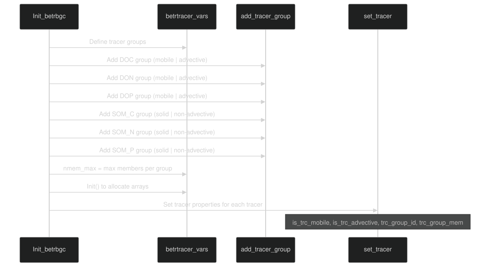
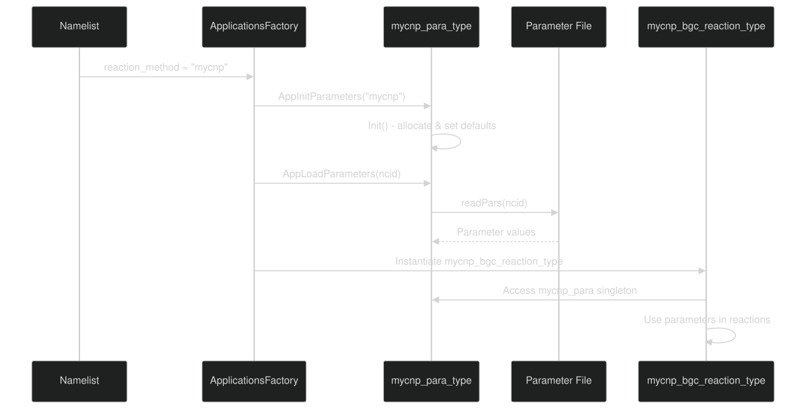

# Creating Custom BGC Models

Relevant source files

- [src/Applications/app_util/ApplicationsFactory.F90](https://github.com/jingtao-lbl/sbetr-resomv1/blob/72301c77/src/Applications/app_util/ApplicationsFactory.F90)
- [src/Applications/soil-farm/bgcfarm_util/BiogeoConType.F90](https://github.com/jingtao-lbl/sbetr-resomv1/blob/72301c77/src/Applications/soil-farm/bgcfarm_util/BiogeoConType.F90)
- [src/betr/betr_core/BGCReactionsMod.F90](https://github.com/jingtao-lbl/sbetr-resomv1/blob/72301c77/src/betr/betr_core/BGCReactionsMod.F90)
- [src/betr/betr_rxns/DIOCBGCReactionsType.F90](https://github.com/jingtao-lbl/sbetr-resomv1/blob/72301c77/src/betr/betr_rxns/DIOCBGCReactionsType.F90)
- [src/betr/betr_rxns/H2OIsotopeBGCReactionsType.F90](https://github.com/jingtao-lbl/sbetr-resomv1/blob/72301c77/src/betr/betr_rxns/H2OIsotopeBGCReactionsType.F90)
- [src/betr/betr_rxns/MockBGCReactionsType.F90](https://github.com/jingtao-lbl/sbetr-resomv1/blob/72301c77/src/betr/betr_rxns/MockBGCReactionsType.F90)
- [src/betr/betr_util/Tracer_varcon.F90](https://github.com/jingtao-lbl/sbetr-resomv1/blob/72301c77/src/betr/betr_util/Tracer_varcon.F90)
- [src/betr/betr_util/betr_ctrl.F90](https://github.com/jingtao-lbl/sbetr-resomv1/blob/72301c77/src/betr/betr_util/betr_ctrl.F90)
- [src/driver/shared/BeTRType.F90](https://github.com/jingtao-lbl/sbetr-resomv1/blob/72301c77/src/driver/shared/BeTRType.F90)

## Purpose and Scope

This page provides a practical guide for implementing a custom biogeochemical (BGC) model that integrates with BeTR's reactive transport framework. It covers the required interfaces, factory registration, tracer configuration, and parameter management needed to create a new pluggable BGC model.

For background on the plugin architecture and existing models, see [BGC Model Plugin System](#7.1) . For details on specific existing models like ECACNP or SIMIC, see [ECACNP Model](#7.3) and [SIMIC Model](#7.4) . For information about parameter management patterns, see [Parameter Management](#7.2) .

## BGC Model Plugin Architecture

The BeTR framework uses polymorphism and the factory pattern to enable runtime selection of BGC models without recompilation. The architecture consists of three key layers:

Sources:  [src/Applications/app_util/ApplicationsFactory.F90 1-370](https://github.com/jingtao-lbl/sbetr-resomv1/blob/72301c77/src/Applications/app_util/ApplicationsFactory.F90#L1-L370)  [src/betr/betr_core/BGCReactionsMod.F90 1-425](https://github.com/jingtao-lbl/sbetr-resomv1/blob/72301c77/src/betr/betr_core/BGCReactionsMod.F90#L1-L425)  [src/Applications/soil-farm/bgcfarm_util/BiogeoConType.F90 1-400](https://github.com/jingtao-lbl/sbetr-resomv1/blob/72301c77/src/Applications/soil-farm/bgcfarm_util/BiogeoConType.F90#L1-L400)

## Required Components

A complete BGC model implementation requires four components:

| Component | Purpose | Base Class/Module | Registration Location | 
| --- | --- | --- | --- |
| BGC Reaction Class | Implements biogeochemical reactions, tracer equilibration, boundary conditions | bgc_reaction_type | create_bgc_reaction_type() in ApplicationsFactory | 
| Plant-Soil BGC Class | Handles plant-soil nutrient coupling (can be minimal) | plant_soilbgc_type | create_plant_soilbgc_type() in ApplicationsFactory | 
| Parameter Class | Manages model parameters and initialization | BiogeoCon_type | AppLoadParameters() and AppInitParameters() | 
| Factory Registration | Enables runtime instantiation | N/A | Multiple procedures in ApplicationsFactory | 

Sources:  [src/Applications/app_util/ApplicationsFactory.F90 27-46](https://github.com/jingtao-lbl/sbetr-resomv1/blob/72301c77/src/Applications/app_util/ApplicationsFactory.F90#L27-L46)  [src/Applications/app_util/ApplicationsFactory.F90 50-115](https://github.com/jingtao-lbl/sbetr-resomv1/blob/72301c77/src/Applications/app_util/ApplicationsFactory.F90#L50-L115)  [src/Applications/app_util/ApplicationsFactory.F90 118-175](https://github.com/jingtao-lbl/sbetr-resomv1/blob/72301c77/src/Applications/app_util/ApplicationsFactory.F90#L118-L175)

## Step-by-Step Tutorial: Creating a Simple BGC Model

This tutorial walks through creating a minimal BGC model called "mycnp" that simulates carbon, nitrogen, and phosphorus cycling.

### Step 1: Create the BGC Reaction Type

Create a new file `src/Applications/mymodel/mycnpBGCReactionsType.F90` :

The class must extend `bgc_reaction_type` and implement all 16 deferred procedures.

Sources:  [src/betr/betr_core/BGCReactionsMod.F90 17-59](https://github.com/jingtao-lbl/sbetr-resomv1/blob/72301c77/src/betr/betr_core/BGCReactionsMod.F90#L17-L59)  [src/betr/betr_rxns/MockBGCReactionsType.F90 28-53](https://github.com/jingtao-lbl/sbetr-resomv1/blob/72301c77/src/betr/betr_rxns/MockBGCReactionsType.F90#L28-L53)

### Step 2: Define Model Tracers

In the `Init_betrbgc()` procedure, define your model's tracers:

Key steps:

Sources:  [src/betr/betr_rxns/MockBGCReactionsType.F90 174-288](https://github.com/jingtao-lbl/sbetr-resomv1/blob/72301c77/src/betr/betr_rxns/MockBGCReactionsType.F90#L174-L288)

### Step 3: Implement Boundary Conditions

In `init_boundary_condition_type()` and `set_boundary_conditions()` :

- `topbc_type(tracer_id)``bndcond_as_conc``bndcond_as_flux`= or
- `tracer_gwdif_concflux_top_col(c, 1:2, tracer_id)`= top boundary value(s)
- `bot_concflux_col(c, 1, tracer_id)`= bottom boundary value
- `condc_toplay_col(c, group_id)`= surface conductance for diffusion

Sources:  [src/betr/betr_rxns/MockBGCReactionsType.F90 123-152](https://github.com/jingtao-lbl/sbetr-resomv1/blob/72301c77/src/betr/betr_rxns/MockBGCReactionsType.F90#L123-L152)  [src/betr/betr_rxns/MockBGCReactionsType.F90 292-376](https://github.com/jingtao-lbl/sbetr-resomv1/blob/72301c77/src/betr/betr_rxns/MockBGCReactionsType.F90#L292-L376)

### Step 4: Implement Biogeochemical Reactions

In `calc_bgc_reaction()` , implement your reaction kinetics:

Key patterns:

- `tracerstate_vars%tracer_conc_mobile_col(c, j, tracer_id)`Access state via
- `biophysforc`Access environment via (temperature, moisture, etc.)
- `tracerflux_vars%tracer_flx_netpro_vr_col(c, j, tracer_id)`Store net changes in
- `tracer_conc_mobile += net_change`Update concentrations:

Sources:  [src/betr/betr_rxns/MockBGCReactionsType.F90 379-459](https://github.com/jingtao-lbl/sbetr-resomv1/blob/72301c77/src/betr/betr_rxns/MockBGCReactionsType.F90#L379-L459)

### Step 5: Create Parameter Type

Create `src/Applications/mymodel/mycnpParaType.F90` :

Key methods:

- `Init()`: Allocate arrays and set default values
- `readPars(ncid)`: Read parameters from NetCDF file
- `printPars()`: Print parameters for verification
- `deep_copy_bgc(mother)`: Copy parameters from another instance

Sources:  [src/Applications/soil-farm/bgcfarm_util/BiogeoConType.F90 8-74](https://github.com/jingtao-lbl/sbetr-resomv1/blob/72301c77/src/Applications/soil-farm/bgcfarm_util/BiogeoConType.F90#L8-L74)  [src/Applications/soil-farm/bgcfarm_util/BiogeoConType.F90 78-190](https://github.com/jingtao-lbl/sbetr-resomv1/blob/72301c77/src/Applications/soil-farm/bgcfarm_util/BiogeoConType.F90#L78-L190)

### Step 6: Create Plant-Soil BGC Type (Minimal)

Create `src/Applications/mymodel/mycnpPlantSoilBGCType.F90` :

Most models use a minimal implementation that extends `plant_soilbgc_type` and implements required methods with minimal functionality. This class handles plant-soil nutrient coupling if needed.

Sources:  [src/Applications/app_util/ApplicationsFactory.F90 118-175](https://github.com/jingtao-lbl/sbetr-resomv1/blob/72301c77/src/Applications/app_util/ApplicationsFactory.F90#L118-L175)

### Step 7: Register with Factory

Edit `src/Applications/app_util/ApplicationsFactory.F90` :

Sources:  [src/Applications/app_util/ApplicationsFactory.F90 50-115](https://github.com/jingtao-lbl/sbetr-resomv1/blob/72301c77/src/Applications/app_util/ApplicationsFactory.F90#L50-L115)  [src/Applications/app_util/ApplicationsFactory.F90 178-222](https://github.com/jingtao-lbl/sbetr-resomv1/blob/72301c77/src/Applications/app_util/ApplicationsFactory.F90#L178-L222)  [src/Applications/app_util/ApplicationsFactory.F90 226-275](https://github.com/jingtao-lbl/sbetr-resomv1/blob/72301c77/src/Applications/app_util/ApplicationsFactory.F90#L226-L275)

## Detailed Interface Reference

### Required Methods in bgc_reaction_type

The following table describes each deferred procedure that must be implemented:

| Method | Purpose | Key Responsibilities | 
| --- | --- | --- |
| Init_betrbgc | Initialize BGC model | Define tracers, allocate arrays, read namelist | 
| calc_bgc_reaction | Compute reactions | Apply reaction kinetics, update states and fluxes | 
| set_boundary_conditions | Set BC values | Assign atmospheric/groundwater boundary values | 
| init_boundary_condition_type | Set BC types | Specify concentration vs. flux BCs | 
| do_tracer_equilibration | Phase equilibration | Equilibrate gas-aqueous-solid phases | 
| initCold | Cold start initialization | Set initial tracer concentrations | 
| retrieve_biogeoflux | Extract fluxes | Copy model fluxes to output structure | 
| retrieve_lnd2atm | Land-atmosphere flux | Extract surface fluxes for atmosphere | 
| set_kinetics_par | Update kinetics | Set plant nutrient uptake parameters | 
| retrieve_biostates | Extract states | Copy model states to output structure | 
| debug_info | Debug output | Print diagnostic information | 
| set_bgc_spinup | Configure spinup | Adjust for accelerated spinup | 
| UpdateParas | Update parameters | Apply parameter changes during run | 
| init_iP_prof | Initialize P profile | Set initial inorganic phosphorus (if applicable) | 
| reset_biostates | Reset states | Reset states during restart | 
| SetParCols | Set parameter columns | Configure spatially-varying parameters | 

Sources:  [src/betr/betr_core/BGCReactionsMod.F90 61-421](https://github.com/jingtao-lbl/sbetr-resomv1/blob/72301c77/src/betr/betr_core/BGCReactionsMod.F90#L61-L421)

## Tracer Configuration Details

### Tracer Groups and Properties

Tracers are organized into groups with shared transport properties:

Common tracer property patterns:

| Tracer Type | is_trc_mobile | is_trc_advective | is_trc_volatile | Example | 
| --- | --- | --- | --- | --- |
| Dissolved solute | true | true | false | DOC, DON, NO3- | 
| Volatile gas | true | true | true | CO2, CH4, O2 | 
| Solid organic matter | false | false | false | SOM, litter | 
| Adsorbing solute | true | true | false (adsorbing=true) | NH4+ | 

Sources:  [src/betr/betr_rxns/MockBGCReactionsType.F90 209-288](https://github.com/jingtao-lbl/sbetr-resomv1/blob/72301c77/src/betr/betr_rxns/MockBGCReactionsType.F90#L209-L288)

### Tracer State Access Patterns

Sources:  [src/betr/betr_rxns/MockBGCReactionsType.F90 426-458](https://github.com/jingtao-lbl/sbetr-resomv1/blob/72301c77/src/betr/betr_rxns/MockBGCReactionsType.F90#L426-L458)

## Parameter Management Patterns

### Parameter Initialization Sequence

Key patterns:

- `type(mycnp_para_type), public :: mycnp_para`Create a module-level singleton:
- `Init()`In , allocate arrays and set scientifically reasonable defaults
- `readPars()``ncd_io()``ncdio_pio`In , read from NetCDF using from module
- `readv=.false.`Parameters marked will use defaults if not in file

Sources:  [src/Applications/app_util/ApplicationsFactory.F90 226-275](https://github.com/jingtao-lbl/sbetr-resomv1/blob/72301c77/src/Applications/app_util/ApplicationsFactory.F90#L226-L275)  [src/Applications/soil-farm/bgcfarm_util/BiogeoConType.F90 194-301](https://github.com/jingtao-lbl/sbetr-resomv1/blob/72301c77/src/Applications/soil-farm/bgcfarm_util/BiogeoConType.F90#L194-L301)

### NetCDF Parameter File Format

Parameters are stored in NetCDF files with specific variable names. Example parameter read pattern:

Sources:  [src/Applications/soil-farm/bgcfarm_util/BiogeoConType.F90 215-300](https://github.com/jingtao-lbl/sbetr-resomv1/blob/72301c77/src/Applications/soil-farm/bgcfarm_util/BiogeoConType.F90#L215-L300)

## Testing Your Custom Model

### Configuration Steps

### Running Your Model

### Debug Output

Enable debug output in your model:

Sources:  [src/driver/shared/BeTRType.F90 401-408](https://github.com/jingtao-lbl/sbetr-resomv1/blob/72301c77/src/driver/shared/BeTRType.F90#L401-L408)  [src/betr/betr_rxns/MockBGCReactionsType.F90 438-456](https://github.com/jingtao-lbl/sbetr-resomv1/blob/72301c77/src/betr/betr_rxns/MockBGCReactionsType.F90#L438-L456)

## Common Implementation Patterns

### Pattern 1: Temperature-Dependent Rates

Access temperature: `biophysforc%t_soisno_col(c, j)` (soil/snow temperature in K)

### Pattern 2: Moisture Limitation

Access water content: `biophysforc%h2osoi_liq_col(c, j)` and `biophysforc%h2osoi_ice_col(c, j)`

Calculate water-filled pore space (WFPS) for anaerobic/aerobic reactions.

### Pattern 3: Vertical Integration

Loop over layers from top ( `jtops(c)` ) to bottom ( `col%lbots(c)` ):

Sources:  [src/betr/betr_rxns/MockBGCReactionsType.F90 449-457](https://github.com/jingtao-lbl/sbetr-resomv1/blob/72301c77/src/betr/betr_rxns/MockBGCReactionsType.F90#L449-L457)

## Advanced Topics

### Spatially-Varying Parameters

For parameters that vary by column (e.g., soil order-specific):

Sources:  [src/Applications/app_util/ApplicationsFactory.F90 316-368](https://github.com/jingtao-lbl/sbetr-resomv1/blob/72301c77/src/Applications/app_util/ApplicationsFactory.F90#L316-L368)

### Tracer Equilibration

For tracers with multiple phases (gas-aqueous-solid), implement `do_tracer_equilibration()` :

- `tracercoeff_vars`Use partition coefficients from
- Redistribute total tracer mass among phases
- Conserve total mass

Sources:  [src/betr/betr_rxns/MockBGCReactionsType.F90 462-518](https://github.com/jingtao-lbl/sbetr-resomv1/blob/72301c77/src/betr/betr_rxns/MockBGCReactionsType.F90#L462-L518)

### Adaptive Time-Stepping

For stiff reaction systems, use sub-stepping within `calc_bgc_reaction()` :

- Check for negative concentrations
- Reduce timestep if needed
- [ODE Integrators](#6.1)Use ODE integrators from BeTR's numerical library (see )

## Complete Example: Minimal Working Model

Here is a minimal but complete example showing the essential structure:

Sources:  [src/betr/betr_rxns/MockBGCReactionsType.F90 1-598](https://github.com/jingtao-lbl/sbetr-resomv1/blob/72301c77/src/betr/betr_rxns/MockBGCReactionsType.F90#L1-L598)

## Summary Checklist

Before compiling your custom model, verify:

- `*BGCReactionsType.F90``bgc_reaction_type`Created extending
- Implemented all 16 required deferred procedures
- `Init_betrbgc()``add_tracer_group()``set_tracer()`Defined tracers in using and
- `*PlantSoilBGCType.F90``plant_soilbgc_type`Created extending
- `*ParaType.F90``BiogeoCon_type`Created extending with parameter definitions
- `ApplicationsFactory.F90`Registered model in (5 locations)
- Created NetCDF parameter file (if using file-based parameters)
- `reaction_method = "yourmodel"`Created test namelist with
- Verified mass balance in reactions
- Tested with debug output enabled

Sources:  [src/Applications/app_util/ApplicationsFactory.F90 1-370](https://github.com/jingtao-lbl/sbetr-resomv1/blob/72301c77/src/Applications/app_util/ApplicationsFactory.F90#L1-L370)  [src/betr/betr_core/BGCReactionsMod.F90 1-425](https://github.com/jingtao-lbl/sbetr-resomv1/blob/72301c77/src/betr/betr_core/BGCReactionsMod.F90#L1-L425)