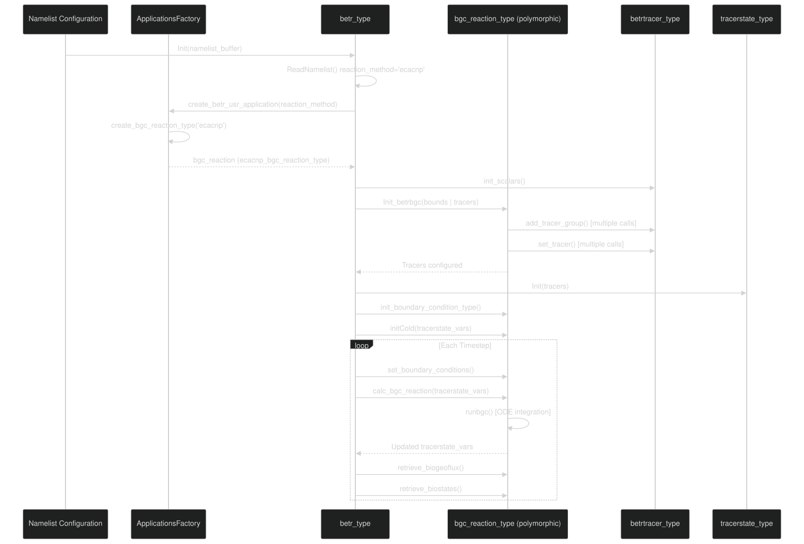

# BGC Models

Relevant source files

- [src/Applications/app_util/ApplicationsFactory.F90](https://github.com/jingtao-lbl/sbetr-resomv1/blob/72301c77/src/Applications/app_util/ApplicationsFactory.F90)
- [src/Applications/soil-farm/bgcfarm_util/BiogeoConType.F90](https://github.com/jingtao-lbl/sbetr-resomv1/blob/72301c77/src/Applications/soil-farm/bgcfarm_util/BiogeoConType.F90)
- [src/betr/betr_core/BGCReactionsMod.F90](https://github.com/jingtao-lbl/sbetr-resomv1/blob/72301c77/src/betr/betr_core/BGCReactionsMod.F90)
- [src/betr/betr_rxns/DIOCBGCReactionsType.F90](https://github.com/jingtao-lbl/sbetr-resomv1/blob/72301c77/src/betr/betr_rxns/DIOCBGCReactionsType.F90)
- [src/betr/betr_rxns/H2OIsotopeBGCReactionsType.F90](https://github.com/jingtao-lbl/sbetr-resomv1/blob/72301c77/src/betr/betr_rxns/H2OIsotopeBGCReactionsType.F90)
- [src/betr/betr_rxns/MockBGCReactionsType.F90](https://github.com/jingtao-lbl/sbetr-resomv1/blob/72301c77/src/betr/betr_rxns/MockBGCReactionsType.F90)
- [src/betr/betr_util/Tracer_varcon.F90](https://github.com/jingtao-lbl/sbetr-resomv1/blob/72301c77/src/betr/betr_util/Tracer_varcon.F90)
- [src/betr/betr_util/betr_ctrl.F90](https://github.com/jingtao-lbl/sbetr-resomv1/blob/72301c77/src/betr/betr_util/betr_ctrl.F90)
- [src/driver/shared/BeTRType.F90](https://github.com/jingtao-lbl/sbetr-resomv1/blob/72301c77/src/driver/shared/BeTRType.F90)

## Purpose and Scope

This page provides an overview of the biogeochemical (BGC) models available in BeTR and the plugin architecture that enables their extensibility. BGC models define the biogeochemical reactions that transform soil carbon, nitrogen, phosphorus, and other tracers during each simulation timestep.

For detailed information about specific aspects of BGC models, see:

- [BGC Model Plugin System](#7.1)- Architecture details and factory pattern implementation
- [Parameter Management](#7.2)- How BGC models load and manage parameters
- [ECACNP Model](#7.3)[SIMIC Model](#7.4)[V1ECA Model](#7.5)[Other BGC Models](#7.6), , , - Model-specific documentation
- [Creating Custom BGC Models](#7.7)- Tutorial for implementing new models

## BGC Model Plugin Architecture

BeTR uses a plugin architecture based on Fortran polymorphism that allows BGC models to be selected at runtime without recompiling the code. All BGC models extend the abstract `bgc_reaction_type` base class and implement a standard interface for initialization, boundary condition setting, tracer equilibration, and biogeochemical reaction calculations.

### Class Hierarchy

Sources:  [src/betr/betr_core/BGCReactionsMod.F90 1-430](https://github.com/jingtao-lbl/sbetr-resomv1/blob/72301c77/src/betr/betr_core/BGCReactionsMod.F90#L1-L430)  [src/Applications/app_util/ApplicationsFactory.F90 50-115](https://github.com/jingtao-lbl/sbetr-resomv1/blob/72301c77/src/Applications/app_util/ApplicationsFactory.F90#L50-L115)

### Factory Pattern Implementation

BGC models are instantiated using the factory pattern through `ApplicationsFactory` . The factory selects the appropriate concrete model class based on the `reaction_method` string specified in the configuration.

Sources:  [src/Applications/app_util/ApplicationsFactory.F90 27-115](https://github.com/jingtao-lbl/sbetr-resomv1/blob/72301c77/src/Applications/app_util/ApplicationsFactory.F90#L27-L115)  [src/driver/shared/BeTRType.F90 184-186](https://github.com/jingtao-lbl/sbetr-resomv1/blob/72301c77/src/driver/shared/BeTRType.F90#L184-L186)

## Available BGC Models

BeTR provides several BGC models for different scientific applications. The models vary in complexity, from simple test models to comprehensive C-N-P cycling models with microbial dynamics.

| Model Name | reaction_method | Description | Active Soil BGC | BGC Type | 
| --- | --- | --- | --- | --- |
| ECACNP | 'ecacnp' or 'ecacnp_mosart' | Full C-N-P cycling with ECA nutrient competition, nitrification, denitrification | Yes | type2_bgc | 
| RESOM | 'resom' | Reaction-based Soil Organic Matter model | Yes | Default | 
| V1ECA | 'v1eca' | Version 1 ECA model with enzymatic carbon assimilation | Yes | type1_bgc | 
| KECA | 'keca' | K-theory based ECA model | Yes | Default | 
| SIMIC | 'simic' | Soil Microbial-Mineral Carbon dynamics model | Yes | Default | 
| CH4SOIL | 'ch4soil' | Methane production/consumption in soil | Yes | Default | 
| CDOM | 'cdom' or 'cdom_mosart' | Colored Dissolved Organic Matter model | Yes | Default | 
| Mock | 'mock_run' | Simple test model for development/validation | No | Default | 

Sources:  [src/Applications/app_util/ApplicationsFactory.F90 83-103](https://github.com/jingtao-lbl/sbetr-resomv1/blob/72301c77/src/Applications/app_util/ApplicationsFactory.F90#L83-L103)

### Model Categories

BGC models in BeTR can be categorized by complexity and scientific focus:

- **Comprehensive C-N-P Models**: ECACNP provides full carbon-nitrogen-phosphorus cycling with competitive nutrient uptake
- **Microbial Models**: SIMIC focuses on microbial-mineral interactions and soil organic matter formation
- **Specialized Models**: CH4SOIL for methane biogeochemistry, CDOM for dissolved organic matter
- **Development Models**: Mock and test implementations for validating the transport infrastructure

## BGC Model Lifecycle

The lifecycle of a BGC model during a BeTR simulation follows a well-defined sequence from instantiation through repeated reaction calculations.

Sources:  [src/driver/shared/BeTRType.F90 153-222](https://github.com/jingtao-lbl/sbetr-resomv1/blob/72301c77/src/driver/shared/BeTRType.F90#L153-L222)  [src/driver/shared/BeTRType.F90 309-435](https://github.com/jingtao-lbl/sbetr-resomv1/blob/72301c77/src/driver/shared/BeTRType.F90#L309-L435)

### Initialization Phase

During initialization, the BGC model:

Sources:  [src/betr/betr_rxns/MockBGCReactionsType.F90 174-289](https://github.com/jingtao-lbl/sbetr-resomv1/blob/72301c77/src/betr/betr_rxns/MockBGCReactionsType.F90#L174-L289)

### Timestep Phase

During each simulation timestep, the BGC model:

Sources:  [src/driver/shared/BeTRType.F90 309-435](https://github.com/jingtao-lbl/sbetr-resomv1/blob/72301c77/src/driver/shared/BeTRType.F90#L309-L435)

## Key Abstract Interfaces

The `bgc_reaction_type` abstract base class defines 14 deferred procedures that all concrete BGC models must implement. These interfaces ensure consistent behavior and allow the core BeTR engine to work with any BGC model without knowing its specific implementation.

### Critical Interface Methods

| Method | Purpose | Called By | Timing | 
| --- | --- | --- | --- |
| Init_betrbgc | Define tracers, initialize model | betr_type%Init() | Once at startup | 
| init_boundary_condition_type | Set BC types (conc vs flux) | betr_type%Init() | Once at startup | 
| initCold | Set initial tracer concentrations | betr_type%Init() | Once at startup | 
| set_boundary_conditions | Update atmospheric BCs | stage_tracer_transport() | Every timestep | 
| calc_bgc_reaction | Compute biogeochemical reactions | step_without_drainage() | Every timestep | 
| do_tracer_equilibration | Phase equilibration (gas/aqueous/solid) | Transport routines | Every timestep | 
| retrieve_biogeoflux | Extract fluxes for output/coupling | betr_type%retrieve_biofluxes() | Every timestep | 
| retrieve_biostates | Extract states for output/coupling | betr_type%retrieve_biostates() | Every timestep | 
| set_kinetics_par | Update plant nutrient kinetics | step_without_drainage() | Every timestep (if active) | 

Sources:  [src/betr/betr_core/BGCReactionsMod.F90 17-59](https://github.com/jingtao-lbl/sbetr-resomv1/blob/72301c77/src/betr/betr_core/BGCReactionsMod.F90#L17-L59)  [src/betr/betr_core/BGCReactionsMod.F90 61-430](https://github.com/jingtao-lbl/sbetr-resomv1/blob/72301c77/src/betr/betr_core/BGCReactionsMod.F90#L61-L430)

### Example: Mock BGC Model Implementation

The mock BGC model provides a minimal but complete implementation showing how to satisfy the abstract interface:

Sources:  [src/betr/betr_rxns/MockBGCReactionsType.F90 174-289](https://github.com/jingtao-lbl/sbetr-resomv1/blob/72301c77/src/betr/betr_rxns/MockBGCReactionsType.F90#L174-L289)  [src/betr/betr_rxns/MockBGCReactionsType.F90 292-376](https://github.com/jingtao-lbl/sbetr-resomv1/blob/72301c77/src/betr/betr_rxns/MockBGCReactionsType.F90#L292-L376)  [src/betr/betr_rxns/MockBGCReactionsType.F90 379-459](https://github.com/jingtao-lbl/sbetr-resomv1/blob/72301c77/src/betr/betr_rxns/MockBGCReactionsType.F90#L379-L459)

## BGC Model Parameter System

Each BGC model has an associated parameter type that extends `BiogeoCon_type` (or defines its own parameter structure). Parameters are loaded from NetCDF files and can be customized per simulation or even per grid column.

### Parameter Type Hierarchy

Sources:  [src/Applications/soil-farm/bgcfarm_util/BiogeoConType.F90 1-400](https://github.com/jingtao-lbl/sbetr-resomv1/blob/72301c77/src/Applications/soil-farm/bgcfarm_util/BiogeoConType.F90#L1-L400)

### Parameter Loading Workflow

Parameters are loaded through a centralized workflow in `ApplicationsFactory` :

Sources:  [src/Applications/app_util/ApplicationsFactory.F90 178-369](https://github.com/jingtao-lbl/sbetr-resomv1/blob/72301c77/src/Applications/app_util/ApplicationsFactory.F90#L178-L369)

## Model Selection and Configuration

BGC models are selected by setting the `reaction_method` parameter in the BeTR namelist configuration. The choice of model depends on:

- **Scientific objectives**: What biogeochemical processes need to be represented?
- **Available parameters**: Do you have calibrated parameters for the model?
- **Computational cost**: More complex models require more computation
- **Tracer count**: Models define different numbers of tracers (5 for mock, 40+ for ECACNP)

### Configuration Example

In the BeTR namelist file:

The `reaction_method` string is read in [src/driver/shared/BeTRType.F90 238-306](https://github.com/jingtao-lbl/sbetr-resomv1/blob/72301c77/src/driver/shared/BeTRType.F90#L238-L306) and passed to `ApplicationsFactory` for model instantiation.

### Switching Between Models

To switch between BGC models:

Sources:  [src/Applications/app_util/ApplicationsFactory.F90 27-46](https://github.com/jingtao-lbl/sbetr-resomv1/blob/72301c77/src/Applications/app_util/ApplicationsFactory.F90#L27-L46)  [src/betr/betr_util/Tracer_varcon.F90 42-65](https://github.com/jingtao-lbl/sbetr-resomv1/blob/72301c77/src/betr/betr_util/Tracer_varcon.F90#L42-L65)

## Integration with BeTR Core

BGC models integrate tightly with the BeTR transport engine through the `betr_type` orchestrator class. The key integration points are:

Sources:  [src/driver/shared/BeTRType.F90 44-106](https://github.com/jingtao-lbl/sbetr-resomv1/blob/72301c77/src/driver/shared/BeTRType.F90#L44-L106)  [src/driver/shared/BeTRType.F90 309-435](https://github.com/jingtao-lbl/sbetr-resomv1/blob/72301c77/src/driver/shared/BeTRType.F90#L309-L435)

For implementation details of specific models, see their dedicated pages ( [ECACNP](#7.3) , [SIMIC](#7.4) , [V1ECA](#7.5) , [Others](#7.6) ). To create a custom BGC model, follow the tutorial in [Creating Custom BGC Models](#7.7) .