# Jarmodel Architecture

Relevant source files

- [src/betr/betr_math/LinearAlgebraMod.F90](https://github.com/jingtao-lbl/sbetr-resomv1/blob/72301c77/src/betr/betr_math/LinearAlgebraMod.F90)
- [src/io_util/histMod.F90](https://github.com/jingtao-lbl/sbetr-resomv1/blob/72301c77/src/io_util/histMod.F90)
- [src/io_util/ncdio_pio.F90](https://github.com/jingtao-lbl/sbetr-resomv1/blob/72301c77/src/io_util/ncdio_pio.F90)
- [src/jarmodel/driver/jarmodel.F90](https://github.com/jingtao-lbl/sbetr-resomv1/blob/72301c77/src/jarmodel/driver/jarmodel.F90)
- [src/jarmodel/forcing/CMakeLists.txt](https://github.com/jingtao-lbl/sbetr-resomv1/blob/72301c77/src/jarmodel/forcing/CMakeLists.txt)
- [src/jarmodel/forcing/SetJarForcMod.F90](https://github.com/jingtao-lbl/sbetr-resomv1/blob/72301c77/src/jarmodel/forcing/SetJarForcMod.F90)
- [templates/reaction.1d.sbetr.nl](https://github.com/jingtao-lbl/sbetr-resomv1/blob/72301c77/templates/reaction.1d.sbetr.nl)
- [templates/reaction.jar.sbetr.nl](https://github.com/jingtao-lbl/sbetr-resomv1/blob/72301c77/templates/reaction.jar.sbetr.nl)

## Purpose and Scope

This document explains the jarmodel executable architecture, which provides a simplified single-layer mode for testing and calibrating BeTR's biogeochemical (BGC) models. Jarmodel bypasses BeTR's multi-layer transport system to enable rapid testing of BGC reaction dynamics in isolation. This mode is particularly useful for parameter calibration, sensitivity analysis, and validating BGC model implementations before integrating them into full column-scale simulations.

For information about full column-scale simulations with transport, see [Simulation Modes](#3.1) . For BGC model development and integration, see [BGC Model Plugin System](#7.1) .

Sources : [src/jarmodel/driver/jarmodel.F90 1-208](https://github.com/jingtao-lbl/sbetr-resomv1/blob/72301c77/src/jarmodel/driver/jarmodel.F90#L1-L208)  [templates/reaction.jar.sbetr.nl 1-18](https://github.com/jingtao-lbl/sbetr-resomv1/blob/72301c77/templates/reaction.jar.sbetr.nl#L1-L18)

## Overview and Use Cases

Jarmodel represents a "jar experiment" simulation where BGC processes occur in a single, well-mixed soil layer without spatial transport. This abstraction enables:

- **Rapid parameter calibration**: Test parameter values without expensive multi-layer transport calculations
- **Model validation**: Verify BGC model implementations against analytical solutions or laboratory data
- **Sensitivity analysis**: Explore how environmental conditions affect BGC dynamics
- **Educational demonstrations**: Illustrate biogeochemical processes in a simplified context

Unlike the full `sbetr` executable which handles multi-layer soil profiles with transport, `jarmodel` focuses exclusively on the temporal evolution of biogeochemical state variables in response to environmental forcing.

Sources : [src/jarmodel/driver/jarmodel.F90 43-45](https://github.com/jingtao-lbl/sbetr-resomv1/blob/72301c77/src/jarmodel/driver/jarmodel.F90#L43-L45)

## Core Architecture Components

The jarmodel system consists of four primary components that interact to simulate single-layer BGC dynamics:

Sources : [src/jarmodel/driver/jarmodel.F90 48-207](https://github.com/jingtao-lbl/sbetr-resomv1/blob/72301c77/src/jarmodel/driver/jarmodel.F90#L48-L207)  [src/jarmodel/forcing/SetJarForcMod.F90 1-245](https://github.com/jingtao-lbl/sbetr-resomv1/blob/72301c77/src/jarmodel/forcing/SetJarForcMod.F90#L1-L245)

## Key Type Definitions

### jar_model_type

The `jar_model_type` is an abstract base class that defines the interface for BGC models running in jar mode. Concrete BGC model implementations (ECACNP, SIMIC, V1ECA, etc.) extend this type.

Key methods :

- `init()`: Initialize the model with parameters
- `UpdateParas()`: Update model parameters
- `runbgc()`: Execute BGC reactions for one timestep
- `getvarllen()`: Get number of output variables
- `getvarlist()`: Get output variable names and units
- `init_cold()`: Cold start initialization of state variables

Sources : [src/jarmodel/driver/jarmodel.F90 49-50](https://github.com/jingtao-lbl/sbetr-resomv1/blob/72301c77/src/jarmodel/driver/jarmodel.F90#L49-L50)

### JarBGC_forc_type

This type consolidates all forcing data needed by BGC models in jar mode:

| Field Category | Examples | Units | 
| --- | --- | --- |
| Environmental | temp, h2osoi_vol, air_vol, soilpsi | K, m³/m³, MPa | 
| Soil Properties | bd, pct_sand, pct_clay, pH, dzsoi | kg/m³, %, -, m | 
| Organic Matter Inputs | cflx_input_litr_met, cflx_input_litr_cel | g C/m²/s | 
| Nutrient Inputs | sflx_minn_input_nh4, sflx_minp_input_po4 | g N/m²/s, g P/m²/s | 
| Atmospheric Concentrations | conc_atm_co2, conc_atm_o2, conc_atm_n2 | mol/m³ | 
| Phase Conversion Coefficients | o2_w2b, o2_g2b, bunsen_o2 | - | 
| State Variables | ystates(:) | various | 

Sources : [src/jarmodel/forcing/SetJarForcMod.F90 22-97](https://github.com/jingtao-lbl/sbetr-resomv1/blob/72301c77/src/jarmodel/forcing/SetJarForcMod.F90#L22-L97)

## Execution Flow

The jarmodel execution follows a streamlined initialization-loop-finalize pattern:

Sources : [src/jarmodel/driver/jarmodel.F90 122-207](https://github.com/jingtao-lbl/sbetr-resomv1/blob/72301c77/src/jarmodel/driver/jarmodel.F90#L122-L207)

## Forcing Data Preparation

The forcing system transforms external input data into the format required by BGC models. This involves two stages: constant forcing (loaded once) and transient forcing (updated each timestep).

### SetJarForc Interface

The `SetJarForc` subroutine has two overloaded implementations:

Constant Forcing ( `SetJarForc_const` ):

Transient Forcing ( `SetJarForc_transient` ):

### Phase Conversion Calculations

Jarmodel computes gas-aqueous-solid phase partitioning coefficients during forcing preparation:

Temperature-dependent Henry's law constants (dimensionless):

- `1.3e-3 * exp(-1500 * (1/T - 1/298.15))`O₂:
- `2.5e-2 * exp(-2600 * (1/T - 1/298.15))`N₂O:
- `6.1e-4 * exp(-1300 * (1/T - 1/298.15))`N₂:

Bunsen coefficients relate dissolved to gas-phase concentrations:

- `bunsen = henry * T / 12.2`

Phase conversion factors :

- `o2_w2b = air_vol/bunsen_o2 + h2osoi_liqvol`
- `o2_g2b = air_vol + h2osoi_liqvol*bunsen_o2`

Sources : [src/jarmodel/forcing/SetJarForcMod.F90 144-243](https://github.com/jingtao-lbl/sbetr-resomv1/blob/72301c77/src/jarmodel/forcing/SetJarForcMod.F90#L144-L243)

## Comparison with Column-Mode BeTR

Jarmodel differs fundamentally from the full `sbetr` column-mode simulations:

| Aspect | Jarmodel | Column-Mode BeTR | 
| --- | --- | --- |
| Executable | jarmodel | sbetr | 
| Spatial Dimension | Single layer (0D) | Multi-layer profile (1D) | 
| Transport Processes | None | Diffusion, advection, ebullition, solid transport | 
| Main Loop | Direct BGC execution | Transport-reaction splitting | 
| Driver Type | jar_model_type | betr_type | 
| Forcing Type | JarBGC_forc_type | betr_biogeophys_input_type | 
| Time-stepping | Fixed BGC timestep | Adaptive transport + BGC timestep | 
| Primary Use Case | Parameter calibration, testing | Scientific simulations, predictions | 
| Computational Cost | Very low | Moderate to high | 
| Output Focus | BGC state evolution | Vertical profiles, fluxes | 

### Architecture Comparison

Key architectural difference : Jarmodel directly invokes `runbgc()` on the BGC model, while column-mode BeTR embeds BGC reactions within the `calc_bgc_reaction()` phase of a complex transport-reaction operator splitting scheme.

Sources : [src/jarmodel/driver/jarmodel.F90 189-190](https://github.com/jingtao-lbl/sbetr-resomv1/blob/72301c77/src/jarmodel/driver/jarmodel.F90#L189-L190)

## BGC Model Integration

Any BGC model that implements the `jar_model_type` interface can run in jarmodel. The factory pattern enables runtime selection:

### Supported BGC Models

From the namelist parameter `jarmodel_name` , the following models are available:

- **`'ecacnp'`**[ECACNP Model](#7.3): Full C-N-P cycling with ECA competition (see )
- **`'simic'`**[SIMIC Model](#7.4): Microbial-mineral carbon dynamics (see )
- **`'v1eca'`**[V1ECA Model](#7.5): Enzymatic carbon assimilation with P dynamics (see )
- **`'keca'`**: Kinetic ECA model variant
- **`'resom'`**: Reactive SOM model

### Runtime Model Selection

Sources : [src/jarmodel/driver/jarmodel.F90 124-125](https://github.com/jingtao-lbl/sbetr-resomv1/blob/72301c77/src/jarmodel/driver/jarmodel.F90#L124-L125)

### Stress Control

Jarmodel namelists can disable nutrient limitations to test carbon cycling in isolation:

These flags set `jarpars%non_limit` and `jarpars%nop_limit` to disable nutrient competition in models that support it.

Sources : [src/jarmodel/driver/jarmodel.F90 129](https://github.com/jingtao-lbl/sbetr-resomv1/blob/72301c77/src/jarmodel/driver/jarmodel.F90#L129-L129)  [templates/reaction.jar.sbetr.nl 3-4](https://github.com/jingtao-lbl/sbetr-resomv1/blob/72301c77/templates/reaction.jar.sbetr.nl#L3-L4)

## History Output System

Jarmodel reuses BeTR's `histf_type` for flexible time-series output. The history system supports multiple output frequencies:

### Output Frequency Configuration

| Frequency | Namelist Value | Typical Use | 
| --- | --- | --- |
| Hourly | 'hour' | High-resolution dynamics | 
| Daily | 'day' | Standard output (default) | 
| Weekly | 'week' | Reduced output volume | 
| Monthly | 'month' | Long-term patterns | 
| Yearly | 'year' | Climate-scale averages | 

The `hist_freq` parameter in the `jar_driver` namelist controls output frequency:

### Variable Management

BGC models declare output variables through the `getvarlist()` method, which returns:

- Variable names (up to 40 characters)
- Units (up to 16 characters)
- `var_state_type``var_flux_type`Variable types ( or )

The history system automatically:

- **Accumulates**values each timestep
- **Averages**state variables by counting timesteps
- **Averages**flux variables by total time duration
- **Writes**to NetCDF when frequency threshold reached

Sources : [src/jarmodel/driver/jarmodel.F90 146-167](https://github.com/jingtao-lbl/sbetr-resomv1/blob/72301c77/src/jarmodel/driver/jarmodel.F90#L146-L167)  [src/io_util/histMod.F90 423-462](https://github.com/jingtao-lbl/sbetr-resomv1/blob/72301c77/src/io_util/histMod.F90#L423-L462)

## Namelist Configuration

Jarmodel uses a simplified namelist structure compared to full BeTR simulations:

### Required Namelist Sections

`&jar_driver` - Model selection and output control:

`&betr_time` - Time control:

`&forcing_inparm` - Forcing data:

### Output File Naming

History files follow the pattern:

For example: `jarmodel.exp1.ecacnp.hist.day.nc`

Sources : [templates/reaction.jar.sbetr.nl 1-18](https://github.com/jingtao-lbl/sbetr-resomv1/blob/72301c77/templates/reaction.jar.sbetr.nl#L1-L18)  [src/jarmodel/driver/jarmodel.F90 106-107](https://github.com/jingtao-lbl/sbetr-resomv1/blob/72301c77/src/jarmodel/driver/jarmodel.F90#L106-L107)

## Data Flow Through Jarmodel

The complete data flow from input files to BGC execution to output:

Sources : [src/jarmodel/driver/jarmodel.F90 169-207](https://github.com/jingtao-lbl/sbetr-resomv1/blob/72301c77/src/jarmodel/driver/jarmodel.F90#L169-L207)  [src/jarmodel/forcing/SetJarForcMod.F90 22-97](https://github.com/jingtao-lbl/sbetr-resomv1/blob/72301c77/src/jarmodel/forcing/SetJarForcMod.F90#L22-L97)

## Summary

Jarmodel provides a streamlined execution path for BGC model testing by:

This architecture makes jarmodel ideal for rapid iteration during model development, parameter calibration against laboratory experiments, and educational demonstrations of biogeochemical dynamics.

Sources : [src/jarmodel/driver/jarmodel.F90 1-208](https://github.com/jingtao-lbl/sbetr-resomv1/blob/72301c77/src/jarmodel/driver/jarmodel.F90#L1-L208)  [src/jarmodel/forcing/SetJarForcMod.F90 1-245](https://github.com/jingtao-lbl/sbetr-resomv1/blob/72301c77/src/jarmodel/forcing/SetJarForcMod.F90#L1-L245)  [src/jarmodel/forcing/CMakeLists.txt 1-38](https://github.com/jingtao-lbl/sbetr-resomv1/blob/72301c77/src/jarmodel/forcing/CMakeLists.txt#L1-L38)