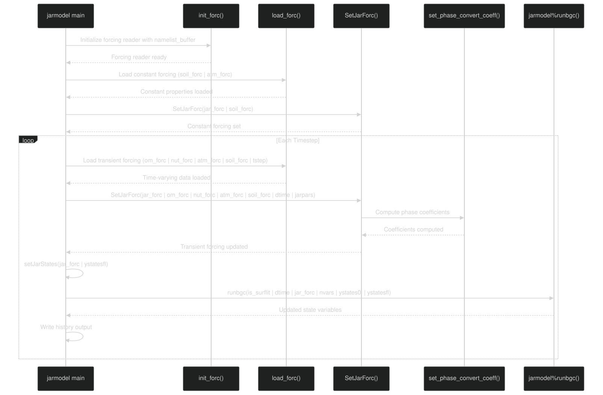

# Forcing Data for Jarmodel

Relevant source files

- [src/betr/betr_math/LinearAlgebraMod.F90](https://github.com/jingtao-lbl/sbetr-resomv1/blob/72301c77/src/betr/betr_math/LinearAlgebraMod.F90)
- [src/io_util/histMod.F90](https://github.com/jingtao-lbl/sbetr-resomv1/blob/72301c77/src/io_util/histMod.F90)
- [src/io_util/ncdio_pio.F90](https://github.com/jingtao-lbl/sbetr-resomv1/blob/72301c77/src/io_util/ncdio_pio.F90)
- [src/jarmodel/driver/jarmodel.F90](https://github.com/jingtao-lbl/sbetr-resomv1/blob/72301c77/src/jarmodel/driver/jarmodel.F90)
- [src/jarmodel/forcing/CMakeLists.txt](https://github.com/jingtao-lbl/sbetr-resomv1/blob/72301c77/src/jarmodel/forcing/CMakeLists.txt)
- [src/jarmodel/forcing/SetJarForcMod.F90](https://github.com/jingtao-lbl/sbetr-resomv1/blob/72301c77/src/jarmodel/forcing/SetJarForcMod.F90)
- [templates/reaction.1d.sbetr.nl](https://github.com/jingtao-lbl/sbetr-resomv1/blob/72301c77/templates/reaction.1d.sbetr.nl)
- [templates/reaction.jar.sbetr.nl](https://github.com/jingtao-lbl/sbetr-resomv1/blob/72301c77/templates/reaction.jar.sbetr.nl)

## Purpose and Scope

This page documents the environmental forcing data system used by the jarmodel executable for single-layer biogeochemical simulations. It covers the data structures that contain forcing variables, how forcing data is loaded from NetCDF input files, and how environmental conditions are passed to BGC models. For information about the jarmodel architecture itself, see [Jarmodel Architecture](#8.1) . For jarmodel configuration and output, see [Jarmodel Configuration and Output](#8.3) .

## Overview

Jarmodel requires environmental forcing data to drive biogeochemical reactions. Unlike column-mode simulations that receive forcing from a land surface model, jarmodel reads forcing data directly from NetCDF files. The forcing system separates data into four categories:

- **Soil forcing**: Physical properties and state variables (temperature, moisture, texture)
- **Atmospheric forcing**: Gas concentrations and atmospheric pressure
- **Organic matter forcing**: Carbon inputs from litter decomposition
- **Nutrient forcing**: Mineral nitrogen and phosphorus inputs

These individual forcing types are combined into a unified `JarBGC_forc_type` structure that BGC models consume during execution.

Sources: [src/jarmodel/driver/jarmodel.F90 48-207](https://github.com/jingtao-lbl/sbetr-resomv1/blob/72301c77/src/jarmodel/driver/jarmodel.F90#L48-L207)  [src/jarmodel/forcing/SetJarForcMod.F90 1-246](https://github.com/jingtao-lbl/sbetr-resomv1/blob/72301c77/src/jarmodel/forcing/SetJarForcMod.F90#L1-L246)

## Forcing Data Structures

### Component Forcing Types

Jarmodel organizes forcing data into four specialized types, each encapsulating a distinct category of environmental variables:

Sources: [src/jarmodel/driver/jarmodel.F90 76-80](https://github.com/jingtao-lbl/sbetr-resomv1/blob/72301c77/src/jarmodel/driver/jarmodel.F90#L76-L80)  [src/jarmodel/forcing/SetJarForcMod.F90 5-9](https://github.com/jingtao-lbl/sbetr-resomv1/blob/72301c77/src/jarmodel/forcing/SetJarForcMod.F90#L5-L9)

### JarBGC_forc_type Contents

The `JarBGC_forc_type` structure consolidates all forcing variables needed by BGC models. It contains three categories of data:

1. Constant Soil Properties (Set Once)

| Variable | Units | Description | 
| --- | --- | --- |
| depz | m | Depth to center of soil layer | 
| dzsoi | m | Soil layer thickness | 
| bd | kg/m³ | Bulk density | 
| pct_sand | % | Sand content | 
| pct_clay | % | Clay content | 
| watsat | m³/m³ | Saturated water content (porosity) | 
| watfc | m³/m³ | Field capacity | 
| sucsat | mm | Saturated matric potential | 
| bsw | - | Clapp-Hornberger parameter | 
| cellorg | kg/m³ | Organic matter content | 
| pH | - | Soil pH | 

2. Time-Varying Environmental Conditions

| Variable | Units | Description | 
| --- | --- | --- |
| temp | K | Soil temperature | 
| air_temp | K | Air temperature | 
| h2osoi_vol | m³/m³ | Volumetric water content | 
| h2osoi_liq | m³/m³ | Liquid water volume fraction | 
| h2osoi_liqvol | m³/m³ | Liquid water volume | 
| air_vol | m³/m³ | Air-filled porosity | 
| soilpsi | MPa | Soil water potential | 
| finundated | fraction | Inundated area fraction | 
| conc_atm_n2 | mol/m³ | Atmospheric N₂ concentration | 
| conc_atm_o2 | mol/m³ | Atmospheric O₂ concentration | 
| conc_atm_co2 | mol/m³ | Atmospheric CO₂ concentration | 
| conc_atm_ch4 | mol/m³ | Atmospheric CH₄ concentration | 
| conc_atm_n2o | mol/m³ | Atmospheric N₂O concentration | 
| conc_atm_nh3 | mol/m³ | Atmospheric NH₃ concentration | 
| conc_atm_ar | mol/m³ | Atmospheric Ar concentration | 

3. Time-Varying Inputs

| Variable | Units | Description | 
| --- | --- | --- |
| cflx_input_litr_met | gC/m²/s | Metabolic litter C input | 
| cflx_input_litr_cel | gC/m²/s | Cellulose litter C input | 
| cflx_input_litr_lig | gC/m²/s | Lignin litter C input | 
| cflx_input_litr_cwd | gC/m²/s | Coarse woody debris C input | 
| cflx_input_litr_fwd | gC/m²/s | Fine woody debris C input | 
| cflx_input_litr_lwd | gC/m²/s | Large woody debris C input | 
| nflx_input_litr_* | gN/m²/s | Corresponding N fluxes | 
| pflx_input_litr_* | gP/m²/s | Corresponding P fluxes | 
| sflx_minn_input_nh4 | gN/m²/s | Ammonium input | 
| sflx_minn_input_no3 | gN/m²/s | Nitrate input | 
| sflx_minp_input_po4 | gP/m²/s | Phosphate input | 

Sources: [src/jarmodel/forcing/SetJarForcMod.F90 100-129](https://github.com/jingtao-lbl/sbetr-resomv1/blob/72301c77/src/jarmodel/forcing/SetJarForcMod.F90#L100-L129)  [src/jarmodel/forcing/SetJarForcMod.F90 22-96](https://github.com/jingtao-lbl/sbetr-resomv1/blob/72301c77/src/jarmodel/forcing/SetJarForcMod.F90#L22-L96)

## Forcing Data Flow

### Initialization and Time-Stepping

The forcing system follows a two-phase initialization pattern followed by time-stepping updates:

Sources: [src/jarmodel/driver/jarmodel.F90 169-190](https://github.com/jingtao-lbl/sbetr-resomv1/blob/72301c77/src/jarmodel/driver/jarmodel.F90#L169-L190)  [src/jarmodel/forcing/SetJarForcMod.F90 14-17](https://github.com/jingtao-lbl/sbetr-resomv1/blob/72301c77/src/jarmodel/forcing/SetJarForcMod.F90#L14-L17)

### Detailed Data Flow Through SetJarForc

The `SetJarForc` subroutine serves as the bridge between component forcing types and the unified `JarBGC_forc_type` . It has two overloaded implementations:

Sources: [src/jarmodel/forcing/SetJarForcMod.F90 100-130](https://github.com/jingtao-lbl/sbetr-resomv1/blob/72301c77/src/jarmodel/forcing/SetJarForcMod.F90#L100-L130)  [src/jarmodel/forcing/SetJarForcMod.F90 22-97](https://github.com/jingtao-lbl/sbetr-resomv1/blob/72301c77/src/jarmodel/forcing/SetJarForcMod.F90#L22-L97)

## Litter Input Processing

### C:N:P Stoichiometry Calculation

Jarmodel derives nitrogen and phosphorus litter inputs from carbon inputs using fixed stoichiometric ratios. This occurs in the `SetJarForc_transient` subroutine:

| Litter Type | C:N Ratio | C:P Ratio | Code Reference | 
| --- | --- | --- | --- |
| Metabolic | 90:1 | 1600:1 | Lines 52-53, 59-60 | 
| Cellulose | 90:1 | 2000:1 | Lines 53-54, 60-61 | 
| Lignin | 90:1 | 2500:1 | Lines 54-55, 61-62 | 
| Coarse woody debris | 90:1 | 4500:1 | Lines 55-56, 62-63 | 
| Fine woody debris | 90:1 | 4500:1 | Lines 56-57, 63-64 | 
| Large woody debris | 90:1 | 4500:1 | Lines 57-58, 64-65 | 

The calculation is straightforward division:

For example, if `cflx_input_litr_met = 0.01 gC/m²/s` , then:

- `nflx_input_litr_met = 0.01 / 90 = 1.11e-4 gN/m²/s`
- `pflx_input_litr_met = 0.01 / 1600 = 6.25e-6 gP/m²/s`

Sources: [src/jarmodel/forcing/SetJarForcMod.F90 45-64](https://github.com/jingtao-lbl/sbetr-resomv1/blob/72301c77/src/jarmodel/forcing/SetJarForcMod.F90#L45-L64)

## Phase Conversion Coefficients

### Gas-Liquid-Solid Equilibration

Jarmodel computes phase conversion coefficients at each timestep to enable multi-phase tracer calculations. The `set_phase_convert_coeff` subroutine calculates:

The phase conversion parameters ( `o2_w2b` , `o2_g2b` , `n2_g2b` , `n2o_g2b` ) scale concentrations between gas and aqueous phases during equilibration. For oxygen:

- `o2_w2b`: Converts aqueous O₂ concentration to bulk (gas+aqueous) concentration
- `o2_g2b`: Converts gas-phase O₂ concentration to bulk concentration

These ensure that `C_bulk = C_gas * o2_g2b = C_aqueous * o2_w2b` during equilibration.

Sources: [src/jarmodel/forcing/SetJarForcMod.F90 144-243](https://github.com/jingtao-lbl/sbetr-resomv1/blob/72301c77/src/jarmodel/forcing/SetJarForcMod.F90#L144-L243)

### Temperature Dependencies

All phase conversion coefficients are temperature-dependent, reflecting the physical reality of gas solubility and diffusion:

| Coefficient Type | Temperature Dependence | Physical Basis | 
| --- | --- | --- |
| Henry's constant | Arrhenius: exp(-E/RT) | Enthalpy of dissolution | 
| Bunsen coefficient | Linear: henrycef * T | Ideal gas law | 
| Gas diffusivity | Power law: (T/T₀)^1.5-1.82 | Kinetic theory of gases | 
| Aqueous diffusivity | Linear: (T/T₀) | Stokes-Einstein relation | 
| Aerenchyma conductance | Combined from above | Multi-phase transport | 

Sources: [src/jarmodel/forcing/SetJarForcMod.F90 175-230](https://github.com/jingtao-lbl/sbetr-resomv1/blob/72301c77/src/jarmodel/forcing/SetJarForcMod.F90#L175-L230)

## Atmospheric Gas Concentration Conversion

### ppm to mol/m³ Conversion

Atmospheric gas concentrations are typically specified in parts-per-million (ppm) in the NetCDF forcing file, but BGC models require molar concentrations (mol/m³). The `ppm2molv` function performs this conversion using the ideal gas law:

Where:

- `P_atm`= atmospheric pressure (Pa)
- `ppm`= gas concentration (parts per million)
- `R`= ideal gas constant (8.314 J/mol/K)
- `T`= air temperature (K)

This conversion is applied to all atmospheric gases:

Sources: [src/jarmodel/forcing/SetJarForcMod.F90 79-85](https://github.com/jingtao-lbl/sbetr-resomv1/blob/72301c77/src/jarmodel/forcing/SetJarForcMod.F90#L79-L85)

## NetCDF Forcing File Structure

### Required File Format

The forcing file must be a NetCDF file with a time dimension and variables for all required forcing data. The file path is specified in the `forcing_inparm` namelist section:

### Typical Variable Naming Convention

While the exact variable names depend on the implementation of `ForcDataType` , typical forcing files contain:

Dimensions:

- `time`: Unlimited dimension for temporal data

Soil Variables (constant or time-varying):

- `TSOI`: Soil temperature (K)
- `H2OSOI`: Volumetric soil water (m³/m³)
- `SOILPSI`: Soil water potential (MPa)
- `AIR_VOL`: Air-filled porosity (m³/m³)

Atmospheric Variables (time-varying):

- `TBOT`: Air temperature (K)
- `PATM`: Atmospheric pressure (Pa)
- `CO2_PPM`: CO₂ concentration (ppm)
- `O2_PPM`: O₂ concentration (ppm)
- `N2_PPM`: N₂ concentration (ppm)

Organic Matter Fluxes (time-varying):

- `LITR_MET_C_IN`: Metabolic litter C input (gC/m²/s)
- `LITR_CEL_C_IN`: Cellulose litter C input (gC/m²/s)
- `LITR_LIG_C_IN`: Lignin litter C input (gC/m²/s)

Nutrient Fluxes (time-varying):

- `NH4_INPUT`: Ammonium deposition (gN/m²/s)
- `NO3_INPUT`: Nitrate deposition (gN/m²/s)
- `PO4_INPUT`: Phosphate deposition (gP/m²/s)

Sources: [templates/reaction.jar.sbetr.nl 15-17](https://github.com/jingtao-lbl/sbetr-resomv1/blob/72301c77/templates/reaction.jar.sbetr.nl#L15-L17)  [src/jarmodel/driver/jarmodel.F90 171-174](https://github.com/jingtao-lbl/sbetr-resomv1/blob/72301c77/src/jarmodel/driver/jarmodel.F90#L171-L174)

## Integration with BGC Models

### State Variable Updates

Before calling the BGC model, jarmodel updates state variables stored in `jar_forc%ystates` using the `setJarStates` subroutine. This ensures that initial conditions for the current timestep match the final conditions from the previous timestep:

This is a simple copy operation that maintains continuity across timesteps.

Sources: [src/jarmodel/forcing/SetJarForcMod.F90 133-142](https://github.com/jingtao-lbl/sbetr-resomv1/blob/72301c77/src/jarmodel/forcing/SetJarForcMod.F90#L133-L142)  [src/jarmodel/driver/jarmodel.F90 186](https://github.com/jingtao-lbl/sbetr-resomv1/blob/72301c77/src/jarmodel/driver/jarmodel.F90#L186-L186)

### Model-Specific Forcing Adjustments

Some BGC models require model-specific forcing adjustments. For example, the KECA model updates an optimal temperature for microbial activity using a relaxation approach:

This smooths instantaneous temperature fluctuations to represent microbial thermal adaptation over time. The relaxation timescale `tau30` controls how quickly microbial communities adjust to temperature changes.

Sources: [src/jarmodel/forcing/SetJarForcMod.F90 89-95](https://github.com/jingtao-lbl/sbetr-resomv1/blob/72301c77/src/jarmodel/forcing/SetJarForcMod.F90#L89-L95)

## Example Workflow

### Complete Forcing Setup and Usage

Here's the complete sequence of operations for a typical jarmodel simulation:

Sources: [src/jarmodel/driver/jarmodel.F90 169-206](https://github.com/jingtao-lbl/sbetr-resomv1/blob/72301c77/src/jarmodel/driver/jarmodel.F90#L169-L206)

## Key Implementation Details

### Forcing Data Initialization Sequence

The forcing system initializes in a specific order to ensure all dependencies are satisfied:

This sequence ensures that constant properties (soil texture, depth, etc.) are set once and reused, while time-varying conditions are updated each timestep.

Sources: [src/jarmodel/driver/jarmodel.F90 169-206](https://github.com/jingtao-lbl/sbetr-resomv1/blob/72301c77/src/jarmodel/driver/jarmodel.F90#L169-L206)

### Error Handling and Validation

The forcing system performs validation through assertions:

This ensures that the state vector passed to `setJarStates` matches the expected size. If dimensions mismatch, the simulation aborts with a clear error message indicating the file and line number where the assertion failed.

Sources: [src/jarmodel/forcing/SetJarForcMod.F90 139](https://github.com/jingtao-lbl/sbetr-resomv1/blob/72301c77/src/jarmodel/forcing/SetJarForcMod.F90#L139-L139)

## Summary

The jarmodel forcing system provides a flexible framework for specifying environmental conditions in single-layer BGC simulations. Key features include:

- **Modular design**`soil_forc_type``atm_forc_type`: Separate forcing types ( , , etc.) for different data categories
- **Two-phase initialization**: Constant properties set once, time-varying conditions updated each timestep
- **Automatic stoichiometry**: N and P litter inputs derived from C inputs using fixed ratios
- **Phase equilibration**: Temperature-dependent coefficients for gas-liquid-solid partitioning
- **Unit conversion**: Automatic conversion from ppm to mol/m³ for atmospheric gases
- **NetCDF interface**: Standard NetCDF files for forcing data storage and retrieval

This architecture enables rapid testing of BGC models under controlled environmental conditions without the complexity of a full land surface model coupling.

Sources: [src/jarmodel/forcing/SetJarForcMod.F90 1-246](https://github.com/jingtao-lbl/sbetr-resomv1/blob/72301c77/src/jarmodel/forcing/SetJarForcMod.F90#L1-L246)  [src/jarmodel/driver/jarmodel.F90 48-207](https://github.com/jingtao-lbl/sbetr-resomv1/blob/72301c77/src/jarmodel/driver/jarmodel.F90#L48-L207)