# Jarmodel Configuration and Output

Relevant source files

- [src/betr/betr_math/LinearAlgebraMod.F90](https://github.com/jingtao-lbl/sbetr-resomv1/blob/72301c77/src/betr/betr_math/LinearAlgebraMod.F90)
- [src/io_util/histMod.F90](https://github.com/jingtao-lbl/sbetr-resomv1/blob/72301c77/src/io_util/histMod.F90)
- [src/io_util/ncdio_pio.F90](https://github.com/jingtao-lbl/sbetr-resomv1/blob/72301c77/src/io_util/ncdio_pio.F90)
- [src/jarmodel/driver/jarmodel.F90](https://github.com/jingtao-lbl/sbetr-resomv1/blob/72301c77/src/jarmodel/driver/jarmodel.F90)
- [src/jarmodel/forcing/CMakeLists.txt](https://github.com/jingtao-lbl/sbetr-resomv1/blob/72301c77/src/jarmodel/forcing/CMakeLists.txt)
- [src/jarmodel/forcing/SetJarForcMod.F90](https://github.com/jingtao-lbl/sbetr-resomv1/blob/72301c77/src/jarmodel/forcing/SetJarForcMod.F90)
- [templates/reaction.1d.sbetr.nl](https://github.com/jingtao-lbl/sbetr-resomv1/blob/72301c77/templates/reaction.1d.sbetr.nl)
- [templates/reaction.jar.sbetr.nl](https://github.com/jingtao-lbl/sbetr-resomv1/blob/72301c77/templates/reaction.jar.sbetr.nl)

This page documents the configuration of jarmodel simulations through namelist files and the structure of output files produced. For information about the jarmodel architecture and how it differs from column-mode simulations, see [Jarmodel Architecture](#8.1) . For details on preparing forcing data for jarmodel, see [Forcing Data for Jarmodel](#8.2) .

## Purpose and Scope

Jarmodel uses namelist files to configure single-layer BGC simulations. This document explains:

- The structure and parameters of jarmodel namelist files
- How to configure history output frequency and variables
- The format of output files (history and restart)
- Common configuration patterns for parameter calibration and testing

## Namelist Structure

Jarmodel configuration is controlled by a single namelist file passed as a command-line argument. The namelist contains three primary sections:

Sources: [templates/reaction.jar.sbetr.nl 1-18](https://github.com/jingtao-lbl/sbetr-resomv1/blob/72301c77/templates/reaction.jar.sbetr.nl#L1-L18)

### Configuration Flow Diagram

Sources: [src/jarmodel/driver/jarmodel.F90 48-207](https://github.com/jingtao-lbl/sbetr-resomv1/blob/72301c77/src/jarmodel/driver/jarmodel.F90#L48-L207)

## jar_driver Namelist

The `jar_driver` namelist controls jarmodel-specific behavior:

| Parameter | Type | Description | Default | 
| --- | --- | --- | --- |
| jarmodel_name | character(len=24) | BGC model to use ('ecacnp', 'simic', 'v1eca', etc.) | Required | 
| case_id | character(len=64) | Case identifier for output filenames | '' (empty) | 
| is_surflit | logical | Enable surface litter decomposition mode | .false. | 
| nitrogen_stress | logical | Enable nitrogen limitation | .false. | 
| phosphorus_stress | logical | Enable phosphorus limitation | .false. | 
| hist_freq | character(len=6) | Output frequency ('hour', 'day', 'week', 'month', 'year') | 'day' | 

Parameter Details:

- 
jarmodel_name : Must match one of the registered BGC models in `JarModelFactory` . This determines which biogeochemical model equations are solved.

- 
case_id : Used in output filename construction. If empty, filenames are `jarmodel.<jarmodel_name>` . If specified, filenames become `jarmodel.<case_id>.<jarmodel_name>` .

- 
nitrogen_stress/phosphorus_stress : When `.false.` , the corresponding nutrient is not limiting. This is implemented by setting `jarpars%non_limit` and `jarpars%nop_limit` flags.

- 
hist_freq : Controls how often data is averaged and written to output files. All output variables use the same frequency.

Sources: [src/jarmodel/driver/jarmodel.F90 106-120](https://github.com/jingtao-lbl/sbetr-resomv1/blob/72301c77/src/jarmodel/driver/jarmodel.F90#L106-L120)  [templates/reaction.jar.sbetr.nl 1-7](https://github.com/jingtao-lbl/sbetr-resomv1/blob/72301c77/templates/reaction.jar.sbetr.nl#L1-L7)

## betr_time Namelist

The `betr_time` namelist controls simulation timing:

| Parameter | Type | Description | Example | 
| --- | --- | --- | --- |
| delta_time | real(r8) | Timestep size in seconds | 1800.0 (30 minutes) | 
| stop_n | integer | Number of stop_option intervals | 30 | 
| stop_option | character | Time unit for stop_n ('nyears', 'ndays', 'nmonths') | 'nyears' | 

Example : With `stop_n=30` and `stop_option='nyears'` , the simulation runs for 30 years.

Sources: [templates/reaction.jar.sbetr.nl 9-13](https://github.com/jingtao-lbl/sbetr-resomv1/blob/72301c77/templates/reaction.jar.sbetr.nl#L9-L13)  [src/jarmodel/driver/jarmodel.F90 158-160](https://github.com/jingtao-lbl/sbetr-resomv1/blob/72301c77/src/jarmodel/driver/jarmodel.F90#L158-L160)

## forcing_inparm Namelist

Specifies the NetCDF file containing time-varying forcing data:

| Parameter | Type | Description | 
| --- | --- | --- |
| forcing_filename | character | Path to forcing NetCDF file | 

The forcing file must contain variables for:

- `cflx_input_litr_met``cflx_input_litr_cel`Organic matter inputs ( , , etc.)
- `sflx_minn_input_nh4``sflx_minn_input_no3``sflx_minp_input_po4`Nutrient inputs ( , , )
- Environmental conditions (updated from soil and atmospheric forcing)

Sources: [templates/reaction.jar.sbetr.nl 15-17](https://github.com/jingtao-lbl/sbetr-resomv1/blob/72301c77/templates/reaction.jar.sbetr.nl#L15-L17)  [src/jarmodel/forcing/SetJarForcMod.F90 22-97](https://github.com/jingtao-lbl/sbetr-resomv1/blob/72301c77/src/jarmodel/forcing/SetJarForcMod.F90#L22-L97)

## History Output Configuration

### Variable List and Metadata

Jarmodel queries the BGC model for the list of output variables during initialization:

Each variable has associated metadata:

- **varnames**: Variable name (up to 40 characters)
- **units**: Physical units (up to 16 characters)
- **vartypes**`var_flux_type``var_state_type`: Either or
- **hrfreq**: Output frequency string

Sources: [src/jarmodel/driver/jarmodel.F90 147-150](https://github.com/jingtao-lbl/sbetr-resomv1/blob/72301c77/src/jarmodel/driver/jarmodel.F90#L147-L150)  [src/io_util/histMod.F90 23-27](https://github.com/jingtao-lbl/sbetr-resomv1/blob/72301c77/src/io_util/histMod.F90#L23-L27)

### Output Frequency Options

The `histf_type` class supports five output frequencies, each managed by separate internal clocks:

| Frequency String | Clock ID | Description | 
| --- | --- | --- |
| 'hour' | clock_hour | Hourly averages | 
| 'day' | clock_day | Daily averages | 
| 'week' | clock_week | Weekly averages | 
| 'month' | clock_month | Monthly averages (default) | 
| 'year' | clock_year | Yearly averages | 

Variables are accumulated at each timestep and averaged over the specified interval. Flux variables are divided by both the counter and `dtime` to convert accumulation to average flux rate.

Sources: [src/io_util/histMod.F90 12-17](https://github.com/jingtao-lbl/sbetr-resomv1/blob/72301c77/src/io_util/histMod.F90#L12-L17)  [src/io_util/histMod.F90 162-174](https://github.com/jingtao-lbl/sbetr-resomv1/blob/72301c77/src/io_util/histMod.F90#L162-L174)

### History File Creation and Writing

Sources: [src/jarmodel/driver/jarmodel.F90 180-204](https://github.com/jingtao-lbl/sbetr-resomv1/blob/72301c77/src/jarmodel/driver/jarmodel.F90#L180-L204)  [src/io_util/histMod.F90 281-324](https://github.com/jingtao-lbl/sbetr-resomv1/blob/72301c77/src/io_util/histMod.F90#L281-L324)  [src/io_util/histMod.F90 423-462](https://github.com/jingtao-lbl/sbetr-resomv1/blob/72301c77/src/io_util/histMod.F90#L423-L462)

## Output File Structure

### History Files

History files are created with the naming convention:

Where:

- `<basename>``jarmodel.<case_id>.<jarmodel_name>``jarmodel.<jarmodel_name>`= (or if case_id is empty)
- `<frequency>`= 'hour', 'day', 'week', 'month', or 'year'

File Structure:

Each variable in the history file has:

- Two dimensions: spatial (column) and temporal (frequency)
- Long name matching the variable name
- Units from the BGC model's variable list
- `spval`Missing and fill values set to

Sources: [src/io_util/histMod.F90 328-372](https://github.com/jingtao-lbl/sbetr-resomv1/blob/72301c77/src/io_util/histMod.F90#L328-L372)  [src/io_util/histMod.F90 374-389](https://github.com/jingtao-lbl/sbetr-resomv1/blob/72301c77/src/io_util/histMod.F90#L374-L389)

### Restart Files

Restart files are written at simulation end with the naming convention:

Where `<yymmddhhss>` is the timestamp in format YYYYMMDDHHMMSS.

File Structure:

Restart files store:

- **counters**: Number of timesteps accumulated for each frequency since last write
- **vars**: Current accumulated values before averaging

This allows simulations to be continued with exact preservation of averaging state.

Sources: [src/jarmodel/driver/jarmodel.F90 205-206](https://github.com/jingtao-lbl/sbetr-resomv1/blob/72301c77/src/jarmodel/driver/jarmodel.F90#L205-L206)  [src/io_util/histMod.F90 61-110](https://github.com/jingtao-lbl/sbetr-resomv1/blob/72301c77/src/io_util/histMod.F90#L61-L110)

## Output File Format Details

### NetCDF File Creation

The history system uses the `ncdio_pio` module to create and write NetCDF files:

Sources: [src/io_util/histMod.F90 328-372](https://github.com/jingtao-lbl/sbetr-resomv1/blob/72301c77/src/io_util/histMod.F90#L328-L372)  [src/io_util/histMod.F90 374-389](https://github.com/jingtao-lbl/sbetr-resomv1/blob/72301c77/src/io_util/histMod.F90#L374-L389)

## Typical Workflows

### Parameter Calibration Workflow

Key Configuration Choices:

- `hist_freq='day'`Use for most calibration work (balances time resolution with output size)
- `case_id`Use to distinguish calibration iterations
- `nitrogen_stress``phosphorus_stress`Set and based on site conditions

Sources: [src/jarmodel/driver/jarmodel.F90 48-207](https://github.com/jingtao-lbl/sbetr-resomv1/blob/72301c77/src/jarmodel/driver/jarmodel.F90#L48-L207)

### Sensitivity Analysis Workflow

For testing BGC model sensitivity to individual parameters or environmental conditions:

### Testing New BGC Models

When developing or testing a new BGC model:

Sources: [templates/reaction.jar.sbetr.nl 1-18](https://github.com/jingtao-lbl/sbetr-resomv1/blob/72301c77/templates/reaction.jar.sbetr.nl#L1-L18)

## Variable Type Handling

The history system distinguishes between fluxes and states:

Flux variables (e.g., CO2 flux, nitrogen mineralization rate):

- Accumulated as flux × timestep
- `dtime`Averaged by dividing by both counter and
- Result is average flux rate over the period

State variables (e.g., soil carbon pool, nitrogen concentration):

- Accumulated directly
- Averaged by dividing by counter only
- Result is average state over the period

Sources: [src/io_util/histMod.F90 444-452](https://github.com/jingtao-lbl/sbetr-resomv1/blob/72301c77/src/io_util/histMod.F90#L444-L452)  [src/betr/betr_util/betr_varcon.F90 7-8](https://github.com/jingtao-lbl/sbetr-resomv1/blob/72301c77/src/betr/betr_util/betr_varcon.F90#L7-L8)

## Example Configuration

Complete jarmodel namelist for a 30-year calibration simulation:

This configuration produces:

- `jarmodel.site_A_calibration_v3.ecacnp.hist.day.nc`History file:
- `jarmodel.site_A_calibration_v3.ecacnp.hr.YYYYMMDDhhmmss.nc`Restart file:

Sources: [templates/reaction.jar.sbetr.nl 1-18](https://github.com/jingtao-lbl/sbetr-resomv1/blob/72301c77/templates/reaction.jar.sbetr.nl#L1-L18)