# Jarmodel Single-Layer Mode

Relevant source files

- [src/betr/betr_math/LinearAlgebraMod.F90](https://github.com/jingtao-lbl/sbetr-resomv1/blob/72301c77/src/betr/betr_math/LinearAlgebraMod.F90)
- [src/io_util/histMod.F90](https://github.com/jingtao-lbl/sbetr-resomv1/blob/72301c77/src/io_util/histMod.F90)
- [src/io_util/ncdio_pio.F90](https://github.com/jingtao-lbl/sbetr-resomv1/blob/72301c77/src/io_util/ncdio_pio.F90)
- [src/jarmodel/driver/jarmodel.F90](https://github.com/jingtao-lbl/sbetr-resomv1/blob/72301c77/src/jarmodel/driver/jarmodel.F90)
- [src/jarmodel/forcing/CMakeLists.txt](https://github.com/jingtao-lbl/sbetr-resomv1/blob/72301c77/src/jarmodel/forcing/CMakeLists.txt)
- [src/jarmodel/forcing/SetJarForcMod.F90](https://github.com/jingtao-lbl/sbetr-resomv1/blob/72301c77/src/jarmodel/forcing/SetJarForcMod.F90)
- [templates/reaction.1d.sbetr.nl](https://github.com/jingtao-lbl/sbetr-resomv1/blob/72301c77/templates/reaction.1d.sbetr.nl)
- [templates/reaction.jar.sbetr.nl](https://github.com/jingtao-lbl/sbetr-resomv1/blob/72301c77/templates/reaction.jar.sbetr.nl)

Purpose : This page documents the jarmodel executable, which provides a simplified single-layer BGC testing mode for rapid parameter calibration, model debugging, and isolated biogeochemical process evaluation without multi-layer transport complexity.

For information about full multi-layer simulations with transport, see [Simulation Modes](#3.1) . For details on BGC model implementations that jarmodel can run, see [BGC Models](#7) .

## Overview

Jarmodel is a standalone executable that runs BGC models in a single-layer "jar" configuration, bypassing the full BeTR transport engine. This simplified mode is designed for:

- **Rapid parameter calibration**: Test parameter sensitivity without expensive transport calculations
- **Model development**: Debug BGC reaction code in isolation
- **Point-scale validation**: Compare model predictions against laboratory or field microcosm data
- **Batch processing**: Run large parameter ensembles efficiently

Unlike the full `sbetr` executable which orchestrates multi-layer transport, phase equilibration, and BGC reactions across a soil profile, jarmodel directly calls BGC model `runbgc` methods with simplified environmental forcing.

Sources : [src/jarmodel/driver/jarmodel.F90 1-208](https://github.com/jingtao-lbl/sbetr-resomv1/blob/72301c77/src/jarmodel/driver/jarmodel.F90#L1-L208)

## Architecture Comparison

The following diagram illustrates how jarmodel's simplified architecture differs from the full BeTR column-mode simulation:

Key architectural differences :

| Feature | Full BeTR (sbetr) | Jarmodel (jarmodel) | 
| --- | --- | --- |
| Layers | Multi-layer soil profile | Single "jar" layer | 
| Transport | Advection, diffusion, ebullition | None | 
| Phase tracking | Gas, aqueous, solid phases | Simplified phase tracking | 
| Time-stepping | Adaptive with Strang splitting | Fixed time-step | 
| Complexity | Full reactive transport system | Direct BGC reaction calls | 
| Use case | Production simulations | Parameter calibration, testing | 

Sources : [src/jarmodel/driver/jarmodel.F90 48-207](https://github.com/jingtao-lbl/sbetr-resomv1/blob/72301c77/src/jarmodel/driver/jarmodel.F90#L48-L207)  [Diagram 1 from system architecture](https://github.com/jingtao-lbl/sbetr-resomv1/blob/72301c77/Diagram 1 from system architecture)

## Execution Flow

The jarmodel execution follows a straightforward initialization and time-stepping pattern:

Key stages :

Sources : [src/jarmodel/driver/jarmodel.F90 48-207](https://github.com/jingtao-lbl/sbetr-resomv1/blob/72301c77/src/jarmodel/driver/jarmodel.F90#L48-L207)

## Forcing Data System

Jarmodel uses a modular forcing system that separates constant soil properties from time-varying environmental conditions:

### Forcing Data Components
1. Constant Forcing (Set Once)
The `SetJarForc_const` routine ( [src/jarmodel/forcing/SetJarForcMod.F90 100-130](https://github.com/jingtao-lbl/sbetr-resomv1/blob/72301c77/src/jarmodel/forcing/SetJarForcMod.F90#L100-L130) ) initializes time-invariant soil properties:

- **Soil physical properties**`depz``dzsoi``bd``watsat`: (depth), (thickness), (bulk density), (saturated water content)
- **Soil texture**`pct_sand``pct_clay`: ,
- **Hydraulic properties**`sucsat``bsw`: (suction at saturation), (Clapp-Hornberger parameter)
- **Chemical properties**`pH``cellorg`: , (cellulose content)

2. Transient Forcing (Updated Each Time Step)
The `SetJarForc_transient` routine ( [src/jarmodel/forcing/SetJarForcMod.F90 22-97](https://github.com/jingtao-lbl/sbetr-resomv1/blob/72301c77/src/jarmodel/forcing/SetJarForcMod.F90#L22-L97) ) updates time-varying conditions:

Environmental conditions :

- `temp`: Soil temperature (K)
- `air_temp`: Air temperature (K)
- `h2osoi_vol`: Volumetric soil moisture
- `h2osoi_liq`: Liquid water content
- `air_vol`: Air-filled pore space
- `soilpsi`: Soil water potential (MPa)

Litter and nutrient inputs :

- `cflx_input_litr_met/cel/lig/cwd/fwd/lwd`: Carbon fluxes for metabolic, cellulose, lignin, and woody litter pools (g C m⁻² s⁻¹)
- `nflx_input_litr_*`: Nitrogen fluxes computed from C fluxes with fixed C:N ratios
- `pflx_input_litr_*`: Phosphorus fluxes computed from C fluxes with fixed C:P ratios
- `sflx_minn_input_nh4/no3`: Mineral N inputs (g N m⁻² s⁻¹)
- `sflx_minp_input_po4`: Mineral P inputs (g P m⁻² s⁻¹)

Atmospheric concentrations :

- `ppm2molv`Converted from partial pressures to molar concentrations using function
- `conc_atm_co2``conc_atm_o2``conc_atm_n2``conc_atm_n2o``conc_atm_ch4``conc_atm_nh3`, , , , ,

3. Phase Conversion Coefficients
The `set_phase_convert_coeff` routine ( [src/jarmodel/forcing/SetJarForcMod.F90 144-243](https://github.com/jingtao-lbl/sbetr-resomv1/blob/72301c77/src/jarmodel/forcing/SetJarForcMod.F90#L144-L243) ) computes gas-aqueous phase equilibrium parameters:

- **Bunsen coefficients**: Temperature-dependent gas solubility (O₂, N₂O, N₂)
- **Phase conversion factors**`o2_w2b``o2_g2b``n2_g2b``n2o_g2b`: , , , for converting between phases
- **Conductivity coefficients**`aren_cond_o2``aren_cond_n2``aren_cond_n2o`: , , for atmosphere-soil gas exchange
- **Diffusion coefficients**: Aqueous diffusivity for NH₄⁺, NO₃⁻, PO₄³⁻ with tortuosity corrections

Sources : [src/jarmodel/forcing/SetJarForcMod.F90 1-246](https://github.com/jingtao-lbl/sbetr-resomv1/blob/72301c77/src/jarmodel/forcing/SetJarForcMod.F90#L1-L246)  [src/jarmodel/forcing/ForcDataType.F90](https://github.com/jingtao-lbl/sbetr-resomv1/blob/72301c77/src/jarmodel/forcing/ForcDataType.F90)

## Configuration Files

### Namelist Structure

Jarmodel uses a simplified namelist configuration compared to full BeTR simulations:

Sources : [templates/reaction.jar.sbetr.nl 1-18](https://github.com/jingtao-lbl/sbetr-resomv1/blob/72301c77/templates/reaction.jar.sbetr.nl#L1-L18)

### Namelist Parameters

| Namelist Section | Parameter | Type | Description | 
| --- | --- | --- | --- |
| jar_driver |  |  |  | 
|  | jarmodel_name | character(24) | BGC model name ('ecacnp', 'simic', 'v1eca', etc.) | 
|  | case_id | character(64) | Optional case identifier appended to output filenames | 
|  | is_surflit | logical | Enable surface litter decomposition mode | 
|  | nitrogen_stress | logical | Enable nitrogen limitation (sets non_limit parameter) | 
|  | phosphorus_stress | logical | Enable phosphorus limitation (sets nop_limit parameter) | 
|  | hist_freq | character(6) | Output frequency: 'hour', 'day', 'week', 'month', 'year' | 
| betr_time |  |  |  | 
|  | delta_time | real(r8) | Time step size in seconds (typically 1800 s = 30 min) | 
|  | stop_n | integer | Number of time units to run | 
|  | stop_option | character | Time units: 'ndays', 'nmonths', 'nyears' | 
|  | hist_freq | integer | (Alternative) History write frequency in time steps | 
| forcing_inparm |  |  |  | 
|  | forcing_filename | character | Path to NetCDF forcing data file | 

The `nitrogen_stress` and `phosphorus_stress` flags directly modify parameter values during initialization ( [src/jarmodel/driver/jarmodel.F90 129](https://github.com/jingtao-lbl/sbetr-resomv1/blob/72301c77/src/jarmodel/driver/jarmodel.F90#L129-L129) ):

Setting `nitrogen_stress=.true.` enables N limitation by setting `non_limit=.false.` in the parameter object.

Sources : [src/jarmodel/driver/jarmodel.F90 106-120](https://github.com/jingtao-lbl/sbetr-resomv1/blob/72301c77/src/jarmodel/driver/jarmodel.F90#L106-L120)

## Forcing Data File Format

Jarmodel expects a NetCDF forcing file containing time-varying environmental conditions. The file structure includes:

### Required Dimensions

- `time`: Unlimited dimension for time series data

### Required Variables

Organic matter inputs (all in g C m⁻² s⁻¹):

- `cflx_input_litr_met`: Metabolic litter C flux
- `cflx_input_litr_cel`: Cellulose litter C flux
- `cflx_input_litr_lig`: Lignin litter C flux
- `cflx_input_litr_cwd`: Coarse woody debris C flux
- `cflx_input_litr_fwd`: Fine woody debris C flux
- `cflx_input_litr_lwd`: Large woody debris C flux

Nutrient inputs (in g N or P m⁻² s⁻¹):

- `sflx_minn_input_nh4`: Ammonium input flux
- `sflx_minn_input_no3`: Nitrate input flux
- `sflx_minp_input_po4`: Phosphate input flux

Environmental state variables :

- `temp`: Soil temperature (K)
- `air_temp`: Air temperature (K)
- `h2osoi_vol`: Volumetric soil water content (m³ m⁻³)
- `h2osoi_liq`: Liquid water content
- `air_vol`: Air-filled porosity
- `soilpsi`: Soil water potential (MPa)
- `finundated`: Fraction of inundated area

Atmospheric conditions :

- `patm_pascal`: Atmospheric pressure (Pa)
- `n2_ppmv``n2o_ppmv``o2_ppmv``ar_ppmv``co2_ppmv``ch4_ppmv``nh3_ppmv`, , , , , , : Gas mixing ratios (ppmv)
- `ra`: Aerodynamic resistance (s m⁻¹)

Constant soil properties (can be time-invariant):

- `depz`: Depth to layer center (m)
- `dzsoi`: Layer thickness (m)
- `bd`: Bulk density (kg m⁻³)
- `pct_sand``pct_clay`, : Texture percentages
- `watsat`: Saturated water content
- `watfc`: Field capacity
- `sucsat`: Suction at saturation (mm)
- `bsw`: Clapp-Hornberger b parameter
- `cellorg`: Cellulose organic matter content
- `pH`: Soil pH
- `h2osoi_liqvol`: Volumetric liquid water
- `tauaqu``taugas`, : Tortuosity factors for aqueous and gas phases
- `Diff_Darcy`: Darcy diffusivity (m² s⁻¹)

The forcing data is loaded using the `ForcDataType` module's `load_forc` and `init_forc` routines.

Sources : [src/jarmodel/forcing/ForcDataType.F90](https://github.com/jingtao-lbl/sbetr-resomv1/blob/72301c77/src/jarmodel/forcing/ForcDataType.F90)  [src/jarmodel/forcing/SetJarForcMod.F90 22-97](https://github.com/jingtao-lbl/sbetr-resomv1/blob/72301c77/src/jarmodel/forcing/SetJarForcMod.F90#L22-L97)

## History Output System

Jarmodel generates NetCDF history files containing time series of BGC state variables and fluxes.

### Output File Structure

History files are created with the naming convention:

For example: `jarmodel.exp1.ecacnp.hist.day.nc`

The file contains:

- **Dimensions**`column``frequency`: (typically 1 for single-layer mode), (unlimited time dimension)
- **Variables**`jarmodel%getvarlist()`
- BGC state variables (pool sizes)
- Flux diagnostics (decomposition rates, gas emissions)
- Environmental response functions

: All variables returned by , which includes:

### Output Frequencies

The `hist_freq` parameter controls temporal averaging and output frequency ( [src/io_util/histMod.F90 113-246](https://github.com/jingtao-lbl/sbetr-resomv1/blob/72301c77/src/io_util/histMod.F90#L113-L246) ):

| Frequency | Averaging Period | Typical Use | 
| --- | --- | --- |
| 'hour' | Hourly means | Sub-daily dynamics, diel cycles | 
| 'day' | Daily means | Standard output, seasonal patterns | 
| 'week' | Weekly means | Reduced file size, weekly dynamics | 
| 'month' | Monthly means | Long-term simulations, climatology | 
| 'year' | Annual means | Multi-decadal runs, annual budgets | 

The history system accumulates values during each time step and writes averaged output at the specified frequency. Flux variables are divided by both the counter and time step size; state variables are divided by the counter only ( [src/io_util/histMod.F90 444-452](https://github.com/jingtao-lbl/sbetr-resomv1/blob/72301c77/src/io_util/histMod.F90#L444-L452) ):

### Restart Capability

Jarmodel can write restart files containing accumulated state for continuation runs:

The restart file ( `jarmodel.hr.YYYYMMDDHHSS.nc` ) contains:

- `vars`: Accumulated output values for all variables
- `counters`: Time step counters for each output frequency

Sources : [src/io_util/histMod.F90 1-463](https://github.com/jingtao-lbl/sbetr-resomv1/blob/72301c77/src/io_util/histMod.F90#L1-L463)  [src/jarmodel/driver/jarmodel.F90 167-206](https://github.com/jingtao-lbl/sbetr-resomv1/blob/72301c77/src/jarmodel/driver/jarmodel.F90#L167-L206)

## BGC Model Integration

Jarmodel uses the same factory pattern as full BeTR to instantiate BGC models:

### Factory Methods

The `JarModelFactory` provides two key factory methods:

`create_jar_model(jarmodel_name)` ( [src/jarmodel/BeTRJarModel/JarModelFactory.F90](https://github.com/jingtao-lbl/sbetr-resomv1/blob/72301c77/src/jarmodel/BeTRJarModel/JarModelFactory.F90) ):

- `jar_model_type`Returns a polymorphic pointer
- `jarmodel_name`Instantiates the appropriate model wrapper based on
- Available models: 'ecacnp', 'simic', 'v1eca', 'keca', 'resom'

`create_jar_pars(jarmodel_name)` :

- `BiogeoCon_type`Returns a polymorphic pointer
- Instantiates model-specific parameter object
- `ecacnp_para_type`Each model has its own parameter type (e.g., )

### Key Methods

The `jar_model_type` interface provides:

| Method | Purpose | Called From | 
| --- | --- | --- |
| init(jarpars, batch_mode, bstatus) | Initialize model, define tracers | jarmodel.F90135 | 
| UpdateParas(jarpars, bstatus) | Load parameters from file or defaults | jarmodel.F90141 | 
| getvarllen() | Return number of output variables | jarmodel.F90147 | 
| getvarlist(nvars, varl, unitl, vartypes) | Get output variable metadata | jarmodel.F90149 | 
| init_cold(nvars, ystates) | Set initial state values | jarmodel.F90155 | 
| runbgc(is_surflit, dtime, bgc_forc, nvars, ystates0, ystates, bstatus) | Execute BGC reactions for one time step | jarmodel.F90189 | 

The `runbgc` method is the core computational routine that:

Sources : [src/jarmodel/driver/jarmodel.F90 124-144](https://github.com/jingtao-lbl/sbetr-resomv1/blob/72301c77/src/jarmodel/driver/jarmodel.F90#L124-L144)  [src/jarmodel/BeTRJarModel/JarModelFactory.F90](https://github.com/jingtao-lbl/sbetr-resomv1/blob/72301c77/src/jarmodel/BeTRJarModel/JarModelFactory.F90)

## Typical Workflows

### 1. Parameter Sensitivity Analysis

### 2. Model Comparison

Run multiple BGC models with identical forcing:

### 3. Short-Term Process Evaluation

For detailed sub-daily dynamics:

### 4. Long-Term Equilibration

For spinup or steady-state analysis:

Sources : [templates/reaction.jar.sbetr.nl 1-18](https://github.com/jingtao-lbl/sbetr-resomv1/blob/72301c77/templates/reaction.jar.sbetr.nl#L1-L18)

## Differences from Full BeTR

Understanding jarmodel's limitations is important for interpreting results:

| Feature | Jarmodel | Full BeTR (sbetr) | 
| --- | --- | --- |
| Vertical resolution | Single layer | Multi-layer profile (configurable) | 
| Transport processes | None | Advection, diffusion, ebullition, bioturbation | 
| Phase equilibration | Simplified | Full multi-phase (gas-aqueous-solid) | 
| Boundary conditions | Atmospheric only | Top (atmospheric) and bottom (drainage) | 
| Spatial heterogeneity | Homogeneous | Layer-specific properties | 
| Water flow | Not represented | Coupled with transport | 
| Depth gradients | Not captured | Temperature, moisture, O₂ gradients | 
| Time-stepping | Fixed | Adaptive within transport operators | 
| Computational cost | ~1-10 ms per time step | ~100-1000 ms per time step | 

When to use jarmodel :

- Parameter calibration against controlled experiments
- Isolating BGC kinetics from transport effects
- Rapid ensemble runs for uncertainty quantification
- Initial model development and debugging

When to use full BeTR :

- Simulating field observations with depth profiles
- Studying coupled transport-reaction phenomena
- Investigating vertical redistribution (e.g., DOC leaching)
- Production runs for Earth system model coupling

Sources : [Diagram 1 from system architecture](https://github.com/jingtao-lbl/sbetr-resomv1/blob/72301c77/Diagram 1 from system architecture)  [src/jarmodel/driver/jarmodel.F90 1-208](https://github.com/jingtao-lbl/sbetr-resomv1/blob/72301c77/src/jarmodel/driver/jarmodel.F90#L1-L208)

## Advanced Topics

### Custom Forcing Functions

For analytical or idealized forcing, the `analforc.F90` module provides functions to generate synthetic forcing data:

- Sinusoidal temperature variations
- Step changes in inputs
- Idealized seasonal cycles

Users can modify this module to implement custom forcing scenarios without creating NetCDF files.

Sources : [src/jarmodel/forcing/analforc.F90](https://github.com/jingtao-lbl/sbetr-resomv1/blob/72301c77/src/jarmodel/forcing/analforc.F90)

### Batch Mode Flag

The `batch_mode` parameter passed during initialization ( [jarmodel.F90 133-135](https://github.com/jingtao-lbl/sbetr-resomv1/blob/72301c77/jarmodel.F90#L133-L135) ) affects model behavior:

In batch mode:

- Suppresses interactive prompts
- Minimal console output (errors only)
- Optimized for automated workflows

### Multiple Columns

While jarmodel is designed for single-layer simulations, the code structure supports multiple independent "jars" (columns) by setting `ncols > 1` ( [jarmodel.F90 111](https://github.com/jingtao-lbl/sbetr-resomv1/blob/72301c77/jarmodel.F90#L111-L111) ). This enables:

- Parallel parameter ensemble runs
- Site comparison studies
- Monte Carlo uncertainty analysis

Each column is independent (no spatial coupling), but shares the same time-varying forcing.

Sources : [src/jarmodel/driver/jarmodel.F90 111-167](https://github.com/jingtao-lbl/sbetr-resomv1/blob/72301c77/src/jarmodel/driver/jarmodel.F90#L111-L167)