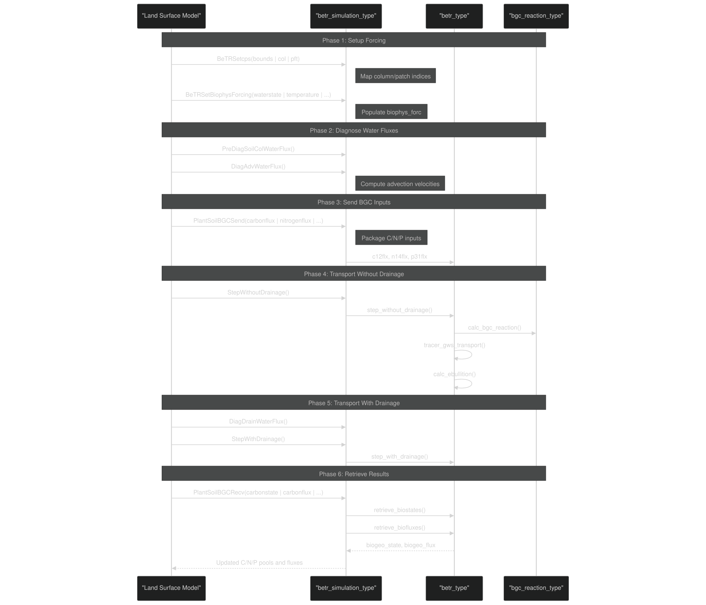

# Data Exchange Protocol

Relevant source files

- [example_input/ecacnp-reaction.namelist](https://github.com/jingtao-lbl/sbetr-resomv1/blob/72301c77/example_input/ecacnp-reaction.namelist)
- [src/Applications/soil-farm/bgcfarm_util/GeoChemAlgorithmMod.F90](https://github.com/jingtao-lbl/sbetr-resomv1/blob/72301c77/src/Applications/soil-farm/bgcfarm_util/GeoChemAlgorithmMod.F90)
- [src/betr/betr_dtype/BeTR_biogeophysInputType.F90](https://github.com/jingtao-lbl/sbetr-resomv1/blob/72301c77/src/betr/betr_dtype/BeTR_biogeophysInputType.F90)
- [src/driver/clm/BeTRSimulationCLM.F90](https://github.com/jingtao-lbl/sbetr-resomv1/blob/72301c77/src/driver/clm/BeTRSimulationCLM.F90)
- [src/driver/main/BeTRSimulationFactory.F90](https://github.com/jingtao-lbl/sbetr-resomv1/blob/72301c77/src/driver/main/BeTRSimulationFactory.F90)
- [src/driver/main/sbetrDriverMod.F90](https://github.com/jingtao-lbl/sbetr-resomv1/blob/72301c77/src/driver/main/sbetrDriverMod.F90)
- [src/driver/shared/BeTRSimulation.F90](https://github.com/jingtao-lbl/sbetr-resomv1/blob/72301c77/src/driver/shared/BeTRSimulation.F90)
- [src/driver/shared/bncdio_pio.F90](https://github.com/jingtao-lbl/sbetr-resomv1/blob/72301c77/src/driver/shared/bncdio_pio.F90)
- [src/driver/standalone/BeTRSimulationStandalone.F90](https://github.com/jingtao-lbl/sbetr-resomv1/blob/72301c77/src/driver/standalone/BeTRSimulationStandalone.F90)
- [src/driver/standalone/ForcingDataType.F90](https://github.com/jingtao-lbl/sbetr-resomv1/blob/72301c77/src/driver/standalone/ForcingDataType.F90)
- [src/driver/standalone/GridMod.F90](https://github.com/jingtao-lbl/sbetr-resomv1/blob/72301c77/src/driver/standalone/GridMod.F90)
- [src/stub_clm/WaterFluxType.F90](https://github.com/jingtao-lbl/sbetr-resomv1/blob/72301c77/src/stub_clm/WaterFluxType.F90)

## Purpose and Scope

This page documents the protocol for exchanging data between land surface models (CLM/ELM/ALM) and the BeTR reactive transport engine. It describes the data structures, variables, and calling sequences that enable coupled biogeochemistry simulations. This protocol defines what information flows into BeTR from the land model and what results BeTR returns.

For the overall integration architecture, see [CLM/ELM Integration](#9.1) . For the stub implementations used in standalone mode, see [Stub CLM Types](#9.3) .

## Data Exchange Overview

The data exchange protocol operates in a bidirectional manner: the land surface model provides physical and environmental forcing to BeTR, and BeTR returns updated biogeochemical states and fluxes. This exchange occurs at each model time step using the Strang splitting approach.

### High-Level Exchange Pattern

Sources:  [src/driver/shared/BeTRSimulation.F90 68-170](https://github.com/jingtao-lbl/sbetr-resomv1/blob/72301c77/src/driver/shared/BeTRSimulation.F90#L68-L170)  [src/betr/betr_dtype/BeTR_biogeophysInputType.F90 16-124](https://github.com/jingtao-lbl/sbetr-resomv1/blob/72301c77/src/betr/betr_dtype/BeTR_biogeophysInputType.F90#L16-L124)

## Core Data Structures

### Input Data Structure: betr_biogeophys_input_type

The primary input container is `betr_biogeophys_input_type` , which aggregates all physical and chemical forcing from the land model.

Sources:  [src/betr/betr_dtype/BeTR_biogeophysInputType.F90 16-131](https://github.com/jingtao-lbl/sbetr-resomv1/blob/72301c77/src/betr/betr_dtype/BeTR_biogeophysInputType.F90#L16-L131)  [src/betr/betr_dtype/BeTR_carbonfluxType.F90](https://github.com/jingtao-lbl/sbetr-resomv1/blob/72301c77/src/betr/betr_dtype/BeTR_carbonfluxType.F90)  [src/betr/betr_dtype/BeTR_nitrogenfluxType.F90](https://github.com/jingtao-lbl/sbetr-resomv1/blob/72301c77/src/betr/betr_dtype/BeTR_nitrogenfluxType.F90)  [src/betr/betr_dtype/BeTR_phosphorusfluxType.F90](https://github.com/jingtao-lbl/sbetr-resomv1/blob/72301c77/src/betr/betr_dtype/BeTR_phosphorusfluxType.F90)

### Output Data Structures

BeTR returns results through two complementary structures:

- **`betr_biogeo_state_type`**: Updated state variables (carbon pools, nitrogen pools, phosphorus pools)
- **`betr_biogeo_flux_type`**: Flux diagnostics (respiration, gas emissions, leaching losses)

Sources:  [src/betr/betr_dtype/BeTR_biogeoStateType.F90](https://github.com/jingtao-lbl/sbetr-resomv1/blob/72301c77/src/betr/betr_dtype/BeTR_biogeoStateType.F90)  [src/betr/betr_dtype/BeTR_biogeoFluxType.F90](https://github.com/jingtao-lbl/sbetr-resomv1/blob/72301c77/src/betr/betr_dtype/BeTR_biogeoFluxType.F90)

## Data Categories and Variables

### Water State and Flux Variables

| Variable | Type | Units | Description | 
| --- | --- | --- | --- |
| h2osoi_liq_col | real(r8)(:,:) | kg/m² | Liquid water content per layer | 
| h2osoi_ice_col | real(r8)(:,:) | kg/m² | Ice content per layer | 
| h2osoi_liqvol_col | real(r8)(:,:) | m³/m³ | Volumetric liquid water content | 
| h2osoi_vol_col | real(r8)(:,:) | m³/m³ | Total volumetric water content | 
| qflx_surf_col | real(r8)(:) | mm/s | Surface runoff | 
| qflx_rootsoi_col | real(r8)(:,:) | mm/s | Root water uptake by layer | 
| qflx_bot_col | real(r8)(:) | mm/s | Bottom drainage | 
| smp_l_col | real(r8)(:,:) | mm | Soil matric potential | 

Sources:  [src/betr/betr_dtype/BeTR_biogeophysInputType.F90 29-58](https://github.com/jingtao-lbl/sbetr-resomv1/blob/72301c77/src/betr/betr_dtype/BeTR_biogeophysInputType.F90#L29-L58)

### Temperature Variables

| Variable | Type | Units | Description | 
| --- | --- | --- | --- |
| t_soisno_col | real(r8)(:,:) | K | Soil/snow temperature by layer | 
| t_soi_10cm | real(r8)(:) | K | Top 10cm average soil temperature | 
| t_veg_patch | real(r8)(:) | K | Vegetation temperature | 
| forc_t_downscaled_col | real(r8)(:) | K | Atmospheric temperature | 

Sources:  [src/betr/betr_dtype/BeTR_biogeophysInputType.F90 52-61](https://github.com/jingtao-lbl/sbetr-resomv1/blob/72301c77/src/betr/betr_dtype/BeTR_biogeophysInputType.F90#L52-L61)

### Atmospheric Composition Variables

| Variable | Type | Units | Description | 
| --- | --- | --- | --- |
| forc_pbot_downscaled_col | real(r8)(:) | Pa | Atmospheric pressure | 
| co2_ppmv_col | real(r8)(:) | ppmv | CO₂ concentration | 
| o2_ppmv_col | real(r8)(:) | ppmv | O₂ concentration | 
| n2_ppmv_col | real(r8)(:) | ppmv | N₂ concentration | 
| ch4_ppmv_col | real(r8)(:) | ppmv | CH₄ concentration | 
| n2o_ppmv_col | real(r8)(:) | ppmv | N₂O concentration | 
| nh3_ppmv_col | real(r8)(:) | ppmv | NH₃ concentration | 

Sources:  [src/betr/betr_dtype/BeTR_biogeophysInputType.F90 60-69](https://github.com/jingtao-lbl/sbetr-resomv1/blob/72301c77/src/betr/betr_dtype/BeTR_biogeophysInputType.F90#L60-L69)

### Soil Physical Properties

| Variable | Type | Units | Description | 
| --- | --- | --- | --- |
| bsw_col | real(r8)(:,:) | - | Clapp-Hornberger b parameter | 
| watsat_col | real(r8)(:,:) | m³/m³ | Porosity | 
| eff_porosity_col | real(r8)(:,:) | m³/m³ | Effective porosity (porosity - ice) | 
| bd_col | real(r8)(:,:) | kg/m³ | Bulk density | 
| cellorg_col | real(r8)(:,:) | kg/m³ | Organic matter content | 
| cellclay_col | real(r8)(:,:) | % | Clay content | 
| cellsand_col | real(r8)(:,:) | % | Sand content | 
| sucsat_col | real(r8)(:,:) | mm | Saturated suction | 

Sources:  [src/betr/betr_dtype/BeTR_biogeophysInputType.F90 78-89](https://github.com/jingtao-lbl/sbetr-resomv1/blob/72301c77/src/betr/betr_dtype/BeTR_biogeophysInputType.F90#L78-L89)

### Carbon Input Fluxes

These fluxes represent litter and root inputs from vegetation into the soil:

| Variable | Type | Units | Description | 
| --- | --- | --- | --- |
| cflx_input_litr_met_vr_col | real(r8)(:,:) | gC/m³/s | Metabolic litter C input | 
| cflx_input_litr_cel_vr_col | real(r8)(:,:) | gC/m³/s | Cellulose litter C input | 
| cflx_input_litr_lig_vr_col | real(r8)(:,:) | gC/m³/s | Lignin litter C input | 
| cflx_input_litr_cwd_vr_col | real(r8)(:,:) | gC/m³/s | Coarse woody debris C input | 
| rt_vr_col | real(r8)(:,:) | gC/m³/s | Root respiration | 

Sources:  [src/betr/betr_dtype/BeTR_carbonfluxType.F90](https://github.com/jingtao-lbl/sbetr-resomv1/blob/72301c77/src/betr/betr_dtype/BeTR_carbonfluxType.F90)  [src/driver/standalone/BeTRSimulationStandalone.F90 363-370](https://github.com/jingtao-lbl/sbetr-resomv1/blob/72301c77/src/driver/standalone/BeTRSimulationStandalone.F90#L363-L370)

### Nitrogen and Phosphorus Input Fluxes

| Variable | Type | Units | Description | 
| --- | --- | --- | --- |
| nflx_input_litr_met_vr_col | real(r8)(:,:) | gN/m³/s | Metabolic litter N input | 
| nflx_minn_input_nh4_vr_col | real(r8)(:,:) | gN/m³/s | NH₄ deposition/fertilization | 
| nflx_minn_input_no3_vr_col | real(r8)(:,:) | gN/m³/s | NO₃ deposition/fertilization | 
| pflx_input_litr_met_vr_col | real(r8)(:,:) | gP/m³/s | Metabolic litter P input | 
| pflx_minp_input_po4_vr_col | real(r8)(:,:) | gP/m³/s | PO₄ input | 

Sources:  [src/betr/betr_dtype/BeTR_nitrogenfluxType.F90](https://github.com/jingtao-lbl/sbetr-resomv1/blob/72301c77/src/betr/betr_dtype/BeTR_nitrogenfluxType.F90)  [src/betr/betr_dtype/BeTR_phosphorusfluxType.F90](https://github.com/jingtao-lbl/sbetr-resomv1/blob/72301c77/src/betr/betr_dtype/BeTR_phosphorusfluxType.F90)  [src/driver/standalone/BeTRSimulationStandalone.F90 372-383](https://github.com/jingtao-lbl/sbetr-resomv1/blob/72301c77/src/driver/standalone/BeTRSimulationStandalone.F90#L372-L383)

## Exchange Protocol Sequence

### Per-Timestep Exchange Phases

Sources:  [src/driver/main/sbetrDriverMod.F90 230-364](https://github.com/jingtao-lbl/sbetr-resomv1/blob/72301c77/src/driver/main/sbetrDriverMod.F90#L230-L364)  [src/driver/standalone/BeTRSimulationStandalone.F90 143-235](https://github.com/jingtao-lbl/sbetr-resomv1/blob/72301c77/src/driver/standalone/BeTRSimulationStandalone.F90#L143-L235)

### Detailed Method Calls
1. Setting Biophysical Forcing
The `BeTRSetBiophysForcing` method transfers physical state from LSM types to BeTR types:

Implementation: This method populates the `biophys_forc(c)` member for each column `c` .

Sources:  [src/driver/shared/BeTRSimulation.F90 1395-1786](https://github.com/jingtao-lbl/sbetr-resomv1/blob/72301c77/src/driver/shared/BeTRSimulation.F90#L1395-L1786)
2. Sending BGC Inputs
The `PlantSoilBGCSend` method transfers vegetation-derived C/N/P fluxes:

Implementation: This populates `biophys_forc(c)%c12flx` , `biophys_forc(c)%n14flx` , and `biophys_forc(c)%p31flx` .

Sources:  [src/driver/standalone/BeTRSimulationStandalone.F90 288-389](https://github.com/jingtao-lbl/sbetr-resomv1/blob/72301c77/src/driver/standalone/BeTRSimulationStandalone.F90#L288-L389)
3. Receiving BGC Outputs
The `PlantSoilBGCRecv` method retrieves updated states and fluxes:

Implementation: Calls `betr(c)%retrieve_biostates()` and `betr(c)%retrieve_biofluxes()` , then maps results back to LSM types.

Sources:  [src/driver/standalone/BeTRSimulationStandalone.F90 392-534](https://github.com/jingtao-lbl/sbetr-resomv1/blob/72301c77/src/driver/standalone/BeTRSimulationStandalone.F90#L392-L534)

## Variable Mapping: LSM to BeTR

The exchange protocol requires mapping between LSM-specific types and BeTR-internal types. This mapping is performed in the simulation classes.

### Water State Mapping Example

Sources:  [src/driver/shared/BeTRSimulation.F90 1491-1540](https://github.com/jingtao-lbl/sbetr-resomv1/blob/72301c77/src/driver/shared/BeTRSimulation.F90#L1491-L1540)

### Carbon Flux Mapping Example

In the standalone simulation, carbon fluxes are mapped as follows:

Sources:  [src/driver/standalone/BeTRSimulationStandalone.F90 363-389](https://github.com/jingtao-lbl/sbetr-resomv1/blob/72301c77/src/driver/standalone/BeTRSimulationStandalone.F90#L363-L389)  [src/driver/standalone/BeTRSimulationStandalone.F90 472-483](https://github.com/jingtao-lbl/sbetr-resomv1/blob/72301c77/src/driver/standalone/BeTRSimulationStandalone.F90#L472-L483)

## Coordinate System Conventions

### Spatial Indexing

BeTR uses a different indexing convention than some LSMs:

- **LSM convention**`(begc:endc, 1:nlevgrnd)`: where levels go from surface (1) to depth
- **BeTR convention**`(begc_l:endc_l, lbj:ubj)``lbj`: where may include snow layers

The `betr_bounds_type` encapsulates these bounds:

Note : Snow layers are indexed as negative levels (-nlevsno+1 : 0), while soil layers are positive (1 : nlevsoi).

Sources:  [src/betr/betr_util/betr_decompMod.F90](https://github.com/jingtao-lbl/sbetr-resomv1/blob/72301c77/src/betr/betr_util/betr_decompMod.F90)

### Time Conventions

- **LSM time step**: Typically 30 minutes (1800 seconds)
- **BeTR adaptive sub-stepping**: BeTR may use smaller internal time steps for numerical stability
- **Forcing update frequency**: Once per LSM time step

Sources:  [src/driver/main/sbetrDriverMod.F90 231](https://github.com/jingtao-lbl/sbetr-resomv1/blob/72301c77/src/driver/main/sbetrDriverMod.F90#L231-L231)

## Implementation Variants

### Standalone Mode

In standalone mode, forcing data is read from NetCDF files rather than received from a live LSM:

Sources:  [src/driver/standalone/ForcingDataType.F90 340-493](https://github.com/jingtao-lbl/sbetr-resomv1/blob/72301c77/src/driver/standalone/ForcingDataType.F90#L340-L493)  [src/driver/main/sbetrDriverMod.F90 241-244](https://github.com/jingtao-lbl/sbetr-resomv1/blob/72301c77/src/driver/main/sbetrDriverMod.F90#L241-L244)

### Online Coupled Mode

In online coupled mode (CLM/ELM), the LSM directly provides its internal state variables:

Sources:  [src/driver/clm/BeTRSimulationCLM.F90 302-364](https://github.com/jingtao-lbl/sbetr-resomv1/blob/72301c77/src/driver/clm/BeTRSimulationCLM.F90#L302-L364)

## Data Validation and Error Handling

### Consistency Checks

The simulation classes implement validation methods:

- **`ConsistencyCheck`**: Verifies water tracer mass balance
- **`MassBalanceCheck`**: Validates carbon/nitrogen/phosphorus conservation
- **`bstatus`**: Status object tracks errors per column

Sources:  [src/driver/shared/BeTRSimulation.F90 717-790](https://github.com/jingtao-lbl/sbetr-resomv1/blob/72301c77/src/driver/shared/BeTRSimulation.F90#L717-L790)

### Error Status Propagation

The `betr_status_type` and `betr_status_sim_type` classes handle error reporting:

Sources:  [src/driver/standalone/BeTRSimulationStandalone.F90 182-189](https://github.com/jingtao-lbl/sbetr-resomv1/blob/72301c77/src/driver/standalone/BeTRSimulationStandalone.F90#L182-L189)

## Summary Table: Key Exchange Methods

| Method | Direction | Purpose | Primary Variables | 
| --- | --- | --- | --- |
| BeTRSetcps | LSM → BeTR | Map column/patch structure | betr_col, betr_pft | 
| BeTRSetBiophysForcing | LSM → BeTR | Set physical environment | Water, temperature, pressure | 
| PlantSoilBGCSend | LSM → BeTR | Send C/N/P inputs | Litter fluxes, root respiration | 
| StepWithoutDrainage | BeTR internal | Run transport + reactions | All tracers | 
| StepWithDrainage | BeTR internal | Apply drainage losses | Mobile tracers | 
| retrieve_biostates | BeTR → LSM | Get updated pools | C/N/P state variables | 
| retrieve_biofluxes | BeTR → LSM | Get diagnostic fluxes | Respiration, emissions, leaching | 
| PlantSoilBGCRecv | BeTR → LSM | Package results | All outputs | 
| RetrieveBiogeoFlux | BeTR → LSM | Get auxiliary fluxes | Water fluxes | 

Sources:  [src/driver/shared/BeTRSimulation.F90 122-170](https://github.com/jingtao-lbl/sbetr-resomv1/blob/72301c77/src/driver/shared/BeTRSimulation.F90#L122-L170)