# Stub CLM Types

Relevant source files

- [example_input/ecacnp-reaction.namelist](https://github.com/jingtao-lbl/sbetr-resomv1/blob/72301c77/example_input/ecacnp-reaction.namelist)
- [src/Applications/soil-farm/bgcfarm_util/GeoChemAlgorithmMod.F90](https://github.com/jingtao-lbl/sbetr-resomv1/blob/72301c77/src/Applications/soil-farm/bgcfarm_util/GeoChemAlgorithmMod.F90)
- [src/betr/betr_dtype/BeTR_biogeophysInputType.F90](https://github.com/jingtao-lbl/sbetr-resomv1/blob/72301c77/src/betr/betr_dtype/BeTR_biogeophysInputType.F90)
- [src/driver/clm/BeTRSimulationCLM.F90](https://github.com/jingtao-lbl/sbetr-resomv1/blob/72301c77/src/driver/clm/BeTRSimulationCLM.F90)
- [src/driver/main/BeTRSimulationFactory.F90](https://github.com/jingtao-lbl/sbetr-resomv1/blob/72301c77/src/driver/main/BeTRSimulationFactory.F90)
- [src/driver/main/sbetrDriverMod.F90](https://github.com/jingtao-lbl/sbetr-resomv1/blob/72301c77/src/driver/main/sbetrDriverMod.F90)
- [src/driver/shared/BeTRSimulation.F90](https://github.com/jingtao-lbl/sbetr-resomv1/blob/72301c77/src/driver/shared/BeTRSimulation.F90)
- [src/driver/shared/bncdio_pio.F90](https://github.com/jingtao-lbl/sbetr-resomv1/blob/72301c77/src/driver/shared/bncdio_pio.F90)
- [src/driver/standalone/BeTRSimulationStandalone.F90](https://github.com/jingtao-lbl/sbetr-resomv1/blob/72301c77/src/driver/standalone/BeTRSimulationStandalone.F90)
- [src/driver/standalone/ForcingDataType.F90](https://github.com/jingtao-lbl/sbetr-resomv1/blob/72301c77/src/driver/standalone/ForcingDataType.F90)
- [src/driver/standalone/GridMod.F90](https://github.com/jingtao-lbl/sbetr-resomv1/blob/72301c77/src/driver/standalone/GridMod.F90)
- [src/stub_clm/WaterFluxType.F90](https://github.com/jingtao-lbl/sbetr-resomv1/blob/72301c77/src/stub_clm/WaterFluxType.F90)

## Purpose and Scope

This page documents the stub CLM types provided in the `src/stub_clm` directory. These are simplified land surface model data structures that enable BeTR to run in standalone mode without requiring the full CLM or ELM codebase. Stub types provide minimal but sufficient interfaces to satisfy BeTR's dependencies on land model data structures.

For information about the full CLM/ELM integration, see [CLM/ELM Integration](#9.1) . For data exchange protocols with land models, see [Data Exchange Protocol](#9.2) .

## Architectural Role of Stub Types

Stub CLM types act as lightweight substitutes for actual CLM/ELM data structures when BeTR runs independently. They enable BeTR's core engine to use a consistent programming interface regardless of whether it's coupled to a full land model or running standalone.

Diagram: Stub CLM Types in BeTR Architecture

Sources: [src/driver/shared/BeTRSimulation.F90 18-42](https://github.com/jingtao-lbl/sbetr-resomv1/blob/72301c77/src/driver/shared/BeTRSimulation.F90#L18-L42)

## Conditional Compilation and Type Selection

BeTR uses C preprocessor directives to select between real CLM types and stub types at compile time. The `SBETR` macro determines which types are imported.

Type Mapping Table

| Purpose | Real CLM/ELM Type (SBETR defined) | Stub Type (SBETR not defined) | Module | 
| --- | --- | --- | --- |
| Patch/PFT properties | PatchType::patch_type | VegetationType::vegetation_physical_properties | patch_type alias | 
| Column properties | ColumnType::column_type | ColumnType::column_physical_properties | column_type alias | 
| Landunit properties | LandunitType::landunit_type | LandunitType::landunit_physical_properties | landunit_type alias | 
| Carbon fluxes | CNCarbonFluxType::carbonflux_type | ColumnDataType::column_carbon_flux | carbonflux_type alias | 
| Water state | WaterStateType::waterstate_type | ColumnDataType::column_water_state | waterstate_type alias | 
| Water fluxes | WaterfluxType::waterflux_type | ColumnDataType::column_water_flux | waterflux_type alias | 
| Temperature state | TemperatureType::temperature_type | ColumnDataType::column_energy_state | temperature_type alias | 
| Patch carbon flux | PfCarbonFluxType::pf_carbonflux_type | VegetationDataType::vegetation_carbon_flux | pf_carbonflux_type alias | 
| Patch temperature | PfTemperatureType::pf_temperature_type | VegetationDataType::vegetation_energy_state | pf_temperature_type alias | 
| Patch water flux | PfWaterfluxType::pf_waterflux_type | VegetationDataType::vegetation_water_flux | pf_waterflux_type alias | 

Sources: [src/driver/shared/BeTRSimulation.F90 18-42](https://github.com/jingtao-lbl/sbetr-resomv1/blob/72301c77/src/driver/shared/BeTRSimulation.F90#L18-L42)

## Implementation Example: WaterfluxType

The `WaterfluxType` module demonstrates the structure of stub CLM types. It provides essential water flux variables with minimal overhead.

Diagram: WaterfluxType Structure

Key Variables in waterflux_type:

- **`qflx_adv(begc:endc, lbj-1:ubj)`**- Advective water flux between layers (mm/s), positive downward
- **`qflx_infl(begc:endc)`**- Surface infiltration rate (mm H2O/s)
- **`qflx_surf(begc:endc)`**- Surface runoff (mm H2O/s)
- **`qflx_rootsoi(begc:endc, lbj:ubj)`**- Root-soil water exchange (mm H2O/s), positive into root
- **`qflx_drain_vr(begc:endc, lbj:ubj)`**- Drainage flux by layer (m/timestep)
- **`qflx_totdrain(begc:endc)`**- Total column drainage (m/timestep)
- **`qflx_dew_grnd(begc:endc)`**- Ground surface dew formation (mm H2O/s)
- **`qflx_sub_snow(begc:endc)`**- Snow sublimation rate (mm H2O/s)
- **`qflx_runoff(begc:endc)`**- Total runoff (mm H2O/s)

Sources: [src/stub_clm/WaterFluxType.F90 1-91](https://github.com/jingtao-lbl/sbetr-resomv1/blob/72301c77/src/stub_clm/WaterFluxType.F90#L1-L91)

## Stub Type Characteristics

Stub CLM types exhibit the following design characteristics:

1. Minimal Data Members

Stub types contain only the variables that BeTR directly accesses. Unused CLM/ELM variables are omitted.

2. Simple Initialization

Each stub type provides an `Init` method that:

- `InitAllocate`Calls to create pointer arrays
- `nan`Initializes values to or physically meaningful defaults
- `bounds_type`Uses to determine array dimensions

3. No Complex Behavior

Stub types do not implement land model physics. They provide data storage only. Methods are limited to:

- `Init()`- Constructor-like initialization
- `InitAllocate()`- Memory allocation

4. Consistent Interface

Stub types use identical names and signatures to their real CLM/ELM counterparts, enabling polymorphic usage in BeTR code.

Sources: [src/stub_clm/WaterFluxType.F90 42-86](https://github.com/jingtao-lbl/sbetr-resomv1/blob/72301c77/src/stub_clm/WaterFluxType.F90#L42-L86)

## Usage in BeTRSimulation

The `BeTRSimulation` module demonstrates how stub types integrate with BeTR's driver layer.

Code Selection Pattern:

Diagram: Type Usage Flow

Sources: [src/driver/shared/BeTRSimulation.F90 18-42](https://github.com/jingtao-lbl/sbetr-resomv1/blob/72301c77/src/driver/shared/BeTRSimulation.F90#L18-L42)

## Stub Types Directory Structure

The `src/stub_clm/` directory contains simplified implementations of land model types needed for standalone BeTR operation.

Key Stub Type Modules:

| Module | Purpose | Key Types | 
| --- | --- | --- |
| ColumnType | Column physical properties | column_physical_properties | 
| VegetationType | Vegetation/patch properties | vegetation_physical_properties | 
| LandunitType | Landunit properties | landunit_physical_properties | 
| ColumnDataType | Column state/flux data | column_carbon_flux, column_water_state, column_water_flux, column_energy_state | 
| VegetationDataType | Vegetation state/flux data | vegetation_carbon_flux, vegetation_energy_state, vegetation_water_flux | 
| WaterfluxType | Water flux variables | waterflux_type | 

Sources: [src/driver/shared/BeTRSimulation.F90 18-42](https://github.com/jingtao-lbl/sbetr-resomv1/blob/72301c77/src/driver/shared/BeTRSimulation.F90#L18-L42)  [src/stub_clm/WaterFluxType.F90 1-91](https://github.com/jingtao-lbl/sbetr-resomv1/blob/72301c77/src/stub_clm/WaterFluxType.F90#L1-L91)

## Interaction with Forcing Data

In standalone mode, stub types receive data from forcing files rather than online land model calculations. The `ForcingDataType` reads environmental conditions from NetCDF files and populates stub type arrays.

Diagram: Data Flow in Standalone Mode

Sources: [src/driver/standalone/ForcingDataType.F90 340-494](https://github.com/jingtao-lbl/sbetr-resomv1/blob/72301c77/src/driver/standalone/ForcingDataType.F90#L340-L494)  [src/driver/main/sbetrDriverMod.F90 233-256](https://github.com/jingtao-lbl/sbetr-resomv1/blob/72301c77/src/driver/main/sbetrDriverMod.F90#L233-L256)

## Differences from Real CLM Types

Stub types differ from real CLM/ELM types in several important ways:

Comparison Table

| Aspect | Real CLM/ELM Types | Stub CLM Types | 
| --- | --- | --- |
| Physics Implementation | Full land model physics and parameterizations | No physics, data containers only | 
| Variable Count | Hundreds of variables per type | Minimal subset (~10-30 variables) | 
| Dependencies | Complex interdependencies with other CLM modules | Minimal dependencies, self-contained | 
| Memory Footprint | Large, supports full ESM coupling | Minimal, only BeTR-required variables | 
| Initialization | Complex multi-step cold-start procedures | Simple array allocation and NaN/default fills | 
| Methods | Extensive physics calculations | Only Init/InitAllocate | 
| Compilation | Requires full CLM/ELM build system | Standalone compilation with BeTR | 

Sources: [src/stub_clm/WaterFluxType.F90 1-91](https://github.com/jingtao-lbl/sbetr-resomv1/blob/72301c77/src/stub_clm/WaterFluxType.F90#L1-L91)  [src/driver/shared/BeTRSimulation.F90 18-42](https://github.com/jingtao-lbl/sbetr-resomv1/blob/72301c77/src/driver/shared/BeTRSimulation.F90#L18-L42)

## Example: Standalone Simulation Setup

The following code excerpt from `sbetrDriverMod` illustrates how stub types are initialized and used in standalone mode:

Initialization Steps:

Sources: [src/driver/main/sbetrDriverMod.F90 134-196](https://github.com/jingtao-lbl/sbetr-resomv1/blob/72301c77/src/driver/main/sbetrDriverMod.F90#L134-L196)

## Benefits of the Stub Type Approach

The stub type architecture provides several advantages:

1. Decoupling

- BeTR development can proceed independently of CLM/ELM releases
- Testing and debugging without full land model overhead
- Reduced compilation times during development

2. Portability

- Standalone executables run on any system with minimal dependencies
- No need for CESM/E3SM infrastructure
- Easier deployment for sensitivity studies and parameter calibration

3. Simplicity

- Reduced cognitive load when focusing on biogeochemistry
- Easier onboarding for new developers
- Clear separation between land model physics and BGC reactions

4. Flexibility

- Custom forcing data formats
- Simplified testing scenarios
- Rapid prototyping of new BGC models

Sources: [src/driver/standalone/BeTRSimulationStandalone.F90 1-60](https://github.com/jingtao-lbl/sbetr-resomv1/blob/72301c77/src/driver/standalone/BeTRSimulationStandalone.F90#L1-L60)  [src/driver/main/sbetrDriverMod.F90 1-404](https://github.com/jingtao-lbl/sbetr-resomv1/blob/72301c77/src/driver/main/sbetrDriverMod.F90#L1-L404)

## Summary

Stub CLM types enable BeTR's standalone operation by providing minimal but sufficient substitutes for full CLM/ELM data structures. Through conditional compilation and consistent naming, BeTR code remains agnostic to whether it's using real or stub types. This design supports both coupled Earth system modeling and rapid standalone development/testing workflows.

Sources: [src/driver/shared/BeTRSimulation.F90 1-172](https://github.com/jingtao-lbl/sbetr-resomv1/blob/72301c77/src/driver/shared/BeTRSimulation.F90#L1-L172)  [src/stub_clm/WaterFluxType.F90 1-91](https://github.com/jingtao-lbl/sbetr-resomv1/blob/72301c77/src/stub_clm/WaterFluxType.F90#L1-L91)  [src/driver/main/sbetrDriverMod.F90 1-404](https://github.com/jingtao-lbl/sbetr-resomv1/blob/72301c77/src/driver/main/sbetrDriverMod.F90#L1-L404)