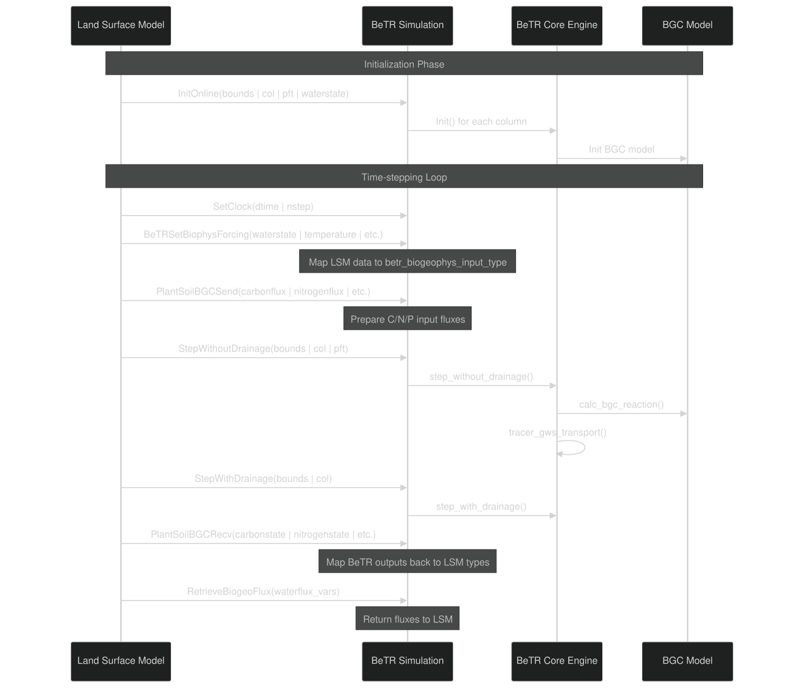

# Land Model Coupling

Relevant source files

- [example_input/ecacnp-reaction.namelist](https://github.com/jingtao-lbl/sbetr-resomv1/blob/72301c77/example_input/ecacnp-reaction.namelist)
- [src/Applications/soil-farm/bgcfarm_util/GeoChemAlgorithmMod.F90](https://github.com/jingtao-lbl/sbetr-resomv1/blob/72301c77/src/Applications/soil-farm/bgcfarm_util/GeoChemAlgorithmMod.F90)
- [src/betr/betr_dtype/BeTR_biogeophysInputType.F90](https://github.com/jingtao-lbl/sbetr-resomv1/blob/72301c77/src/betr/betr_dtype/BeTR_biogeophysInputType.F90)
- [src/driver/clm/BeTRSimulationCLM.F90](https://github.com/jingtao-lbl/sbetr-resomv1/blob/72301c77/src/driver/clm/BeTRSimulationCLM.F90)
- [src/driver/main/BeTRSimulationFactory.F90](https://github.com/jingtao-lbl/sbetr-resomv1/blob/72301c77/src/driver/main/BeTRSimulationFactory.F90)
- [src/driver/main/sbetrDriverMod.F90](https://github.com/jingtao-lbl/sbetr-resomv1/blob/72301c77/src/driver/main/sbetrDriverMod.F90)
- [src/driver/shared/BeTRSimulation.F90](https://github.com/jingtao-lbl/sbetr-resomv1/blob/72301c77/src/driver/shared/BeTRSimulation.F90)
- [src/driver/shared/bncdio_pio.F90](https://github.com/jingtao-lbl/sbetr-resomv1/blob/72301c77/src/driver/shared/bncdio_pio.F90)
- [src/driver/standalone/BeTRSimulationStandalone.F90](https://github.com/jingtao-lbl/sbetr-resomv1/blob/72301c77/src/driver/standalone/BeTRSimulationStandalone.F90)
- [src/driver/standalone/ForcingDataType.F90](https://github.com/jingtao-lbl/sbetr-resomv1/blob/72301c77/src/driver/standalone/ForcingDataType.F90)
- [src/driver/standalone/GridMod.F90](https://github.com/jingtao-lbl/sbetr-resomv1/blob/72301c77/src/driver/standalone/GridMod.F90)
- [src/stub_clm/WaterFluxType.F90](https://github.com/jingtao-lbl/sbetr-resomv1/blob/72301c77/src/stub_clm/WaterFluxType.F90)

## Purpose and Scope

This document describes how BeTR couples with land surface models (LSMs) such as CLM (Community Land Model), ELM (E3SM Land Model), and ALM (Accelerated Land Model). It covers the coupling architecture, data exchange protocols, and the workflow for passing environmental forcing and biogeochemical fluxes between BeTR and the host land model.

For information about the overall BeTR architecture and system design, see the [System Architecture](#1.1) page. For details on simulation execution and time-stepping, see [Simulation Execution](#3) . For information about single-layer testing without land model coupling, see [Jarmodel Single-Layer Mode](#8) .

## Coupling Architecture Overview

BeTR uses an adapter pattern to provide a unified interface to different land surface models. The base class `betr_simulation_type` defines the abstract interface, and specific implementations ( `betr_simulation_clm_type` , `betr_simulation_elm_type` , `betr_simulation_standalone_type` ) provide LSM-specific data mapping.

Diagram: Coupling Architecture Using Adapter Pattern

Sources: [src/driver/shared/BeTRSimulation.F90 1-172](https://github.com/jingtao-lbl/sbetr-resomv1/blob/72301c77/src/driver/shared/BeTRSimulation.F90#L1-L172)  [src/driver/main/BeTRSimulationFactory.F90 1-51](https://github.com/jingtao-lbl/sbetr-resomv1/blob/72301c77/src/driver/main/BeTRSimulationFactory.F90#L1-L51)  [src/driver/standalone/BeTRSimulationStandalone.F90 1-60](https://github.com/jingtao-lbl/sbetr-resomv1/blob/72301c77/src/driver/standalone/BeTRSimulationStandalone.F90#L1-L60)  [src/driver/clm/BeTRSimulationCLM.F90 1-60](https://github.com/jingtao-lbl/sbetr-resomv1/blob/72301c77/src/driver/clm/BeTRSimulationCLM.F90#L1-L60)

The factory creates the appropriate simulation type at runtime based on the `simulator_name` parameter:

| Simulator Name | Class | Purpose | 
| --- | --- | --- |
| "standalone" | betr_simulation_standalone_type | Offline simulations with NetCDF forcing files | 
| "clm" | betr_simulation_clm_type | Online coupling with CLM | 
| "elm" or "alm" | betr_simulation_elm_type | Online coupling with ELM/ALM | 

Sources: [src/driver/main/BeTRSimulationFactory.F90 21-47](https://github.com/jingtao-lbl/sbetr-resomv1/blob/72301c77/src/driver/main/BeTRSimulationFactory.F90#L21-L47)

## Simulation Modes

### Online Coupling Mode

In online coupling mode, BeTR is called directly from the land model during its biogeochemistry phase. The land model provides environmental conditions and receives back biogeochemical fluxes at each time step.

Initialization : The land model calls `InitOnline()` (or `BeTRInit()` ) during its initialization phase, passing land model data structures directly.

Sources: [src/driver/shared/BeTRSimulation.F90 185-210](https://github.com/jingtao-lbl/sbetr-resomv1/blob/72301c77/src/driver/shared/BeTRSimulation.F90#L185-L210)  [src/driver/clm/BeTRSimulationCLM.F90 81-132](https://github.com/jingtao-lbl/sbetr-resomv1/blob/72301c77/src/driver/clm/BeTRSimulationCLM.F90#L81-L132)

### Standalone Mode

In standalone mode, BeTR operates independently using forcing data from NetCDF files. This mode is useful for:

- Parameter calibration
- Testing BGC models in isolation
- Sensitivity studies
- Model development and debugging

Initialization : Standalone mode calls `Init()` (or `BeTRInitOffline()` ), which reads forcing data from files specified in the namelist.

Sources: [src/driver/standalone/BeTRSimulationStandalone.F90 85-139](https://github.com/jingtao-lbl/sbetr-resomv1/blob/72301c77/src/driver/standalone/BeTRSimulationStandalone.F90#L85-L139)  [src/driver/standalone/ForcingDataType.F90 1-73](https://github.com/jingtao-lbl/sbetr-resomv1/blob/72301c77/src/driver/standalone/ForcingDataType.F90#L1-L73)

## Data Exchange Protocol

### Biophysical Input Data Structure

The `betr_biogeophys_input_type` serves as the primary interface for passing environmental forcing from the land model to BeTR. This structure contains:

Diagram: Structure of Biophysical Input Data

Sources: [src/betr/betr_dtype/BeTR_biogeophysInputType.F90 16-131](https://github.com/jingtao-lbl/sbetr-resomv1/blob/72301c77/src/betr/betr_dtype/BeTR_biogeophysInputType.F90#L16-L131)

Key data categories:

| Category | Variables | Purpose | 
| --- | --- | --- |
| Water State | h2osoi_liq_col, h2osoi_ice_col, h2osoi_vol_col | Liquid/ice water content, volumetric fractions | 
| Temperature | t_soisno_col, t_soi_10cm | Soil temperature profile | 
| Water Fluxes | qflx_rootsoi_col, qflx_surf_col, qflx_bot_col | Root water uptake, surface runoff, drainage | 
| Atmospheric | forc_pbot_downscaled_col, co2_ppmv_col, n2o_ppmv_col | Atmospheric pressure, gas concentrations | 
| Soil Properties | bsw_col, watsat_col, bd_col, soil_pH | Hydraulic properties, bulk density, pH | 
| CNP Inputs | c12flx, n14flx, p31flx | Litter inputs, root exudates, deposition | 

Sources: [src/betr/betr_dtype/BeTR_biogeophysInputType.F90 27-123](https://github.com/jingtao-lbl/sbetr-resomv1/blob/72301c77/src/betr/betr_dtype/BeTR_biogeophysInputType.F90#L27-L123)

### Biogeochemical State and Flux Data

BeTR returns biogeochemical states and fluxes to the land model through two structures:

These structures are populated by BeTR and then mapped back to the land model's native data structures.

Sources: [src/driver/shared/BeTRSimulation.F90 71-72](https://github.com/jingtao-lbl/sbetr-resomv1/blob/72301c77/src/driver/shared/BeTRSimulation.F90#L71-L72)

## Coupling Workflow

The coupling workflow follows a standardized sequence of method calls that is the same for all simulation modes:

Diagram: Coupling Workflow Sequence

Sources: [src/driver/main/sbetrDriverMod.F90 229-395](https://github.com/jingtao-lbl/sbetr-resomv1/blob/72301c77/src/driver/main/sbetrDriverMod.F90#L229-L395)

### Key Coupling Methods
1.`BeTRSetBiophysForcing`
Maps land model variables to `betr_biogeophys_input_type` . This method is overridden in each simulation type to handle LSM-specific data structures.

CLM/ELM Implementation:

- `waterstate_type`Extracts water state from
- `temperature_type`Extracts temperature from
- `waterflux_type`Extracts fluxes from
- `this%biophys_forc(c)`Stores in for each column

Sources: [src/driver/shared/BeTRSimulation.F90 141](https://github.com/jingtao-lbl/sbetr-resomv1/blob/72301c77/src/driver/shared/BeTRSimulation.F90#L141-L141)  [src/driver/standalone/BeTRSimulationStandalone.F90 238-285](https://github.com/jingtao-lbl/sbetr-resomv1/blob/72301c77/src/driver/standalone/BeTRSimulationStandalone.F90#L238-L285)
2.`PlantSoilBGCSend`
Prepares C/N/P input fluxes from the land model:

- Litter inputs (metabolic, cellulose, lignin, CWD)
- Root exudates
- Mineral nutrient deposition
- Fire-related losses

Standalone Example:

Sources: [src/driver/standalone/BeTRSimulationStandalone.F90 288-389](https://github.com/jingtao-lbl/sbetr-resomv1/blob/72301c77/src/driver/standalone/BeTRSimulationStandalone.F90#L288-L389)
3.`StepWithoutDrainage`and`StepWithDrainage`
These methods implement the Strang splitting approach:

- `StepWithoutDrainage`: Transport + BGC reactions without drainage
- `StepWithDrainage`: Transport with drainage only

The split-operator approach improves numerical stability and accuracy.

Sources: [src/driver/shared/BeTRSimulation.F90 137-138](https://github.com/jingtao-lbl/sbetr-resomv1/blob/72301c77/src/driver/shared/BeTRSimulation.F90#L137-L138)  [src/driver/standalone/BeTRSimulationStandalone.F90 143-190](https://github.com/jingtao-lbl/sbetr-resomv1/blob/72301c77/src/driver/standalone/BeTRSimulationStandalone.F90#L143-L190)  [src/driver/standalone/BeTRSimulationStandalone.F90 193-235](https://github.com/jingtao-lbl/sbetr-resomv1/blob/72301c77/src/driver/standalone/BeTRSimulationStandalone.F90#L193-L235)
4.`PlantSoilBGCRecv`
Retrieves biogeochemical states and fluxes from BeTR and maps them back to land model types:

- Carbon state pools and fluxes
- Nitrogen mineralization/immobilization
- Phosphorus transformations
- Trace gas emissions (CO₂, N₂O, NH₃)

Example mapping:

Sources: [src/driver/standalone/BeTRSimulationStandalone.F90 392-534](https://github.com/jingtao-lbl/sbetr-resomv1/blob/72301c77/src/driver/standalone/BeTRSimulationStandalone.F90#L392-L534)
5.`RetrieveBiogeoFlux`
Retrieves additional flux variables (e.g., water fluxes modified by BeTR) and returns them to the land model.

Sources: [src/driver/shared/BeTRSimulation.F90 142](https://github.com/jingtao-lbl/sbetr-resomv1/blob/72301c77/src/driver/shared/BeTRSimulation.F90#L142-L142)

## Stub Types for Standalone Mode

When running in standalone mode, BeTR does not have access to the full land model. Instead, it uses stub types that mimic the land model's data structures but can be populated from forcing files.

Key stub types include:

| Stub Type | File | Purpose | 
| --- | --- | --- |
| waterstate_type | src/stub_clm/WaterStateType.F90 | Water content and ice fractions | 
| waterflux_type | src/stub_clm/WaterFluxType.F90 | Water fluxes (infiltration, drainage, root uptake) | 
| temperature_type | src/stub_clm/TemperatureType.F90 | Soil and vegetation temperature | 
| carbonflux_type | src/stub_clm/CNCarbonFluxType.F90 | Carbon input fluxes | 
| nitrogenflux_type | src/stub_clm/CNNitrogenFluxType.F90 | Nitrogen input fluxes | 
| phosphorusflux_type | src/stub_clm/PhosphorusFluxType.F90 | Phosphorus input fluxes | 

These stub types have the same member variables as the real land model types, allowing the same coupling code to work in both online and offline modes.

Sources: [src/stub_clm/WaterFluxType.F90 18-38](https://github.com/jingtao-lbl/sbetr-resomv1/blob/72301c77/src/stub_clm/WaterFluxType.F90#L18-L38)

## Data Flow Through Coupling Interface

The following diagram shows how data flows from the land model through BeTR's coupling interface to the BGC model and back:

Diagram: Data Flow Through Coupling Interface

Sources: [src/driver/shared/BeTRSimulation.F90 68-77](https://github.com/jingtao-lbl/sbetr-resomv1/blob/72301c77/src/driver/shared/BeTRSimulation.F90#L68-L77)  [src/driver/standalone/BeTRSimulationStandalone.F90 238-534](https://github.com/jingtao-lbl/sbetr-resomv1/blob/72301c77/src/driver/standalone/BeTRSimulationStandalone.F90#L238-L534)

## Implementation Details

### Column and Patch Index Mapping

BeTR operates on columns (soil profiles) and patches (plant functional types). The simulation classes maintain mappings between LSM indices and BeTR indices:

- `betr_col(c)``c`: BeTR column data for LSM column
- `betr_pft(c)``c`: BeTR patch data for LSM column
- `filter_soilc`: Array of active soil column indices
- `filter_soilp`: Array of active soil patch indices

Sources: [src/driver/shared/BeTRSimulation.F90 76-91](https://github.com/jingtao-lbl/sbetr-resomv1/blob/72301c77/src/driver/shared/BeTRSimulation.F90#L76-L91)

### Active Column Filtering

Not all land model columns run BeTR (e.g., ice sheets, lakes are excluded). The `active_col` array tracks which columns should be processed:

Sources: [src/driver/shared/BeTRSimulation.F90 443-456](https://github.com/jingtao-lbl/sbetr-resomv1/blob/72301c77/src/driver/shared/BeTRSimulation.F90#L443-L456)

### Bounds Type Conversion

BeTR uses its own `betr_bounds_type` internally, which is set from the land model's `bounds_type` :

Sources: [src/driver/shared/BeTRSimulation.F90 160](https://github.com/jingtao-lbl/sbetr-resomv1/blob/72301c77/src/driver/shared/BeTRSimulation.F90#L160-L160)

### Error Handling During Coupling

Each column has a `bstatus(c)` object that tracks errors. If any column fails, the simulation stops with a diagnostic message identifying the problematic column:

Sources: [src/driver/shared/BeTRSimulation.F90 466-470](https://github.com/jingtao-lbl/sbetr-resomv1/blob/72301c77/src/driver/shared/BeTRSimulation.F90#L466-L470)  [src/driver/standalone/BeTRSimulationStandalone.F90 182-189](https://github.com/jingtao-lbl/sbetr-resomv1/blob/72301c77/src/driver/standalone/BeTRSimulationStandalone.F90#L182-L189)

### Forcing Data Management (Standalone Mode)

In standalone mode, the `ForcingData_type` class manages reading and time-interpolation of forcing data from NetCDF files:

- `ReadForcingData()`: Reads environmental forcing (temperature, moisture, atmospheric conditions)
- `ReadCNPData()`: Reads C/N/P input fluxes
- `UpdateForcing()`: Updates forcing for current time step
- `UpdateCNPForcing()`: Updates C/N/P inputs for current time step

Sources: [src/driver/standalone/ForcingDataType.F90 22-73](https://github.com/jingtao-lbl/sbetr-resomv1/blob/72301c77/src/driver/standalone/ForcingDataType.F90#L22-L73)  [src/driver/main/sbetrDriverMod.F90 139-140](https://github.com/jingtao-lbl/sbetr-resomv1/blob/72301c77/src/driver/main/sbetrDriverMod.F90#L139-L140)  [src/driver/main/sbetrDriverMod.F90 225-244](https://github.com/jingtao-lbl/sbetr-resomv1/blob/72301c77/src/driver/main/sbetrDriverMod.F90#L225-L244)