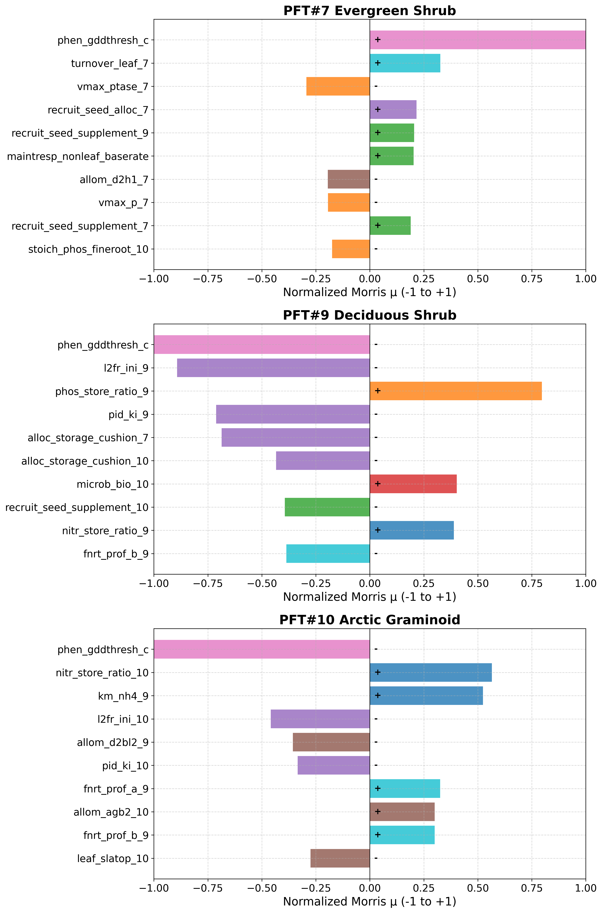

<!-- _paginate: false -->

# A2MC: Diagnosis Evolution
## How AI Reasoning Deepens Understanding Through Iterative Calibration

**Session 20260309_232001 -- Kougarok, Alaska**
Calibration Round 2 | 162 parameters | 4,890 simulations

A2MC Reporting Agent
Curated by Jing Tao (Lawrence Berkeley National Laboratory)

---

# Session Overview

## 4 diagnosis-hypothesis cycles before submitting experiments to HPC

```
Phase 2               Phase 3                Phase 4              Phase 5
SCREENING ──> iter 1: DIAGNOSIS ──> iter 1: HYPOTHESIS ──┐
                  ^                                       |
                  |   (skip testing: test with            |
                  |    existing ensemble data)            |
                  |                                       |
              iter 2: DIAGNOSIS <── Not supported ────────┘
                  |
              iter 2: HYPOTHESIS ── Not supported ──> iter 3: DIAGNOSIS
                                                          |
              iter 3: HYPOTHESIS ── Not supported ──> iter 4: DIAGNOSIS
                                                          |
              iter 4: HYPOTHESIS ── Synthesized ────> TESTING (7 experiments)
```

<div class="highlight">

**Each cycle tests a hypothesis against existing data, learns from failure, and refines the causal model.** No new HPC simulations needed until the final step.

</div>

---

# Phase 1: Morris Sensitivity Analysis



## Parameter sensitivity ranking by PFT

Morris analysis of 162 parameters across 4,890 simulations reveals **PFT-specific dominant controls:**

- **PFT7:** Phenology threshold (`phen_gddthresh_c`) and leaf turnover dominate
- **PFT9:** `l2fr_ini_9` is the #2 most sensitive parameter for leaf biomass
- **PFT10:** Nitrogen store ratio and `km_nh4_9` (cross-PFT effect) dominate

<div class="highlight">

These rankings guide the AI's search for root causes -- but sensitivity alone cannot explain multi-factor interactions.

</div>

---

# Phase 2: Screening -- The Starting Point

## 4,890 simulations, 0 meet all 6 targets

<div class="columns">
<div>

**Validation targets** (3 PFTs x 2 biomass pools):

| PFT | Type | Leaf (gC/m2) | Root (gC/m2) |
|-----|------|:-----------:|:-----------:|
| #7 | Evergreen shrub | 24.6 | 174.2 |
| #9 | Deciduous shrub | 124.7 | 187.3 |
| #10 | Arctic graminoid | 82.7 | 382.1 |

</div>
<div>

**Ensemble performance:**

| Targets met | Cases | Fraction |
|:-----------:|------:|:--------:|
| 0 | 4,233 | 86.6% |
| 1 | 607 | 12.4% |
| 2 | 46 | 0.9% |
| 3 | 4 | 0.08% |
| 4+ | 0 | 0% |

</div>
</div>

<div class="orange-highlight">

**Best case #322:** 3/6 targets met, RMSRE = 0.614. **Lowest RMSRE case #1386:** 0/6 targets met, RMSRE = 0.586. Discrete and continuous metrics disagree -- a hard combinatorial optimization problem.

</div>

---

<style scoped>
section { padding-top: 10px; padding-bottom: 10px; }
h1 { margin-bottom: 0; font-size: 1.4em; }
img { display: block; margin: 0 auto; max-height: 580px; }
</style>

# Phase 2: Top 100 Cases vs Observations


<!--
This figure shows the top 100 ensemble cases (light blue lines) for all 3 PFTs x 2 biomass pools.
Black diamond = observation with 20% uncertainty range.
Best case #322 (blue) meets 3/6 targets.
Lowest RMSRE case #1386 (red) meets 0/6 but has overall lower error.
Key takeaway: no single case reaches all targets simultaneously.
-->

---

# Iteration 1: Diagnosis -- "Everything Is P-Starved"

## A monolithic first impression (Confidence: 0.88)

<div class="columns">
<div>

### What the AI found

Catastrophic **systemic P starvation** across all PFTs:

| Metric | Value |
|--------|-------|
| Total P demand | 358,121 g/m2/yr |
| Total P supply | 0.67 g/m2/yr |
| **Demand/supply ratio** | **534,509x** |

PFT share of P uptake:
- PFT7 (evergreen): **73.4%**
- PFT9 (deciduous): **24.6%**
- PFT10 (graminoid): **2.0%**

</div>
<div>

### Initial causal model

```
Extreme P demand (358,121 g/m2/yr)
        |
        v
  ECA competition
  PFT7 >> PFT9 >> PFT10
        |
        v
  PFT10 gets ~0% of P
        |
        v
  PID controller diverts C to roots
        |
        v
  Leaf biomass collapses
```

### Proposed fix: PFT10-centric
Increase `vmax_p_10` by 100x to boost PFT10's competitive position in ECA.

</div>
</div>

---

# Diagnostic Evidence: P Mass Balance (Case #322)


## Where is the phosphorus?

AI-generated diagnostic plot reveals:

- **Panel C:** Litter P pools accumulate massively -- P is trapped in decomposing litter
- **Panel E:** P uptake flux (red) near zero for vegetation
- **Panel F:** Total ecosystem P budget shows ~1,243 g P/m2 total, but almost none available to plants

<div class="orange-highlight">

**98.9% of soil P locked in mineral pools.** The tiny available fraction is fought over by 3 PFTs with astronomically inflated demand.

</div>

---

# Diagnostic Evidence: PFT10 Overview (Case #322)


## Arctic graminoid in total collapse

AI-generated 6-panel diagnostic:

- **Panel A:** Fineroot biomass far below 382 gC/m2 target (dashed red)
- **Panel B:** Leaf biomass near zero vs 82.7 target
- **Panel C:** P uptake/demand ratio ~ 0 (red zone)
- **Panel D:** GPP dominated by PFT7/PFT9; PFT10 negligible
- **Panel E:** L2FR spikes indicate unstable allocation
- **Panel F:** Near-zero allocation to both leaf and root

---

# Iteration 1: Hypothesis -- Boost PFT10 P Uptake

## Test: Can increasing PFT10's competitive ability fix the problem?

<div class="columns">
<div>

**Parameter changes (5):**

| Parameter | From | To |
|-----------|:----:|:--:|
| vmax_p_10 | 5e-11 | 5e-9 (100x) |
| stoich_phos_leaf_10 | 0.0053 | 0.0026 |
| stoich_phos_froot_10 | 0.0031 | 0.0016 |
| vmax_ptase_10 | 3.7e-9 | 3.7e-7 |
| l2fr_ini_10 | 9.88 | 3.0 |

**Confidence:** 0.62

</div>
<div>

### Skip-testing result

<div class="red-highlight">

**Not supported.** Tested against existing ensemble data.

PFT10 leaf: **0.006 vs 0.003 g/m2** in top vs bottom quintile for vmax_p_10 -- both essentially **zero**.

The entire ensemble operates within a regime of total P-starvation collapse. Improving PFT10's competitive position within a collapsed system has no effect.

</div>

</div>
</div>

<div class="grey-highlight">

**Key learning:** You cannot fix a PFT within a system that is universally collapsed. The problem is bigger than PFT10.

</div>

---

# Iteration 2: Diagnosis -- "Three Separate Failures"

## From monolithic to differentiated (Confidence: 0.87)

<div class="columns">
<div>

### New insight: PFT-specific failure modes

The AI now recognizes **three distinct problems**, not one:

**PFT9:** `l2fr_ini_9 = 18.31` (at upper bound)
Routes >95% of C to fine roots, starving leaves.
PFT9 leaf = 26.6 vs target 124.7 gC/m2

**PFT7:** `l2fr_ini_7 = 0.85` (too leaf-biased)
Opposite problem -- insufficient root allocation.
PFT7 froot = 63.5 vs target 174.2 gC/m2

**PFT10:** Allometric structural collapse
`d2bl1_10`, `dbh_maxheight_10`, `slatop_10` all at lower bounds -- "triple lower-bound failure"

</div>
<div>

### Critical realization

PFT10's absolute P demand is only **15.5 g/m2/yr** -- that's **10,000x smaller** than PFT7/PFT9.

<div class="highlight">

**Pivot:** PFT10's collapse is more about **structural/allometric** failures than P competition. The AI stops treating PFT10 as purely a victim of P exclusion.

</div>

### The l2fr dual-direction problem

| PFT | l2fr value | Problem |
|-----|:----------:|---------|
| PFT9 | 18.31 (max) | Too much root, starving leaves |
| PFT7 | 0.85 (low) | Too much leaf, starving roots |

Both are wrong, in **opposite** directions.

</div>
</div>

---

# Diagnostic Evidence: PFT9 Leaf Starvation (Case #322)


## Deciduous shrub with extreme root bias

- **Panel A:** Fineroot biomass overshoots -- allocation heavily root-biased
- **Panel B:** Leaf biomass (26.6) far below target (124.7, dashed red)
- **Panel E:** L2FR (leaf-to-fineroot ratio) driven by `l2fr_ini_9 = 18.31` at upper bound
- **Panel F:** Root allocation dominates; leaf allocation starved

<div class="highlight">

The AI identified that PFT9's leaf deficit is caused by **allocation imbalance**, not P starvation -- a distinct mechanism from PFT10's failure.

</div>

---

# Iteration 2: Hypothesis -- Dual l2fr + Allometric Rescue

## Three simultaneous corrections

<div class="columns">
<div>

**Parameter changes (7):**

| Parameter | From | To | Target |
|-----------|:----:|:--:|--------|
| l2fr_ini_9 | 18.31 | 4.5 | PFT9 leaf |
| l2fr_ini_7 | 0.85 | 1.8 | PFT7 root |
| d2bl1_10 | 0.006 | 0.06 | PFT10 structure |
| dbh_maxheight_10 | 0.16 | 1.0 | PFT10 structure |
| stoich_phos_leaf_9 | 0.0053 | 0.003 | PFT9 P demand |
| pid_kd_9 | 0.01 | 0.2 | Stabilization |
| pid_kd_10 | 0.01 | 0.35 | Stabilization |

**Confidence:** 0.78

</div>
<div>

### Skip-testing result

<div class="red-highlight">

**Not supported** (0.62 confidence).

Case #3972 (l2fr_ini_9 = 5.24) appeared to show PFT9_leaf = 85.2 from the **Y-matrix** (multi-year mean used for sensitivity analysis) -- but the diagnostic script found PFT9_leaf = **0.037 g/m2** at the observation timestep (July 2016).

Both cases near zero at the observation point. The l2fr correction alone cannot overcome systemic P starvation.

</div>

<div class="orange-highlight">

**Self-correction:** The Y-matrix stores multi-year means (e.g., 2010-2019 average) for sensitivity analysis, while diagnostics evaluate at a specific observation timestep. The AI caught this discrepancy -- collapsing vegetation can show non-zero annual means but near-zero values at a given point in time.

</div>

</div>
</div>

---

# Iteration 3: Diagnosis -- "PFT10 Is Being Killed"

## A new dominant failure mode discovered (Confidence: 0.82)

<div class="columns">
<div>

### The hydraulic mortality discovery

Diagnostic scripts revealed:

| PFT10 mortality | Rate |
|----------------|:----:|
| **Hydraulic failure** | **92%** of all deaths |
| Carbon starvation | 5% |
| Other | 3% |

Root cause: `mort_hf_sm_threshold_10 = 1e-08`
(at absolute lower bound)

This means **any soil moisture level** triggers hydraulic death for PFT10. Plants are killed before they can grow.

</div>
<div>

### Three failure regimes identified

```
    Regime A              Regime B              Regime C
    --------              --------              --------
    Systemic P         PFT10 Hydraulic      Structural/
    Starvation            Mortality          Allometric
    (all PFTs)          (PFT10 only)         (PFT10)
        |                    |                   |
        v                    v                   v
   Leaf collapse       Plants killed        Plants too
   via PID             before growing       small to grow
```

<div class="highlight">

**New primary target:** Fix hydraulic mortality threshold to let PFT10 survive, then address P starvation.

</div>

### GPP reality check
GPP = 0 and MR = 0 for best cases -- vegetation is collapsing to near-zero. The system is not just P-limited, it's in **total collapse**.

</div>
</div>

---

# Diagnostic Evidence: Mortality Components (Case #322)


## AI-generated mortality decomposition

Three panels showing mortality components by PFT:

- **PFT7 (top):** Dominated by **hydraulic failure** (red) with periodic carbon starvation (orange)
- **PFT9 (middle):** Episodic mortality spikes, mix of hydraulic and C starvation
- **PFT10 (bottom):** **92% hydraulic failure** -- persistent death at nearly every timestep

<div class="orange-highlight">

This plot, generated by the AI's diagnostic scripts, revealed the hydraulic mortality mechanism that was invisible in the sensitivity analysis and screening phases.

</div>

---

# Iteration 3: Hypothesis -- Hydraulic Escape + P Relief

## Three-layer intervention

<div class="columns">
<div>

**Parameter changes (6):**

| Parameter | From | To | Layer |
|-----------|:----:|:--:|-------|
| mort_hf_sm_threshold_10 | 1e-8 | 5e-7 | Mortality |
| stoich_phos_leaf_7 | 0.0084 | 0.004 | P demand |
| stoich_phos_froot_7 | 0.0042 | 0.002 | P demand |
| l2fr_ini_9 | 18.31 | 5.0 | Allocation |
| pid_kd_10 | 0.01 | 0.35 | Stabilization |
| pid_kd_9 | 0.01 | 0.2 | Stabilization |

**Confidence:** 0.72

</div>
<div>

### Skip-testing result

<div class="red-highlight">

**Not supported** (0.70 confidence).

Top-quintile cases with high `mort_hf_sm_threshold` showed only **1.09x** more PFT10 biomass (expected > 2.0x).

</div>

### The refuting evidence

Case #4007 achieves `PFT10_froot = 0.297` **with** `mort_hf_sm_threshold` at lower bound.

If hydraulic mortality were the primary cause, cases at the lower bound should have ~zero biomass. They don't.

<div class="grey-highlight">

**Hydraulic mortality is a secondary symptom, not the root cause.**

</div>

</div>
</div>

---

# Iteration 4: Diagnosis -- The Breakthrough

## "The real root cause is vmax inflation in PFT7/PFT9" (Confidence: 0.82)

<div class="columns">
<div>

### What drives the 534,509x demand/supply ratio?

| Parameter | Value | Status |
|-----------|:-----:|--------|
| vmax_nh4_7 | 0.00025 | **At upper bound** |
| vmax_no3_9 | 0.00025 | **At upper bound** |

ECA demand = vmax x fine_root_C.
With extreme vmax, PFT7 and PFT9 each generate **>160,000 g/m2/yr** of P demand.

PFT10 could have ANY vmax value -- it receives ~0% of P regardless, because PFT7+PFT9 demand dwarfs the supply.

</div>
<div>

### Existence proofs from the ensemble

| Case | Achievement |
|------|-----------|
| #648 | PFT10_leaf = **79.6** (target: 82.7, within 3.6%) |
| #1386 | PFT10_froot = **186.6** (target: 382.1) |
| #3972 | vmax_nh4_7 = 3.57e-5 (7x lower), better PFT7_froot |

<div class="green-highlight">

**The targets ARE reachable.** The problem is that Case #322's extreme vmax values create a regime where ECA competition makes P distribution impossible. Fix the system-level demand, and individual PFTs can thrive.

</div>

</div>
</div>

---

# Iteration 4: The Conceptual Shift

## From fixing the victim to fixing the system

<div class="columns">
<div>

### Previous iterations: PFT10-centric thinking

```
"PFT10 is failing"
    |
    v
Try to help PFT10:
  - Boost PFT10 vmax (iter 1)
  - Fix PFT10 allometry (iter 2)
  - Fix PFT10 mortality (iter 3)
    |
    v
All failed: PFT10 can't compete
in a collapsed system
```

</div>
<div>

### Iteration 4: System-level thinking

```
"The SYSTEM is broken"
    |
    v
Fix PFT7+PFT9 demand inflation:
  - Reduce vmax_nh4_7 by 100x
  - Reduce vmax_no3_9 by 100x
  - Reduce vmax_nh4_9 by 100x
    |
    v
Total demand: 358,121 -> ~3,500 g/m2/yr
    |
    v
ECA can now distribute P meaningfully
to ALL PFTs
```

</div>
</div>

<div class="highlight">

**This is the first time the AI proposes reducing PFT7/PFT9 vmax** -- all prior cycles focused on stoichiometry, thresholds, and PFT10-specific parameters while leaving the primary vmax bottleneck untouched.

</div>

---

# Iteration 4: Hypothesis -- Systemic P Demand Reset

## The synthesized 7-parameter intervention

**Parameter changes across 3 mechanistic pathways:**

<div class="columns-3">
<div>

### Pathway 1: Demand Reset

| Parameter | Change |
|-----------|--------|
| vmax_nh4_7 | 100x down |
| vmax_no3_9 | 100x down |
| vmax_nh4_9 | 100x down |

*Reduces total demand from 358,121 to ~3,500 g/m2/yr*

</div>
<div>

### Pathway 2: Allocation Fix

| Parameter | Change |
|-----------|--------|
| l2fr_ini_9 | 18.3 -> 5.2 |
| l2fr_ini_7 | 0.85 -> 1.8 |

*Corrects the dual-direction l2fr problem*

</div>
<div>

### Pathway 3: Stabilization

| Parameter | Change |
|-----------|--------|
| pid_kd_10 | 0.01 -> 0.35 |
| pid_kd_9 | 0.01 -> 0.2 |

*Prevents allocation oscillation after rebalancing*

</div>
</div>

<div class="orange-highlight">

**Confidence: 0.72.** The AI self-review flagged 8 warnings: 100x changes are aggressive, 7 simultaneous modifications prevent causal attribution. Response: design 7 cumulative experiments, each adding one change, to isolate individual effects.

</div>

---

# Phase 5: Experiment Design

## 7 cumulative experiments isolating each parameter change

| Exp | Added Parameter | Cumulative Changes | Tests |
|:---:|----------------|:-:|---------|
| 1 | vmax_nh4_7 (100x down) | 1 | Does reducing PFT7 N demand alone help? |
| 2 | + vmax_no3_9 (100x down) | 2 | Does reducing PFT9 N demand add benefit? |
| 3 | + vmax_nh4_9 (100x down) | 3 | Full demand reset complete? |
| 4 | + l2fr_ini_9 (18.3 -> 5.2) | 4 | Does PFT9 leaf recover? |
| 5 | + l2fr_ini_7 (0.85 -> 1.8) | 5 | Does PFT7 root recover? |
| 6 | + pid_kd_10 (0.01 -> 0.35) | 6 | Does PFT10 stabilize? |
| 7 | + pid_kd_9 (0.01 -> 0.2) | 7 | Full intervention effect? |

<div class="highlight">

**All 7 experiments submitted to NERSC Perlmutter.** Each builds on the previous, so we can attribute improvement to each individual change. Results pending (~2 day simulation time).

</div>

---

# Diagnosis Evolution Summary

## How AI understanding deepened across 4 iterations

| Iter | Diagnosis | Hypothesis | Result | Key Learning |
|:----:|-----------|-----------|:------:|-------------|
| 1 | Monolithic P starvation | Boost PFT10 vmax_p | Failed | Can't fix a PFT in a collapsed system |
| 2 | 3 PFT-specific failures | Dual l2fr + allometry | Failed | Y-matrix vs observation timestep differ; l2fr alone insufficient |
| 3 | PFT10 hydraulic mortality | Fix mortality threshold | Failed | Mortality is symptom, not cause |
| 4 | **Systemic vmax inflation** | **100x demand reset** | Testing | Fix the system, not the victim |

<br>

```
Iter 1                  Iter 2                  Iter 3                  Iter 4
"P starvation"    -->   "3 separate       -->   "PFT10 is being   -->   "PFT7/PFT9 vmax
 (monolithic)"          failures"               killed (hydraulic)"     inflates demand"
                        (differentiated)        (new mechanism)         (ROOT CAUSE)
     |                       |                       |                       |
  Fix PFT10             Fix allocation          Fix mortality          Fix the SYSTEM
  (failed)              (failed)                (refuted)              (testing...)
```

---

# Key Takeaways

## What this session demonstrates about A2MC

- **Iterative deepening:** Each failed hypothesis is not wasted -- it eliminates mechanisms and reveals new ones
- **Self-correction:** The AI caught its own data discrepancy (Y-matrix multi-year mean vs observation timestep) and revised conclusions
- **Mechanism-first reasoning:** Not curve-fitting parameters, but understanding WHY the model fails
- **AI-generated diagnostics:** P mass balance, mortality decomposition, and PFT overview plots -- all created by the AI to support its reasoning
- **Skip testing:** 4 diagnosis-hypothesis cycles completed in ~30 minutes using existing ensemble data, with no new HPC simulations
- **Cumulative experiment design:** 7 experiments that isolate individual effects while testing the full intervention
- **From victim to system:** The conceptual shift from "fix PFT10" to "fix the system" required evidence from 3 failed hypotheses

**Contact:** Jing Tao | jtao@lbl.gov | Lawrence Berkeley National Laboratory
**Repository:** github.com/jingtao-lbl/A2MC-elm
